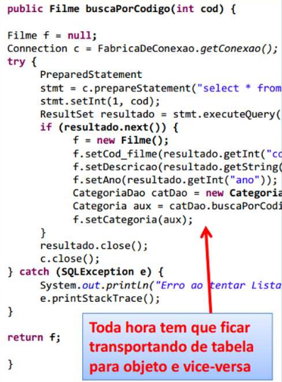
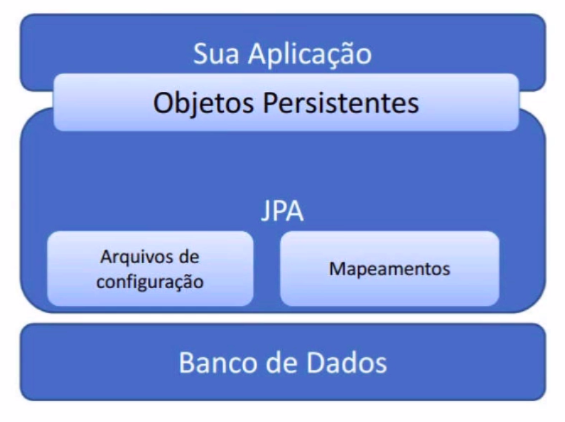

# __CRIACAO PROJETO MAVEN INTELIj COM IMPLEMENTACAO NATIVA DO HIBERNATE (JPA)__

## Mapeamento Objeto-Relacional

O principal problema ao realizar a integracao entre o banco de dados que possui um paradigma relacional e a aplicacao java com paradigma orientado a objetos e o esforco necessario para realizar a conversao entre o paradigma relacional e orientado a objetos. O exemplo a seguir utiliza a biblioteca JDBC onde o metodo implementado ira buscar um filme no banco de dados ataves de seu codigo, note que e necessario realizar a consulta SQL retornar todos os dados da tabela para o objeto `resultado` da classe `ResultSet`, varrer o resultado com o intuito de armazenar as colunas retornadas nos correspondentes atributos do objeto `f` que e da classe `Filme` e retornar o objeto, este processo era custoso e segundo o autor `Martin Fowler` essa implementacao e cerca de 30% do esforco para a criacao de um sistema.


<p align="center">
    <br>
    figura 1 - JDBC library, exemplo de implementacao.
</p>

Outros problemas envolidos no processo sao listados.

- Contexto de persistencia: gerenciar objetos que estao atrelados a uma conexao em um dados momento
- Mapa de indentidade: cache dos objetos ja carregados, caso o objeto ja esteja carregado em memoria e a aplicacao necessitar do dado novamente, nao deve ser realizada uma nova consulda no banco e sim utilizar o objeto em memoria.
- Carregamento tardio (Lazy Loading): Carregar apenas os dados solicitados, sem retornar dados nao solicitados do banco de dados.

#
## JPA (Java persistence API)

Para solucinar esse problema foi criada a JPA (Java Persistence API) que consiste uma especificacao (JSR 338) sobre como devem ser implementadas as APIs de integracao com bancos de dados com paradigma relacional. Dentre as implementacoes existentes a mais utilizada e o Hibernate. A imagem a seguir exemplifica a arquitetura de uma aplicacao que utiliza JPA.


<p align="center">
    <br>
    figura 1 - JDBC library, exemplo de implementacao.
</p>

A JPA possui dois principais grupos de arquivos, os de configuracao, os quais contem as declaracoes sobre drivers, dados para conexao com o banco de dados, e demais configuracoes sobre o comportamento da JPA. O outro grupo sao os arquivos que contem os mapeamentos, ou seja, as entidades (tabelas), seus relacionamentos, colunas e etc.

Vamos iniciar o projeto.

#
## Criacao do banco de dados
Para este exemplo sera usado o MySQL como bando de dados relacional. e DBeaver como gerenciador do banco de dados (outro bando de dados e gerenciador podem ser utilizados conforme a preferencia do programador). Ao realizar a instalacao dos softwares citados, execute a seguinte Query SQL para criar uma base de dados vazia.

```SQL
CREATE DATABASE nivelamento_jpa;
```


#
## Gerenciando dependencias com maven

Vamos utilizar o maven como gerenciador de dependencias em nosso projeto, no arquivo `pom.xml` encontram-sem configuracoes do maven, dados referentes ao build da aplicacao, versao da jdk utilizada e dependencias do projeto, vamos declarar as 3 depencias necessarias para este exemplo na tag `<dependencies>`.

```xml
<?xml version="1.0" encoding="UTF-8"?>
<project xmlns="http://maven.apache.org/POM/4.0.0"
         xmlns:xsi="http://www.w3.org/2001/XMLSchema-instance"
         xsi:schemaLocation="http://maven.apache.org/POM/4.0.0 http://maven.apache.org/xsd/maven-4.0.0.xsd">
    <modelVersion>4.0.0</modelVersion>

    <groupId>estudos.nivelamento_jpa</groupId>
    <artifactId>nivelamento_jpa</artifactId>
    <version>1.0-SNAPSHOT</version>

    <properties>
        <maven.compiler.source>11</maven.compiler.source>
        <maven.compiler.target>11</maven.compiler.target>
    </properties>

    <dependencies>

        <!-- https://mvnrepository.com/artifact/org.hibernate/hibernate-core -->
        <dependency>
            <groupId>org.hibernate</groupId>
            <artifactId>hibernate-core</artifactId>
            <version>5.4.12.Final</version>
        </dependency>

        <!-- https://mvnrepository.com/artifact/org.hibernate/hibernate-entitymanager -->
        <dependency>
            <groupId>org.hibernate</groupId>
            <artifactId>hibernate-entitymanager</artifactId>
            <version>5.4.12.Final</version>
        </dependency>

        <!-- https://mvnrepository.com/artifact/mysql/mysql-connector-java -->
        <dependency>
            <groupId>mysql</groupId>
            <artifactId>mysql-connector-java</artifactId>
            <version>8.0.19</version>
        </dependency>

    </dependencies>

</project>
```


#
## Arquivos de configuracao do Hibernate (implementacao da JPA)

E importante resaltar que o diretorio e as nomenclaturas dos arquivos devem estar de acordo com a [ducumentacao do Hibernate](https://hibernate.org/orm/documentation) neste caso o arquivo de configuracao precisa estar no seguinte caminho `resources/META-INF/persistence.xml` e seu conteudo conforme o codigo fonte a seguir.

```xml
<?xml version="1.0" encoding="UTF-8"?>
<persistence xmlns="http://xmlns.jcp.org/xml/ns/persistence"
             xmlns:xsi="http://www.w3.org/2001/XMLSchema-instance"
             xsi:schemaLocation="http://xmlns.jcp.org/xml/ns/persistence
http://xmlns.jcp.org/xml/ns/persistence/persistence_2_1.xsd"
             version="2.1">

    <persistence-unit name="exemplo-jpa" transaction-type="RESOURCE_LOCAL">

        <properties>
            <property name="javax.persistence.jdbc.url"
                      value="jdbc:mysql://localhost/nivelamento_jpa?useSSL=false&amp;serverTimezone=UTC" />
            <property name="javax.persistence.jdbc.driver" value="com.mysql.jdbc.Driver" />
            <property name="javax.persistence.jdbc.user" value="root" />
            <property name="javax.persistence.jdbc.password" value="root" />
            <property name="hibernate.hbm2ddl.auto" value="update" />
            <!-- https://docs.jboss.org/hibernate/orm/5.4/javadocs/org/hibernate/dialect/package-summary.html -->
            <property name="hibernate.dialect"
                      value="org.hibernate.dialect.MySQL8Dialect" />
        </properties>

    </persistence-unit>

</persistence>
```

note que a tag `<persistence>` contem os atributos necessarios para as cofiguracoes gerais da JPA. A tag `persistence-unit` ira conter as configuracoes relativas a conexao especifica, o atributo `name` contem o nome da conexao que sera utilizado nas classes da aplicacao e `transaction-type` contem a forma na qual iremos gerenciar as transacoes no caso de `RESOURCE_LOCAL` serao de forma manual. logo depois temos a tag `<properties>` que ira conter dados relativos a conexao declarados cada um em uma tag `property` com os atributos `name` e `value`, listdos a seguir.

- `javax.persistence.jdbc.url`: contem a url de acesso ao banco de dados.
- `javax.persistence.jdbc.driver`: caminho para o driver de conexao com o banco de dados.
- `javax.persistence.jdbc.user`: usuario de acesso ao banco de dados.
- `javax.persistence.jdbc.password`: senha de acesso ao banco de dados.
- `hibernate.hbm2ddl.auto`: ira gerar o banco de dados de forma automatica, no caso deo valor `update`, sempre ao rodar o banco de dados ser atualizado de forma automatica conforme as classes de dominio da aplicacao, outro exemplo seria o valor `create` que recria o banco de dados toda ver que a aplicacao for iniciada.
- `hibernate.dialect`: Padrao das Querys SQL utilizadas, nessa caso a liguagem do MySQL 8.
#
## Mapeamentos

Dentre as classes nativas do Hibernate podemos destacar 2 principais, a [`EntityManager`](https://docs.oracle.com/javaee/7/api/javax/persistence/EntityManager.html) que e responsavel por conter o encapsulamento das conexoes com o banco de dados, efetivar operacoes de acesso aos dados (insert, delete, update, select) em entidades (tabelas) por ele monitoradas em um mesmo contexto de persistencia. Tipicamente mantemos uma instancia da classe para cada thread do sistema, no caso de aplicacoes web uma para cada requisicao. Outra importante classe do hibernate e a [`EntityManagerFactory`](https://docs.oracle.com/javaee/7/api/javax/persistence/EntityManagerFactory.html) que e responsavel por criar instancias de objetos a partir da classe `EntityManager`, tipicamente mantem-se apenas uma instancia da classe `EntityManagerFactory` para toda a aplicacao.


