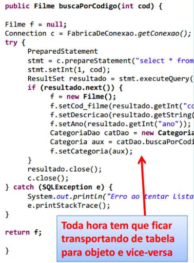
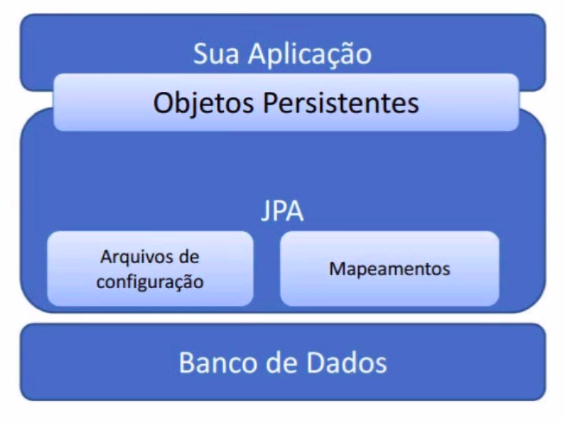
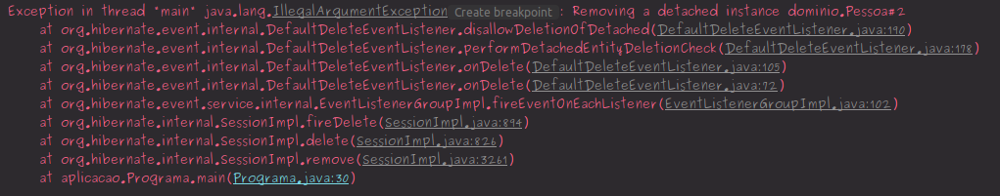

# __CRIACAO PROJETO MAVEN INTELIj COM IMPLEMENTACAO NATIVA DO HIBERNATE (JPA)__

## Mapeamento Objeto-Relacional

O principal problema ao realizar a integracao entre o banco de dados que possui um paradigma relacional e a aplicacao java com paradigma orientado a objetos e o esforco necessario para realizar a conversao entre o paradigma relacional e orientado a objetos. O exemplo a seguir utiliza a biblioteca JDBC onde o metodo implementado ira buscar um filme no banco de dados ataves de seu codigo, note que e necessario realizar a consulta SQL retornar todos os dados da tabela para o objeto `resultado` da classe `ResultSet`, varrer o resultado com o intuito de armazenar as colunas retornadas nos correspondentes atributos do objeto `f` que e da classe `Filme` e retornar o objeto, este processo era custoso e segundo o autor `Martin Fowler` essa implementacao e cerca de 30% do esforco para a criacao de um sistema.

<p align="center">
    <br>
    figura 1 - JDBC library, exemplo de implementacao.
</p>

Outros problemas envolidos no processo sao listados.

- Contexto de persistencia: gerenciar objetos que estao atrelados a uma conexao em um dados momento
- Mapa de indentidade: cache dos objetos ja carregados, caso o objeto ja esteja carregado em memoria e a aplicacao necessitar do dado novamente, nao deve ser realizada uma nova consulda no banco e sim utilizar o objeto em memoria.
- Carregamento tardio (Lazy Loading): Carregar apenas os dados solicitados, sem retornar dados nao solicitados do banco de dados.

#
## JPA (Java persistence API)

Para solucinar esse problema foi criada a JPA (Java Persistence API) que consiste uma especificacao (JSR 338) sobre como devem ser implementadas as APIs de integracao com bancos de dados com paradigma relacional. Dentre as implementacoes existentes a mais utilizada e o Hibernate. A imagem a seguir exemplifica a arquitetura de uma aplicacao que utiliza JPA.


<p align="center">
    <br>
    figura 1 - JDBC library, exemplo de implementacao.
</p>

A JPA possui dois principais grupos de arquivos, os de configuracao, os quais contem as declaracoes sobre drivers, dados para conexao com o banco de dados, e demais configuracoes sobre o comportamento da JPA. O outro grupo sao os arquivos que contem os mapeamentos, ou seja, as entidades (tabelas), seus relacionamentos, colunas e etc.

Vamos iniciar o projeto.

#
## Criacao do banco de dados
Para este exemplo sera usado o MySQL como bando de dados relacional. e DBeaver como gerenciador do banco de dados (outro bando de dados e gerenciador podem ser utilizados conforme a preferencia do programador). Ao realizar a instalacao dos softwares citados, execute a seguinte Query SQL para criar uma base de dados vazia.

```SQL
CREATE DATABASE nivelamento_jpa;
```


#
## Gerenciando dependencias com maven

Vamos utilizar o maven como gerenciador de dependencias em nosso projeto, no arquivo `pom.xml` encontram-sem configuracoes do maven, dados referentes ao build da aplicacao, versao da jdk utilizada e dependencias do projeto, vamos declarar as 3 depencias necessarias para este exemplo na tag `<dependencies>`.

```xml
<?xml version="1.0" encoding="UTF-8"?>
<project xmlns="http://maven.apache.org/POM/4.0.0"
         xmlns:xsi="http://www.w3.org/2001/XMLSchema-instance"
         xsi:schemaLocation="http://maven.apache.org/POM/4.0.0 http://maven.apache.org/xsd/maven-4.0.0.xsd">
    <modelVersion>4.0.0</modelVersion>

    <groupId>estudos.nivelamento_jpa</groupId>
    <artifactId>nivelamento_jpa</artifactId>
    <version>1.0-SNAPSHOT</version>

    <properties>
        <maven.compiler.source>11</maven.compiler.source>
        <maven.compiler.target>11</maven.compiler.target>
    </properties>

    <dependencies>

        <!-- https://mvnrepository.com/artifact/org.hibernate/hibernate-core -->
        <dependency>
            <groupId>org.hibernate</groupId>
            <artifactId>hibernate-core</artifactId>
            <version>5.4.12.Final</version>
        </dependency>

        <!-- https://mvnrepository.com/artifact/org.hibernate/hibernate-entitymanager -->
        <dependency>
            <groupId>org.hibernate</groupId>
            <artifactId>hibernate-entitymanager</artifactId>
            <version>5.4.12.Final</version>
        </dependency>

        <!-- https://mvnrepository.com/artifact/mysql/mysql-connector-java -->
        <dependency>
            <groupId>mysql</groupId>
            <artifactId>mysql-connector-java</artifactId>
            <version>8.0.19</version>
        </dependency>

    </dependencies>

</project>
```


#
## Arquivos de configuracao do Hibernate

E importante resaltar que o diretorio e as nomenclaturas dos arquivos devem estar de acordo com a [ducumentacao do Hibernate](https://hibernate.org/orm/documentation) neste caso o arquivo de configuracao precisa estar no seguinte caminho `resources/META-INF/persistence.xml` e seu conteudo conforme o codigo fonte a seguir.

```xml
<?xml version="1.0" encoding="UTF-8"?>
<persistence xmlns="http://xmlns.jcp.org/xml/ns/persistence"
             xmlns:xsi="http://www.w3.org/2001/XMLSchema-instance"
             xsi:schemaLocation="http://xmlns.jcp.org/xml/ns/persistence
http://xmlns.jcp.org/xml/ns/persistence/persistence_2_1.xsd"
             version="2.1">

    <persistence-unit name="exemplo-jpa" transaction-type="RESOURCE_LOCAL">

        <properties>
            <property name="javax.persistence.jdbc.url"
                      value="jdbc:mysql://localhost/nivelamento_jpa?useSSL=false&amp;serverTimezone=UTC" />
            <property name="javax.persistence.jdbc.driver" value="com.mysql.jdbc.Driver" />
            <property name="javax.persistence.jdbc.user" value="root" />
            <property name="javax.persistence.jdbc.password" value="root" />
            <property name="hibernate.hbm2ddl.auto" value="update" />
            <property name="hibernate.dialect"
                      value="org.hibernate.dialect.MySQL8Dialect" />
        </properties>

    </persistence-unit>

</persistence>
```

note que a tag `<persistence>` contem os atributos necessarios para as cofiguracoes gerais da JPA. A tag `<persistence-unit>` ira conter as configuracoes relativas a conexao especifica, o atributo `name` contem o nome da conexao que sera utilizado nas classes da aplicacao e `transaction-type` contem a forma na qual iremos gerenciar as transacoes no caso de `RESOURCE_LOCAL` serao de forma manual. logo depois temos a tag `<properties>` que ira conter dados relativos a conexao declarados cada um em uma tag `property` com os atributos `name` e `value`, listdos a seguir.

- `javax.persistence.jdbc.url`: contem a url de acesso ao banco de dados.
- `javax.persistence.jdbc.driver`: caminho para o driver de conexao com o banco de dados.
- `javax.persistence.jdbc.user`: usuario de acesso ao banco de dados.
- `javax.persistence.jdbc.password`: senha de acesso ao banco de dados.
- `hibernate.hbm2ddl.auto`: ira gerar o banco de dados de forma automatica, no caso deo valor `update`, sempre ao rodar o banco de dados ser atualizado de forma automatica conforme as classes de dominio da aplicacao, outro exemplo seria o valor `create` que recria o banco de dados toda ver que a aplicacao for iniciada.
- `hibernate.dialect`: Padrao das Querys SQL utilizadas, nessa caso a liguagem do MySQL 8, podem ser declarados [outros dialetos](https://docs.jboss.org/hibernate/orm/5.4/javadocs/org/hibernate/dialect/package-summary.html).
#
## Mapeamentos

Dentre as classes nativas do Hibernate podemos destacar 2 principais, a [`EntityManager`](https://docs.oracle.com/javaee/7/api/javax/persistence/EntityManager.html) que e responsavel por conter o encapsulamento das conexoes com o banco de dados, efetivar operacoes de acesso aos dados (insert, delete, update, select) em entidades (tabelas) por ele monitoradas em um mesmo contexto de persistencia. Tipicamente mantemos uma instancia da classe para cada thread do sistema, no caso de aplicacoes web uma para cada requisicao. Outra importante classe do hibernate e a [`EntityManagerFactory`](https://docs.oracle.com/javaee/7/api/javax/persistence/EntityManagerFactory.html) que e responsavel por criar instancias de objetos a partir da classe `EntityManager`, tipicamente mantem-se apenas uma instancia da classe `EntityManagerFactory` para toda a aplicacao.
Os arquivos de mapeamento irao conter as relacoes entre as Classes da aplicacao e as tabelas do banco de dados, os atributos da classe a sua coluna correspondente e os tipos de relacionamento. vamos codar a classe `Pessoa` que ira correponder a tabela pessoa no banco de dados.

```java
package dominio;

import javax.persistence.Entity;
import javax.persistence.GeneratedValue;
import javax.persistence.GenerationType;
import javax.persistence.Id;

@Entity
public class Pessoa {

    @Id
    @GeneratedValue(strategy = GenerationType.IDENTITY)
    private Integer id;

    private String nome;
    
    private String email;

    public Pessoa() {
    }

    public Pessoa(Integer id, String nome, String email) {
        this.id = id;
        this.nome = nome;
        this.email = email;
    }

    public Integer getId() {
        return id;
    }

    public void setId(Integer id) {
        this.id = id;
    }

    public String getNome() {
        return nome;
    }

    public void setNome(String nome) {
        this.nome = nome;
    }

    public String getEmail() {
        return email;
    }

    public void setEmail(String email) {
        this.email = email;
    }

    @Override
    public String toString() {
        return "Pessoa{" +
                "id=" + id +
                ", nome='" + nome + '\'' +
                ", email='" + email + '\'' +
                '}';
    }
}
```
A anotacao `@Entity` na classe ira indicar que essa classe e uma entidade (tabela) no banco de dados. o atributo que corresponde a chave primaria da tabela (_primary key_) estar com a anotacao `@Id`, a anotacao `@GeneratedValue(strategy = GenerationType.IDENTITY)` indica que o atributo sera gerado no bando de dados automaticamente. A JPA ira criar a tabela com o mesmo nome da classe e as colunas com os memos nomes dos atributos, porem caso deseje-se ter nomes diferentes entre as colunas do bando de dados e o atributo da aplicacao, basta  utilizar a anotacao `@Column(name = "nomeDaColunaNoBando")` e como parametro da anotacao o nome que a coluna relativa ao atributo anotado ira receber.

```java
@Column(name = "nomeCompleto")
private String nome;

@Column(name = "emailClient")
private String email;
```

Apos mapeados os campos do banco de dados, temos a implementacao da classe que ira realizar as operacoes no banco de dados.

```java
package aplicacao;

import javax.persistence.EntityManager;
import javax.persistence.EntityManagerFactory;
import javax.persistence.Persistence;

import dominio.Pessoa;

public class Programa {

    public static void main(String[] args) {

        // objetos para serem persistidos no banco de dados
        Pessoa p1 = new Pessoa(null, "Carlos da Silva", "carlos@gmail.com");
        Pessoa p2 = new Pessoa(null, "Joao da Silva", "joao@gmail.com");
        Pessoa p3 = new Pessoa(null, "Jose da Silva", "jose@gmail.com");

        // instancia do EntityManagerFactory
        EntityManagerFactory emf = Persistence.createEntityManagerFactor("exemplo-jpa");

        // instancia do EntityManager
        EntityManager em = emf.createEntityManager();

        // Inicia a transacao
        em.getTransaction().begin();

        // persiste os objetos para o banco de dados
        em.persist(p1);
        em.persist(p2);
        em.persist(p3);

        // salva os objetos no bando de dados
        em.getTransaction().commit();

        // termina a transacao
        em.close();
        emf.close();

        // mostra no console que a execucao terminou
        System.out.println("pronto !");

    }

}
```

A Classe `Persistence` possui o metodo `createEntityManegerFactory()` que recebe como argumento o nome declarado no atributo `name` da tag `persistence-unit` no arquivo de configuracoes `persistence.xml`, no caso do nosso exemplo `exemplo-jpa`. Para realizar a instancia de um objeto da classe `EntityManager` a classe `EntityManegerFactory` possui o metodo `createEntityManeger()`. Para realizar transacoes entre a aplicacao e o banco de dados que nao sao uma simples consulta, como inserir, alterar e remover dados do bando de dados e necessario que os dados estejam monitorados pela JPA, para fazer isso e preciso iniciar uma utilizando os metodos `getTransaction().begin()` o metodo `persist()` ira armazenar os objetos para persistir no banco de dados e o metodo `commit()` ira efetivamente salvar os dados no bando de dados. apos realizar todas as transacoes desejadas neste contexto de persistencia basta fechar a conexao com `close()` tanto para o objeto `EntityManager` quanto para o `EntityManagerFactory`.

Vamos buscar dados do bando, (lembrando que para realizar apenas consultas nao e necessario iniciar a transacao), a JPA pussui um metodo que retorna o elemento do bando de dados no formato Json a partir do id, `find()` que recebe como parametro a classe relativa a entidade no bando e o id desejado.

```java
package aplicacao;

import javax.persistence.EntityManager;
import javax.persistence.EntityManagerFactory;
import javax.persistence.Persistence;

import dominio.Pessoa;

public class Programa {

    public static void main(String[] args) {

        Pessoa p1 = new Pessoa(null, "Carlos da Silva", "carlos@gmail.com");
        Pessoa p2 = new Pessoa(null, "Joao da Silva", "joao@gmail.com");
        Pessoa p3 = new Pessoa(null, "Jose da Silva", "jose@gmail.com");

        EntityManagerFactory emf = Persistence.createEntityManagerFactory("exemplo-jpa");
        EntityManager em = emf.createEntityManager();

        // consulta no banco de dados pelo id  
        Pessoa p = em.find(Pessoa.class, 2);

        System.out.println(p);

        System.out.println("pronto !");

    }
```
### Entidade monitorada e entidade destacada

Para realizar as operacoes de _updade_ e _delete_ na base de dados e necessario que os objetos estajam monitorados pelo hibernate. Mas afinal o que e um objeto monitorado ? Um objeto monitorado e um objeto carregado em memoria a partir de uma consulta no banco de dados ou que acabou de ser inserido no banco de dados, ou seja para atualizar ou remover um dado no banco de dados primeiro e necessario carregalo em memoria (por meio de uma consulta) ou ter acabado de salva-lo no banco de dados.

```java
package aplicacao;

import dominio.Pessoa;

import javax.persistence.EntityManager;
import javax.persistence.EntityManagerFactory;
import javax.persistence.Persistence;

public class Programa {

    public static void main(String[] args) {

        EntityManagerFactory emf = Persistence.createEntityManagerFactory("exemplo-jpa");
        EntityManager em = emf.createEntityManager();

        // consulta no bando de dados
        Pessoa p = em.find(Pessoa.class, 2);

        em.getTransaction().begin();
        // remocao do objeto monitorado
        em.remove(p);
        em.getTransaction().commit();
        em.close();
        emf.close();

        System.out.println("pronto !");

    }

}
```

Vamos analisar o caso de um objeto destacado, um objeto destacado e um objeto que nao foi carregado em memoria a partir de uma consulta, vamos a um exemplo.
Instanciar um objeto pessoa contendo somente o id que deseja-se remover do banco de dados e utilizar o metodo `remove()`

```java
package aplicacao;

import dominio.Pessoa;

import javax.persistence.EntityManager;
import javax.persistence.EntityManagerFactory;
import javax.persistence.Persistence;

public class Programa {

    public static void main(String[] args) {

        EntityManagerFactory emf = Persistence.createEntityManagerFactory("exemplo-jpa");
        EntityManager em = emf.createEntityManager();
    
        // instancia de um objeto destacado
        Pessoa pessoaRemovida = new Pessoa(2, null, null);

        em.getTransaction().begin();

        // tentativa de remocao de um objeto destacado
        em.remove(pessoaRemovida);
        em.getTransaction().commit();

        em.close();
        emf.close();

        System.out.println("pronto !");

    }

}
```
ao tentar remover o objeto do banco de dados uma exception ira informar que um instancia destacada nao pode ser removida.

<p align="center">
    <br>
    figura 1 - Exception ao tentar realizar operacoes com objeto destacado.
</p>

#
## Consideracoes Finais

E importante conhecer o funcionamento das APIs que implementamos em nosso projeto, entretando no dia-a-dia de nossos projetos iremos realizar o SpringData que ira instanciar as classes e gerenciar a abertura e fechamento das transacoes automaticamente e incluir a camada de repository que ira fornecer metodos para realizar operacoes no bando de dados.


