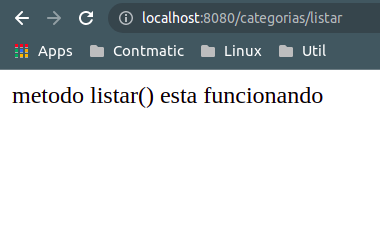
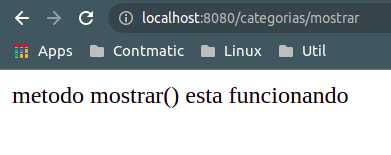

# __REST IMPLEMENTACAO SIMPLES__

Como interface de comunicacao a aplicacao utilizara a arquitetura REST, vamos realizar uma implementacao simples em um classe para entender alguns conceitos iniciais.

vamos gerar um novo pacote chamado `resources`, de acordo com o padrao de projeto [Data Transfer Object (DTO)](https://martinfowler.com/eaaCatalog/dataTransferObject.html) proposto pos Martin Flowler o pacote `resources` cotem as classes controladoras REST. O padrao de nomenclatura das classes segue o nome da entidade no banco de dados seguito do sufixo `Resource`, de acordo com o [diagrama UML de classes](../../ConteudoDoCurso/Secao2-ImplementacaoDoModeloConceitual/Diagrama/diagrama-de-classes.png) do projeto vamos iniciar pela classe `Categoria` (pois e uma classe simple e imdependente) deste modo o nome da classe sera `CategoriaResource`

```java
package br.com.estudos.springboot.projetospringboot.resource;

import org.springframework.web.bind.annotation.RequestMapping;
import org.springframework.web.bind.annotation.RequestMethod;
import org.springframework.web.bind.annotation.RestController;

@RestController
@RequestMapping(value = "/categorias")
public class CategoriaResource {

    @RequestMapping(method = RequestMethod.GET, value = "/listar")
    public String listar(){
        return "metodo listar() esta funcionando";
    }

    @RequestMapping(method = RequestMethod.GET, value = "/mostrar")
    public String mostrar(){
        return "metodo mostrar() esta funcionando";
    }

}
```

note que a classe contem as anotacoes `@RestController` que indica ao Spring Boot que essa classe e um controlador REST e `@ResquestMapping` que recebe como argumento `value` que indica o caminho para acessar essa classe (por padrao o caminho e o nome da classe no plural sem o sufixo Resources, neste casso `/categorias`). os metodos sao anotados com os subcaminhos para acessar-los e os modos de requisisao HTTP (GET para acessar dados, POST para salvar dados, DELETE para deletar e etc.), iniciando a aplicacao e ao inserir os `http://localhost:8080/categorias/listar` e `http://localhost:8080/categorias/mostrar` no navegador web termos os respectivos retornos dos metodos `listar()` e `mostrar()` conforme as figuras.

<p align="center">
    <br>
    figura 1 - retorno do metodo listar() no navegador web.
</p>

<p align="center">
    <br>
    figura 2 - retorno do metodo mostrar() no navegador web.
</p>


