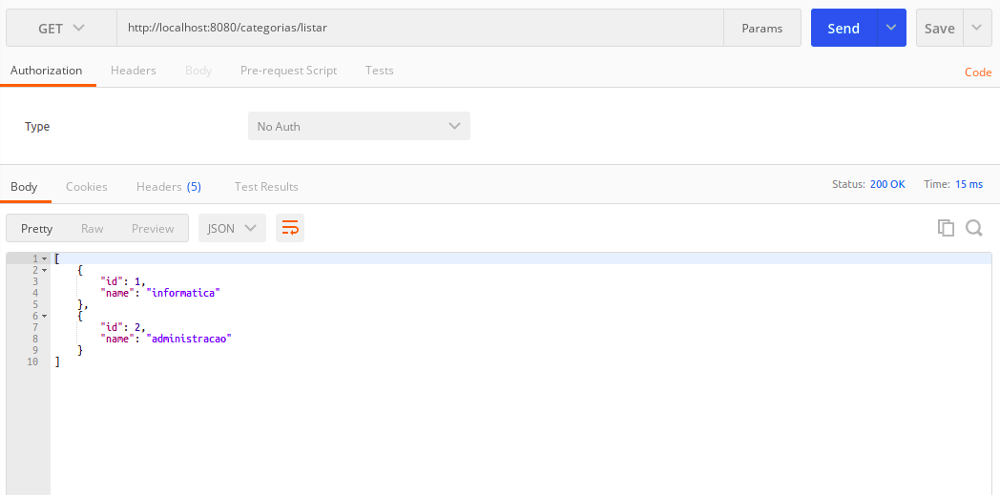

# __CLASSE DE DOMINIO IMPLEMENTACAO SIMPLES__

O processo de implementacao de uma classe de dominio possui algumas etapas importantes listadas a seguir.

- Atributos basicos
- Associacoes (inicie as colecoes)
- Construtores (nao inclua as associacoes nos construtores)
- Getters and Setters
- metodos hashCode() and equals() (implementacao padrao somente id)
- Heranca da interface Serializable como interface filho, extends (padrao 1L, nao e mais necessario)

Como no documento [REST IMPLEMENTACAO SIMPLES](03-rest-implementacao-simples.md) a classe de controle `CategoriaResource` foi implementada, para este exemplo a classe de dominio `Categoria` sera implementa segundo o [diagrama UML de classes](../../ConteudoDoCurso/Secao2-ImplementacaoDoModeloConceitual/Diagrama/diagrama-de-classes.png) do projeto.

```java
package br.com.estudos.springboot.projetospringboot.domain;

import java.util.Objects;

public class Categoria {

    private Integer id;

    private String nome;

    public Categoria(){
    }

    public Categoria(Integer id, String nome){
        setId(id);
        setNome(nome);
    }

    public Integer getId() {
        return id;
    }

    public void setId(Integer id) {
        this.id = id;
    }

    public String getNome() {
        return nome;
    }

    public void setNome(String nome) {
        this.name = nome;
    }

    @Override
    public boolean equals(Object o) {
        if (this == o) return true;
        if (o == null || getClass() != o.getClass()) return false;
        Categoria categoria = (Categoria) o;
        return Objects.equals(id, categoria.id);
    }

    @Override
    public int hashCode() {
        return Objects.hash(id);
    }
}
```

Temos a classe de dominio implementada, para obter o retorno dos objetos instanciados a partir da classe de dominio `Categoria` vamos refator a classe `CategoriaResource`, com a instancia de 2 objetos de acordo com o [diagrama UML de objetos](../../ConteudoDoCurso/Secao2-ImplementacaoDoModeloConceitual/Diagrama/diagrama-de-objetos.png) e retornandos em uma lista conforme o codigo a seguir (internamente o Spring Boot realiza a conversao dos dados retornados para o formato JSON no endpoint).

```java
package br.com.estudos.springboot.projetospringboot.resource;

import br.com.estudos.springboot.projetospringboot.domain.Categoria;
import org.springframework.web.bind.annotation.RequestMapping;
import org.springframework.web.bind.annotation.RequestMethod;
import org.springframework.web.bind.annotation.RestController;

import java.util.ArrayList;
import java.util.List;

@RestController
@RequestMapping(value = "/categorias")
public class CategoriaResource {

    @RequestMapping(method = RequestMethod.GET, value = "/listar")
    public List<Categoria> listar(){

        List<Categoria> categorias = new ArrayList<>();

        Categoria categoriaA = new Categoria(1, "Informatica");
        Categoria categoriaB = new Categoria(2, "Escritorio");

        categorias.add(categoriaA);
        categorias.add(categoriaB);

        return categorias;
    }

}
```

ao acessar o caminho `http://localhost:8080/categorias/listar` utilizando o softwate Postman.

<p align="center">
    <br>
    figura 2 - json retornado a partir dos objetos da classe Categoria instanciados.
</p>


