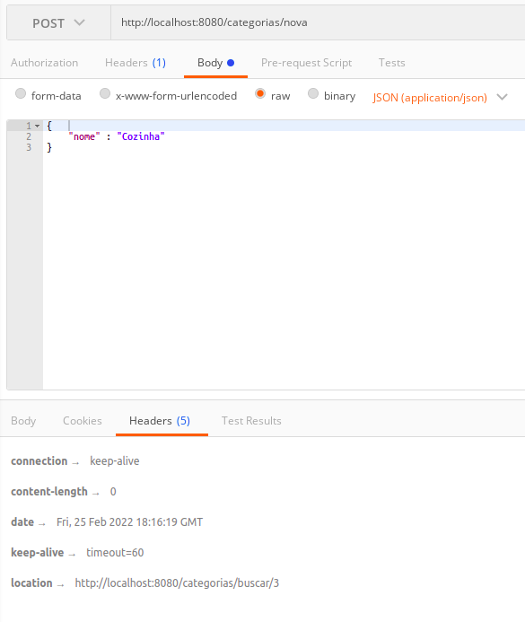

# __INSERINDO NOVA CATEGORIA COM POST__

A insercao de novas entidades pode ser feita utilizando o metodo `POST` do `http`, vamos iniciar pela entidade `Categoria`, pois e uma entidade independente, ja foram realizada a persistencias dos dados no banco manualmente utilizando o metodo `run()`, basta expor o metodo `save()` da JPA em um endpoint, para isto e necessario declarar novos metodos para inserir dados nas classes `CategoriaService` e `CategoriaResource`.

refatoracao da classe `CategoriaService`

```java
package br.com.estudos.springboot.projetospringboot.service;

import br.com.estudos.springboot.projetospringboot.domain.Categoria;
import br.com.estudos.springboot.projetospringboot.ropository.CategoriaRepository;
import br.com.estudos.springboot.projetospringboot.service.exceptions.ObjectNotFoundException;
import org.springframework.beans.factory.annotation.Autowired;
import org.springframework.stereotype.Service;

import java.util.Optional;

@Service
public class CategoriaService {

    @Autowired
    private CategoriaRepository repository;

    public Categoria buscar(Integer id){
        Optional<Categoria> categoria = repository.findById(id);

        return categoria.orElseThrow(() -> new ObjectNotFoundException(
                "objeto com id " + id + " nao encontrado em " + this.getClass().getSimpleName()
            )
        );
    }

    // novo meotodo para inserir dados
    public Categoria inserir(Categoria categoria) {
        return repository.save(categoria);
    }
}

```

refatoracao da classe `CategoriaResource`

```java
package br.com.estudos.springboot.projetospringboot.resource;

import br.com.estudos.springboot.projetospringboot.domain.Categoria;
import br.com.estudos.springboot.projetospringboot.service.CategoriaService;
import org.springframework.beans.factory.annotation.Autowired;
import org.springframework.http.ResponseEntity;
import org.springframework.web.bind.annotation.*;
import org.springframework.web.servlet.support.ServletUriComponentsBuilder;

import java.net.URI;

@RestController
@RequestMapping(value = "/categorias")
public class CategoriaResource {

    @Autowired
    private CategoriaService service;

    @RequestMapping(method = RequestMethod.GET, value = "/buscar/{id}")
    public ResponseEntity<?> buscar(@PathVariable Integer id){

        Categoria categoria = service.buscar(id);

        return ResponseEntity.ok().body(categoria);
    }

    // novo endpoint para inserir dados
    @RequestMapping(method = RequestMethod.POST, value = "/nova")
    public ResponseEntity<Void> inserir(@RequestBody Categoria categoria){
        categoria = service.inserir(categoria);
        URI uri = ServletUriComponentsBuilder.fromCurrentRequestUri().replacePath("categorias/buscar/{id}").build(categoria.getId());
        return ResponseEntity.created(uri).build();
    }

}
```

note que na _annotation_ `@RequestMapping` o atributo `method` recebe o valor `ResquestMethod.POST`. 

O metodo `save()` salva o novo objeto no banco de dados e retorna a consulta do do mesmo (ao objeto retorna completo, incluindo o campo id que e gerado no banco de dados por conta do autoincrement).

De acordo com o [MDN Web Docs](https://developer.mozilla.org/pt-BR/), ao retornar o codigo [`201 Created`](https://developer.mozilla.org/pt-BR/docs/Web/HTTP/Status/201) deve ser retornado o caminho para o novo recurso, o objeto da classe `URI` recebe o valor do caminho para o recurso e altera para o caminho de busca com o novo id gerado no banco de dados, o novo caminho sera disponibilizado no header da resposta por meio do metodo `created()`.

#
## INSERINDO NOVA CATEGORIA
acessando o endpont e enviando uma nova categoria atraves do corpo, obetemos como resposta o caminho do novo recurso (neste caso os novos dados inseridos no banco de dados).

<p align="center">
    <br>
    figura 1 - insercao de nova categoria.
</p>

