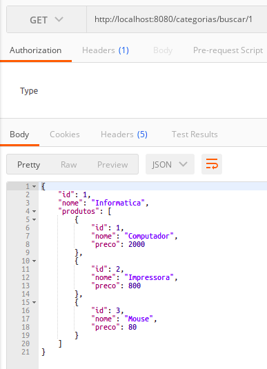
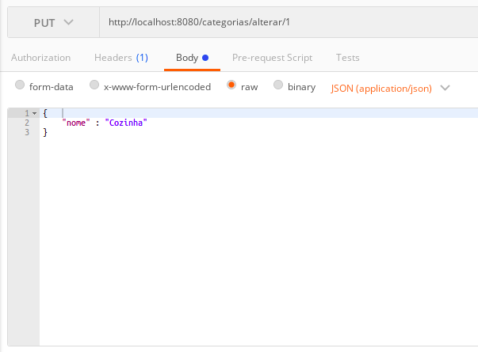
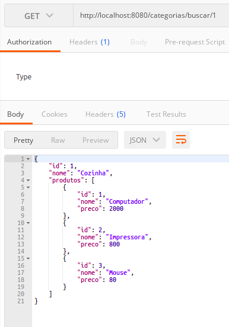
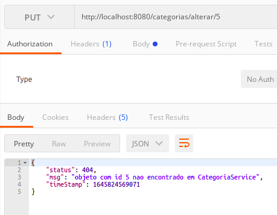

# __ATUALIZANDO CATEGORIA COM PUT__

A alteracao de entidades pode ser feita utilizando o metodo `PUT` do `http`, vamos iniciar pela entidade `Categoria`, pois e uma entidade independente, ja foram realizadas persistencias dos dados no banco manualmente utilizando o metodo `run()`, basta expor o metodo `save()`, da JPA em um endpoint, no exemplo anterior o metodo `save()` foi utilizado para persistir um novo objeto no banco de dados, caso o id do objeto ja exista no bando da dados, os dados sao sobrescritos, para isto e necessario declarar novos metodos para inserir dados nas classes `CategoriaService` e `CategoriaResource`.

refatoracao da classe `CategoriaService`

```java
package br.com.estudos.springboot.projetospringboot.service;

import br.com.estudos.springboot.projetospringboot.domain.Categoria;
import br.com.estudos.springboot.projetospringboot.ropository.CategoriaRepository;
import br.com.estudos.springboot.projetospringboot.service.exceptions.ObjectNotFoundException;
import org.springframework.beans.factory.annotation.Autowired;
import org.springframework.stereotype.Service;

import java.util.Optional;

@Service
public class CategoriaService {

    @Autowired
    private CategoriaRepository repository;

    public Categoria buscar(Integer id){
        Optional<Categoria> categoria = repository.findById(id);

        return categoria.orElseThrow(() -> new ObjectNotFoundException(
                "objeto com id " + id + " nao encontrado em " + this.getClass().getSimpleName()
            )
        );
    }

    public Categoria inserir(Categoria categoria) {
        return repository.save(categoria);
    }

    // metodo para alteracao dos dados
    public Categoria alterar(Categoria categoria) {
        buscar(categoria.getId());
        return repository.save(categoria);
    }
}
```
note que estamos utilizando o metodo `buscar()` deste mesmo contexto, deste modo podemos aproveitar o mapeamento de exceptions caso o id nao seja encontrado.

refatoracao da classe `CategoriaResource`

```java
package br.com.estudos.springboot.projetospringboot.resource;

import br.com.estudos.springboot.projetospringboot.domain.Categoria;
import br.com.estudos.springboot.projetospringboot.service.CategoriaService;
import org.springframework.beans.factory.annotation.Autowired;
import org.springframework.http.ResponseEntity;
import org.springframework.web.bind.annotation.*;
import org.springframework.web.servlet.support.ServletUriComponentsBuilder;

import java.net.URI;

@RestController
@RequestMapping(value = "/categorias")
public class CategoriaResource {

    @Autowired
    private CategoriaService service;

    @RequestMapping(method = RequestMethod.GET, value = "/buscar/{id}")
    public ResponseEntity<?> buscar(@PathVariable Integer id){

        Categoria categoria = service.buscar(id);

        return ResponseEntity.ok().body(categoria);
    }

    @RequestMapping(method = RequestMethod.POST, value = "/nova")
    public ResponseEntity<Void> inserir(@RequestBody Categoria categoria){
        categoria = service.inserir(categoria);
        URI uri = ServletUriComponentsBuilder.fromCurrentRequestUri().replacePath("categorias/buscar/{id}").build(categoria.getId());
        return ResponseEntity.created(uri).build();
    }

    // endpoint para alteracao dos dados
    @RequestMapping(method = RequestMethod.PUT, value = "/alterar/{id}")
    public ResponseEntity<Void> alterar(@RequestBody Categoria categoria, @PathVariable Integer id){
        categoria.setId(id);
        categoria = service.alterar(categoria);
        return ResponseEntity.noContent().build();
    }

}
```

antes de passar o objeto `categoria` como argumento para o metodo `alterar()` e necessario passar o valor do `id` informado na `url` para o atributo `id` do objeto `categoria`, deste modo os dados seram sobrescritos (caso contrario, um novo `id` seria gerado no banco de dados e os valores seriam inseridos).

#
## ALTERANDO DADOS NO BANDO DE DADOS

### Alterando dados em id existente
consulta antes da alteracao

<p align="center">
    <br>
    figura 1 - consulta antes da alteracao dos dados.
</p>

alteracao dos dados

<p align="center">
    <br>
    figura 1 - consulta antes da alteracao dos dados.
</p>

consulta apos alteracao

<p align="center">
    <br>
    figura 1 - consulta antes da alteracao dos dados.
</p>

### Tentarva de alterar dados em id inexistente

<p align="center">
    <br>
    figura 1 - consulta antes da alteracao dos dados.
</p>
