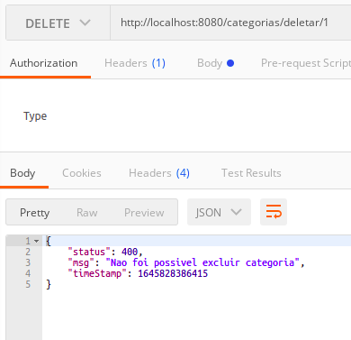

# __DELETANDO UMA CATEGORIA COM DELETE__

similar aos documentos anteriores, vamos implementar um endpoint que espera receber uma requisicao atraves do metodo `delete` do protocolo `http`.

implementacao na classe `CategoriaService`

```java
package br.com.estudos.springboot.projetospringboot.service;

import br.com.estudos.springboot.projetospringboot.domain.Categoria;
import br.com.estudos.springboot.projetospringboot.ropository.CategoriaRepository;
import br.com.estudos.springboot.projetospringboot.service.exceptions.DataIntegrityException;
import br.com.estudos.springboot.projetospringboot.service.exceptions.ObjectNotFoundException;
import org.springframework.beans.factory.annotation.Autowired;
import org.springframework.dao.DataIntegrityViolationException;
import org.springframework.stereotype.Service;

import java.util.Optional;

@Service
public class CategoriaService {

    @Autowired
    private CategoriaRepository repository;

    public Categoria buscar(Integer id){
        Optional<Categoria> categoria = repository.findById(id);

        return categoria.orElseThrow(() -> new ObjectNotFoundException(
                "objeto com id " + id + " nao encontrado em " + this.getClass().getSimpleName()
            )
        );
    }

    public Categoria inserir(Categoria categoria) {
        return repository.save(categoria);
    }

    public Categoria alterar(Categoria categoria) {
        buscar(categoria.getId());
        return repository.save(categoria);
    }

    // novo metodo implementado para delecao de itens
    public void deletar(Integer id) {
        buscar(id);
        try {
            repository.deleteById(id);
        }
        catch (DataIntegrityViolationException e){
            throw new DataIntegrityException("Nao foi possivel excluir categoria");
        }
    }
}
```

note que como nao ha retorno pois os dados serao excluidos do banco de dados a _exception_ personalizada foi implementada utilizando `try` e `catch`, caso ocorra uma _exception_ uma mensagem personalizada e exibida.

criacao da classe `DataIntegrityException`.

```java
package br.com.estudos.springboot.projetospringboot.service.exceptions;


public class DataIntegrityException extends RuntimeException {

    public DataIntegrityException(String msg) {
        super(msg);
    }

    public DataIntegrityException(String msg, Throwable cause){
        super(msg, cause);
    }

}
```
agora e necessario que a _exception_ seja capturada no metodo que possui o endpoint, como temos implementado o `@ControllAdvice` na classe `ResourceExceptionHandler` que ira capturar as _excetions_ relativas aos metodos anotados com `@ResquestMapping` ou similar, basta um metodo para capturar e tratar a nova _exception_ criada.

refatoraca da classe `ResourceExceptionHandler`

```java
package br.com.estudos.springboot.projetospringboot.resource.exceptions;

import br.com.estudos.springboot.projetospringboot.service.exceptions.DataIntegrityException;
import br.com.estudos.springboot.projetospringboot.service.exceptions.ObjectNotFoundException;
import org.springframework.http.HttpStatus;
import org.springframework.http.ResponseEntity;
import org.springframework.web.bind.annotation.ControllerAdvice;
import org.springframework.web.bind.annotation.ExceptionHandler;

import javax.servlet.http.HttpServletRequest;

@ControllerAdvice
public class ResourceExceptionHandler {

    @ExceptionHandler(ObjectNotFoundException.class)
    public ResponseEntity<StandardError> objectNotFound(ObjectNotFoundException e, HttpServletRequest request) {
        StandardError erro = new StandardError(HttpStatus.NOT_FOUND.value(), e.getMessage(), System.currentTimeMillis());
        return ResponseEntity.status(HttpStatus.NOT_FOUND).body(erro);
    }

    // tratamento da exception adicionada
    @ExceptionHandler(DataIntegrityException.class)
    public ResponseEntity<StandardError> dataIntegity(DataIntegrityException e, HttpServletRequest request){
        StandardError erro = new StandardError(HttpStatus.BAD_REQUEST.value(), e.getMessage(), System.currentTimeMillis());
        return ResponseEntity.status(HttpStatus.BAD_REQUEST).body(erro);
    }
}
```
por fim basta expor o endpoint na classe `@CategoriaResource`

```java
package br.com.estudos.springboot.projetospringboot.resource;

import br.com.estudos.springboot.projetospringboot.domain.Categoria;
import br.com.estudos.springboot.projetospringboot.service.CategoriaService;
import org.springframework.beans.factory.annotation.Autowired;
import org.springframework.http.ResponseEntity;
import org.springframework.web.bind.annotation.*;
import org.springframework.web.servlet.support.ServletUriComponentsBuilder;

import java.net.URI;

@RestController
@RequestMapping(value = "/categorias")
public class CategoriaResource {

    @Autowired
    private CategoriaService service;

    @RequestMapping(method = RequestMethod.GET, value = "/buscar/{id}")
    public ResponseEntity<?> buscar(@PathVariable Integer id){

        Categoria categoria = service.buscar(id);

        return ResponseEntity.ok().body(categoria);
    }

    @RequestMapping(method = RequestMethod.POST, value = "/nova")
    public ResponseEntity<Void> inserir(@RequestBody Categoria categoria){
        categoria = service.inserir(categoria);
        URI uri = ServletUriComponentsBuilder.fromCurrentRequestUri().replacePath("categorias/buscar/{id}").build(categoria.getId());
        return ResponseEntity.created(uri).build();
    }

    @RequestMapping(method = RequestMethod.PUT, value = "/alterar/{id}")
    public ResponseEntity<Void> alterar(@RequestBody Categoria categoria, @PathVariable Integer id){
        categoria.setId(id);
        categoria = service.alterar(categoria);
        return ResponseEntity.noContent().build();
    }

    // novo endpoint para delecao de dados
    @RequestMapping(method = RequestMethod.DELETE, value = "/deletar/{id}")
    public ResponseEntity<Void> delete(@PathVariable Integer id){
        service.deletar(id);
        return ResponseEntity.noContent().build();
    }

}
```

#
## Deletando dados

Ao tentar deletar um campo que possui relacao com outras tabelas uma _exception_ `DataIntegrityViolationException` sera gerada, porem foi tratada anteriormente e exibira o seguinte erro.

<p align="center">
    <br>
    figura 1 - consulta antes da alteracao dos dados.
</p>

categorias que nao possum relacao com outras tabelas serao deletadas com sucesso.