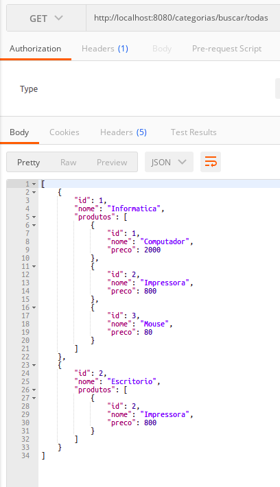
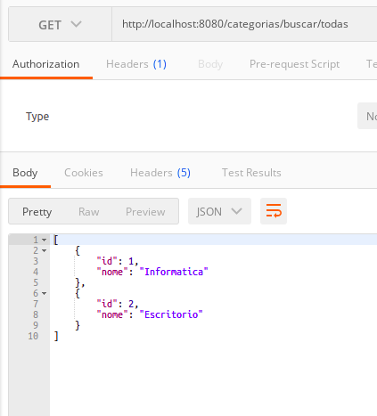

# __LISTANDO CATEGORIAS COM DTO (DATA TRANSFER OBJECT)__

previamente a implementacao da classe de DTO para categorias, vamos implementar apenas o retorno de todas as categorias registradas no banco de dados utilizando a entidade `Categoria`

implementacao do metodo `findAll()` na classe `CategoriaService` 

```java
package br.com.estudos.springboot.projetospringboot.service;

import br.com.estudos.springboot.projetospringboot.domain.Categoria;
import br.com.estudos.springboot.projetospringboot.ropository.CategoriaRepository;
import br.com.estudos.springboot.projetospringboot.service.exceptions.DataIntegrityException;
import br.com.estudos.springboot.projetospringboot.service.exceptions.ObjectNotFoundException;
import org.springframework.beans.factory.annotation.Autowired;
import org.springframework.dao.DataIntegrityViolationException;
import org.springframework.stereotype.Service;

import java.util.List;
import java.util.Optional;

@Service
public class CategoriaService {

    @Autowired
    private CategoriaRepository repository;

    public Categoria buscar(Integer id){
        Optional<Categoria> categoria = repository.findById(id);

        return categoria.orElseThrow(() -> new ObjectNotFoundException(
                "objeto com id " + id + " nao encontrado em " + this.getClass().getSimpleName()
            )
        );
    }

    public Categoria inserir(Categoria categoria) {
        return repository.save(categoria);
    }

    public Categoria alterar(Categoria categoria) {
        buscar(categoria.getId());
        return repository.save(categoria);
    }

    public void deletar(Integer id) {
        buscar(id);
        try {
            repository.deleteById(id);
        }
        catch (DataIntegrityViolationException e){
            throw new DataIntegrityException("Nao foi possivel excluir categoria");
        }
    }

    // metodo para retornar todas as categorias
    public List<Categoria> buscarTodas() {
        return repository.findAll();
    }
}
```
implementacao do endpoint na classe `CategoriaResource`

```java
package br.com.estudos.springboot.projetospringboot.resource;

import br.com.estudos.springboot.projetospringboot.domain.Categoria;
import br.com.estudos.springboot.projetospringboot.service.CategoriaService;
import org.springframework.beans.factory.annotation.Autowired;
import org.springframework.http.ResponseEntity;
import org.springframework.web.bind.annotation.*;
import org.springframework.web.servlet.support.ServletUriComponentsBuilder;

import java.net.URI;
import java.util.List;

@RestController
@RequestMapping(value = "/categorias")
public class CategoriaResource {

    @Autowired
    private CategoriaService service;

    @RequestMapping(method = RequestMethod.GET, value = "/buscar/{id}")
    public ResponseEntity<?> buscar(@PathVariable Integer id){

        Categoria categoria = service.buscar(id);

        return ResponseEntity.ok().body(categoria);
    }

    @RequestMapping(method = RequestMethod.POST, value = "/nova")
    public ResponseEntity<Void> inserir(@RequestBody Categoria categoria){
        categoria = service.inserir(categoria);
        URI uri = ServletUriComponentsBuilder.fromCurrentRequestUri().replacePath("categorias/buscar/{id}").build(categoria.getId());
        return ResponseEntity.created(uri).build();
    }

    @RequestMapping(method = RequestMethod.PUT, value = "/alterar/{id}")
    public ResponseEntity<Void> alterar(@RequestBody Categoria categoria, @PathVariable Integer id){
        categoria.setId(id);
        categoria = service.alterar(categoria);
        return ResponseEntity.noContent().build();
    }

    @RequestMapping(method = RequestMethod.DELETE, value = "/deletar/{id}")
    public ResponseEntity<Void> delete(@PathVariable Integer id){
        service.deletar(id);
        return ResponseEntity.noContent().build();
    }

    // metodo para retornar todas as categorias
    @RequestMapping(method = RequestMethod.GET, value = "/buscar/todas")
    public ResponseEntity<List<Categoria>> buscarTodas(){
        List<Categoria> categorias = service.buscarTodas();
        return ResponseEntity.ok().body(categorias);
    }

}
```
#
## Acessando o endpoint para retornar todas as categorias

<p align="center">
    <br>
    figura 1 - endpoint todas as categorias.
</p>

note que ao retornar as categorias todos os relaciomentos com a entidade categoria tambem sao retornados (nao e interessante retornar os relacionamentos, apenas as categorias), para solucionar este problema podemos fazer uso do Design Patter Data Transfer Object e criar um objeto que contem apenas os dados de interesse.

criacao da classe `CategoriaDTO`

#
## Data Transfer Object

```java
package br.com.estudos.springboot.projetospringboot.domain.dto;

import br.com.estudos.springboot.projetospringboot.domain.Categoria;

public class CategoriaDTO {

    Integer id;

    String nome;

    CategoriaDTO(){

    }

    public CategoriaDTO(Categoria categoria) {
        this.id = categoria.getId();
        this.nome = categoria.getNome();
    }

    public Integer getId() {
        return id;
    }

    public void setId(Integer id) {
        this.id = id;
    }

    public String getNome() {
        return nome;
    }

    public void setNome(String nome) {
        this.nome = nome;
    }
}
```

note que a classe `CategoriaDTO` contem apenas os atributos de interese da classe `Categoria`.

Refatorando as classes adjacentes.

refetoracao da classe `CategoriaService`

```java
package br.com.estudos.springboot.projetospringboot.service;

import br.com.estudos.springboot.projetospringboot.domain.Categoria;
import br.com.estudos.springboot.projetospringboot.domain.dto.CategoriaDTO;
import br.com.estudos.springboot.projetospringboot.ropository.CategoriaRepository;
import br.com.estudos.springboot.projetospringboot.service.exceptions.DataIntegrityException;
import br.com.estudos.springboot.projetospringboot.service.exceptions.ObjectNotFoundException;
import org.springframework.beans.factory.annotation.Autowired;
import org.springframework.dao.DataIntegrityViolationException;
import org.springframework.stereotype.Service;

import java.util.Collections;
import java.util.List;
import java.util.Optional;
import java.util.stream.Collectors;

@Service
public class CategoriaService {

    @Autowired
    private CategoriaRepository repository;

    public Categoria buscar(Integer id){
        Optional<Categoria> categoria = repository.findById(id);

        return categoria.orElseThrow(() -> new ObjectNotFoundException(
                "objeto com id " + id + " nao encontrado em " + this.getClass().getSimpleName()
            )
        );
    }

    public Categoria inserir(Categoria categoria) {
        return repository.save(categoria);
    }

    public Categoria alterar(Categoria categoria) {
        buscar(categoria.getId());
        return repository.save(categoria);
    }

    public void deletar(Integer id) {
        buscar(id);
        try {
            repository.deleteById(id);
        }
        catch (DataIntegrityViolationException e){
            throw new DataIntegrityException("Nao foi possivel excluir categoria");
        }
    }

    // refatoracao
    public List<CategoriaDTO> buscarTodas() {

        List<Categoria> categorias = repository.findAll();
        List<CategoriaDTO> categoriaDTOs = categorias.stream().map(categoria ->
                new CategoriaDTO(categoria)).collect(Collectors.toList());

        return categoriaDTOs;
    }
}
```

refatoracao da classe `CategoriaResource`

```java
package br.com.estudos.springboot.projetospringboot.resource;

import br.com.estudos.springboot.projetospringboot.domain.Categoria;
import br.com.estudos.springboot.projetospringboot.domain.dto.CategoriaDTO;
import br.com.estudos.springboot.projetospringboot.service.CategoriaService;
import org.springframework.beans.factory.annotation.Autowired;
import org.springframework.http.ResponseEntity;
import org.springframework.web.bind.annotation.*;
import org.springframework.web.servlet.support.ServletUriComponentsBuilder;

import java.net.URI;
import java.util.List;

@RestController
@RequestMapping(value = "/categorias")
public class CategoriaResource {

    @Autowired
    private CategoriaService service;

    @RequestMapping(method = RequestMethod.GET, value = "/buscar/{id}")
    public ResponseEntity<?> buscar(@PathVariable Integer id){

        Categoria categoria = service.buscar(id);

        return ResponseEntity.ok().body(categoria);
    }

    @RequestMapping(method = RequestMethod.POST, value = "/nova")
    public ResponseEntity<Void> inserir(@RequestBody Categoria categoria){
        categoria = service.inserir(categoria);
        URI uri = ServletUriComponentsBuilder.fromCurrentRequestUri().replacePath("categorias/buscar/{id}").build(categoria.getId());
        return ResponseEntity.created(uri).build();
    }

    @RequestMapping(method = RequestMethod.PUT, value = "/alterar/{id}")
    public ResponseEntity<Void> alterar(@RequestBody Categoria categoria, @PathVariable Integer id){
        categoria.setId(id);
        categoria = service.alterar(categoria);
        return ResponseEntity.noContent().build();
    }

    @RequestMapping(method = RequestMethod.DELETE, value = "/deletar/{id}")
    public ResponseEntity<Void> delete(@PathVariable Integer id){
        service.deletar(id);
        return ResponseEntity.noContent().build();
    }

    // refatoracao
    @RequestMapping(method = RequestMethod.GET, value = "/buscar/todas")
    public ResponseEntity<List<CategoriaDTO>> buscarTodas(){
        List<CategoriaDTO> categorias = service.buscarTodas();
        return ResponseEntity.ok().body(categorias);
    }
}
```

#
## Acessando endpoint com Data Transfer Object

note que apenas os dados relevantes foram retornados no endpoint

<p align="center">
    <br>
    figura 2 - endpoint todas as categorias com DTO.
</p>


