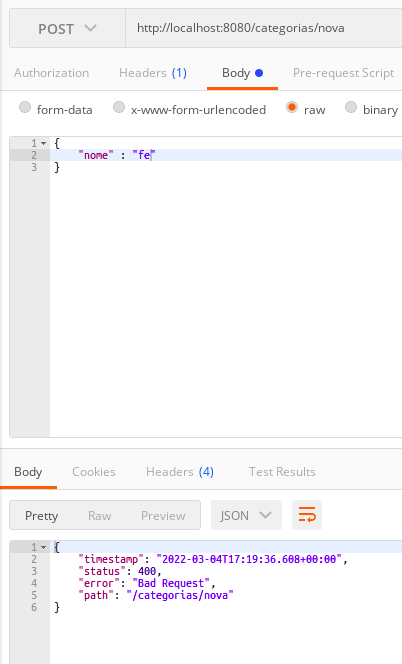

# __VALIDACAO SINTATICA COM BEAN VALIDATION__

As validacoes podem ser divididas em 2 principais tipos, validacoes sem acesso a dados, quando nao ha necessidade de comparacao com dados do banco de dados, e validacoes com acesso a dados, quando ha a necessidade de comparar ou validar a quantidada de dados no banco de dados.

- Validaceos sem acesso a dados
    - Sintaticas: campo nao pode ser vazio, valor numerico minimo e maximo, comprimento minimo e maximo de string, somente digitos, pardrao (regex, ex (##)#####-####).
    - Outras: data futura, data passada
    - Mais de um campo: confirmacao de senha igual a senha

- Com acesso a dados
    - Email nao pode ser repetido
    - Cada cliente pode cadastrar no max 3 cupons

#
## Gerenciamento de dependencias

O pacote com a implementacao das validacoes esta disponivel em [Hibernate Validator Engine Relocation Artifact](https://mvnrepository.com/artifact/org.hibernate/hibernate-validator), basta adicionar a dependencia ao `pom.xml`

```xml
<?xml version="1.0" encoding="UTF-8"?>
<project xmlns="http://maven.apache.org/POM/4.0.0" xmlns:xsi="http://www.w3.org/2001/XMLSchema-instance"
	xsi:schemaLocation="http://maven.apache.org/POM/4.0.0 https://maven.apache.org/xsd/maven-4.0.0.xsd">
	<modelVersion>4.0.0</modelVersion>

	<parent>
		<groupId>org.springframework.boot</groupId>
		<artifactId>spring-boot-starter-parent</artifactId>
		<version>2.6.3</version>
		<relativePath/>
	</parent>

	<groupId>br.com.estudos.springboot</groupId>

	<artifactId>ProjetoSpringBoot</artifactId>

	<version>0.0.1-SNAPSHOT</version>

	<name>ProjetoSpringBoot</name>

	<description>Projeto para aplicar os conhecimentos adquiridos no curso da Udemy Spring Boot, Hibernate, REST, Ionic, JWT, S3, MySQL, MongoDB</description>

	<properties>
		<java.version>11</java.version>
	</properties>

	<dependencies>
		<dependency>
			<groupId>org.springframework.boot</groupId>
			<artifactId>spring-boot-starter-web</artifactId>
		</dependency>

		<dependency>
			<groupId>org.springframework.boot</groupId>
			<artifactId>spring-boot-starter-test</artifactId>
			<scope>test</scope>
		</dependency>

		<dependency>
			<groupId>org.springframework.boot</groupId>
			<artifactId>spring-boot-starter-data-jpa</artifactId>
		</dependency>

		<dependency>
			<groupId>mysql</groupId>
			<artifactId>mysql-connector-java</artifactId>
			<version>8.0.19</version>
		</dependency>

        <!-- dependencia adicionada, implementacao das validacoes -->
		<!-- https://mvnrepository.com/artifact/org.hibernate/hibernate-validator -->
		<!-- versao utilizada pois a versao final apresentou problemas-->
		<dependency>
			<groupId>org.hibernate</groupId>
			<artifactId>hibernate-validator</artifactId>
			<version>6.2.0.Final</version>
		</dependency>


	</dependencies>

	<build>
		<plugins>
			<plugin>
				<groupId>org.springframework.boot</groupId>
				<artifactId>spring-boot-maven-plugin</artifactId>
			</plugin>
		</plugins>
	</build>

</project>
```

#
## Implementacao das validacoes

sugestao de implementacao das validacoes pelo curso. O objeto sera interceptado e as validacoes seram aplicadas

<p align="center">
    <br>
    figura 1 - sugestao do curso para implementacao das validacoes relativas ao hibernate na camada de controle.
</p>

Refatoracao da classe de dominio `Categoria`

```java
package br.com.estudos.springboot.projetospringboot.domain;

import org.hibernate.validator.constraints.Length;
import javax.persistence.*;
import javax.validation.constraints.NotEmpty;
import java.util.ArrayList;
import java.util.List;
import java.util.Objects;

@Entity
public class Categoria {

    @Id
    @GeneratedValue(strategy = GenerationType.IDENTITY)
    private Integer id;

	// anotacoes adicionadas para validacao
    @NotEmpty(message = "preenchimento do campo obrigatorio")
    @Length(min = 5, max = 80, message = "o campo deve conter entre {min} e {max} caracteres")
    private String nome;

    @ManyToMany(mappedBy = "categorias")
    private List<Produto> produtos = new ArrayList<>();

    public Categoria(){
    }

    public Categoria(Integer id, String nome){
        setId(id);
        setNome(nome);
    }

    public Integer getId() {
        return id;
    }

    public void setId(Integer id) {
        this.id = id;
    }

    public String getNome() {
        return nome;
    }

    public void setNome(String nome) {
        this.nome = nome;
    }

    public List<Produto> getProdutos() {
        return produtos;
    }

    public void setProdutos(List<Produto> produtos) {
        this.produtos = produtos;
    }

    @Override
    public boolean equals(Object o) {
        if (this == o) return true;
        if (o == null || getClass() != o.getClass()) return false;
        Categoria categoria = (Categoria) o;
        return Objects.equals(id, categoria.id);
    }

    @Override
    public int hashCode() {
        return Objects.hash(id);
    }
}
```

refatoracao na classe `CategoriaResource`

```java
package br.com.estudos.springboot.projetospringboot.resource;

import org.springframework.beans.factory.annotation.Autowired;
import org.springframework.data.domain.Page;
import org.springframework.http.ResponseEntity;
import org.springframework.web.bind.annotation.*;
import org.springframework.web.servlet.support.ServletUriComponentsBuilder;
import java.net.URI;
import java.util.List;

import br.com.estudos.springboot.projetospringboot.domain.Categoria;
import br.com.estudos.springboot.projetospringboot.domain.dto.CategoriaDTO;
import br.com.estudos.springboot.projetospringboot.service.CategoriaService;

import javax.validation.Valid;

@RestController
@RequestMapping(value = "/categorias")
public class CategoriaResource {

    @Autowired
    private CategoriaService service;

    @RequestMapping(method = RequestMethod.GET, value = "/buscar/{id}")
    public ResponseEntity<?> buscar(@PathVariable Integer id){

        Categoria categoria = service.buscar(id);

        return ResponseEntity.ok().body(categoria);
    }

	// annotation @Valid inserida no parametro do tipo Categoria
    @RequestMapping(method = RequestMethod.POST, value = "/nova")
    public ResponseEntity<Void> inserir(@Valid @RequestBody Categoria categoria){
        categoria = service.inserir(categoria);
        URI uri = ServletUriComponentsBuilder.fromCurrentRequestUri().replacePath("categorias/buscar/{id}").build(categoria.getId());
        return ResponseEntity.created(uri).build();
    }

	// annotation @Valid inserida no parametro do tipo Categoria
    @RequestMapping(method = RequestMethod.PUT, value = "/alterar/{id}")
    public ResponseEntity<Void> alterar(@Valid @RequestBody Categoria categoria, @PathVariable Integer id){
        categoria.setId(id);
        categoria = service.alterar(categoria);
        return ResponseEntity.noContent().build();
    }

    @RequestMapping(method = RequestMethod.DELETE, value = "/deletar/{id}")
    public ResponseEntity<Void> delete(@PathVariable Integer id){
        service.deletar(id);
        return ResponseEntity.noContent().build();
    }

    @RequestMapping(method = RequestMethod.GET, value = "/buscar/todas")
    public ResponseEntity<List<CategoriaDTO>> buscarTodas(){
        List<CategoriaDTO> categorias = service.buscarTodas();
        return ResponseEntity.ok().body(categorias);
    }

    @RequestMapping(method = RequestMethod.GET, value = "/buscar")
    public ResponseEntity<Page<CategoriaDTO>> buscarPaginado(
            @RequestParam(value = "pg", defaultValue = "0") Integer numeroPagina,
            @RequestParam(value = "qtditenspg", defaultValue = "2") Integer linhasPorPagina,
            @RequestParam(value = "ordenar", defaultValue = "nome") String ordenarPor,
            @RequestParam(value = "dir", defaultValue = "ASC") String direcaoOrdencao
    ){
        Page<CategoriaDTO> paginaCategoriaDto = service.buscarPaginado(numeroPagina, linhasPorPagina, ordenarPor, direcaoOrdencao);
        return ResponseEntity.ok().body(paginaCategoriaDto);
    }

}
```

#
## Tentativa de inserir dados invalidos

<p align="center">
    <br>
    figura 2 - insercao de dados invalidos.
</p>

#
## Referencias
- [Java bean validation](https://docs.oracle.com/javaee/6/tutorial/doc/gircz.html)
- [Hibernate Validator](https://docs.jboss.org/hibernate/validator/8.0/reference/en-US/html_single/#section-group-conversion)


