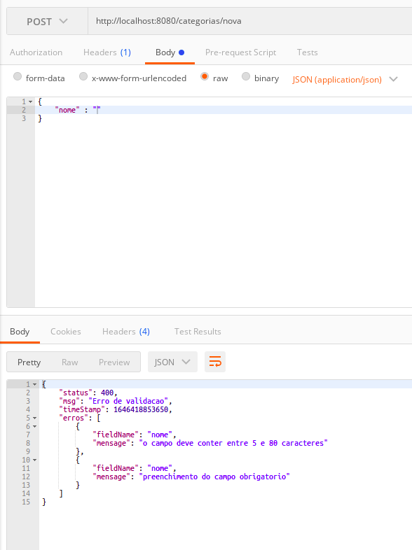

# __PERSONALIZANDO ERRO DE RETORNO BEAN VALIDATION__

Ao tentar inserir um dado invalido obtemos o retorno do status `http 400 Bad Request`, mas para o usuario estes dados nao sao relevantes, deste modo vamos implementar o retorno personalizado para informar os erros relativos a cada campo nao valido.

Se argumentos invalidos forem fornecidos para os campos a classe `MethodArgumentNotValidException` sera disparada, como temos a nossa classe anotada com `@ControllerAdvice` iremos utiliza-la para interceptar essa exception e gerar a resposta personalizada. Alem das informacoes ja retornadas pela classe `StandardError` (status http, mensagem, tempo atual), e necessario retorna os erros relativos a cada campo, para isto utiliza-se heranca para especializar a classe de erros na validacao, vamos implementar 2 novas classes, `FieldMensage` que ira conter apenas o nome e a mensagem de erro relativa aos campos, e `ValidationError` que ira conter a lista de `FieldMensage`.

criacao da classe `FieldMensage`

```java
package br.com.estudos.springboot.projetospringboot.resource.exceptions;

public class FieldMensage {

    private String fieldName;

    private String mensage;

    public FieldMensage(){

    }

    public FieldMensage(String fieldName, String mensage) {
        this.fieldName = fieldName;
        this.mensage = mensage;
    }

    public String getFieldName() {
        return fieldName;
    }

    public void setFieldName(String fieldName) {
        this.fieldName = fieldName;
    }

    public String getMensage() {
        return mensage;
    }

    public void setMensage(String mensage) {
        this.mensage = mensage;
    }
}
```

criacao da classe `ValidationError`

```java
package br.com.estudos.springboot.projetospringboot.resource.exceptions;

import java.util.ArrayList;
import java.util.List;

public class ValidationError extends StandardError {

    List<FieldMensage> erros = new ArrayList<>();

    public ValidationError(Integer status, String msg, Long timeStamp) {
        super(status, msg, timeStamp);
    }

    public List<FieldMensage> getErros() {
        return erros;
    }

    public void addFieldError(String fieldName, String mensage) {
        erros.add(new FieldMensage(fieldName, mensage));
    }
}
```
note que o metodo `setErros()` foi substituido por `addFieldMensage`, pois seram passados os erros um a um a partir de uma lista gerada pela exception `MethodArgumentNotValidException`.

refatoracao da classe `` para interceptar a exception

```java
package br.com.estudos.springboot.projetospringboot.resource.exceptions;

import br.com.estudos.springboot.projetospringboot.service.exceptions.DataIntegrityException;
import br.com.estudos.springboot.projetospringboot.service.exceptions.ObjectNotFoundException;
import org.springframework.http.HttpStatus;
import org.springframework.http.ResponseEntity;
import org.springframework.validation.FieldError;
import org.springframework.web.bind.MethodArgumentNotValidException;
import org.springframework.web.bind.annotation.ControllerAdvice;
import org.springframework.web.bind.annotation.ExceptionHandler;

import javax.servlet.http.HttpServletRequest;

@ControllerAdvice
public class ResourceExceptionHandler {

    @ExceptionHandler(ObjectNotFoundException.class)
    public ResponseEntity<StandardError> objectNotFound(ObjectNotFoundException e, HttpServletRequest request) {
        StandardError erro = new StandardError(HttpStatus.NOT_FOUND.value(), e.getMessage(), System.currentTimeMillis());
        return ResponseEntity.status(HttpStatus.NOT_FOUND).body(erro);
    }

    @ExceptionHandler(DataIntegrityException.class)
    public ResponseEntity<StandardError> dataIntegity(DataIntegrityException e, HttpServletRequest request){
        StandardError erro = new StandardError(HttpStatus.BAD_REQUEST.value(), e.getMessage(), System.currentTimeMillis());
        return ResponseEntity.status(HttpStatus.BAD_REQUEST).body(erro);
    }

    // metodo que sera disparado ao interceptar a exception
    @ExceptionHandler(MethodArgumentNotValidException.class)
    public ResponseEntity<StandardError> validationError(MethodArgumentNotValidException e, HttpServletRequest request){
        ValidationError erro = new ValidationError(HttpStatus.BAD_REQUEST.value(), "Erro de validacao", System.currentTimeMillis());
        for(FieldError x : e.getBindingResult().getFieldErrors()){
            erro.addFieldError(x.getField(), x.getDefaultMessage());
        }

        return ResponseEntity.status(HttpStatus.BAD_REQUEST).body(erro);
    }
}
```

#
## testando retorno personalizado

tentativa de inserir dados invalidos


<p align="center">
    <br>
    figura 1 - insercao de dados invalidos com retorno personalizado.
</p>

