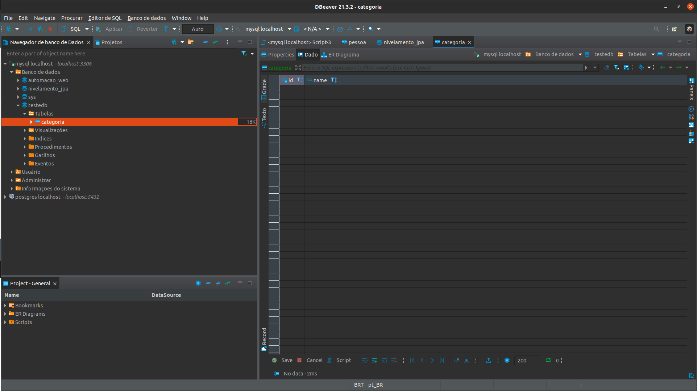

# __CRIACAO AUTOMATICA DA BASE DE DADOS__

Retomando o exemplo apresentado em [CLASSE DE DOMINIO IMPLEMENTACAO SIMPLES](05-configuracao-mysql-com-springboot.md), para que o Spring Boot reconheca a Classe `Categoria` como uma classe de dominio (entidade, tabela no banco) e necessario refatorar a classe com as _annotations_.

LEMBRETE: para o Spring Boot gerar as entidades de domino automaticamente no banco de dados a propriedade `spring.jpa.hibernate.ddl-auto` deve possuir o valor `update` em ``resources/application.properties`.

```java
package br.com.estudos.springboot.projetospringboot.domain;

import javax.persistence.Entity;
import javax.persistence.GeneratedValue;
import javax.persistence.GenerationType;
import javax.persistence.Id;
import java.util.Objects;

@Entity
public class Categoria {

    @Id
    @GeneratedValue(strategy = GenerationType.IDENTITY)
    private Integer id;

    private String name;

    public Categoria(){
    }

    public Categoria(Integer id, String name){
        setId(id);
        setName(name);
    }

    public Integer getId() {
        return id;
    }

    public void setId(Integer id) {
        this.id = id;
    }

    public String getName() {
        return name;
    }

    public void setName(String name) {
        this.name = name;
    }

    @Override
    public boolean equals(Object o) {
        if (this == o) return true;
        if (o == null || getClass() != o.getClass()) return false;
        Categoria categoria = (Categoria) o;
        return Objects.equals(id, categoria.id);
    }

    @Override
    public int hashCode() {
        return Objects.hash(id);
    }
}

```

note que foram adicionadas as seguintes _annotations_, `@Entity` define a classe como uma entidade objeto-relacional, `@Id` define a variavel annotada como chave primaria da entidade e `@GeneratedValue` recebendo como parametro a forma como a chave primaria sera gerada no MySQL (outros bancos de dados podem utilizar outros modos de geracao da chave primaria, mas em geral `IDENTITY` e funcional em grande parte dos bancos de dados relacionais).

Ao iniciar a applicacao o Hibernate ira gerar a Query SQL automaticamente para gerar a entidade no banco de dados caso ainda nao exista, como em `resources/application.properties` foram adicionadas as seguintes propriedades `spring.jpa.properties.hibernate.format_sql=true` e `spring.jpa.show-sql=true` as instrucoes envidas ao banco de dados estao no log similar a exemplo.

```
03:12:57.846 [Thread-0] DEBUG org.springframework.boot.devtools.restart.classloader.RestartClassLoader - Created RestartClassLoader org.springframework.boot.devtools.restart.classloader.RestartClassLoader@2e6363a3

  .   ____          _            __ _ _
 /\\ / ___'_ __ _ _(_)_ __  __ _ \ \ \ \
( ( )\___ | '_ | '_| | '_ \/ _` | \ \ \ \
 \\/  ___)| |_)| | | | | || (_| |  ) ) ) )
  '  |____| .__|_| |_|_| |_\__, | / / / /
 =========|_|==============|___/=/_/_/_/
 :: Spring Boot ::                (v2.6.3)

2022-02-06 03:12:58.220  INFO 182971 --- [  restartedMain] b.c.e.s.p.ProjetoSpringBootApplication   : Starting ProjetoSpringBootApplication using Java 17.0.1 on trajy with PID 182971 (/home/trajy/Documentos/Contmatic/Workspace/Estagio/Estudos/Frameworks/Spring Boot/Udemy - Spring, Hibernate, REST, Ionic, JWT, S3, MySQL, MongoDb/Codigos Fonte/Exemplos sobre topicos/Back-end/ProjetoSpringBoot/ProjetoSpringBoot/target/classes started by trajy in /home/trajy/Documentos/Contmatic/Workspace/Estagio/Estudos/Frameworks/Spring Boot/Udemy - Spring, Hibernate, REST, Ionic, JWT, S3, MySQL, MongoDb/Codigos Fonte/Exemplos sobre topicos/Back-end/ProjetoSpringBoot/ProjetoSpringBoot)
2022-02-06 03:12:58.221  INFO 182971 --- [  restartedMain] b.c.e.s.p.ProjetoSpringBootApplication   : No active profile set, falling back to default profiles: default
2022-02-06 03:12:58.281  INFO 182971 --- [  restartedMain] .e.DevToolsPropertyDefaultsPostProcessor : Devtools property defaults active! Set 'spring.devtools.add-properties' to 'false' to disable
2022-02-06 03:12:58.281  INFO 182971 --- [  restartedMain] .e.DevToolsPropertyDefaultsPostProcessor : For additional web related logging consider setting the 'logging.level.web' property to 'DEBUG'
2022-02-06 03:12:58.783  INFO 182971 --- [  restartedMain] .s.d.r.c.RepositoryConfigurationDelegate : Bootstrapping Spring Data JPA repositories in DEFAULT mode.
2022-02-06 03:12:58.800  INFO 182971 --- [  restartedMain] .s.d.r.c.RepositoryConfigurationDelegate : Finished Spring Data repository scanning in 7 ms. Found 0 JPA repository interfaces.
2022-02-06 03:12:59.437  INFO 182971 --- [  restartedMain] o.s.b.w.embedded.tomcat.TomcatWebServer  : Tomcat initialized with port(s): 8080 (http)
2022-02-06 03:12:59.449  INFO 182971 --- [  restartedMain] o.apache.catalina.core.StandardService   : Starting service [Tomcat]
2022-02-06 03:12:59.449  INFO 182971 --- [  restartedMain] org.apache.catalina.core.StandardEngine  : Starting Servlet engine: [Apache Tomcat/9.0.56]
2022-02-06 03:12:59.513  INFO 182971 --- [  restartedMain] o.a.c.c.C.[Tomcat].[localhost].[/]       : Initializing Spring embedded WebApplicationContext
2022-02-06 03:12:59.513  INFO 182971 --- [  restartedMain] w.s.c.ServletWebServerApplicationContext : Root WebApplicationContext: initialization completed in 1232 ms
2022-02-06 03:12:59.692  INFO 182971 --- [  restartedMain] o.hibernate.jpa.internal.util.LogHelper  : HHH000204: Processing PersistenceUnitInfo [name: default]
2022-02-06 03:12:59.734  INFO 182971 --- [  restartedMain] org.hibernate.Version                    : HHH000412: Hibernate ORM core version 5.6.4.Final
2022-02-06 03:12:59.855  INFO 182971 --- [  restartedMain] o.hibernate.annotations.common.Version   : HCANN000001: Hibernate Commons Annotations {5.1.2.Final}
2022-02-06 03:12:59.937  INFO 182971 --- [  restartedMain] com.zaxxer.hikari.HikariDataSource       : HikariPool-1 - Starting...
2022-02-06 03:13:00.057  INFO 182971 --- [  restartedMain] com.zaxxer.hikari.HikariDataSource       : HikariPool-1 - Start completed.
2022-02-06 03:13:00.068  INFO 182971 --- [  restartedMain] org.hibernate.dialect.Dialect            : HHH000400: Using dialect: org.hibernate.dialect.MySQL8Dialect
Hibernate: 
    
    drop table if exists categoria
Hibernate: 
    
    create table categoria (
       id integer not null auto_increment,
        name varchar(255),
        primary key (id)
    ) engine=InnoDB
2022-02-06 03:13:00.517  INFO 182971 --- [  restartedMain] o.h.e.t.j.p.i.JtaPlatformInitiator       : HHH000490: Using JtaPlatform implementation: [org.hibernate.engine.transaction.jta.platform.internal.NoJtaPlatform]
2022-02-06 03:13:00.523  INFO 182971 --- [  restartedMain] j.LocalContainerEntityManagerFactoryBean : Initialized JPA EntityManagerFactory for persistence unit 'default'
2022-02-06 03:13:00.568  WARN 182971 --- [  restartedMain] JpaBaseConfiguration$JpaWebConfiguration : spring.jpa.open-in-view is enabled by default. Therefore, database queries may be performed during view rendering. Explicitly configure spring.jpa.open-in-view to disable this warning
2022-02-06 03:13:00.863  INFO 182971 --- [  restartedMain] o.s.b.d.a.OptionalLiveReloadServer       : LiveReload server is running on port 35729
2022-02-06 03:13:00.887  INFO 182971 --- [  restartedMain] o.s.b.w.embedded.tomcat.TomcatWebServer  : Tomcat started on port(s): 8080 (http) with context path ''
2022-02-06 03:13:00.898  INFO 182971 --- [  restartedMain] b.c.e.s.p.ProjetoSpringBootApplication   : Started ProjetoSpringBootApplication in 3.041 seconds (JVM running for 3.534)
```

podemos vizualizar a tabela gerada atraves do DBeaver (gerenciador do banco de dados).

<p align="center">
    <br>
    figura 1 - Consulta da entidade (tabela) gerada automaticamente.
</p>

