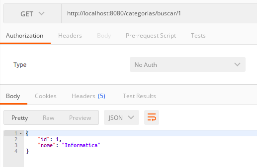
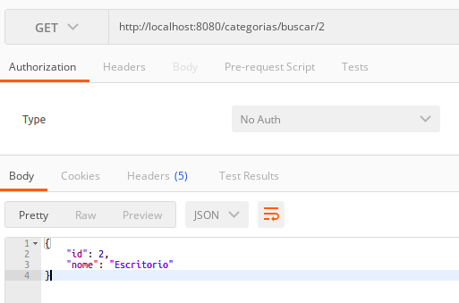

# __ATUALIZANDO A ARQUITETURA DE SOFTWARE__

OBSERVACAO: A partir da versao 2.x.x do Spring Boot a implementacao do java 7 foi removida e os retornos das classes Service necessitam implementar a opcional `Optional` que consiste no encapsulamento da instancia do objeto e em caso de nao exsistir instqancia, um valor alternativo pode ser fornecido para o retorno no lugar de `null`, nao gerando `NullPointerExceptions`, porem e possivel fornecer o valor `null` como alternativa.

comparativo entre as implementacoes

```java 

// implementacao sem a classe Opcional
public Categoria find(Integer id){
    Categoria obj = repository.findOne(id);
    return obj;
}

// implementacao com a classe opcional
public Categoria find(Integer id){
    Optional<Categoria> obj = repository.findById(id);
    return obj.orElse(null);
}
```
#
## __Arquitetura de Software Data Transfer Object (DTO)__

No documento [REST IMPLEMENTACAO SIMPLES](03-rest-implementacao-simples.md) a arquitetura [Data Transfer Object (DTO)](https://martinfowler.com/eaaCatalog/dataTransferObject.html) foi intruduzida, vamos analizar uma abordagem mais completa sobre as responsabilidades delegadas a cada camada da aplicacao. A figura 1 mostra a relacao entre as camadas.

<p align="center">
    <br>
    figura 1 - Arquitetura de software Data Transfer Object (DTO).
</p>

- Controller: Neste exemplo a implementacao de controladores REST do hibernate tambem chamado de end-point (extremidade da aplicacao, interface de comunicacao entre o back-end e front-end).

- Service: Responsavel por aplicar as regras de negocio nas operacoes fornecidas pela camada Repository e enviar para os controladores REST (Nao possui contato com tecnologias externas a aplicacao), contem as regras de negocios que por ventura nao foram implementadas na camada de dominio.

- Repository: Camada Responsavel por acessar os dados, ou seja se comunicar com o banco de dados, nela sao declaradas as classes que efetivamente realizao as operacoes e consultas no banco de dados.

- Domain: Sao as classes relativas as entidades do banco de dados, contem os mapeamentos objeto-relacional (E utilizada pelas camadas de Servico e Repository para  acessar os dados).

Supondo que a aplicacao faca uma solicitacao atraves de um end-point, a Camada de controladores REST ira comunicar-se com a Camada de Servicos que pos sua Vez Ira se Comunicar com a camda Repository que ira no banco de dados realizar as operacoes necessarias.

#
## __Criando Repository e Service__

Seguindo com o exemplo utilizando a classe `Categoria` especificada no [diagrama UML de classes](../../ConteudoDoCurso/Secao2-ImplementacaoDoModeloConceitual/Diagrama/diagrama-de-classes.png) vamos implementar as classes Repository e Service relativas a `Categoria`.

2 novos subpacotes serao criados repository e service.

Implementacao da Camada Repository contem a interface `CategoriaRepository`, os metodos apenas assinados e serao implementados na camada de servico, neste caso 
na classe `CategoriaService`.

Implementacao da interface `CategoriaRepository`.

```java
package br.com.estudos.springboot.projetospringboot.ropository;

import br.com.estudos.springboot.projetospringboot.domain.Categoria;
import org.springframework.data.jpa.repository.JpaRepository;
import org.springframework.stereotype.Repository;

@Repository
public interface CategoriaRepository extends JpaRepository<Categoria, Integer> {

}
```
nunhum metodo sera assinado neste exemplo pois os metodos heradados da classe `JpaRepository` serao suficientes para o exemplo, note que a interface possui a anotacao `@Repository` para que o hibernate possa identificar a interface.

A classe na camada Service percisa ser capaz de entre entregar uma classe de Dominio para a camada da classe Resource, coforme o nosso exemplo a Classe `CartegoriaService` precisa entregar um Objeto da classe `Categoria` para a classe `CategoriaResource`.

Implementacao da classe `CategoriaService`

```java
package br.com.estudos.springboot.projetospringboot.service;

import br.com.estudos.springboot.projetospringboot.domain.Categoria;
import br.com.estudos.springboot.projetospringboot.ropository.CategoriaRepository;
import org.springframework.beans.factory.annotation.Autowired;
import org.springframework.stereotype.Service;

import java.util.Optional;

@Service
public class CategoriaService {

    @Autowired
    private CategoriaRepository repository;

    public Categoria buscar(Integer id){
        Optional<Categoria> categoria = repository.findById(id);
        return categoria.orElse(null);
    }

}
```
Note que a classe possui a anotacao `@Service` para que o Hibernate possa identificar a classe, e o atributo `repository` (a classe CategoriaService possui dependencia da interface CategoriaRepository), possui a anotacao `@Autowired` que ira realizar a injecao de dependencia ou a inversao de controle automaticamente.

Refatorando a classe `CategoriaResource` na camada de controle.

```java
package br.com.estudos.springboot.projetospringboot.resource;

import br.com.estudos.springboot.projetospringboot.domain.Categoria;
import br.com.estudos.springboot.projetospringboot.service.CategoriaService;
import org.springframework.beans.factory.annotation.Autowired;
import org.springframework.http.ResponseEntity;
import org.springframework.web.bind.annotation.PathVariable;
import org.springframework.web.bind.annotation.RequestMapping;
import org.springframework.web.bind.annotation.RequestMethod;
import org.springframework.web.bind.annotation.RestController;

import java.util.ArrayList;
import java.util.List;

@RestController
@RequestMapping(value = "/categorias")
public class CategoriaResource {

    @Autowired
    private CategoriaService service;

    @RequestMapping(method = RequestMethod.GET, value = "/buscar/{id}")
    public ResponseEntity<?> buscar(@PathVariable Integer id){

        Categoria categoria = service.buscar(id);

        return ResponseEntity.ok().body(categoria);
    }

}
```

note que a classe `CategoriaResource` possui dependencia da classe `CategoriaService` e a anotacao `@Autowired` ira injetar a depencencia ou inverter o controle automaticamente, o Spring framework possui a classe `ResponseEntity` que encapsula o retorno do objeto e fornece dados de conexao junto ao objeto retornado.

#
## __Iniciando a aplicacao e testando end-points__

Antes de iniciar a aplicacao os dados para consulta necessitam ser inseridos por meio do DBeaver (gerenciador do banco de dados), pois as operacoes de insercao de dados ainda nao foram implementadas, basta iniciar o seguinte script no editor SQL.

```sql
INSERT INTO categoria(nome) VALUES ("Informatica");
INSERT INTO categoria(nome) VALUES ("Escritorio");
```
ao iniciar a aplicacao e utlizar o software Postman para acessar o end-point.

<p align="center">
    <br>
    figura 1 - utilizando Postman para acessar o end-point cateroria/buscar com o id 1.
</p>

<p align="center">
    <br>
    figura 1 - utilizando Postman para acessar o end-point cateroria/buscar com o id 2.
</p>

log apos realizar a inicializcao e o acesso aos end-points.

```log
10:47:13.244 [Thread-0] DEBUG org.springframework.boot.devtools.restart.classloader.RestartClassLoader - Created RestartClassLoader org.springframework.boot.devtools.restart.classloader.RestartClassLoader@2e6363a3

  .   ____          _            __ _ _
 /\\ / ___'_ __ _ _(_)_ __  __ _ \ \ \ \
( ( )\___ | '_ | '_| | '_ \/ _` | \ \ \ \
 \\/  ___)| |_)| | | | | || (_| |  ) ) ) )
  '  |____| .__|_| |_|_| |_\__, | / / / /
 =========|_|==============|___/=/_/_/_/
 :: Spring Boot ::                (v2.6.3)

2022-02-06 10:47:13.623  INFO 208164 --- [  restartedMain] b.c.e.s.p.ProjetoSpringBootApplication   : Starting ProjetoSpringBootApplication using Java 17.0.1 on trajy with PID 208164 (/home/trajy/Documentos/Contmatic/Workspace/Estagio/Estudos/Frameworks/Spring Boot/Udemy - Spring, Hibernate, REST, Ionic, JWT, S3, MySQL, MongoDb/Codigos Fonte/Exemplos sobre topicos/Back-end/ProjetoSpringBoot/ProjetoSpringBoot/target/classes started by trajy in /home/trajy/Documentos/Contmatic/Workspace/Estagio/Estudos/Frameworks/Spring Boot/Udemy - Spring, Hibernate, REST, Ionic, JWT, S3, MySQL, MongoDb/Codigos Fonte/Exemplos sobre topicos/Back-end/ProjetoSpringBoot/ProjetoSpringBoot)
2022-02-06 10:47:13.624  INFO 208164 --- [  restartedMain] b.c.e.s.p.ProjetoSpringBootApplication   : No active profile set, falling back to default profiles: default
2022-02-06 10:47:13.688  INFO 208164 --- [  restartedMain] .e.DevToolsPropertyDefaultsPostProcessor : Devtools property defaults active! Set 'spring.devtools.add-properties' to 'false' to disable
2022-02-06 10:47:13.689  INFO 208164 --- [  restartedMain] .e.DevToolsPropertyDefaultsPostProcessor : For additional web related logging consider setting the 'logging.level.web' property to 'DEBUG'
2022-02-06 10:47:14.195  INFO 208164 --- [  restartedMain] .s.d.r.c.RepositoryConfigurationDelegate : Bootstrapping Spring Data JPA repositories in DEFAULT mode.
2022-02-06 10:47:14.252  INFO 208164 --- [  restartedMain] .s.d.r.c.RepositoryConfigurationDelegate : Finished Spring Data repository scanning in 46 ms. Found 1 JPA repository interfaces.
2022-02-06 10:47:14.827  INFO 208164 --- [  restartedMain] o.s.b.w.embedded.tomcat.TomcatWebServer  : Tomcat initialized with port(s): 8080 (http)
2022-02-06 10:47:14.837  INFO 208164 --- [  restartedMain] o.apache.catalina.core.StandardService   : Starting service [Tomcat]
2022-02-06 10:47:14.837  INFO 208164 --- [  restartedMain] org.apache.catalina.core.StandardEngine  : Starting Servlet engine: [Apache Tomcat/9.0.56]
2022-02-06 10:47:14.896  INFO 208164 --- [  restartedMain] o.a.c.c.C.[Tomcat].[localhost].[/]       : Initializing Spring embedded WebApplicationContext
2022-02-06 10:47:14.896  INFO 208164 --- [  restartedMain] w.s.c.ServletWebServerApplicationContext : Root WebApplicationContext: initialization completed in 1207 ms
2022-02-06 10:47:15.070  INFO 208164 --- [  restartedMain] o.hibernate.jpa.internal.util.LogHelper  : HHH000204: Processing PersistenceUnitInfo [name: default]
2022-02-06 10:47:15.100  INFO 208164 --- [  restartedMain] org.hibernate.Version                    : HHH000412: Hibernate ORM core version 5.6.4.Final
2022-02-06 10:47:15.195  INFO 208164 --- [  restartedMain] o.hibernate.annotations.common.Version   : HCANN000001: Hibernate Commons Annotations {5.1.2.Final}
2022-02-06 10:47:15.251  INFO 208164 --- [  restartedMain] com.zaxxer.hikari.HikariDataSource       : HikariPool-1 - Starting...
2022-02-06 10:47:15.346  INFO 208164 --- [  restartedMain] com.zaxxer.hikari.HikariDataSource       : HikariPool-1 - Start completed.
2022-02-06 10:47:15.355  INFO 208164 --- [  restartedMain] org.hibernate.dialect.Dialect            : HHH000400: Using dialect: org.hibernate.dialect.MySQL8Dialect
Hibernate: 
    
    drop table if exists categoria
Hibernate: 
    
    create table categoria (
       id integer not null auto_increment,
        nome varchar(255),
        primary key (id)
    ) engine=InnoDB
2022-02-06 10:47:15.805  INFO 208164 --- [  restartedMain] o.h.e.t.j.p.i.JtaPlatformInitiator       : HHH000490: Using JtaPlatform implementation: [org.hibernate.engine.transaction.jta.platform.internal.NoJtaPlatform]
2022-02-06 10:47:15.810  INFO 208164 --- [  restartedMain] j.LocalContainerEntityManagerFactoryBean : Initialized JPA EntityManagerFactory for persistence unit 'default'
2022-02-06 10:47:16.057  WARN 208164 --- [  restartedMain] JpaBaseConfiguration$JpaWebConfiguration : spring.jpa.open-in-view is enabled by default. Therefore, database queries may be performed during view rendering. Explicitly configure spring.jpa.open-in-view to disable this warning
2022-02-06 10:47:16.323  INFO 208164 --- [  restartedMain] o.s.b.d.a.OptionalLiveReloadServer       : LiveReload server is running on port 35729
2022-02-06 10:47:16.347  INFO 208164 --- [  restartedMain] o.s.b.w.embedded.tomcat.TomcatWebServer  : Tomcat started on port(s): 8080 (http) with context path ''
2022-02-06 10:47:16.358  INFO 208164 --- [  restartedMain] b.c.e.s.p.ProjetoSpringBootApplication   : Started ProjetoSpringBootApplication in 3.102 seconds (JVM running for 3.533)
2022-02-06 10:47:31.498  INFO 208164 --- [nio-8080-exec-1] o.a.c.c.C.[Tomcat].[localhost].[/]       : Initializing Spring DispatcherServlet 'dispatcherServlet'
2022-02-06 10:47:31.499  INFO 208164 --- [nio-8080-exec-1] o.s.web.servlet.DispatcherServlet        : Initializing Servlet 'dispatcherServlet'
2022-02-06 10:47:31.500  INFO 208164 --- [nio-8080-exec-1] o.s.web.servlet.DispatcherServlet        : Completed initialization in 0 ms
Hibernate: 
    select
        categoria0_.id as id1_0_0_,
        categoria0_.nome as nome2_0_0_ 
    from
        categoria categoria0_ 
    where
        categoria0_.id=?
Hibernate: 
    select
        categoria0_.id as id1_0_0_,
        categoria0_.nome as nome2_0_0_ 
    from
        categoria categoria0_ 
    where
        categoria0_.id=?
```


