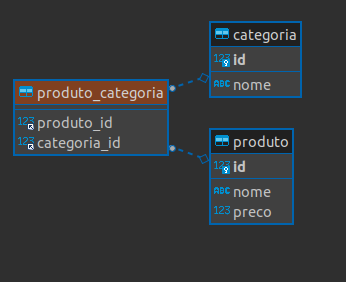
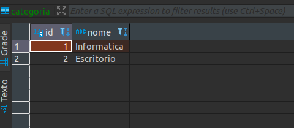
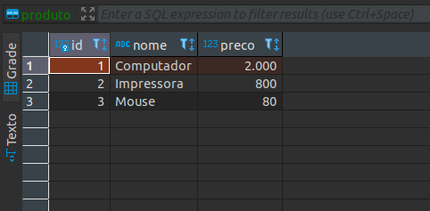
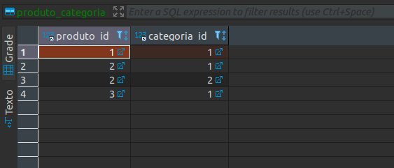

# __ASSOCIACAO MUITOS PARA MUITOS__

Conforme o [diagrama UML de classes](../../ConteudoDoCurso/Secao2-ImplementacaoDoModeloConceitual/Diagrama/diagrama-de-classes.png), sera feita a implementacao das demais classes e seus relacinamentos, a proxima entidade a ser implementada sera `Produto` que possui um relacionamento de muitos para muitos com a classe `Categoria`. 

#
## Implementacao do relacionamento entre classes

para implementar a relacao entre tabelas nas classes de dominio sao utilizadas as _annotacions_ `@ManyToMany` e `JoinTable` que recebe alguns parametros. _anotation_ `@JoinTable` pode ser declarada em qualquer uma das classes, e a outra recebe um parametro na annotation `@ManyToMany` declarando que possui relacionamento com outra classe, neste exemplo iremos declarar `@JoinTable` na classe `Produto`.

Refatoracao da classe `Categoria`

```java
package br.com.estudos.springboot.projetospringboot.domain;

import javax.persistence.*;
import java.util.ArrayList;
import java.util.List;
import java.util.Objects;

@Entity
public class Categoria {

    @Id
    @GeneratedValue(strategy = GenerationType.IDENTITY)
    private Integer id;

    private String nome;

    // implementacao do relacionamento entre entidades
    @ManyToMany(mappedBy = "categorias")
    private List<Produto> produtos = new ArrayList<>();

    public Categoria(){
    }

    public Categoria(Integer id, String nome){
        setId(id);
        setNome(nome);
    }

    public Integer getId() {
        return id;
    }

    public void setId(Integer id) {
        this.id = id;
    }

    public String getNome() {
        return nome;
    }

    public void setNome(String nome) {
        this.nome = nome;
    }

    public List<Produto> getProdutos() {
        return produtos;
    }

    public void setProdutos(List<Produto> produtos) {
        this.produtos = produtos;
    }

    @Override
    public boolean equals(Object o) {
        if (this == o) return true;
        if (o == null || getClass() != o.getClass()) return false;
        Categoria categoria = (Categoria) o;
        return Objects.equals(id, categoria.id);
    }

    @Override
    public int hashCode() {
        return Objects.hash(id);
    }

}
```
como cada categoria pode possuir diversos produtos uma lista de produtos e declarada na classe `Categoria` com a _annotation_ `@ManyToMany` recebendo como argumento `mappedBy = categorias` que aponta para o atributo no qual mapeia o relacinamento na classe `Produto` (ou seja, para a classe `Categoria` produto e o outro contexto), neste caso `categorias` (lista declarada na calsse `Produto`).

Implementacao da classe `Produto`

```java
package br.com.estudos.springboot.projetospringboot.domain;

import javax.persistence.*;
import java.util.ArrayList;
import java.util.List;
import java.util.Objects;

@Entity
public class Produto {

    @Id
    @GeneratedValue(strategy = GenerationType.IDENTITY)
    private Integer id;

    private String nome;

    private Double preco;

    @ManyToMany
    @JoinTable(
            name = "produto_categoria",
            joinColumns = @JoinColumn(name = "produto_id"),
            inverseJoinColumns = @JoinColumn(name = "categoria_id")
    )
    private List<Categoria> categorias = new ArrayList<>();

    public Produto(){

    }

    public Produto(Integer id, String nome, Double preco) {
        this.id = id;
        this.nome = nome;
        this.preco = preco;
    }

    public Integer getId() {
        return id;
    }

    public void setId(Integer id) {
        this.id = id;
    }

    public String getNome() {
        return nome;
    }

    public void setNome(String nome) {
        this.nome = nome;
    }

    public Double getPreco() {
        return preco;
    }

    public void setPreco(Double preco) {
        this.preco = preco;
    }

    public List<Categoria> getCategorias() {
        return categorias;
    }

    public void setCategorias(List<Categoria> categorias) {
        this.categorias = categorias;
    }

    @Override
    public boolean equals(Object o) {
        if (this == o) return true;
        if (o == null || getClass() != o.getClass()) return false;
        Produto produto = (Produto) o;
        return Objects.equals(id, produto.id);
    }

    @Override
    public int hashCode() {
        return Objects.hash(id);
    }

    @Override
    public String toString() {
        return "Produto{" +
                "id=" + id +
                ", nome='" + nome + '\'' +
                ", preco=" + preco +
                ", categorias=" + categorias +
                '}';
    }

}
```

note que alem da _annotation_ `@ManyToMany` ha tambem `@JoinTable` que recebe como argumentos `name` que e o nome da tabela que ira relacinar os ids entre `Produto` e `Categoria`, `joinColumns` que recebe outra _annotation_ que contem como argumento o nome da coluna que ira conter chave estrangeira que referencia o id deste contexto (id de `Produto`) e por fim `inverseJoinColumns` que contem o nome da coluna que ira referenciar a chave estrangeira do outro contexto,( neste caso `Categoria`).

#
## Testando a implmentacao

previamente aos testes e necessario implementar a interface da camada `repository` da aplicacao, seguindo o padrao de nomenclatura temos `ProdutoRepository`.

```java
package br.com.estudos.springboot.projetospringboot.ropository;

import br.com.estudos.springboot.projetospringboot.domain.Produto;
import org.springframework.data.jpa.repository.JpaRepository;

public interface ProdutoRepository extends JpaRepository<Produto, Integer> {

}
```
os metodos hedados de `JpaRepository` sao suficientes para persistir os dados no banco de dados, por este motivo nao temos metodos assinados na interface. Refatorando o metodo `run()` na calsse `ProjetoSpringBootApplication` para instanciar objetos do tipo produto, relacionar as listas conforme os relacionamento especificado no [diagrama UML de objetos](../../ConteudoDoCurso/Secao2-ImplementacaoDoModeloConceitual/Diagrama/diagrama-de-objetos.png) e persistir os objetos no banco de dados na inicializacao da aplicacao.

Em um relacionamento de muitos para muitos uma tabela intermediaria sera criada, conforme o diagrama entidade relacional a seguir.

<p align="center">
    <br>
    figura 1 - diagrama entidade relacinal entre as tabelas geradas no banco de dados.
</p>

<p align="center">
    <br>
    figura 2 - dados persistidos na entidade categoria.
</p>


<p align="center">
    <br>
    figura 3 - dados persistidos na entidade produto.
</p>

<p align="center">
    <br>
    figura 3 - dados persistidos na entidade produto.
</p>

<p align="center">
    <br>
    figura 4 - dados persistidos na entidade de relacionamento entre entidades produto catogoria.
</p>


