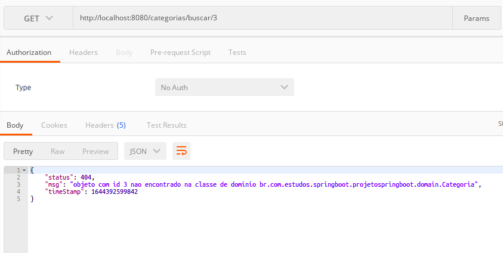

# __AJUSTES NO END-POINT DE CATEGORIA__

## Erro causado pela associacao muitos pra muitos

#
### Replicando erro
Ao acessar o end-point em uma classe de dominio que possui o relacionamento de muitos para muitos (`@ManyToMany`) com outra classe, occorre o erro de referencia ciclica, ou seja as classes iteram inifinitamente para referenciar suas listas no JSON, pois estao relacionadas. o seguinte erro e gerado no log informando recursao infinita.

```log
Hibernate: 
    select
        categoria0_.id as id1_0_0_,
        categoria0_.nome as nome2_0_0_ 
    from
        categoria categoria0_ 
    where
        categoria0_.id=?
Hibernate: 
    select
        produtos0_.categoria_id as categori2_2_0_,
        produtos0_.produto_id as produto_1_2_0_,
        produto1_.id as id1_1_1_,
        produto1_.nome as nome2_1_1_,
        produto1_.preco as preco3_1_1_ 
    from
        produto_categoria produtos0_ 
    inner join
        produto produto1_ 
            on produtos0_.produto_id=produto1_.id 
    where
        produtos0_.categoria_id=?
Hibernate: 
    select
        categorias0_.produto_id as produto_1_2_0_,
        categorias0_.categoria_id as categori2_2_0_,
        categoria1_.id as id1_0_1_,
        categoria1_.nome as nome2_0_1_ 
    from
        produto_categoria categorias0_ 
    inner join
        categoria categoria1_ 
            on categorias0_.categoria_id=categoria1_.id 
    where
        categorias0_.produto_id=?
2022-02-09 01:42:32.415  WARN 41753 --- [nio-8080-exec-3] .w.s.m.s.DefaultHandlerExceptionResolver : Failure while trying to resolve exception [org.springframework.http.converter.HttpMessageNotWritableException]

java.lang.IllegalStateException: Cannot call sendError() after the response has been committed
	at org.apache.catalina.connector.ResponseFacade.sendError(ResponseFacade.java:472) ~[tomcat-embed-core-9.0.56.jar:9.0.56]
	at org.springframework.web.servlet.mvc.support.DefaultHandlerExceptionResolver.sendServerError(DefaultHandlerExceptionResolver.java:552) ~[spring-webmvc-5.3.15.jar:5.3.15]
	at org.springframework.web.servlet.mvc.support.DefaultHandlerExceptionResolver.handleHttpMessageNotWritable(DefaultHandlerExceptionResolver.java:442) ~[spring-webmvc-5.3.15.jar:5.3.15]
	at org.springframework.web.servlet.mvc.support.DefaultHandlerExceptionResolver.doResolveException(DefaultHandlerExceptionResolver.java:209) ~[spring-webmvc-5.3.15.jar:5.3.15]
	at org.springframework.web.servlet.handler.AbstractHandlerExceptionResolver.resolveException(AbstractHandlerExceptionResolver.java:142) ~[spring-webmvc-5.3.15.jar:5.3.15]
	at org.springframework.web.servlet.handler.HandlerExceptionResolverComposite.resolveException(HandlerExceptionResolverComposite.java:80) ~[spring-webmvc-5.3.15.jar:5.3.15]
	at org.springframework.web.servlet.DispatcherServlet.processHandlerException(DispatcherServlet.java:1327) ~[spring-webmvc-5.3.15.jar:5.3.15]
	at org.springframework.web.servlet.DispatcherServlet.processDispatchResult(DispatcherServlet.java:1138) ~[spring-webmvc-5.3.15.jar:5.3.15]
	at org.springframework.web.servlet.DispatcherServlet.doDispatch(DispatcherServlet.java:1084) ~[spring-webmvc-5.3.15.jar:5.3.15]
	at org.springframework.web.servlet.DispatcherServlet.doService(DispatcherServlet.java:963) ~[spring-webmvc-5.3.15.jar:5.3.15]
	at org.springframework.web.servlet.FrameworkServlet.processRequest(FrameworkServlet.java:1006) ~[spring-webmvc-5.3.15.jar:5.3.15]
	at org.springframework.web.servlet.FrameworkServlet.doGet(FrameworkServlet.java:898) ~[spring-webmvc-5.3.15.jar:5.3.15]
	at javax.servlet.http.HttpServlet.service(HttpServlet.java:655) ~[tomcat-embed-core-9.0.56.jar:4.0.FR]
	at org.springframework.web.servlet.FrameworkServlet.service(FrameworkServlet.java:883) ~[spring-webmvc-5.3.15.jar:5.3.15]
	at javax.servlet.http.HttpServlet.service(HttpServlet.java:764) ~[tomcat-embed-core-9.0.56.jar:4.0.FR]
	at org.apache.catalina.core.ApplicationFilterChain.internalDoFilter(ApplicationFilterChain.java:227) ~[tomcat-embed-core-9.0.56.jar:9.0.56]
	at org.apache.catalina.core.ApplicationFilterChain.doFilter(ApplicationFilterChain.java:162) ~[tomcat-embed-core-9.0.56.jar:9.0.56]
	at org.apache.tomcat.websocket.server.WsFilter.doFilter(WsFilter.java:53) ~[tomcat-embed-websocket-9.0.56.jar:9.0.56]
	at org.apache.catalina.core.ApplicationFilterChain.internalDoFilter(ApplicationFilterChain.java:189) ~[tomcat-embed-core-9.0.56.jar:9.0.56]
	at org.apache.catalina.core.ApplicationFilterChain.doFilter(ApplicationFilterChain.java:162) ~[tomcat-embed-core-9.0.56.jar:9.0.56]
	at org.springframework.web.filter.RequestContextFilter.doFilterInternal(RequestContextFilter.java:100) ~[spring-web-5.3.15.jar:5.3.15]
	at org.springframework.web.filter.OncePerRequestFilter.doFilter(OncePerRequestFilter.java:117) ~[spring-web-5.3.15.jar:5.3.15]
	at org.apache.catalina.core.ApplicationFilterChain.internalDoFilter(ApplicationFilterChain.java:189) ~[tomcat-embed-core-9.0.56.jar:9.0.56]
	at org.apache.catalina.core.ApplicationFilterChain.doFilter(ApplicationFilterChain.java:162) ~[tomcat-embed-core-9.0.56.jar:9.0.56]
	at org.springframework.web.filter.FormContentFilter.doFilterInternal(FormContentFilter.java:93) ~[spring-web-5.3.15.jar:5.3.15]
	at org.springframework.web.filter.OncePerRequestFilter.doFilter(OncePerRequestFilter.java:117) ~[spring-web-5.3.15.jar:5.3.15]
	at org.apache.catalina.core.ApplicationFilterChain.internalDoFilter(ApplicationFilterChain.java:189) ~[tomcat-embed-core-9.0.56.jar:9.0.56]
	at org.apache.catalina.core.ApplicationFilterChain.doFilter(ApplicationFilterChain.java:162) ~[tomcat-embed-core-9.0.56.jar:9.0.56]
	at org.springframework.web.filter.CharacterEncodingFilter.doFilterInternal(CharacterEncodingFilter.java:201) ~[spring-web-5.3.15.jar:5.3.15]
	at org.springframework.web.filter.OncePerRequestFilter.doFilter(OncePerRequestFilter.java:117) ~[spring-web-5.3.15.jar:5.3.15]
	at org.apache.catalina.core.ApplicationFilterChain.internalDoFilter(ApplicationFilterChain.java:189) ~[tomcat-embed-core-9.0.56.jar:9.0.56]
	at org.apache.catalina.core.ApplicationFilterChain.doFilter(ApplicationFilterChain.java:162) ~[tomcat-embed-core-9.0.56.jar:9.0.56]
	at org.apache.catalina.core.StandardWrapperValve.invoke(StandardWrapperValve.java:197) ~[tomcat-embed-core-9.0.56.jar:9.0.56]
	at org.apache.catalina.core.StandardContextValve.invoke(StandardContextValve.java:97) ~[tomcat-embed-core-9.0.56.jar:9.0.56]
	at org.apache.catalina.authenticator.AuthenticatorBase.invoke(AuthenticatorBase.java:540) ~[tomcat-embed-core-9.0.56.jar:9.0.56]
	at org.apache.catalina.core.StandardHostValve.invoke(StandardHostValve.java:135) ~[tomcat-embed-core-9.0.56.jar:9.0.56]
	at org.apache.catalina.valves.ErrorReportValve.invoke(ErrorReportValve.java:92) ~[tomcat-embed-core-9.0.56.jar:9.0.56]
	at org.apache.catalina.core.StandardEngineValve.invoke(StandardEngineValve.java:78) ~[tomcat-embed-core-9.0.56.jar:9.0.56]
	at org.apache.catalina.connector.CoyoteAdapter.service(CoyoteAdapter.java:357) ~[tomcat-embed-core-9.0.56.jar:9.0.56]
	at org.apache.coyote.http11.Http11Processor.service(Http11Processor.java:382) ~[tomcat-embed-core-9.0.56.jar:9.0.56]
	at org.apache.coyote.AbstractProcessorLight.process(AbstractProcessorLight.java:65) ~[tomcat-embed-core-9.0.56.jar:9.0.56]
	at org.apache.coyote.AbstractProtocol$ConnectionHandler.process(AbstractProtocol.java:895) ~[tomcat-embed-core-9.0.56.jar:9.0.56]
	at org.apache.tomcat.util.net.NioEndpoint$SocketProcessor.doRun(NioEndpoint.java:1732) ~[tomcat-embed-core-9.0.56.jar:9.0.56]
	at org.apache.tomcat.util.net.SocketProcessorBase.run(SocketProcessorBase.java:49) ~[tomcat-embed-core-9.0.56.jar:9.0.56]
	at org.apache.tomcat.util.threads.ThreadPoolExecutor.runWorker(ThreadPoolExecutor.java:1191) ~[tomcat-embed-core-9.0.56.jar:9.0.56]
	at org.apache.tomcat.util.threads.ThreadPoolExecutor$Worker.run(ThreadPoolExecutor.java:659) ~[tomcat-embed-core-9.0.56.jar:9.0.56]
	at org.apache.tomcat.util.threads.TaskThread$WrappingRunnable.run(TaskThread.java:61) ~[tomcat-embed-core-9.0.56.jar:9.0.56]
	at java.base/java.lang.Thread.run(Thread.java:829) ~[na:na]

2022-02-09 01:42:32.418 ERROR 41753 --- [nio-8080-exec-3] o.a.c.c.C.[.[.[/].[dispatcherServlet]    : Servlet.service() for servlet [dispatcherServlet] in context with path [] threw exception [Request processing failed; nested exception is org.springframework.http.converter.HttpMessageNotWritableException: Could not write JSON: Infinite recursion (StackOverflowError); nested exception is com.fasterxml.jackson.databind.JsonMappingException: Infinite recursion (StackOverflowError) (through reference chain: org.hibernate.collection.internal.PersistentBag[0]->br.com.estudos.springboot.projetospringboot.domain.Produto["categorias"]->org.hibernate.collection.internal.PersistentBag[0]->br.com.estudos.springboot.projetospringboot.domain.Categoria["produtos"]->org.hibernate.collection.internal.PersistentBag[0]->br.com.estudos.springboot.projetospringboot.domain.Produto["categorias"]->org.hibernate.collection.internal.PersistentBag[0]->br.com.estudos.springboot.projetospringboot.domain.Categoria["produtos"]->org.hibernate.collection.internal.PersistentBag[0]->br.com.estudos.springboot.projetospringboot.domain.Produto["categorias"]->org.hibernate.collection.internal.PersistentBag[0]->br.com.estudos.springboot.projetospringboot.domain.Categoria["produtos"]->org.hibernate.collection.internal.PersistentBag[0]->br.com.estudos.springboot.projetospringboot.domain.Produto["categorias"]->org.hibernate.collection.internal.PersistentBag[0]->br.com.estudos.springboot.projetospringboot.domain.Categoria["produtos"]->org.hibernate.collection.internal.PersistentBag[0]->br.com.estudos.springboot.projetospringboot.domain.Produto["categorias"]->org.hibernate.collection.internal.PersistentBag[0]->br.com.estudos.springboot.projetospringboot.domain.Categoria["produtos"]->org.hibernate.collection.internal.PersistentBag[0]->br.com.estudos.springboot.projetospringboot.domain.Produto["categorias"]->org.hibernate.collection.internal.PersistentBag[0]->br.com.estudos.springboot.projetospringboot.domain.Categoria["produtos"]->org.hibernate.collection.internal.PersistentBag[0]->br.com.estudos.springboot.projetospringboot.domain.Produto["categorias"]->org.hibernate.collection.internal.PersistentBag[0]->br.com.estudos.springboot.projetospringboot.domain.Categoria["produtos"]->org.hibernate.collection.internal.PersistentBag[0]->br.com.estudos.springboot.projetospringboot.domain.Produto["categorias"]->org.hibernate.collection.internal.PersistentBag[0]->br.com.estudos.springboot.projetospringboot.domain.Categoria["produtos"]->org.hibernate.collection.internal.PersistentBag[0]->br.com.estudos.springboot.projetospringboot.domain.Produto["categorias"]->org.hibernate.collection.internal.PersistentBag[0]->br.com.estudos.springboot.projetospringboot.domain.Categoria["produtos"]->org.hibernate.collection.internal.PersistentBag[0]->br.com.estudos.springboot.projetospringboot.domain.Produto["categorias"]->org.hibernate.collection.internal.PersistentBag[0]->br.com.estudos.springboot.projetospringboot.domain.Categoria["produtos"]->org.hibernate.collection.internal.PersistentBag[0]->br.com.estudos.springboot.projetospringboot.domain.Produto["categorias"]->org.hibernate.collection.internal.PersistentBag[0]->br.com.estudos.springboot.projetospringboot.domain.Categoria["produtos"]->org.hibernate.collection.internal.PersistentBag[0]->br.com.estudos.springboot.projetospringboot.domain.Produto["categorias"]->org.hibernate.collection.internal.PersistentBag[0]->br.com.estudos.springboot.projetospringboot.domain.Categoria["produtos"]->org.hibernate.collection.internal.PersistentBag[0]->br.com.estudos.springboot.projetospringboot.domain.Produto["categorias"]->org.hibernate.collection.internal.PersistentBag[0]->br.com.estudos.springboot.projetospringboot.domain.Categoria["produtos"]->org.hibernate.collection.internal.PersistentBag[0]->br.com.estudos.springboot.projetospringboot.domain.Produto["categorias"]->org.hibernate.collection.internal.PersistentBag[0]->br.com.estudos.springboot.projetospringboot.domain.Categoria["produtos"]->org.hibernate.collection.internal.PersistentBag[0]->br.com.estudos.springboot.projetospringboot.domain.Produto["categorias"]->org.hibernate.collection.internal.PersistentBag[0]->br.com.estudos.springboot.projetospringboot.domain.Categoria["produtos"]->org.hibernate.collection.internal.PersistentBag[0]->br.com.estudos.springboot.projetospringboot.domain.Produto["categorias"]->org.hibernate.collection.internal.PersistentBag[0]->br.com.estudos.springboot.projetospringboot.domain.Categoria["produtos"]->org.hibernate.collection.internal.PersistentBag[0]->br.com.estudos.springboot.projetospringboot.domain.Produto["categorias"]->org.hibernate.collection.internal.PersistentBag[0]->br.com.estudos.springboot.projetospringboot.domain.Categoria["produtos"]->org.hibernate.collection.internal.PersistentBag[0]->br.com.estudos.springboot.projetospringboot.domain.Produto["categorias"]->org.hibernate.collection.internal.PersistentBag[0]->br.com.estudos.springboot.projetospringboot.domain.Categoria["produtos"]->org.hibernate.collection.internal.PersistentBag[0]->br.com.estudos.springboot.projetospringboot.domain.Produto["categorias"]->org.hibernate.collection.internal.PersistentBag[0]->br.com.estudos.springboot.projetospringboot.domain.Categoria["produtos"]->org.hibernate.collection.internal.PersistentBag[0]->br.com.estudos.springboot.projetospringboot.domain.Produto["categorias"]->org.hibernate.collection.internal.PersistentBag[0]->br.com.estudos.springboot.projetospringboot.domain.Categoria["produtos"]->org.hibernate.collection.internal.PersistentBag[0]->br.com.estudos.springboot.projetospringboot.domain.Produto["categorias"]->org.hibernate.collection.internal.PersistentBag[0]->br.com.estudos.springboot.projetospringboot.domain.Categoria["produtos"]->org.hibernate.collection.internal.PersistentBag[0]->br.com.estudos.springboot.projetospringboot.domain.Produto["categorias"]->org.hibernate.collection.internal.PersistentBag[0]->br.com.estudos.springboot.projetospringboot.domain.Categoria["produtos"]->org.hibernate.collection.internal.PersistentBag[0]->br.com.estudos.springboot.projetospringboot.domain.Produto["categorias"]->org.hibernate.collection.internal.PersistentBag[0]->br.com.estudos.springboot.projetospringboot.domain.Categoria["produtos"]->org.hibernate.collection.internal.PersistentBag[0]->br.com.estudos.springboot.projetospringboot.domain.Produto["categorias"]->org.hibernate.collection.internal.PersistentBag[0]->br.com.estudos.springboot.projetospringboot.domain.Categoria["produtos"]->org.hibernate.collection.internal.PersistentBag[0]->br.com.estudos.springboot.projetospringboot.domain.Produto["categorias"]->org.hibernate.collection.internal.PersistentBag[0]->br.com.estudos.springboot.projetospringboot.domain.Categoria["produtos"]->org.hibernate.collection.internal.PersistentBag[0]->br.com.estudos.springboot.projetospringboot.domain.Produto["categorias"]->org.hibernate.collection.internal.PersistentBag[0]->br.com.estudos.springboot.projetospringboot.domain.Categoria["produtos"]->org.hibernate.collection.internal.PersistentBag[0]->br.com.estudos.springboot.projetospringboot.domain.Produto["categorias"]->org.hibernate.collection.internal.PersistentBag[0]->br.com.estudos.springboot.projetospringboot.domain.Categoria["produtos"]->org.hibernate.collection.internal.PersistentBag[0]->br.com.estudos.springboot.projetospringboot.domain.Produto["categorias"]->org.hibernate.collection.internal.PersistentBag[0]->br.com.estudos.springboot.projetospringboot.domain.Categoria["produtos"]->org.hibernate.collection.internal.PersistentBag[0]->br.com.estudos.springboot.projetospringboot.domain.Produto["categorias"]->org.hibernate.collection.internal.PersistentBag[0]->br.com.estudos.springboot.projetospringboot.domain.Categoria["produtos"]->org.hibernate.collection.internal.PersistentBag[0]->br.com.estudos.springboot.projetospringboot.domain.Produto["categorias"]->org.hibernate.collection.internal.PersistentBag[0]->br.com.estudos.springboot.projetospringboot.domain.Categoria["produtos"]->org.hibernate.collection.internal.PersistentBag[0]->br.com.estudos.springboot.projetospringboot.domain.Produto["categorias"]->org.hibernate.collection.internal.PersistentBag[0]->br.com.estudos.springboot.projetospringboot.domain.Categoria["produtos"]->org.hibernate.collection.internal.PersistentBag[0]->br.com.estudos.springboot.projetospringboot.domain.Produto["categorias"]->org.hibernate.collection.internal.PersistentBag[0]->br.com.estudos.springboot.projetospringboot.domain.Categoria["produtos"]->org.hibernate.collection.internal.PersistentBag[0]->br.com.estudos.springboot.projetospringboot.domain.Produto["categorias"]->org.hibernate.collection.internal.PersistentBag[0]->br.com.estudos.springboot.projetospringboot.domain.Categoria["produtos"]->org.hibernate.collection.internal.PersistentBag[0]->br.com.estudos.springboot.projetospringboot.domain.Produto["categorias"]->org.hibernate.collection.internal.PersistentBag[0]->br.com.estudos.springboot.projetospringboot.domain.Categoria["produtos"]->org.hibernate.collection.internal.PersistentBag[0]->br.com.estudos.springboot.projetospringboot.domain.Produto["categorias"]->org.hibernate.collection.internal.PersistentBag[0]->br.com.estudos.springboot.projetospringboot.domain.Categoria["produtos"]->org.hibernate.collection.internal.PersistentBag[0]->br.com.estudos.springboot.projetospringboot.domain.Produto["categorias"]->org.hibernate.collection.internal.PersistentBag[0]->br.com.estudos.springboot.projetospringboot.domain.Categoria["produtos"]->org.hibernate.collection.internal.PersistentBag[0]->br.com.estudos.springboot.projetospringboot.domain.Produto["categorias"]->org.hibernate.collection.internal.PersistentBag[0]->br.com.estudos.springboot.projetospringboot.domain.Categoria["produtos"]->org.hibernate.collection.internal.PersistentBag[0]->br.com.estudos.springboot.projetospringboot.domain.Produto["categorias"]->org.hibernate.collection.internal.PersistentBag[0]->br.com.estudos.springboot.projetospringboot.domain.Categoria["produtos"]->org.hibernate.collection.internal.PersistentBag[0]->br.com.estudos.springboot.projetospringboot.domain.Produto["categorias"]->org.hibernate.collection.internal.PersistentBag[0]->br.com.estudos.springboot.projetospringboot.domain.Categoria["produtos"]->org.hibernate.collection.internal.PersistentBag[0]->br.com.estudos.springboot.projetospringboot.domain.Produto["categorias"]->org.hibernate.collection.internal.PersistentBag[0]->br.com.estudos.springboot.projetospringboot.domain.Categoria["produtos"]->org.hibernate.collection.internal.PersistentBag[0]->br.com.estudos.springboot.projetospringboot.domain.Produto["categorias"]->org.hibernate.collection.internal.PersistentBag[0]->br.com.estudos.springboot.projetospringboot.domain.Categoria["produtos"]->org.hibernate.collection.internal.PersistentBag[0]->br.com.estudos.springboot.projetospringboot.domain.Produto["categorias"]->org.hibernate.collection.internal.PersistentBag[0]->br.com.estudos.springboot.projetospringboot.domain.Categoria["produtos"]->org.hibernate.collection.internal.PersistentBag[0]->br.com.estudos.springboot.projetospringboot.domain.Produto["categorias"]->org.hibernate.collection.internal.PersistentBag[0]->br.com.estudos.springboot.projetospringboot.domain.Categoria["produtos"]->org.hibernate.collection.internal.PersistentBag[0]->br.com.estudos.springboot.projetospringboot.domain.Produto["categorias"]->org.hibernate.collection.internal.PersistentBag[0]->br.com.estudos.springboot.projetospringboot.domain.Categoria["produtos"]->org.hibernate.collection.internal.PersistentBag[0]->br.com.estudos.springboot.projetospringboot.domain.Produto["categorias"]->org.hibernate.collection.internal.PersistentBag[0]->br.com.estudos.springboot.projetospringboot.domain.Categoria["produtos"]->org.hibernate.collection.internal.PersistentBag[0]->br.com.estudos.springboot.projetospringboot.domain.Produto["categorias"]->org.hibernate.collection.internal.PersistentBag[0]->br.com.estudos.springboot.projetospringboot.domain.Categoria["produtos"]->org.hibernate.collection.internal.PersistentBag[0]->br.com.estudos.springboot.projetospringboot.domain.Produto["categorias"]->org.hibernate.collection.internal.PersistentBag[0]->br.com.estudos.springboot.projetospringboot.domain.Categoria["produtos"]->org.hibernate.collection.internal.PersistentBag[0]->br.com.estudos.springboot.projetospringboot.domain.Produto["categorias"]->org.hibernate.collection.internal.PersistentBag[0]->br.com.estudos.springboot.projetospringboot.domain.Categoria["produtos"]->org.hibernate.collection.internal.PersistentBag[0]->br.com.estudos.springboot.projetospringboot.domain.Produto["categorias"]->org.hibernate.collection.internal.PersistentBag[0]->br.com.estudos.springboot.projetospringboot.domain.Categoria["produtos"]->org.hibernate.collection.internal.PersistentBag[0]->br.com.estudos.springboot.projetospringboot.domain.Produto["categorias"]->org.hibernate.collection.internal.PersistentBag[0]->br.com.estudos.springboot.projetospringboot.domain.Categoria["produtos"]->org.hibernate.collection.internal.PersistentBag[0]->br.com.estudos.springboot.projetospringboot.domain.Produto["categorias"]->org.hibernate.collection.internal.PersistentBag[0]->br.com.estudos.springboot.projetospringboot.domain.Categoria["produtos"]->org.hibernate.collection.internal.PersistentBag[0]->br.com.estudos.springboot.projetospringboot.domain.Produto["categorias"]->org.hibernate.collection.internal.PersistentBag[0]->br.com.estudos.springboot.projetospringboot.domain.Categoria["produtos"]->org.hibernate.collection.internal.PersistentBag[0]->br.com.estudos.springboot.projetospringboot.domain.Produto["categorias"]->org.hibernate.collection.internal.PersistentBag[0]->br.com.estudos.springboot.projetospringboot.domain.Categoria["produtos"]->org.hibernate.collection.internal.PersistentBag[0]->br.com.estudos.springboot.projetospringboot.domain.Produto["categorias"]->org.hibernate.collection.internal.PersistentBag[0]->br.com.estudos.springboot.projetospringboot.domain.Categoria["produtos"]->org.hibernate.collection.internal.PersistentBag[0]->br.com.estudos.springboot.projetospringboot.domain.Produto["categorias"]->org.hibernate.collection.internal.PersistentBag[0]->br.com.estudos.springboot.projetospringboot.domain.Categoria["produtos"]->org.hibernate.collection.internal.PersistentBag[0]->br.com.estudos.springboot.projetospringboot.domain.Produto["categorias"]->org.hibernate.collection.internal.PersistentBag[0]->br.com.estudos.springboot.projetospringboot.domain.Categoria["produtos"]->org.hibernate.collection.internal.PersistentBag[0]->br.com.estudos.springboot.projetospringboot.domain.Produto["categorias"]->org.hibernate.collection.internal.PersistentBag[0]->br.com.estudos.springboot.projetospringboot.domain.Categoria["produtos"]->org.hibernate.collection.internal.PersistentBag[0]->br.com.estudos.springboot.projetospringboot.domain.Produto["categorias"]->org.hibernate.collection.internal.PersistentBag[0]->br.com.estudos.springboot.projetospringboot.domain.Categoria["produtos"]->org.hibernate.collection.internal.PersistentBag[0]->br.com.estudos.springboot.projetospringboot.domain.Produto["categorias"]->org.hibernate.collection.internal.PersistentBag[0]->br.com.estudos.springboot.projetospringboot.domain.Categoria["produtos"]->org.hibernate.collection.internal.PersistentBag[0]->br.com.estudos.springboot.projetospringboot.domain.Produto["categorias"]->org.hibernate.collection.internal.PersistentBag[0]->br.com.estudos.springboot.projetospringboot.domain.Categoria["produtos"]->org.hibernate.collection.internal.PersistentBag[0]->br.com.estudos.springboot.projetospringboot.domain.Produto["categorias"]->org.hibernate.collection.internal.PersistentBag[0]->br.com.estudos.springboot.projetospringboot.domain.Categoria["produtos"]->org.hibernate.collection.internal.PersistentBag[0]->br.com.estudos.springboot.projetospringboot.domain.Produto["categorias"]->org.hibernate.collection.internal.PersistentBag[0]->br.com.estudos.springboot.projetospringboot.domain.Categoria["produtos"]->org.hibernate.collection.internal.PersistentBag[0]->br.com.estudos.springboot.projetospringboot.domain.Produto["categorias"]->org.hibernate.collection.internal.PersistentBag[0]->br.com.estudos.springboot.projetospringboot.domain.Categoria["produtos"]->org.hibernate.collection.internal.PersistentBag[0]->br.com.estudos.springboot.projetospringboot.domain.Produto["categorias"]->org.hibernate.collection.internal.PersistentBag[0]->br.com.estudos.springboot.projetospringboot.domain.Categoria["produtos"]->org.hibernate.collection.internal.PersistentBag[0]->br.com.estudos.springboot.projetospringboot.domain.Produto["categorias"]->org.hibernate.collection.internal.PersistentBag[0]->br.com.estudos.springboot.projetospringboot.domain.Categoria["produtos"]->org.hibernate.collection.internal.PersistentBag[0]->br.com.estudos.springboot.projetospringboot.domain.Produto["categorias"]->org.hibernate.collection.internal.PersistentBag[0]->br.com.estudos.springboot.projetospringboot.domain.Categoria["produtos"]->org.hibernate.collection.internal.PersistentBag[0]->br.com.estudos.springboot.projetospringboot.domain.Produto["categorias"]->org.hibernate.collection.internal.PersistentBag[0]->br.com.estudos.springboot.projetospringboot.domain.Categoria["produtos"]->org.hibernate.collection.internal.PersistentBag[0]->br.com.estudos.springboot.projetospringboot.domain.Produto["categorias"]->org.hibernate.collection.internal.PersistentBag[0]->br.com.estudos.springboot.projetospringboot.domain.Categoria["produtos"]->org.hibernate.collection.internal.PersistentBag[0]->br.com.estudos.springboot.projetospringboot.domain.Produto["categorias"]->org.hibernate.collection.internal.PersistentBag[0]->br.com.estudos.springboot.projetospringboot.domain.Categoria["produtos"]->org.hibernate.collection.internal.PersistentBag[0]->br.com.estudos.springboot.projetospringboot.domain.Produto["categorias"]->org.hibernate.collection.internal.PersistentBag[0]->br.com.estudos.springboot.projetospringboot.domain.Categoria["produtos"]->org.hibernate.collection.internal.PersistentBag[0]->br.com.estudos.springboot.projetospringboot.domain.Produto["categorias"]->org.hibernate.collection.internal.PersistentBag[0]->br.com.estudos.springboot.projetospringboot.domain.Categoria["produtos"]->org.hibernate.collection.internal.PersistentBag[0]->br.com.estudos.springboot.projetospringboot.domain.Produto["categorias"]->org.hibernate.collection.internal.PersistentBag[0]->br.com.estudos.springboot.projetospringboot.domain.Categoria["produtos"]->org.hibernate.collection.internal.PersistentBag[0]->br.com.estudos.springboot.projetospringboot.domain.Produto["categorias"]->org.hibernate.collection.internal.PersistentBag[0]->br.com.estudos.springboot.projetospringboot.domain.Categoria["produtos"]->org.hibernate.collection.internal.PersistentBag[0]->br.com.estudos.springboot.projetospringboot.domain.Produto["categorias"]->org.hibernate.collection.internal.PersistentBag[0]->br.com.estudos.springboot.projetospringboot.domain.Categoria["produtos"]->org.hibernate.collection.internal.PersistentBag[0]->br.com.estudos.springboot.projetospringboot.domain.Produto["categorias"]->org.hibernate.collection.internal.PersistentBag[0]->br.com.estudos.springboot.projetospringboot.domain.Categoria["produtos"]->org.hibernate.collection.internal.PersistentBag[0]->br.com.estudos.springboot.projetospringboot.domain.Produto["categorias"]->org.hibernate.collection.internal.PersistentBag[0]->br.com.estudos.springboot.projetospringboot.domain.Categoria["produtos"]->org.hibernate.collection.internal.PersistentBag[0]->br.com.estudos.springboot.projetospringboot.domain.Produto["categorias"]->org.hibernate.collection.internal.PersistentBag[0]->br.com.estudos.springboot.projetospringboot.domain.Categoria["produtos"]->org.hibernate.collection.internal.PersistentBag[0]->br.com.estudos.springboot.projetospringboot.domain.Produto["categorias"]->org.hibernate.collection.internal.PersistentBag[0]->br.com.estudos.springboot.projetospringboot.domain.Categoria["produtos"]->org.hibernate.collection.internal.PersistentBag[0]->br.com.estudos.springboot.projetospringboot.domain.Produto["categorias"]->org.hibernate.collection.internal.PersistentBag[0]->br.com.estudos.springboot.projetospringboot.domain.Categoria["produtos"]->org.hibernate.collection.internal.PersistentBag[0]->br.com.estudos.springboot.projetospringboot.domain.Produto["categorias"]->org.hibernate.collection.internal.PersistentBag[0]->br.com.estudos.springboot.projetospringboot.domain.Categoria["produtos"]->org.hibernate.collection.internal.PersistentBag[0]->br.com.estudos.springboot.projetospringboot.domain.Produto["categorias"]->org.hibernate.collection.internal.PersistentBag[0]->br.com.estudos.springboot.projetospringboot.domain.Categoria["produtos"]->org.hibernate.collection.internal.PersistentBag[0]->br.com.estudos.springboot.projetospringboot.domain.Produto["categorias"]->org.hibernate.collection.internal.PersistentBag[0]->br.com.estudos.springboot.projetospringboot.domain.Categoria["produtos"]->org.hibernate.collection.internal.PersistentBag[0]->br.com.estudos.springboot.projetospringboot.domain.Produto["categorias"]->org.hibernate.collection.internal.PersistentBag[0]->br.com.estudos.springboot.projetospringboot.domain.Categoria["produtos"]->org.hibernate.collection.internal.PersistentBag[0]->br.com.estudos.springboot.projetospringboot.domain.Produto["categorias"]->org.hibernate.collection.internal.PersistentBag[0]->br.com.estudos.springboot.projetospringboot.domain.Categoria["produtos"]->org.hibernate.collection.internal.PersistentBag[0]->br.com.estudos.springboot.projetospringboot.domain.Produto["categorias"]->org.hibernate.collection.internal.PersistentBag[0]->br.com.estudos.springboot.projetospringboot.domain.Categoria["produtos"]->org.hibernate.collection.internal.PersistentBag[0]->br.com.estudos.springboot.projetospringboot.domain.Produto["categorias"]->org.hibernate.collection.internal.PersistentBag[0]->br.com.estudos.springboot.projetospringboot.domain.Categoria["produtos"]->org.hibernate.collection.internal.PersistentBag[0]->br.com.estudos.springboot.projetospringboot.domain.Produto["categorias"]->org.hibernate.collection.internal.PersistentBag[0]->br.com.estudos.springboot.projetospringboot.domain.Categoria["produtos"]->org.hibernate.collection.internal.PersistentBag[0]->br.com.estudos.springboot.projetospringboot.domain.Produto["categorias"]->org.hibernate.collection.internal.PersistentBag[0]->br.com.estudos.springboot.projetospringboot.domain.Categoria["produtos"]->org.hibernate.collection.internal.PersistentBag[0]->br.com.estudos.springboot.projetospringboot.domain.Produto["categorias"]->org.hibernate.collection.internal.PersistentBag[0]->br.com.estudos.springboot.projetospringboot.domain.Categoria["produtos"]->org.hibernate.collection.internal.PersistentBag[0]->br.com.estudos.springboot.projetospringboot.domain.Produto["categorias"]->org.hibernate.collection.internal.PersistentBag[0]->br.com.estudos.springboot.projetospringboot.domain.Categoria["produtos"]->org.hibernate.collection.internal.PersistentBag[0]->br.com.estudos.springboot.projetospringboot.domain.Produto["categorias"]->org.hibernate.collection.internal.PersistentBag[0]->br.com.estudos.springboot.projetospringboot.domain.Categoria["produtos"]->org.hibernate.collection.internal.PersistentBag[0]->br.com.estudos.springboot.projetospringboot.domain.Produto["categorias"]->org.hibernate.collection.internal.PersistentBag[0]->br.com.estudos.springboot.projetospringboot.domain.Categoria["produtos"]->org.hibernate.collection.internal.PersistentBag[0]->br.com.estudos.springboot.projetospringboot.domain.Produto["categorias"]->org.hibernate.collection.internal.PersistentBag[0]->br.com.estudos.springboot.projetospringboot.domain.Categoria["produtos"]->org.hibernate.collection.internal.PersistentBag[0]->br.com.estudos.springboot.projetospringboot.domain.Produto["categorias"]->org.hibernate.collection.internal.PersistentBag[0]->br.com.estudos.springboot.projetospringboot.domain.Categoria["produtos"]->org.hibernate.collection.internal.PersistentBag[0]->br.com.estudos.springboot.projetospringboot.domain.Produto["categorias"]->org.hibernate.collection.internal.PersistentBag[0]->br.com.estudos.springboot.projetospringboot.domain.Categoria["produtos"]->org.hibernate.collection.internal.PersistentBag[0]->br.com.estudos.springboot.projetospringboot.domain.Produto["categorias"]->org.hibernate.collection.internal.PersistentBag[0]->br.com.estudos.springboot.projetospringboot.domain.Categoria["produtos"]->org.hibernate.collection.internal.PersistentBag[0]->br.com.estudos.springboot.projetospringboot.domain.Produto["categorias"]->org.hibernate.collection.internal.PersistentBag[0]->br.com.estudos.springboot.projetospringboot.domain.Categoria["produtos"]->org.hibernate.collection.internal.PersistentBag[0]->br.com.estudos.springboot.projetospringboot.domain.Produto["categorias"]->org.hibernate.collection.internal.PersistentBag[0]->br.com.estudos.springboot.projetospringboot.domain.Categoria["produtos"]->org.hibernate.collection.internal.PersistentBag[0]->br.com.estudos.springboot.projetospringboot.domain.Produto["categorias"]->org.hibernate.collection.internal.PersistentBag[0]->br.com.estudos.springboot.projetospringboot.domain.Categoria["produtos"]->org.hibernate.collection.internal.PersistentBag[0]->br.com.estudos.springboot.projetospringboot.domain.Produto["categorias"]->org.hibernate.collection.internal.PersistentBag[0]->br.com.estudos.springboot.projetospringboot.domain.Categoria["produtos"]->org.hibernate.collection.internal.PersistentBag[0]->br.com.estudos.springboot.projetospringboot.domain.Produto["categorias"]->org.hibernate.collection.internal.PersistentBag[0]->br.com.estudos.springboot.projetospringboot.domain.Categoria["produtos"]->org.hibernate.collection.internal.PersistentBag[0]->br.com.estudos.springboot.projetospringboot.domain.Produto["categorias"]->org.hibernate.collection.internal.PersistentBag[0]->br.com.estudos.springboot.projetospringboot.domain.Categoria["produtos"]->org.hibernate.collection.internal.PersistentBag[0]->br.com.estudos.springboot.projetospringboot.domain.Produto["categorias"]->org.hibernate.collection.internal.PersistentBag[0]->br.com.estudos.springboot.projetospringboot.domain.Categoria["produtos"]->org.hibernate.collection.internal.PersistentBag[0]->br.com.estudos.springboot.projetospringboot.domain.Produto["categorias"]->org.hibernate.collection.internal.PersistentBag[0]->br.com.estudos.springboot.projetospringboot.domain.Categoria["produtos"]->org.hibernate.collection.internal.PersistentBag[0]->br.com.estudos.springboot.projetospringboot.domain.Produto["categorias"]->org.hibernate.collection.internal.PersistentBag[0]->br.com.estudos.springboot.projetospringboot.domain.Categoria["produtos"]->org.hibernate.collection.internal.PersistentBag[0]->br.com.estudos.springboot.projetospringboot.domain.Produto["categorias"]->org.hibernate.collection.internal.PersistentBag[0]->br.com.estudos.springboot.projetospringboot.domain.Categoria["produtos"]->org.hibernate.collection.internal.PersistentBag[0]->br.com.estudos.springboot.projetospringboot.domain.Produto["categorias"]->org.hibernate.collection.internal.PersistentBag[0]->br.com.estudos.springboot.projetospringboot.domain.Categoria["produtos"]->org.hibernate.collection.internal.PersistentBag[0]->br.com.estudos.springboot.projetospringboot.domain.Produto["categorias"]->org.hibernate.collection.internal.PersistentBag[0]->br.com.estudos.springboot.projetospringboot.domain.Categoria["produtos"]->org.hibernate.collection.internal.PersistentBag[0]->br.com.estudos.springboot.projetospringboot.domain.Produto["categorias"]->org.hibernate.collection.internal.PersistentBag[0]->br.com.estudos.springboot.projetospringboot.domain.Categoria["produtos"]->org.hibernate.collection.internal.PersistentBag[0]->br.com.estudos.springboot.projetospringboot.domain.Produto["categorias"]->org.hibernate.collection.internal.PersistentBag[0]->br.com.estudos.springboot.projetospringboot.domain.Categoria["produtos"]->org.hibernate.collection.internal.PersistentBag[0]->br.com.estudos.springboot.projetospringboot.domain.Produto["categorias"]->org.hibernate.collection.internal.PersistentBag[0]->br.com.estudos.springboot.projetospringboot.domain.Categoria["produtos"]->org.hibernate.collection.internal.PersistentBag[0]->br.com.estudos.springboot.projetospringboot.domain.Produto["categorias"]->org.hibernate.collection.internal.PersistentBag[0]->br.com.estudos.springboot.projetospringboot.domain.Categoria["produtos"]->org.hibernate.collection.internal.PersistentBag[0]->br.com.estudos.springboot.projetospringboot.domain.Produto["categorias"]->org.hibernate.collection.internal.PersistentBag[0]->br.com.estudos.springboot.projetospringboot.domain.Categoria["produtos"]->org.hibernate.collection.internal.PersistentBag[0]->br.com.estudos.springboot.projetospringboot.domain.Produto["categorias"]->org.hibernate.collection.internal.PersistentBag[0]->br.com.estudos.springboot.projetospringboot.domain.Categoria["produtos"]->org.hibernate.collection.internal.PersistentBag[0]->br.com.estudos.springboot.projetospringboot.domain.Produto["categorias"]->org.hibernate.collection.internal.PersistentBag[0]->br.com.estudos.springboot.projetospringboot.domain.Categoria["produtos"]->org.hibernate.collection.internal.PersistentBag[0]->br.com.estudos.springboot.projetospringboot.domain.Produto["categorias"]->org.hibernate.collection.internal.PersistentBag[0]->br.com.estudos.springboot.projetospringboot.domain.Categoria["produtos"]->org.hibernate.collection.internal.PersistentBag[0]->br.com.estudos.springboot.projetospringboot.domain.Produto["categorias"]->org.hibernate.collection.internal.PersistentBag[0]->br.com.estudos.springboot.projetospringboot.domain.Categoria["produtos"]->org.hibernate.collection.internal.PersistentBag[0]->br.com.estudos.springboot.projetospringboot.domain.Produto["categorias"]->org.hibernate.collection.internal.PersistentBag[0]->br.com.estudos.springboot.projetospringboot.domain.Categoria["produtos"]->org.hibernate.collection.internal.PersistentBag[0]->br.com.estudos.springboot.projetospringboot.domain.Produto["categorias"]->org.hibernate.collection.internal.PersistentBag[0]->br.com.estudos.springboot.projetospringboot.domain.Categoria["produtos"]->org.hibernate.collection.internal.PersistentBag[0]->br.com.estudos.springboot.projetospringboot.domain.Produto["categorias"]->org.hibernate.collection.internal.PersistentBag[0]->br.com.estudos.springboot.projetospringboot.domain.Categoria["produtos"]->org.hibernate.collection.internal.PersistentBag[0]->br.com.estudos.springboot.projetospringboot.domain.Produto["categorias"]->org.hibernate.collection.internal.PersistentBag[0]->br.com.estudos.springboot.projetospringboot.domain.Categoria["produtos"]->org.hibernate.collection.internal.PersistentBag[0]->br.com.estudos.springboot.projetospringboot.domain.Produto["categorias"]->org.hibernate.collection.internal.PersistentBag[0]->br.com.estudos.springboot.projetospringboot.domain.Categoria["produtos"]->org.hibernate.collection.internal.PersistentBag[0]->br.com.estudos.springboot.projetospringboot.domain.Produto["categorias"]->org.hibernate.collection.internal.PersistentBag[0]->br.com.estudos.springboot.projetospringboot.domain.Categoria["produtos"]->org.hibernate.collection.internal.PersistentBag[0]->br.com.estudos.springboot.projetospringboot.domain.Produto["categorias"]->org.hibernate.collection.internal.PersistentBag[0]->br.com.estudos.springboot.projetospringboot.domain.Categoria["produtos"]->org.hibernate.collection.internal.PersistentBag[0]->br.com.estudos.springboot.projetospringboot.domain.Produto["categorias"]->org.hibernate.collection.internal.PersistentBag[0]->br.com.estudos.springboot.projetospringboot.domain.Categoria["produtos"]->org.hibernate.collection.internal.PersistentBag[0]->br.com.estudos.springboot.projetospringboot.domain.Produto["categorias"]->org.hibernate.collection.internal.PersistentBag[0]->br.com.estudos.springboot.projetospringboot.domain.Categoria["produtos"]->org.hibernate.collection.internal.PersistentBag[0]->br.com.estudos.springboot.projetospringboot.domain.Produto["categorias"]->org.hibernate.collection.internal.PersistentBag[0]->br.com.estudos.springboot.projetospringboot.domain.Categoria["produtos"]->org.hibernate.collection.internal.PersistentBag[0]->br.com.estudos.springboot.projetospringboot.domain.Produto["categorias"]->org.hibernate.collection.internal.PersistentBag[0]->br.com.estudos.springboot.projetospringboot.domain.Categoria["produtos"]->org.hibernate.collection.internal.PersistentBag[0]->br.com.estudos.springboot.projetospringboot.domain.Produto["categorias"]->org.hibernate.collection.internal.PersistentBag[0]->br.com.estudos.springboot.projetospringboot.domain.Categoria["produtos"]->org.hibernate.collection.internal.PersistentBag[0]->br.com.estudos.springboot.projetospringboot.domain.Produto["categorias"]->org.hibernate.collection.internal.PersistentBag[0]->br.com.estudos.springboot.projetospringboot.domain.Categoria["produtos"]->org.hibernate.collection.internal.PersistentBag[0]->br.com.estudos.springboot.projetospringboot.domain.Produto["categorias"]->org.hibernate.collection.internal.PersistentBag[0]->br.com.estudos.springboot.projetospringboot.domain.Categoria["produtos"]->org.hibernate.collection.internal.PersistentBag[0]->br.com.estudos.springboot.projetospringboot.domain.Produto["categorias"]->org.hibernate.collection.internal.PersistentBag[0]->br.com.estudos.springboot.projetospringboot.domain.Categoria["produtos"]->org.hibernate.collection.internal.PersistentBag[0]->br.com.estudos.springboot.projetospringboot.domain.Produto["categorias"]->org.hibernate.collection.internal.PersistentBag[0]->br.com.estudos.springboot.projetospringboot.domain.Categoria["produtos"]->org.hibernate.collection.internal.PersistentBag[0]->br.com.estudos.springboot.projetospringboot.domain.Produto["categorias"]->org.hibernate.collection.internal.PersistentBag[0]->br.com.estudos.springboot.projetospringboot.domain.Categoria["produtos"]->org.hibernate.collection.internal.PersistentBag[0]->br.com.estudos.springboot.projetospringboot.domain.Produto["categorias"]->org.hibernate.collection.internal.PersistentBag[0]->br.com.estudos.springboot.projetospringboot.domain.Categoria["produtos"]->org.hibernate.collection.internal.PersistentBag[0]->br.com.estudos.springboot.projetospringboot.domain.Produto["categorias"]->org.hibernate.collection.internal.PersistentBag[0]->br.com.estudos.springboot.projetospringboot.domain.Categoria["produtos"]->org.hibernate.collection.internal.PersistentBag[0]->br.com.estudos.springboot.projetospringboot.domain.Produto["categorias"]->org.hibernate.collection.internal.PersistentBag[0]->br.com.estudos.springboot.projetospringboot.domain.Categoria["produtos"]->org.hibernate.collection.internal.PersistentBag[0]->br.com.estudos.springboot.projetospringboot.domain.Produto["categorias"]->org.hibernate.collection.internal.PersistentBag[0]->br.com.estudos.springboot.projetospringboot.domain.Categoria["produtos"]->org.hibernate.collection.internal.PersistentBag[0]->br.com.estudos.springboot.projetospringboot.domain.Produto["categorias"]->org.hibernate.collection.internal.PersistentBag[0]->br.com.estudos.springboot.projetospringboot.domain.Categoria["produtos"]->org.hibernate.collection.internal.PersistentBag[0]->br.com.estudos.springboot.projetospringboot.domain.Produto["categorias"]->org.hibernate.collection.internal.PersistentBag[0]->br.com.estudos.springboot.projetospringboot.domain.Categoria["produtos"]->org.hibernate.collection.internal.PersistentBag[0]->br.com.estudos.springboot.projetospringboot.domain.Produto["categorias"]->org.hibernate.collection.internal.PersistentBag[0]->br.com.estudos.springboot.projetospringboot.domain.Categoria["produtos"]->org.hibernate.collection.internal.PersistentBag[0]->br.com.estudos.springboot.projetospringboot.domain.Produto["categorias"]->org.hibernate.collection.internal.PersistentBag[0]->br.com.estudos.springboot.projetospringboot.domain.Categoria["produtos"]->org.hibernate.collection.internal.PersistentBag[0]->br.com.estudos.springboot.projetospringboot.domain.Produto["categorias"]->org.hibernate.collection.internal.PersistentBag[0]->br.com.estudos.springboot.projetospringboot.domain.Categoria["produtos"]->org.hibernate.collection.internal.PersistentBag[0]->br.com.estudos.springboot.projetospringboot.domain.Produto["categorias"]->org.hibernate.collection.internal.PersistentBag[0]->br.com.estudos.springboot.projetospringboot.domain.Categoria["produtos"]->org.hibernate.collection.internal.PersistentBag[0]->br.com.estudos.springboot.projetospringboot.domain.Produto["categorias"]->org.hibernate.collection.internal.PersistentBag[0]->br.com.estudos.springboot.projetospringboot.domain.Categoria["produtos"]->org.hibernate.collection.internal.PersistentBag[0]->br.com.estudos.springboot.projetospringboot.domain.Produto["categorias"]->org.hibernate.collection.internal.PersistentBag[0]->br.com.estudos.springboot.projetospringboot.domain.Categoria["produtos"]->org.hibernate.collection.internal.PersistentBag[0]->br.com.estudos.springboot.projetospringboot.domain.Produto["categorias"]->org.hibernate.collection.internal.PersistentBag[0]->br.com.estudos.springboot.projetospringboot.domain.Categoria["produtos"]->org.hibernate.collection.internal.PersistentBag[0]->br.com.estudos.springboot.projetospringboot.domain.Produto["categorias"]->org.hibernate.collection.internal.PersistentBag[0]->br.com.estudos.springboot.projetospringboot.domain.Categoria["produtos"]->org.hibernate.collection.internal.PersistentBag[0]->br.com.estudos.springboot.projetospringboot.domain.Produto["categorias"]->org.hibernate.collection.internal.PersistentBag[0]->br.com.estudos.springboot.projetospringboot.domain.Categoria["produtos"]->org.hibernate.collection.internal.PersistentBag[0]->br.com.estudos.springboot.projetospringboot.domain.Produto["categorias"]->org.hibernate.collection.internal.PersistentBag[0]->br.com.estudos.springboot.projetospringboot.domain.Categoria["produtos"]->org.hibernate.collection.internal.PersistentBag[0]->br.com.estudos.springboot.projetospringboot.domain.Produto["categorias"]->org.hibernate.collection.internal.PersistentBag[0]->br.com.estudos.springboot.projetospringboot.domain.Categoria["produtos"]->org.hibernate.collection.internal.PersistentBag[0]->br.com.estudos.springboot.projetospringboot.domain.Produto["categorias"]->org.hibernate.collection.internal.PersistentBag[0]->br.com.estudos.springboot.projetospringboot.domain.Categoria["produtos"]->org.hibernate.collection.internal.PersistentBag[0]->br.com.estudos.springboot.projetospringboot.domain.Produto["categorias"]->org.hibernate.collection.internal.PersistentBag[0]->br.com.estudos.springboot.projetospringboot.domain.Categoria["produtos"]->org.hibernate.collection.internal.PersistentBag[0]->br.com.estudos.springboot.projetospringboot.domain.Produto["categorias"]->org.hibernate.collection.internal.PersistentBag[0]->br.com.estudos.springboot.projetospringboot.domain.Categoria["produtos"]->org.hibernate.collection.internal.PersistentBag[0]->br.com.estudos.springboot.projetospringboot.domain.Produto["categorias"]->org.hibernate.collection.internal.PersistentBag[0]->br.com.estudos.springboot.projetospringboot.domain.Categoria["produtos"]->org.hibernate.collection.internal.PersistentBag[0]->br.com.estudos.springboot.projetospringboot.domain.Produto["categorias"]->org.hibernate.collection.internal.PersistentBag[0]->br.com.estudos.springboot.projetospringboot.domain.Categoria["produtos"]->org.hibernate.collection.internal.PersistentBag[0]->br.com.estudos.springboot.projetospringboot.domain.Produto["categorias"]->org.hibernate.collection.internal.PersistentBag[0]->br.com.estudos.springboot.projetospringboot.domain.Categoria["produtos"]->org.hibernate.collection.internal.PersistentBag[0]->br.com.estudos.springboot.projetospringboot.domain.Produto["categorias"]->org.hibernate.collection.internal.PersistentBag[0]->br.com.estudos.springboot.projetospringboot.domain.Categoria["produtos"]->org.hibernate.collection.internal.PersistentBag[0]->br.com.estudos.springboot.projetospringboot.domain.Produto["categorias"]->org.hibernate.collection.internal.PersistentBag[0]->br.com.estudos.springboot.projetospringboot.domain.Categoria["produtos"]->org.hibernate.collection.internal.PersistentBag[0]->br.com.estudos.springboot.projetospringboot.domain.Produto["categorias"]->org.hibernate.collection.internal.PersistentBag[0]->br.com.estudos.springboot.projetospringboot.domain.Categoria["produtos"]->org.hibernate.collection.internal.PersistentBag[0]->br.com.estudos.springboot.projetospringboot.domain.Produto["categorias"]->org.hibernate.collection.internal.PersistentBag[0]->br.com.estudos.springboot.projetospringboot.domain.Categoria["produtos"]->org.hibernate.collection.internal.PersistentBag[0]->br.com.estudos.springboot.projetospringboot.domain.Produto["categorias"]->org.hibernate.collection.internal.PersistentBag[0]->br.com.estudos.springboot.projetospringboot.domain.Categoria["produtos"]->org.hibernate.collection.internal.PersistentBag[0]->br.com.estudos.springboot.projetospringboot.domain.Produto["categorias"]->org.hibernate.collection.internal.PersistentBag[0]->br.com.estudos.springboot.projetospringboot.domain.Categoria["produtos"]->org.hibernate.collection.internal.PersistentBag[0]->br.com.estudos.springboot.projetospringboot.domain.Produto["categorias"]->org.hibernate.collection.internal.PersistentBag[0]->br.com.estudos.springboot.projetospringboot.domain.Categoria["produtos"]->org.hibernate.collection.internal.PersistentBag[0]->br.com.estudos.springboot.projetospringboot.domain.Produto["categorias"]->org.hibernate.collection.internal.PersistentBag[0]->br.com.estudos.springboot.projetospringboot.domain.Categoria["produtos"]->org.hibernate.collection.internal.PersistentBag[0]->br.com.estudos.springboot.projetospringboot.domain.Produto["categorias"]->org.hibernate.collection.internal.PersistentBag[0]->br.com.estudos.springboot.projetospringboot.domain.Categoria["produtos"]->org.hibernate.collection.internal.PersistentBag[0]->br.com.estudos.springboot.projetospringboot.domain.Produto["categorias"]->org.hibernate.collection.internal.PersistentBag[0]->br.com.estudos.springboot.projetospringboot.domain.Categoria["produtos"]->org.hibernate.collection.internal.PersistentBag[0]->br.com.estudos.springboot.projetospringboot.domain.Produto["categorias"]->org.hibernate.collection.internal.PersistentBag[0]->br.com.estudos.springboot.projetospringboot.domain.Categoria["produtos"]->org.hibernate.collection.internal.PersistentBag[0]->br.com.estudos.springboot.projetospringboot.domain.Produto["categorias"]->org.hibernate.collection.internal.PersistentBag[0]->br.com.estudos.springboot.projetospringboot.domain.Categoria["produtos"]->org.hibernate.collection.internal.PersistentBag[0]->br.com.estudos.springboot.projetospringboot.domain.Produto["categorias"]->org.hibernate.collection.internal.PersistentBag[0]->br.com.estudos.springboot.projetospringboot.domain.Categoria["produtos"]->org.hibernate.collection.internal.PersistentBag[0]->br.com.estudos.springboot.projetospringboot.domain.Produto["categorias"]->org.hibernate.collection.internal.PersistentBag[0]->br.com.estudos.springboot.projetospringboot.domain.Categoria["produtos"]->org.hibernate.collection.internal.PersistentBag[0]->br.com.estudos.springboot.projetospringboot.domain.Produto["categorias"]->org.hibernate.collection.internal.PersistentBag[0]->br.com.estudos.springboot.projetospringboot.domain.Categoria["produtos"]->org.hibernate.collection.internal.PersistentBag[0]->br.com.estudos.springboot.projetospringboot.domain.Produto["categorias"]->org.hibernate.collection.internal.PersistentBag[0]->br.com.estudos.springboot.projetospringboot.domain.Categoria["produtos"]->org.hibernate.collection.internal.PersistentBag[0]->br.com.estudos.springboot.projetospringboot.domain.Produto["categorias"]->org.hibernate.collection.internal.PersistentBag[0]->br.com.estudos.springboot.projetospringboot.domain.Categoria["produtos"]->org.hibernate.collection.internal.PersistentBag[0]->br.com.estudos.springboot.projetospringboot.domain.Produto["categorias"]->org.hibernate.collection.internal.PersistentBag[0]->br.com.estudos.springboot.projetospringboot.domain.Categoria["produtos"]->org.hibernate.collection.internal.PersistentBag[0]->br.com.estudos.springboot.projetospringboot.domain.Produto["categorias"]->org.hibernate.collection.internal.PersistentBag[0]->br.com.estudos.springboot.projetospringboot.domain.Categoria["produtos"]->org.hibernate.collection.internal.PersistentBag[0]->br.com.estudos.springboot.projetospringboot.domain.Produto["categorias"]->org.hibernate.collection.internal.PersistentBag[0]->br.com.estudos.springboot.projetospringboot.domain.Categoria["produtos"]->org.hibernate.collection.internal.PersistentBag[0]->br.com.estudos.springboot.projetospringboot.domain.Produto["categorias"]->org.hibernate.collection.internal.PersistentBag[0]->br.com.estudos.springboot.projetospringboot.domain.Categoria["produtos"]->org.hibernate.collection.internal.PersistentBag[0]->br.com.estudos.springboot.projetospringboot.domain.Produto["categorias"]->org.hibernate.collection.internal.PersistentBag[0]->br.com.estudos.springboot.projetospringboot.domain.Categoria["produtos"]->org.hibernate.collection.internal.PersistentBag[0]->br.com.estudos.springboot.projetospringboot.domain.Produto["categorias"]->org.hibernate.collection.internal.PersistentBag[0]->br.com.estudos.springboot.projetospringboot.domain.Categoria["produtos"]->org.hibernate.collection.internal.PersistentBag[0]->br.com.estudos.springboot.projetospringboot.domain.Produto["categorias"]->org.hibernate.collection.internal.PersistentBag[0]->br.com.estudos.springboot.projetospringboot.domain.Categoria["produtos"]->org.hibernate.collection.internal.PersistentBag[0]->br.com.estudos.springboot.projetospringboot.domain.Produto["categorias"]->org.hibernate.collection.internal.PersistentBag[0]->br.com.estudos.springboot.projetospringboot.domain.Categoria["produtos"]->org.hibernate.collection.internal.PersistentBag[0]->br.com.estudos.springboot.projetospringboot.domain.Produto["categorias"]->org.hibernate.collection.internal.PersistentBag[0]->br.com.estudos.springboot.projetospringboot.domain.Categoria["produtos"]->org.hibernate.collection.internal.PersistentBag[0]->br.com.estudos.springboot.projetospringboot.domain.Produto["categorias"]->org.hibernate.collection.internal.PersistentBag[0]->br.com.estudos.springboot.projetospringboot.domain.Categoria["produtos"]->org.hibernate.collection.internal.PersistentBag[0]->br.com.estudos.springboot.projetospringboot.domain.Produto["categorias"]->org.hibernate.collection.internal.PersistentBag[0]->br.com.estudos.springboot.projetospringboot.domain.Categoria["produtos"]->org.hibernate.collection.internal.PersistentBag[0]->br.com.estudos.springboot.projetospringboot.domain.Produto["categorias"]->org.hibernate.collection.internal.PersistentBag[0]->br.com.estudos.springboot.projetospringboot.domain.Categoria["produtos"]->org.hibernate.collection.internal.PersistentBag[0]->br.com.estudos.springboot.projetospringboot.domain.Produto["categorias"]->org.hibernate.collection.internal.PersistentBag[0]->br.com.estudos.springboot.projetospringboot.domain.Categoria["produtos"]->org.hibernate.collection.internal.PersistentBag[0]->br.com.estudos.springboot.projetospringboot.domain.Produto["categorias"]->org.hibernate.collection.internal.PersistentBag[0]->br.com.estudos.springboot.projetospringboot.domain.Categoria["produtos"]->org.hibernate.collection.internal.PersistentBag[0]->br.com.estudos.springboot.projetospringboot.domain.Produto["categorias"]->org.hibernate.collection.internal.PersistentBag[0]->br.com.estudos.springboot.projetospringboot.domain.Categoria["produtos"]->org.hibernate.collection.internal.PersistentBag[0]->br.com.estudos.springboot.projetospringboot.domain.Produto["categorias"]->org.hibernate.collection.internal.PersistentBag[0]->br.com.estudos.springboot.projetospringboot.domain.Categoria["produtos"]->org.hibernate.collection.internal.PersistentBag[0]->br.com.estudos.springboot.projetospringboot.domain.Produto["categorias"]->org.hibernate.collection.internal.PersistentBag[0]->br.com.estudos.springboot.projetospringboot.domain.Categoria["produtos"]->org.hibernate.collection.internal.PersistentBag[0]->br.com.estudos.springboot.projetospringboot.domain.Produto["categorias"]->org.hibernate.collection.internal.PersistentBag[0]->br.com.estudos.springboot.projetospringboot.domain.Categoria["produtos"]->org.hibernate.collection.internal.PersistentBag[0]->br.com.estudos.springboot.projetospringboot.domain.Produto["categorias"]->org.hibernate.collection.internal.PersistentBag[0]->br.com.estudos.springboot.projetospringboot.domain.Categoria["produtos"]->org.hibernate.collection.internal.PersistentBag[0]->br.com.estudos.springboot.projetospringboot.domain.Produto["categorias"]->org.hibernate.collection.internal.PersistentBag[0]->br.com.estudos.springboot.projetospringboot.domain.Categoria["produtos"]->org.hibernate.collection.internal.PersistentBag[0]->br.com.estudos.springboot.projetospringboot.domain.Produto["categorias"]->org.hibernate.collection.internal.PersistentBag[0]->br.com.estudos.springboot.projetospringboot.domain.Categoria["produtos"]->org.hibernate.collection.internal.PersistentBag[0]->br.com.estudos.springboot.projetospringboot.domain.Produto["categorias"]->org.hibernate.collection.internal.PersistentBag[0]->br.com.estudos.springboot.projetospringboot.domain.Categoria["produtos"]->org.hibernate.collection.internal.PersistentBag[0]->br.com.estudos.springboot.projetospringboot.domain.Produto["categorias"]->org.hibernate.collection.internal.PersistentBag[0]->br.com.estudos.springboot.projetospringboot.domain.Categoria["produtos"]->org.hibernate.collection.internal.PersistentBag[0]->br.com.estudos.springboot.projetospringboot.domain.Produto["categorias"]->org.hibernate.collection.internal.PersistentBag[0]->br.com.estudos.springboot.projetospringboot.domain.Categoria["produtos"]->org.hibernate.collection.internal.PersistentBag[0]->br.com.estudos.springboot.projetospringboot.domain.Produto["categorias"]->org.hibernate.collection.internal.PersistentBag[0]->br.com.estudos.springboot.projetospringboot.domain.Categoria["produtos"]->org.hibernate.collection.internal.PersistentBag[0]->br.com.estudos.springboot.projetospringboot.domain.Produto["categorias"]->org.hibernate.collection.internal.PersistentBag[0]->br.com.estudos.springboot.projetospringboot.domain.Categoria["produtos"]->org.hibernate.collection.internal.PersistentBag[0]->br.com.estudos.springboot.projetospringboot.domain.Produto["categorias"]->org.hibernate.collection.internal.PersistentBag[0]->br.com.estudos.springboot.projetospringboot.domain.Categoria["produtos"]->org.hibernate.collection.internal.PersistentBag[0]->br.com.estudos.springboot.projetospringboot.domain.Produto["categorias"]->org.hibernate.collection.internal.PersistentBag[0]->br.com.estudos.springboot.projetospringboot.domain.Categoria["produtos"]->org.hibernate.collection.internal.PersistentBag[0]->br.com.estudos.springboot.projetospringboot.domain.Produto["categorias"]->org.hibernate.collection.internal.PersistentBag[0]->br.com.estudos.springboot.projetospringboot.domain.Categoria["produtos"]->org.hibernate.collection.internal.PersistentBag[0]->br.com.estudos.springboot.projetospringboot.domain.Produto["categorias"]->org.hibernate.collection.internal.PersistentBag[0]->br.com.estudos.springboot.projetospringboot.domain.Categoria["produtos"]->org.hibernate.collection.internal.PersistentBag[0]->br.com.estudos.springboot.projetospringboot.domain.Produto["categorias"]->org.hibernate.collection.internal.PersistentBag[0]->br.com.estudos.springboot.projetospringboot.domain.Categoria["produtos"]->org.hibernate.collection.internal.PersistentBag[0]->br.com.estudos.springboot.projetospringboot.domain.Produto["categorias"]->org.hibernate.collection.internal.PersistentBag[0]->br.com.estudos.springboot.projetospringboot.domain.Categoria["produtos"]->org.hibernate.collection.internal.PersistentBag[0]->br.com.estudos.springboot.projetospringboot.domain.Produto["categorias"]->org.hibernate.collection.internal.PersistentBag[0]->br.com.estudos.springboot.projetospringboot.domain.Categoria["produtos"]->org.hibernate.collection.internal.PersistentBag[0]->br.com.estudos.springboot.projetospringboot.domain.Produto["categorias"]->org.hibernate.collection.internal.PersistentBag[0]->br.com.estudos.springboot.projetospringboot.domain.Categoria["produtos"]->org.hibernate.collection.internal.PersistentBag[0]->br.com.estudos.springboot.projetospringboot.domain.Produto["categorias"]->org.hibernate.collection.internal.PersistentBag[0]->br.com.estudos.springboot.projetospringboot.domain.Categoria["produtos"]->org.hibernate.collection.internal.PersistentBag[0]->br.com.estudos.springboot.projetospringboot.domain.Produto["categorias"]->org.hibernate.collection.internal.PersistentBag[0]->br.com.estudos.springboot.projetospringboot.domain.Categoria["produtos"]->org.hibernate.collection.internal.PersistentBag[0]->br.com.estudos.springboot.projetospringboot.domain.Produto["categorias"]->org.hibernate.collection.internal.PersistentBag[0]->br.com.estudos.springboot.projetospringboot.domain.Categoria["produtos"]->org.hibernate.collection.internal.PersistentBag[0]->br.com.estudos.springboot.projetospringboot.domain.Produto["categorias"]->org.hibernate.collection.internal.PersistentBag[0]->br.com.estudos.springboot.projetospringboot.domain.Categoria["produtos"]->org.hibernate.collection.internal.PersistentBag[0]->br.com.estudos.springboot.projetospringboot.domain.Produto["categorias"]->org.hibernate.collection.internal.PersistentBag[0]->br.com.estudos.springboot.projetospringboot.domain.Categoria["produtos"]->org.hibernate.collection.internal.PersistentBag[0]->br.com.estudos.springboot.projetospringboot.domain.Produto["categorias"]->org.hibernate.collection.internal.PersistentBag[0]->br.com.estudos.springboot.projetospringboot.domain.Categoria["produtos"]->org.hibernate.collection.internal.PersistentBag[0]->br.com.estudos.springboot.projetospringboot.domain.Produto["categorias"]->org.hibernate.collection.internal.PersistentBag[0]->br.com.estudos.springboot.projetospringboot.domain.Categoria["produtos"]->org.hibernate.collection.internal.PersistentBag[0]->br.com.estudos.springboot.projetospringboot.domain.Produto["categorias"]->org.hibernate.collection.internal.PersistentBag[0]->br.com.estudos.springboot.projetospringboot.domain.Categoria["produtos"]->org.hibernate.collection.internal.PersistentBag[0]->br.com.estudos.springboot.projetospringboot.domain.Produto["categorias"]->org.hibernate.collection.internal.PersistentBag[0]->br.com.estudos.springboot.projetospringboot.domain.Categoria["produtos"]->org.hibernate.collection.internal.PersistentBag[0]->br.com.estudos.springboot.projetospringboot.domain.Produto["categorias"]->org.hibernate.collection.internal.PersistentBag[0]->br.com.estudos.springboot.projetospringboot.domain.Categoria["produtos"]->org.hibernate.collection.internal.PersistentBag[0]->br.com.estudos.springboot.projetospringboot.domain.Produto["categorias"]->org.hibernate.collection.internal.PersistentBag[0]->br.com.estudos.springboot.projetospringboot.domain.Categoria["produtos"]->org.hibernate.collection.internal.PersistentBag[0]->br.com.estudos.springboot.projetospringboot.domain.Produto["categorias"]->org.hibernate.collection.internal.PersistentBag[0]->br.com.estudos.springboot.projetospringboot.domain.Categoria["produtos"]->org.hibernate.collection.internal.PersistentBag[0]->br.com.estudos.springboot.projetospringboot.domain.Produto["categorias"]->org.hibernate.collection.internal.PersistentBag[0]->br.com.estudos.springboot.projetospringboot.domain.Categoria["produtos"]->org.hibernate.collection.internal.PersistentBag[0]->br.com.estudos.springboot.projetospringboot.domain.Produto["categorias"]->org.hibernate.collection.internal.PersistentBag[0]->br.com.estudos.springboot.projetospringboot.domain.Categoria["produtos"]->org.hibernate.collection.internal.PersistentBag[0]->br.com.estudos.springboot.projetospringboot.domain.Produto["categorias"]->org.hibernate.collection.internal.PersistentBag[0]->br.com.estudos.springboot.projetospringboot.domain.Categoria["produtos"]->org.hibernate.collection.internal.PersistentBag[0]->br.com.estudos.springboot.projetospringboot.domain.Produto["categorias"]->org.hibernate.collection.internal.PersistentBag[0]->br.com.estudos.springboot.projetospringboot.domain.Categoria["produtos"]->org.hibernate.collection.internal.PersistentBag[0]->br.com.estudos.springboot.projetospringboot.domain.Produto["categorias"]->org.hibernate.collection.internal.PersistentBag[0]->br.com.estudos.springboot.projetospringboot.domain.Categoria["produtos"]->org.hibernate.collection.internal.PersistentBag[0]->br.com.estudos.springboot.projetospringboot.domain.Produto["categorias"]->org.hibernate.collection.internal.PersistentBag[0]->br.com.estudos.springboot.projetospringboot.domain.Categoria["produtos"]->org.hibernate.collection.internal.PersistentBag[0]->br.com.estudos.springboot.projetospringboot.domain.Produto["categorias"]->org.hibernate.collection.internal.PersistentBag[0]->br.com.estudos.springboot.projetospringboot.domain.Categoria["produtos"]->org.hibernate.collection.internal.PersistentBag[0]->br.com.estudos.springboot.projetospringboot.domain.Produto["categorias"]->org.hibernate.collection.internal.PersistentBag[0]->br.com.estudos.springboot.projetospringboot.domain.Categoria["produtos"]->org.hibernate.collection.internal.PersistentBag[0]->br.com.estudos.springboot.projetospringboot.domain.Produto["categorias"]->org.hibernate.collection.internal.PersistentBag[0]->br.com.estudos.springboot.projetospringboot.domain.Categoria["produtos"]->org.hibernate.collection.internal.PersistentBag[0]->br.com.estudos.springboot.projetospringboot.domain.Produto["categorias"]->org.hibernate.collection.internal.PersistentBag[0]->br.com.estudos.springboot.projetospringboot.domain.Categoria["produtos"]->org.hibernate.collection.internal.PersistentBag[0]->br.com.estudos.springboot.projetospringboot.domain.Produto["categorias"]->org.hibernate.collection.internal.PersistentBag[0]->br.com.estudos.springboot.projetospringboot.domain.Categoria["produtos"]->org.hibernate.collection.internal.PersistentBag[0]->br.com.estudos.springboot.projetospringboot.domain.Produto["categorias"]->org.hibernate.collection.internal.PersistentBag[0]->br.com.estudos.springboot.projetospringboot.domain.Categoria["produtos"]->org.hibernate.collection.internal.PersistentBag[0]->br.com.estudos.springboot.projetospringboot.domain.Produto["categorias"]->org.hibernate.collection.internal.PersistentBag[0]->br.com.estudos.springboot.projetospringboot.domain.Categoria["produtos"]->org.hibernate.collection.internal.PersistentBag[0]->br.com.estudos.springboot.projetospringboot.domain.Produto["categorias"]->org.hibernate.collection.internal.PersistentBag[0]->br.com.estudos.springboot.projetospringboot.domain.Categoria["produtos"]->org.hibernate.collection.internal.PersistentBag[0]->br.com.estudos.springboot.projetospringboot.domain.Produto["categorias"]->org.hibernate.collection.internal.PersistentBag[0]->br.com.estudos.springboot.projetospringboot.domain.Categoria["produtos"]->org.hibernate.collection.internal.PersistentBag[0]->br.com.estudos.springboot.projetospringboot.domain.Produto["categorias"]->org.hibernate.collection.internal.PersistentBag[0]->br.com.estudos.springboot.projetospringboot.domain.Categoria["produtos"]->org.hibernate.collection.internal.PersistentBag[0]->br.com.estudos.springboot.projetospringboot.domain.Produto["categorias"]->org.hibernate.collection.internal.PersistentBag[0]->br.com.estudos.springboot.projetospringboot.domain.Categoria["produtos"]->org.hibernate.collection.internal.PersistentBag[0]->br.com.estudos.springboot.projetospringboot.domain.Produto["categorias"]->org.hibernate.collection.internal.PersistentBag[0]->br.com.estudos.springboot.projetospringboot.domain.Categoria["produtos"]->org.hibernate.collection.internal.PersistentBag[0]->br.com.estudos.springboot.projetospringboot.domain.Produto["categorias"]->org.hibernate.collection.internal.PersistentBag[0]->br.com.estudos.springboot.projetospringboot.domain.Categoria["produtos"]->org.hibernate.collection.internal.PersistentBag[0]->br.com.estudos.springboot.projetospringboot.domain.Produto["categorias"]->org.hibernate.collection.internal.PersistentBag[0]->br.com.estudos.springboot.projetospringboot.domain.Categoria["produtos"]->org.hibernate.collection.internal.PersistentBag[0]->br.com.estudos.springboot.projetospringboot.domain.Produto["categorias"]->org.hibernate.collection.internal.PersistentBag[0]->br.com.estudos.springboot.projetospringboot.domain.Categoria["produtos"]->org.hibernate.collection.internal.PersistentBag[0]->br.com.estudos.springboot.projetospringboot.domain.Produto["categorias"]->org.hibernate.collection.internal.PersistentBag[0]->br.com.estudos.springboot.projetospringboot.domain.Categoria["produtos"]->org.hibernate.collection.internal.PersistentBag[0]->br.com.estudos.springboot.projetospringboot.domain.Produto["categorias"]->org.hibernate.collection.internal.PersistentBag[0]->br.com.estudos.springboot.projetospringboot.domain.Categoria["produtos"]->org.hibernate.collection.internal.PersistentBag[0]->br.com.estudos.springboot.projetospringboot.domain.Produto["categorias"]->org.hibernate.collection.internal.PersistentBag[0]->br.com.estudos.springboot.projetospringboot.domain.Categoria["produtos"]->org.hibernate.collection.internal.PersistentBag[0]->br.com.estudos.springboot.projetospringboot.domain.Produto["categorias"]->org.hibernate.collection.internal.PersistentBag[0]->br.com.estudos.springboot.projetospringboot.domain.Categoria["produtos"]->org.hibernate.collection.internal.PersistentBag[0]->br.com.estudos.springboot.projetospringboot.domain.Produto["categorias"]->org.hibernate.collection.internal.PersistentBag[0]->br.com.estudos.springboot.projetospringboot.domain.Categoria["produtos"]->org.hibernate.collection.internal.PersistentBag[0]->br.com.estudos.springboot.projetospringboot.domain.Produto["categorias"]->org.hibernate.collection.internal.PersistentBag[0]->br.com.estudos.springboot.projetospringboot.domain.Categoria["produtos"]->org.hibernate.collection.internal.PersistentBag[0]->br.com.estudos.springboot.projetospringboot.domain.Produto["categorias"]->org.hibernate.collection.internal.PersistentBag[0]->br.com.estudos.springboot.projetospringboot.domain.Categoria["produtos"]->org.hibernate.collection.internal.PersistentBag[0]->br.com.estudos.springboot.projetospringboot.domain.Produto["categorias"]->org.hibernate.collection.internal.PersistentBag[0]->br.com.estudos.springboot.projetospringboot.domain.Categoria["produtos"]->org.hibernate.collection.internal.PersistentBag[0]->br.com.estudos.springboot.projetospringboot.domain.Produto["categorias"]->org.hibernate.collection.internal.PersistentBag[0]->br.com.estudos.springboot.projetospringboot.domain.Categoria["produtos"])] with root cause

java.lang.StackOverflowError: null
	at com.fasterxml.jackson.core.JsonProcessingException.<init>(JsonProcessingException.java:25) ~[jackson-core-2.13.1.jar:2.13.1]
	at com.fasterxml.jackson.databind.DatabindException.<init>(DatabindException.java:22) ~[jackson-databind-2.13.1.jar:2.13.1]
	at com.fasterxml.jackson.databind.DatabindException.<init>(DatabindException.java:34) ~[jackson-databind-2.13.1.jar:2.13.1]
	at com.fasterxml.jackson.databind.JsonMappingException.<init>(JsonMappingException.java:247) ~[jackson-databind-2.13.1.jar:2.13.1]
	at com.fasterxml.jackson.databind.ser.std.BeanSerializerBase.serializeFields(BeanSerializerBase.java:789) ~[jackson-databind-2.13.1.jar:2.13.1]
	at com.fasterxml.jackson.databind.ser.BeanSerializer.serialize(BeanSerializer.java:178) ~[jackson-databind-2.13.1.jar:2.13.1]
	at com.fasterxml.jackson.databind.ser.std.CollectionSerializer.serializeContents(CollectionSerializer.java:145) ~[jackson-databind-2.13.1.jar:2.13.1]
	at com.fasterxml.jackson.databind.ser.std.CollectionSerializer.serialize(CollectionSerializer.java:107) ~[jackson-databind-2.13.1.jar:2.13.1]
	at com.fasterxml.jackson.databind.ser.std.CollectionSerializer.serialize(CollectionSerializer.java:25) ~[jackson-databind-2.13.1.jar:2.13.1]
	at com.fasterxml.jackson.databind.ser.BeanPropertyWriter.serializeAsField(BeanPropertyWriter.java:728) ~[jackson-databind-2.13.1.jar:2.13.1]
	at com.fasterxml.jackson.databind.ser.std.BeanSerializerBase.serializeFields(BeanSerializerBase.java:774) ~[jackson-databind-2.13.1.jar:2.13.1]
	at com.fasterxml.jackson.databind.ser.BeanSerializer.serialize(BeanSerializer.java:178) ~[jackson-databind-2.13.1.jar:2.13.1]
	at com.fasterxml.jackson.databind.ser.std.CollectionSerializer.serializeContents(CollectionSerializer.java:145) ~[jackson-databind-2.13.1.jar:2.13.1]
	at com.fasterxml.jackson.databind.ser.std.CollectionSerializer.serialize(CollectionSerializer.java:107) ~[jackson-databind-2.13.1.jar:2.13.1]
	at com.fasterxml.jackson.databind.ser.std.CollectionSerializer.serialize(CollectionSerializer.java:25) ~[jackson-databind-2.13.1.jar:2.13.1]
	at com.fasterxml.jackson.databind.ser.BeanPropertyWriter.serializeAsField(BeanPropertyWriter.java:728) ~[jackson-databind-2.13.1.jar:2.13.1]
	at com.fasterxml.jackson.databind.ser.std.BeanSerializerBase.serializeFields(BeanSerializerBase.java:774) ~[jackson-databind-2.13.1.jar:2.13.1]
	at com.fasterxml.jackson.databind.ser.BeanSerializer.serialize(BeanSerializer.java:178) ~[jackson-databind-2.13.1.jar:2.13.1]
	at com.fasterxml.jackson.databind.ser.std.CollectionSerializer.serializeContents(CollectionSerializer.java:145) ~[jackson-databind-2.13.1.jar:2.13.1]
	at com.fasterxml.jackson.databind.ser.std.CollectionSerializer.serialize(CollectionSerializer.java:107) ~[jackson-databind-2.13.1.jar:2.13.1]
	at com.fasterxml.jackson.databind.ser.std.CollectionSerializer.serialize(CollectionSerializer.java:25) ~[jackson-databind-2.13.1.jar:2.13.1]
	at com.fasterxml.jackson.databind.ser.BeanPropertyWriter.serializeAsField(BeanPropertyWriter.java:728) ~[jackson-databind-2.13.1.jar:2.13.1]
	at com.fasterxml.jackson.databind.ser.std.BeanSerializerBase.serializeFields(BeanSerializerBase.java:774) ~[jackson-databind-2.13.1.jar:2.13.1]
	at com.fasterxml.jackson.databind.ser.BeanSerializer.serialize(BeanSerializer.java:178) ~[jackson-databind-2.13.1.jar:2.13.1]
	at com.fasterxml.jackson.databind.ser.std.CollectionSerializer.serializeContents(CollectionSerializer.java:145) ~[jackson-databind-2.13.1.jar:2.13.1]
	at com.fasterxml.jackson.databind.ser.std.CollectionSerializer.serialize(CollectionSerializer.java:107) ~[jackson-databind-2.13.1.jar:2.13.1]
	at com.fasterxml.jackson.databind.ser.std.CollectionSerializer.serialize(CollectionSerializer.java:25) ~[jackson-databind-2.13.1.jar:2.13.1]
	at com.fasterxml.jackson.databind.ser.BeanPropertyWriter.serializeAsField(BeanPropertyWriter.java:728) ~[jackson-databind-2.13.1.jar:2.13.1]
	at com.fasterxml.jackson.databind.ser.std.BeanSerializerBase.serializeFields(BeanSerializerBase.java:774) ~[jackson-databind-2.13.1.jar:2.13.1]
	at com.fasterxml.jackson.databind.ser.BeanSerializer.serialize(BeanSerializer.java:178) ~[jackson-databind-2.13.1.jar:2.13.1]
	at com.fasterxml.jackson.databind.ser.std.CollectionSerializer.serializeContents(CollectionSerializer.java:145) ~[jackson-databind-2.13.1.jar:2.13.1]
	at com.fasterxml.jackson.databind.ser.std.CollectionSerializer.serialize(CollectionSerializer.java:107) ~[jackson-databind-2.13.1.jar:2.13.1]
	at com.fasterxml.jackson.databind.ser.std.CollectionSerializer.serialize(CollectionSerializer.java:25) ~[jackson-databind-2.13.1.jar:2.13.1]
	at com.fasterxml.jackson.databind.ser.BeanPropertyWriter.serializeAsField(BeanPropertyWriter.java:728) ~[jackson-databind-2.13.1.jar:2.13.1]
	at com.fasterxml.jackson.databind.ser.std.BeanSerializerBase.serializeFields(BeanSerializerBase.java:774) ~[jackson-databind-2.13.1.jar:2.13.1]
	at com.fasterxml.jackson.databind.ser.BeanSerializer.serialize(BeanSerializer.java:178) ~[jackson-databind-2.13.1.jar:2.13.1]
	at com.fasterxml.jackson.databind.ser.std.CollectionSerializer.serializeContents(CollectionSerializer.java:145) ~[jackson-databind-2.13.1.jar:2.13.1]
	at com.fasterxml.jackson.databind.ser.std.CollectionSerializer.serialize(CollectionSerializer.java:107) ~[jackson-databind-2.13.1.jar:2.13.1]
	at com.fasterxml.jackson.databind.ser.std.CollectionSerializer.serialize(CollectionSerializer.java:25) ~[jackson-databind-2.13.1.jar:2.13.1]
	at com.fasterxml.jackson.databind.ser.BeanPropertyWriter.serializeAsField(BeanPropertyWriter.java:728) ~[jackson-databind-2.13.1.jar:2.13.1]
	at com.fasterxml.jackson.databind.ser.std.BeanSerializerBase.serializeFields(BeanSerializerBase.java:774) ~[jackson-databind-2.13.1.jar:2.13.1]
	at com.fasterxml.jackson.databind.ser.BeanSerializer.serialize(BeanSerializer.java:178) ~[jackson-databind-2.13.1.jar:2.13.1]
	at com.fasterxml.jackson.databind.ser.std.CollectionSerializer.serializeContents(CollectionSerializer.java:145) ~[jackson-databind-2.13.1.jar:2.13.1]
	at com.fasterxml.jackson.databind.ser.std.CollectionSerializer.serialize(CollectionSerializer.java:107) ~[jackson-databind-2.13.1.jar:2.13.1]
	at com.fasterxml.jackson.databind.ser.std.CollectionSerializer.serialize(CollectionSerializer.java:25) ~[jackson-databind-2.13.1.jar:2.13.1]
	at com.fasterxml.jackson.databind.ser.BeanPropertyWriter.serializeAsField(BeanPropertyWriter.java:728) ~[jackson-databind-2.13.1.jar:2.13.1]
	at com.fasterxml.jackson.databind.ser.std.BeanSerializerBase.serializeFields(BeanSerializerBase.java:774) ~[jackson-databind-2.13.1.jar:2.13.1]
	at com.fasterxml.jackson.databind.ser.BeanSerializer.serialize(BeanSerializer.java:178) ~[jackson-databind-2.13.1.jar:2.13.1]
	at com.fasterxml.jackson.databind.ser.std.CollectionSerializer.serializeContents(CollectionSerializer.java:145) ~[jackson-databind-2.13.1.jar:2.13.1]
	at com.fasterxml.jackson.databind.ser.std.CollectionSerializer.serialize(CollectionSerializer.java:107) ~[jackson-databind-2.13.1.jar:2.13.1]
	at com.fasterxml.jackson.databind.ser.std.CollectionSerializer.serialize(CollectionSerializer.java:25) ~[jackson-databind-2.13.1.jar:2.13.1]
	at com.fasterxml.jackson.databind.ser.BeanPropertyWriter.serializeAsField(BeanPropertyWriter.java:728) ~[jackson-databind-2.13.1.jar:2.13.1]
	at com.fasterxml.jackson.databind.ser.std.BeanSerializerBase.serializeFields(BeanSerializerBase.java:774) ~[jackson-databind-2.13.1.jar:2.13.1]
	at com.fasterxml.jackson.databind.ser.BeanSerializer.serialize(BeanSerializer.java:178) ~[jackson-databind-2.13.1.jar:2.13.1]
	at com.fasterxml.jackson.databind.ser.std.CollectionSerializer.serializeContents(CollectionSerializer.java:145) ~[jackson-databind-2.13.1.jar:2.13.1]
	at com.fasterxml.jackson.databind.ser.std.CollectionSerializer.serialize(CollectionSerializer.java:107) ~[jackson-databind-2.13.1.jar:2.13.1]
	at com.fasterxml.jackson.databind.ser.std.CollectionSerializer.serialize(CollectionSerializer.java:25) ~[jackson-databind-2.13.1.jar:2.13.1]
	at com.fasterxml.jackson.databind.ser.BeanPropertyWriter.serializeAsField(BeanPropertyWriter.java:728) ~[jackson-databind-2.13.1.jar:2.13.1]
	at com.fasterxml.jackson.databind.ser.std.BeanSerializerBase.serializeFields(BeanSerializerBase.java:774) ~[jackson-databind-2.13.1.jar:2.13.1]
	at com.fasterxml.jackson.databind.ser.BeanSerializer.serialize(BeanSerializer.java:178) ~[jackson-databind-2.13.1.jar:2.13.1]
	at com.fasterxml.jackson.databind.ser.std.CollectionSerializer.serializeContents(CollectionSerializer.java:145) ~[jackson-databind-2.13.1.jar:2.13.1]
	at com.fasterxml.jackson.databind.ser.std.CollectionSerializer.serialize(CollectionSerializer.java:107) ~[jackson-databind-2.13.1.jar:2.13.1]
	at com.fasterxml.jackson.databind.ser.std.CollectionSerializer.serialize(CollectionSerializer.java:25) ~[jackson-databind-2.13.1.jar:2.13.1]
	at com.fasterxml.jackson.databind.ser.BeanPropertyWriter.serializeAsField(BeanPropertyWriter.java:728) ~[jackson-databind-2.13.1.jar:2.13.1]
	at com.fasterxml.jackson.databind.ser.std.BeanSerializerBase.serializeFields(BeanSerializerBase.java:774) ~[jackson-databind-2.13.1.jar:2.13.1]
	at com.fasterxml.jackson.databind.ser.BeanSerializer.serialize(BeanSerializer.java:178) ~[jackson-databind-2.13.1.jar:2.13.1]
	at com.fasterxml.jackson.databind.ser.std.CollectionSerializer.serializeContents(CollectionSerializer.java:145) ~[jackson-databind-2.13.1.jar:2.13.1]
	at com.fasterxml.jackson.databind.ser.std.CollectionSerializer.serialize(CollectionSerializer.java:107) ~[jackson-databind-2.13.1.jar:2.13.1]
	at com.fasterxml.jackson.databind.ser.std.CollectionSerializer.serialize(CollectionSerializer.java:25) ~[jackson-databind-2.13.1.jar:2.13.1]
	at com.fasterxml.jackson.databind.ser.BeanPropertyWriter.serializeAsField(BeanPropertyWriter.java:728) ~[jackson-databind-2.13.1.jar:2.13.1]
	at com.fasterxml.jackson.databind.ser.std.BeanSerializerBase.serializeFields(BeanSerializerBase.java:774) ~[jackson-databind-2.13.1.jar:2.13.1]
	at com.fasterxml.jackson.databind.ser.BeanSerializer.serialize(BeanSerializer.java:178) ~[jackson-databind-2.13.1.jar:2.13.1]
	at com.fasterxml.jackson.databind.ser.std.CollectionSerializer.serializeContents(CollectionSerializer.java:145) ~[jackson-databind-2.13.1.jar:2.13.1]
	at com.fasterxml.jackson.databind.ser.std.CollectionSerializer.serialize(CollectionSerializer.java:107) ~[jackson-databind-2.13.1.jar:2.13.1]
	at com.fasterxml.jackson.databind.ser.std.CollectionSerializer.serialize(CollectionSerializer.java:25) ~[jackson-databind-2.13.1.jar:2.13.1]
	at com.fasterxml.jackson.databind.ser.BeanPropertyWriter.serializeAsField(BeanPropertyWriter.java:728) ~[jackson-databind-2.13.1.jar:2.13.1]
	at com.fasterxml.jackson.databind.ser.std.BeanSerializerBase.serializeFields(BeanSerializerBase.java:774) ~[jackson-databind-2.13.1.jar:2.13.1]
	at com.fasterxml.jackson.databind.ser.BeanSerializer.serialize(BeanSerializer.java:178) ~[jackson-databind-2.13.1.jar:2.13.1]
	at com.fasterxml.jackson.databind.ser.std.CollectionSerializer.serializeContents(CollectionSerializer.java:145) ~[jackson-databind-2.13.1.jar:2.13.1]
	at com.fasterxml.jackson.databind.ser.std.CollectionSerializer.serialize(CollectionSerializer.java:107) ~[jackson-databind-2.13.1.jar:2.13.1]
	at com.fasterxml.jackson.databind.ser.std.CollectionSerializer.serialize(CollectionSerializer.java:25) ~[jackson-databind-2.13.1.jar:2.13.1]
	at com.fasterxml.jackson.databind.ser.BeanPropertyWriter.serializeAsField(BeanPropertyWriter.java:728) ~[jackson-databind-2.13.1.jar:2.13.1]
	at com.fasterxml.jackson.databind.ser.std.BeanSerializerBase.serializeFields(BeanSerializerBase.java:774) ~[jackson-databind-2.13.1.jar:2.13.1]
	at com.fasterxml.jackson.databind.ser.BeanSerializer.serialize(BeanSerializer.java:178) ~[jackson-databind-2.13.1.jar:2.13.1]
	at com.fasterxml.jackson.databind.ser.std.CollectionSerializer.serializeContents(CollectionSerializer.java:145) ~[jackson-databind-2.13.1.jar:2.13.1]
	at com.fasterxml.jackson.databind.ser.std.CollectionSerializer.serialize(CollectionSerializer.java:107) ~[jackson-databind-2.13.1.jar:2.13.1]
	at com.fasterxml.jackson.databind.ser.std.CollectionSerializer.serialize(CollectionSerializer.java:25) ~[jackson-databind-2.13.1.jar:2.13.1]
	at com.fasterxml.jackson.databind.ser.BeanPropertyWriter.serializeAsField(BeanPropertyWriter.java:728) ~[jackson-databind-2.13.1.jar:2.13.1]
	at com.fasterxml.jackson.databind.ser.std.BeanSerializerBase.serializeFields(BeanSerializerBase.java:774) ~[jackson-databind-2.13.1.jar:2.13.1]
	at com.fasterxml.jackson.databind.ser.BeanSerializer.serialize(BeanSerializer.java:178) ~[jackson-databind-2.13.1.jar:2.13.1]
	at com.fasterxml.jackson.databind.ser.std.CollectionSerializer.serializeContents(CollectionSerializer.java:145) ~[jackson-databind-2.13.1.jar:2.13.1]
	at com.fasterxml.jackson.databind.ser.std.CollectionSerializer.serialize(CollectionSerializer.java:107) ~[jackson-databind-2.13.1.jar:2.13.1]
	at com.fasterxml.jackson.databind.ser.std.CollectionSerializer.serialize(CollectionSerializer.java:25) ~[jackson-databind-2.13.1.jar:2.13.1]
	at com.fasterxml.jackson.databind.ser.BeanPropertyWriter.serializeAsField(BeanPropertyWriter.java:728) ~[jackson-databind-2.13.1.jar:2.13.1]
	at com.fasterxml.jackson.databind.ser.std.BeanSerializerBase.serializeFields(BeanSerializerBase.java:774) ~[jackson-databind-2.13.1.jar:2.13.1]
	at com.fasterxml.jackson.databind.ser.BeanSerializer.serialize(BeanSerializer.java:178) ~[jackson-databind-2.13.1.jar:2.13.1]
	at com.fasterxml.jackson.databind.ser.std.CollectionSerializer.serializeContents(CollectionSerializer.java:145) ~[jackson-databind-2.13.1.jar:2.13.1]
	at com.fasterxml.jackson.databind.ser.std.CollectionSerializer.serialize(CollectionSerializer.java:107) ~[jackson-databind-2.13.1.jar:2.13.1]
	at com.fasterxml.jackson.databind.ser.std.CollectionSerializer.serialize(CollectionSerializer.java:25) ~[jackson-databind-2.13.1.jar:2.13.1]
	at com.fasterxml.jackson.databind.ser.BeanPropertyWriter.serializeAsField(BeanPropertyWriter.java:728) ~[jackson-databind-2.13.1.jar:2.13.1]
	at com.fasterxml.jackson.databind.ser.std.BeanSerializerBase.serializeFields(BeanSerializerBase.java:774) ~[jackson-databind-2.13.1.jar:2.13.1]
	at com.fasterxml.jackson.databind.ser.BeanSerializer.serialize(BeanSerializer.java:178) ~[jackson-databind-2.13.1.jar:2.13.1]
	at com.fasterxml.jackson.databind.ser.std.CollectionSerializer.serializeContents(CollectionSerializer.java:145) ~[jackson-databind-2.13.1.jar:2.13.1]
	at com.fasterxml.jackson.databind.ser.std.CollectionSerializer.serialize(CollectionSerializer.java:107) ~[jackson-databind-2.13.1.jar:2.13.1]
	at com.fasterxml.jackson.databind.ser.std.CollectionSerializer.serialize(CollectionSerializer.java:25) ~[jackson-databind-2.13.1.jar:2.13.1]
	at com.fasterxml.jackson.databind.ser.BeanPropertyWriter.serializeAsField(BeanPropertyWriter.java:728) ~[jackson-databind-2.13.1.jar:2.13.1]
	at com.fasterxml.jackson.databind.ser.std.BeanSerializerBase.serializeFields(BeanSerializerBase.java:774) ~[jackson-databind-2.13.1.jar:2.13.1]
	at com.fasterxml.jackson.databind.ser.BeanSerializer.serialize(BeanSerializer.java:178) ~[jackson-databind-2.13.1.jar:2.13.1]
	at com.fasterxml.jackson.databind.ser.std.CollectionSerializer.serializeContents(CollectionSerializer.java:145) ~[jackson-databind-2.13.1.jar:2.13.1]
	at com.fasterxml.jackson.databind.ser.std.CollectionSerializer.serialize(CollectionSerializer.java:107) ~[jackson-databind-2.13.1.jar:2.13.1]
	at com.fasterxml.jackson.databind.ser.std.CollectionSerializer.serialize(CollectionSerializer.java:25) ~[jackson-databind-2.13.1.jar:2.13.1]
	at com.fasterxml.jackson.databind.ser.BeanPropertyWriter.serializeAsField(BeanPropertyWriter.java:728) ~[jackson-databind-2.13.1.jar:2.13.1]
	at com.fasterxml.jackson.databind.ser.std.BeanSerializerBase.serializeFields(BeanSerializerBase.java:774) ~[jackson-databind-2.13.1.jar:2.13.1]
	at com.fasterxml.jackson.databind.ser.BeanSerializer.serialize(BeanSerializer.java:178) ~[jackson-databind-2.13.1.jar:2.13.1]
	at com.fasterxml.jackson.databind.ser.std.CollectionSerializer.serializeContents(CollectionSerializer.java:145) ~[jackson-databind-2.13.1.jar:2.13.1]
	at com.fasterxml.jackson.databind.ser.std.CollectionSerializer.serialize(CollectionSerializer.java:107) ~[jackson-databind-2.13.1.jar:2.13.1]
	at com.fasterxml.jackson.databind.ser.std.CollectionSerializer.serialize(CollectionSerializer.java:25) ~[jackson-databind-2.13.1.jar:2.13.1]
	at com.fasterxml.jackson.databind.ser.BeanPropertyWriter.serializeAsField(BeanPropertyWriter.java:728) ~[jackson-databind-2.13.1.jar:2.13.1]
	at com.fasterxml.jackson.databind.ser.std.BeanSerializerBase.serializeFields(BeanSerializerBase.java:774) ~[jackson-databind-2.13.1.jar:2.13.1]
	at com.fasterxml.jackson.databind.ser.BeanSerializer.serialize(BeanSerializer.java:178) ~[jackson-databind-2.13.1.jar:2.13.1]
	at com.fasterxml.jackson.databind.ser.std.CollectionSerializer.serializeContents(CollectionSerializer.java:145) ~[jackson-databind-2.13.1.jar:2.13.1]
	at com.fasterxml.jackson.databind.ser.std.CollectionSerializer.serialize(CollectionSerializer.java:107) ~[jackson-databind-2.13.1.jar:2.13.1]
	at com.fasterxml.jackson.databind.ser.std.CollectionSerializer.serialize(CollectionSerializer.java:25) ~[jackson-databind-2.13.1.jar:2.13.1]
	at com.fasterxml.jackson.databind.ser.BeanPropertyWriter.serializeAsField(BeanPropertyWriter.java:728) ~[jackson-databind-2.13.1.jar:2.13.1]
	at com.fasterxml.jackson.databind.ser.std.BeanSerializerBase.serializeFields(BeanSerializerBase.java:774) ~[jackson-databind-2.13.1.jar:2.13.1]
	at com.fasterxml.jackson.databind.ser.BeanSerializer.serialize(BeanSerializer.java:178) ~[jackson-databind-2.13.1.jar:2.13.1]
	at com.fasterxml.jackson.databind.ser.std.CollectionSerializer.serializeContents(CollectionSerializer.java:145) ~[jackson-databind-2.13.1.jar:2.13.1]
	at com.fasterxml.jackson.databind.ser.std.CollectionSerializer.serialize(CollectionSerializer.java:107) ~[jackson-databind-2.13.1.jar:2.13.1]
	at com.fasterxml.jackson.databind.ser.std.CollectionSerializer.serialize(CollectionSerializer.java:25) ~[jackson-databind-2.13.1.jar:2.13.1]
	at com.fasterxml.jackson.databind.ser.BeanPropertyWriter.serializeAsField(BeanPropertyWriter.java:728) ~[jackson-databind-2.13.1.jar:2.13.1]
	at com.fasterxml.jackson.databind.ser.std.BeanSerializerBase.serializeFields(BeanSerializerBase.java:774) ~[jackson-databind-2.13.1.jar:2.13.1]
	at com.fasterxml.jackson.databind.ser.BeanSerializer.serialize(BeanSerializer.java:178) ~[jackson-databind-2.13.1.jar:2.13.1]
	at com.fasterxml.jackson.databind.ser.std.CollectionSerializer.serializeContents(CollectionSerializer.java:145) ~[jackson-databind-2.13.1.jar:2.13.1]
	at com.fasterxml.jackson.databind.ser.std.CollectionSerializer.serialize(CollectionSerializer.java:107) ~[jackson-databind-2.13.1.jar:2.13.1]
	at com.fasterxml.jackson.databind.ser.std.CollectionSerializer.serialize(CollectionSerializer.java:25) ~[jackson-databind-2.13.1.jar:2.13.1]
	at com.fasterxml.jackson.databind.ser.BeanPropertyWriter.serializeAsField(BeanPropertyWriter.java:728) ~[jackson-databind-2.13.1.jar:2.13.1]
	at com.fasterxml.jackson.databind.ser.std.BeanSerializerBase.serializeFields(BeanSerializerBase.java:774) ~[jackson-databind-2.13.1.jar:2.13.1]
	at com.fasterxml.jackson.databind.ser.BeanSerializer.serialize(BeanSerializer.java:178) ~[jackson-databind-2.13.1.jar:2.13.1]
	at com.fasterxml.jackson.databind.ser.std.CollectionSerializer.serializeContents(CollectionSerializer.java:145) ~[jackson-databind-2.13.1.jar:2.13.1]
	at com.fasterxml.jackson.databind.ser.std.CollectionSerializer.serialize(CollectionSerializer.java:107) ~[jackson-databind-2.13.1.jar:2.13.1]
	at com.fasterxml.jackson.databind.ser.std.CollectionSerializer.serialize(CollectionSerializer.java:25) ~[jackson-databind-2.13.1.jar:2.13.1]
	at com.fasterxml.jackson.databind.ser.BeanPropertyWriter.serializeAsField(BeanPropertyWriter.java:728) ~[jackson-databind-2.13.1.jar:2.13.1]
	at com.fasterxml.jackson.databind.ser.std.BeanSerializerBase.serializeFields(BeanSerializerBase.java:774) ~[jackson-databind-2.13.1.jar:2.13.1]
	at com.fasterxml.jackson.databind.ser.BeanSerializer.serialize(BeanSerializer.java:178) ~[jackson-databind-2.13.1.jar:2.13.1]
	at com.fasterxml.jackson.databind.ser.std.CollectionSerializer.serializeContents(CollectionSerializer.java:145) ~[jackson-databind-2.13.1.jar:2.13.1]
	at com.fasterxml.jackson.databind.ser.std.CollectionSerializer.serialize(CollectionSerializer.java:107) ~[jackson-databind-2.13.1.jar:2.13.1]
	at com.fasterxml.jackson.databind.ser.std.CollectionSerializer.serialize(CollectionSerializer.java:25) ~[jackson-databind-2.13.1.jar:2.13.1]
	at com.fasterxml.jackson.databind.ser.BeanPropertyWriter.serializeAsField(BeanPropertyWriter.java:728) ~[jackson-databind-2.13.1.jar:2.13.1]
	at com.fasterxml.jackson.databind.ser.std.BeanSerializerBase.serializeFields(BeanSerializerBase.java:774) ~[jackson-databind-2.13.1.jar:2.13.1]
	at com.fasterxml.jackson.databind.ser.BeanSerializer.serialize(BeanSerializer.java:178) ~[jackson-databind-2.13.1.jar:2.13.1]
	at com.fasterxml.jackson.databind.ser.std.CollectionSerializer.serializeContents(CollectionSerializer.java:145) ~[jackson-databind-2.13.1.jar:2.13.1]
	at com.fasterxml.jackson.databind.ser.std.CollectionSerializer.serialize(CollectionSerializer.java:107) ~[jackson-databind-2.13.1.jar:2.13.1]
	at com.fasterxml.jackson.databind.ser.std.CollectionSerializer.serialize(CollectionSerializer.java:25) ~[jackson-databind-2.13.1.jar:2.13.1]
	at com.fasterxml.jackson.databind.ser.BeanPropertyWriter.serializeAsField(BeanPropertyWriter.java:728) ~[jackson-databind-2.13.1.jar:2.13.1]
	at com.fasterxml.jackson.databind.ser.std.BeanSerializerBase.serializeFields(BeanSerializerBase.java:774) ~[jackson-databind-2.13.1.jar:2.13.1]
	at com.fasterxml.jackson.databind.ser.BeanSerializer.serialize(BeanSerializer.java:178) ~[jackson-databind-2.13.1.jar:2.13.1]
	at com.fasterxml.jackson.databind.ser.std.CollectionSerializer.serializeContents(CollectionSerializer.java:145) ~[jackson-databind-2.13.1.jar:2.13.1]
	at com.fasterxml.jackson.databind.ser.std.CollectionSerializer.serialize(CollectionSerializer.java:107) ~[jackson-databind-2.13.1.jar:2.13.1]
	at com.fasterxml.jackson.databind.ser.std.CollectionSerializer.serialize(CollectionSerializer.java:25) ~[jackson-databind-2.13.1.jar:2.13.1]
	at com.fasterxml.jackson.databind.ser.BeanPropertyWriter.serializeAsField(BeanPropertyWriter.java:728) ~[jackson-databind-2.13.1.jar:2.13.1]
	at com.fasterxml.jackson.databind.ser.std.BeanSerializerBase.serializeFields(BeanSerializerBase.java:774) ~[jackson-databind-2.13.1.jar:2.13.1]
	at com.fasterxml.jackson.databind.ser.BeanSerializer.serialize(BeanSerializer.java:178) ~[jackson-databind-2.13.1.jar:2.13.1]
	at com.fasterxml.jackson.databind.ser.std.CollectionSerializer.serializeContents(CollectionSerializer.java:145) ~[jackson-databind-2.13.1.jar:2.13.1]
	at com.fasterxml.jackson.databind.ser.std.CollectionSerializer.serialize(CollectionSerializer.java:107) ~[jackson-databind-2.13.1.jar:2.13.1]
	at com.fasterxml.jackson.databind.ser.std.CollectionSerializer.serialize(CollectionSerializer.java:25) ~[jackson-databind-2.13.1.jar:2.13.1]
	at com.fasterxml.jackson.databind.ser.BeanPropertyWriter.serializeAsField(BeanPropertyWriter.java:728) ~[jackson-databind-2.13.1.jar:2.13.1]
	at com.fasterxml.jackson.databind.ser.std.BeanSerializerBase.serializeFields(BeanSerializerBase.java:774) ~[jackson-databind-2.13.1.jar:2.13.1]
	at com.fasterxml.jackson.databind.ser.BeanSerializer.serialize(BeanSerializer.java:178) ~[jackson-databind-2.13.1.jar:2.13.1]
	at com.fasterxml.jackson.databind.ser.std.CollectionSerializer.serializeContents(CollectionSerializer.java:145) ~[jackson-databind-2.13.1.jar:2.13.1]
	at com.fasterxml.jackson.databind.ser.std.CollectionSerializer.serialize(CollectionSerializer.java:107) ~[jackson-databind-2.13.1.jar:2.13.1]
	at com.fasterxml.jackson.databind.ser.std.CollectionSerializer.serialize(CollectionSerializer.java:25) ~[jackson-databind-2.13.1.jar:2.13.1]
	at com.fasterxml.jackson.databind.ser.BeanPropertyWriter.serializeAsField(BeanPropertyWriter.java:728) ~[jackson-databind-2.13.1.jar:2.13.1]
	at com.fasterxml.jackson.databind.ser.std.BeanSerializerBase.serializeFields(BeanSerializerBase.java:774) ~[jackson-databind-2.13.1.jar:2.13.1]
	at com.fasterxml.jackson.databind.ser.BeanSerializer.serialize(BeanSerializer.java:178) ~[jackson-databind-2.13.1.jar:2.13.1]
	at com.fasterxml.jackson.databind.ser.std.CollectionSerializer.serializeContents(CollectionSerializer.java:145) ~[jackson-databind-2.13.1.jar:2.13.1]
	at com.fasterxml.jackson.databind.ser.std.CollectionSerializer.serialize(CollectionSerializer.java:107) ~[jackson-databind-2.13.1.jar:2.13.1]
	at com.fasterxml.jackson.databind.ser.std.CollectionSerializer.serialize(CollectionSerializer.java:25) ~[jackson-databind-2.13.1.jar:2.13.1]
	at com.fasterxml.jackson.databind.ser.BeanPropertyWriter.serializeAsField(BeanPropertyWriter.java:728) ~[jackson-databind-2.13.1.jar:2.13.1]
	at com.fasterxml.jackson.databind.ser.std.BeanSerializerBase.serializeFields(BeanSerializerBase.java:774) ~[jackson-databind-2.13.1.jar:2.13.1]
	at com.fasterxml.jackson.databind.ser.BeanSerializer.serialize(BeanSerializer.java:178) ~[jackson-databind-2.13.1.jar:2.13.1]
	at com.fasterxml.jackson.databind.ser.std.CollectionSerializer.serializeContents(CollectionSerializer.java:145) ~[jackson-databind-2.13.1.jar:2.13.1]
	at com.fasterxml.jackson.databind.ser.std.CollectionSerializer.serialize(CollectionSerializer.java:107) ~[jackson-databind-2.13.1.jar:2.13.1]
	at com.fasterxml.jackson.databind.ser.std.CollectionSerializer.serialize(CollectionSerializer.java:25) ~[jackson-databind-2.13.1.jar:2.13.1]
	at com.fasterxml.jackson.databind.ser.BeanPropertyWriter.serializeAsField(BeanPropertyWriter.java:728) ~[jackson-databind-2.13.1.jar:2.13.1]
	at com.fasterxml.jackson.databind.ser.std.BeanSerializerBase.serializeFields(BeanSerializerBase.java:774) ~[jackson-databind-2.13.1.jar:2.13.1]
	at com.fasterxml.jackson.databind.ser.BeanSerializer.serialize(BeanSerializer.java:178) ~[jackson-databind-2.13.1.jar:2.13.1]
	at com.fasterxml.jackson.databind.ser.std.CollectionSerializer.serializeContents(CollectionSerializer.java:145) ~[jackson-databind-2.13.1.jar:2.13.1]
	at com.fasterxml.jackson.databind.ser.std.CollectionSerializer.serialize(CollectionSerializer.java:107) ~[jackson-databind-2.13.1.jar:2.13.1]
	at com.fasterxml.jackson.databind.ser.std.CollectionSerializer.serialize(CollectionSerializer.java:25) ~[jackson-databind-2.13.1.jar:2.13.1]
	at com.fasterxml.jackson.databind.ser.BeanPropertyWriter.serializeAsField(BeanPropertyWriter.java:728) ~[jackson-databind-2.13.1.jar:2.13.1]
	at com.fasterxml.jackson.databind.ser.std.BeanSerializerBase.serializeFields(BeanSerializerBase.java:774) ~[jackson-databind-2.13.1.jar:2.13.1]
	at com.fasterxml.jackson.databind.ser.BeanSerializer.serialize(BeanSerializer.java:178) ~[jackson-databind-2.13.1.jar:2.13.1]
	at com.fasterxml.jackson.databind.ser.std.CollectionSerializer.serializeContents(CollectionSerializer.java:145) ~[jackson-databind-2.13.1.jar:2.13.1]
	at com.fasterxml.jackson.databind.ser.std.CollectionSerializer.serialize(CollectionSerializer.java:107) ~[jackson-databind-2.13.1.jar:2.13.1]
	at com.fasterxml.jackson.databind.ser.std.CollectionSerializer.serialize(CollectionSerializer.java:25) ~[jackson-databind-2.13.1.jar:2.13.1]
	at com.fasterxml.jackson.databind.ser.BeanPropertyWriter.serializeAsField(BeanPropertyWriter.java:728) ~[jackson-databind-2.13.1.jar:2.13.1]
	at com.fasterxml.jackson.databind.ser.std.BeanSerializerBase.serializeFields(BeanSerializerBase.java:774) ~[jackson-databind-2.13.1.jar:2.13.1]
	at com.fasterxml.jackson.databind.ser.BeanSerializer.serialize(BeanSerializer.java:178) ~[jackson-databind-2.13.1.jar:2.13.1]
	at com.fasterxml.jackson.databind.ser.std.CollectionSerializer.serializeContents(CollectionSerializer.java:145) ~[jackson-databind-2.13.1.jar:2.13.1]
	at com.fasterxml.jackson.databind.ser.std.CollectionSerializer.serialize(CollectionSerializer.java:107) ~[jackson-databind-2.13.1.jar:2.13.1]
	at com.fasterxml.jackson.databind.ser.std.CollectionSerializer.serialize(CollectionSerializer.java:25) ~[jackson-databind-2.13.1.jar:2.13.1]
	at com.fasterxml.jackson.databind.ser.BeanPropertyWriter.serializeAsField(BeanPropertyWriter.java:728) ~[jackson-databind-2.13.1.jar:2.13.1]
	at com.fasterxml.jackson.databind.ser.std.BeanSerializerBase.serializeFields(BeanSerializerBase.java:774) ~[jackson-databind-2.13.1.jar:2.13.1]
	at com.fasterxml.jackson.databind.ser.BeanSerializer.serialize(BeanSerializer.java:178) ~[jackson-databind-2.13.1.jar:2.13.1]
	at com.fasterxml.jackson.databind.ser.std.CollectionSerializer.serializeContents(CollectionSerializer.java:145) ~[jackson-databind-2.13.1.jar:2.13.1]
	at com.fasterxml.jackson.databind.ser.std.CollectionSerializer.serialize(CollectionSerializer.java:107) ~[jackson-databind-2.13.1.jar:2.13.1]
	at com.fasterxml.jackson.databind.ser.std.CollectionSerializer.serialize(CollectionSerializer.java:25) ~[jackson-databind-2.13.1.jar:2.13.1]
	at com.fasterxml.jackson.databind.ser.BeanPropertyWriter.serializeAsField(BeanPropertyWriter.java:728) ~[jackson-databind-2.13.1.jar:2.13.1]
	at com.fasterxml.jackson.databind.ser.std.BeanSerializerBase.serializeFields(BeanSerializerBase.java:774) ~[jackson-databind-2.13.1.jar:2.13.1]
	at com.fasterxml.jackson.databind.ser.BeanSerializer.serialize(BeanSerializer.java:178) ~[jackson-databind-2.13.1.jar:2.13.1]
	at com.fasterxml.jackson.databind.ser.std.CollectionSerializer.serializeContents(CollectionSerializer.java:145) ~[jackson-databind-2.13.1.jar:2.13.1]
	at com.fasterxml.jackson.databind.ser.std.CollectionSerializer.serialize(CollectionSerializer.java:107) ~[jackson-databind-2.13.1.jar:2.13.1]
	at com.fasterxml.jackson.databind.ser.std.CollectionSerializer.serialize(CollectionSerializer.java:25) ~[jackson-databind-2.13.1.jar:2.13.1]
	at com.fasterxml.jackson.databind.ser.BeanPropertyWriter.serializeAsField(BeanPropertyWriter.java:728) ~[jackson-databind-2.13.1.jar:2.13.1]
	at com.fasterxml.jackson.databind.ser.std.BeanSerializerBase.serializeFields(BeanSerializerBase.java:774) ~[jackson-databind-2.13.1.jar:2.13.1]
	at com.fasterxml.jackson.databind.ser.BeanSerializer.serialize(BeanSerializer.java:178) ~[jackson-databind-2.13.1.jar:2.13.1]
	at com.fasterxml.jackson.databind.ser.std.CollectionSerializer.serializeContents(CollectionSerializer.java:145) ~[jackson-databind-2.13.1.jar:2.13.1]
	at com.fasterxml.jackson.databind.ser.std.CollectionSerializer.serialize(CollectionSerializer.java:107) ~[jackson-databind-2.13.1.jar:2.13.1]
	at com.fasterxml.jackson.databind.ser.std.CollectionSerializer.serialize(CollectionSerializer.java:25) ~[jackson-databind-2.13.1.jar:2.13.1]
	at com.fasterxml.jackson.databind.ser.BeanPropertyWriter.serializeAsField(BeanPropertyWriter.java:728) ~[jackson-databind-2.13.1.jar:2.13.1]
	at com.fasterxml.jackson.databind.ser.std.BeanSerializerBase.serializeFields(BeanSerializerBase.java:774) ~[jackson-databind-2.13.1.jar:2.13.1]
	at com.fasterxml.jackson.databind.ser.BeanSerializer.serialize(BeanSerializer.java:178) ~[jackson-databind-2.13.1.jar:2.13.1]
	at com.fasterxml.jackson.databind.ser.std.CollectionSerializer.serializeContents(CollectionSerializer.java:145) ~[jackson-databind-2.13.1.jar:2.13.1]
	at com.fasterxml.jackson.databind.ser.std.CollectionSerializer.serialize(CollectionSerializer.java:107) ~[jackson-databind-2.13.1.jar:2.13.1]
	at com.fasterxml.jackson.databind.ser.std.CollectionSerializer.serialize(CollectionSerializer.java:25) ~[jackson-databind-2.13.1.jar:2.13.1]
	at com.fasterxml.jackson.databind.ser.BeanPropertyWriter.serializeAsField(BeanPropertyWriter.java:728) ~[jackson-databind-2.13.1.jar:2.13.1]
	at com.fasterxml.jackson.databind.ser.std.BeanSerializerBase.serializeFields(BeanSerializerBase.java:774) ~[jackson-databind-2.13.1.jar:2.13.1]
	at com.fasterxml.jackson.databind.ser.BeanSerializer.serialize(BeanSerializer.java:178) ~[jackson-databind-2.13.1.jar:2.13.1]
	at com.fasterxml.jackson.databind.ser.std.CollectionSerializer.serializeContents(CollectionSerializer.java:145) ~[jackson-databind-2.13.1.jar:2.13.1]
	at com.fasterxml.jackson.databind.ser.std.CollectionSerializer.serialize(CollectionSerializer.java:107) ~[jackson-databind-2.13.1.jar:2.13.1]
	at com.fasterxml.jackson.databind.ser.std.CollectionSerializer.serialize(CollectionSerializer.java:25) ~[jackson-databind-2.13.1.jar:2.13.1]
	at com.fasterxml.jackson.databind.ser.BeanPropertyWriter.serializeAsField(BeanPropertyWriter.java:728) ~[jackson-databind-2.13.1.jar:2.13.1]
	at com.fasterxml.jackson.databind.ser.std.BeanSerializerBase.serializeFields(BeanSerializerBase.java:774) ~[jackson-databind-2.13.1.jar:2.13.1]
	at com.fasterxml.jackson.databind.ser.BeanSerializer.serialize(BeanSerializer.java:178) ~[jackson-databind-2.13.1.jar:2.13.1]
	at com.fasterxml.jackson.databind.ser.std.CollectionSerializer.serializeContents(CollectionSerializer.java:145) ~[jackson-databind-2.13.1.jar:2.13.1]
	at com.fasterxml.jackson.databind.ser.std.CollectionSerializer.serialize(CollectionSerializer.java:107) ~[jackson-databind-2.13.1.jar:2.13.1]
	at com.fasterxml.jackson.databind.ser.std.CollectionSerializer.serialize(CollectionSerializer.java:25) ~[jackson-databind-2.13.1.jar:2.13.1]
	at com.fasterxml.jackson.databind.ser.BeanPropertyWriter.serializeAsField(BeanPropertyWriter.java:728) ~[jackson-databind-2.13.1.jar:2.13.1]
	at com.fasterxml.jackson.databind.ser.std.BeanSerializerBase.serializeFields(BeanSerializerBase.java:774) ~[jackson-databind-2.13.1.jar:2.13.1]
	at com.fasterxml.jackson.databind.ser.BeanSerializer.serialize(BeanSerializer.java:178) ~[jackson-databind-2.13.1.jar:2.13.1]
	at com.fasterxml.jackson.databind.ser.std.CollectionSerializer.serializeContents(CollectionSerializer.java:145) ~[jackson-databind-2.13.1.jar:2.13.1]
	at com.fasterxml.jackson.databind.ser.std.CollectionSerializer.serialize(CollectionSerializer.java:107) ~[jackson-databind-2.13.1.jar:2.13.1]
	at com.fasterxml.jackson.databind.ser.std.CollectionSerializer.serialize(CollectionSerializer.java:25) ~[jackson-databind-2.13.1.jar:2.13.1]
	at com.fasterxml.jackson.databind.ser.BeanPropertyWriter.serializeAsField(BeanPropertyWriter.java:728) ~[jackson-databind-2.13.1.jar:2.13.1]
	at com.fasterxml.jackson.databind.ser.std.BeanSerializerBase.serializeFields(BeanSerializerBase.java:774) ~[jackson-databind-2.13.1.jar:2.13.1]
	at com.fasterxml.jackson.databind.ser.BeanSerializer.serialize(BeanSerializer.java:178) ~[jackson-databind-2.13.1.jar:2.13.1]
	at com.fasterxml.jackson.databind.ser.std.CollectionSerializer.serializeContents(CollectionSerializer.java:145) ~[jackson-databind-2.13.1.jar:2.13.1]
	at com.fasterxml.jackson.databind.ser.std.CollectionSerializer.serialize(CollectionSerializer.java:107) ~[jackson-databind-2.13.1.jar:2.13.1]
	at com.fasterxml.jackson.databind.ser.std.CollectionSerializer.serialize(CollectionSerializer.java:25) ~[jackson-databind-2.13.1.jar:2.13.1]
	at com.fasterxml.jackson.databind.ser.BeanPropertyWriter.serializeAsField(BeanPropertyWriter.java:728) ~[jackson-databind-2.13.1.jar:2.13.1]
	at com.fasterxml.jackson.databind.ser.std.BeanSerializerBase.serializeFields(BeanSerializerBase.java:774) ~[jackson-databind-2.13.1.jar:2.13.1]
	at com.fasterxml.jackson.databind.ser.BeanSerializer.serialize(BeanSerializer.java:178) ~[jackson-databind-2.13.1.jar:2.13.1]
	at com.fasterxml.jackson.databind.ser.std.CollectionSerializer.serializeContents(CollectionSerializer.java:145) ~[jackson-databind-2.13.1.jar:2.13.1]
	at com.fasterxml.jackson.databind.ser.std.CollectionSerializer.serialize(CollectionSerializer.java:107) ~[jackson-databind-2.13.1.jar:2.13.1]
	at com.fasterxml.jackson.databind.ser.std.CollectionSerializer.serialize(CollectionSerializer.java:25) ~[jackson-databind-2.13.1.jar:2.13.1]
	at com.fasterxml.jackson.databind.ser.BeanPropertyWriter.serializeAsField(BeanPropertyWriter.java:728) ~[jackson-databind-2.13.1.jar:2.13.1]
	at com.fasterxml.jackson.databind.ser.std.BeanSerializerBase.serializeFields(BeanSerializerBase.java:774) ~[jackson-databind-2.13.1.jar:2.13.1]
	at com.fasterxml.jackson.databind.ser.BeanSerializer.serialize(BeanSerializer.java:178) ~[jackson-databind-2.13.1.jar:2.13.1]
	at com.fasterxml.jackson.databind.ser.std.CollectionSerializer.serializeContents(CollectionSerializer.java:145) ~[jackson-databind-2.13.1.jar:2.13.1]
	at com.fasterxml.jackson.databind.ser.std.CollectionSerializer.serialize(CollectionSerializer.java:107) ~[jackson-databind-2.13.1.jar:2.13.1]
	at com.fasterxml.jackson.databind.ser.std.CollectionSerializer.serialize(CollectionSerializer.java:25) ~[jackson-databind-2.13.1.jar:2.13.1]
	at com.fasterxml.jackson.databind.ser.BeanPropertyWriter.serializeAsField(BeanPropertyWriter.java:728) ~[jackson-databind-2.13.1.jar:2.13.1]
	at com.fasterxml.jackson.databind.ser.std.BeanSerializerBase.serializeFields(BeanSerializerBase.java:774) ~[jackson-databind-2.13.1.jar:2.13.1]
	at com.fasterxml.jackson.databind.ser.BeanSerializer.serialize(BeanSerializer.java:178) ~[jackson-databind-2.13.1.jar:2.13.1]
	at com.fasterxml.jackson.databind.ser.std.CollectionSerializer.serializeContents(CollectionSerializer.java:145) ~[jackson-databind-2.13.1.jar:2.13.1]
	at com.fasterxml.jackson.databind.ser.std.CollectionSerializer.serialize(CollectionSerializer.java:107) ~[jackson-databind-2.13.1.jar:2.13.1]
	at com.fasterxml.jackson.databind.ser.std.CollectionSerializer.serialize(CollectionSerializer.java:25) ~[jackson-databind-2.13.1.jar:2.13.1]
	at com.fasterxml.jackson.databind.ser.BeanPropertyWriter.serializeAsField(BeanPropertyWriter.java:728) ~[jackson-databind-2.13.1.jar:2.13.1]
	at com.fasterxml.jackson.databind.ser.std.BeanSerializerBase.serializeFields(BeanSerializerBase.java:774) ~[jackson-databind-2.13.1.jar:2.13.1]
	at com.fasterxml.jackson.databind.ser.BeanSerializer.serialize(BeanSerializer.java:178) ~[jackson-databind-2.13.1.jar:2.13.1]
	at com.fasterxml.jackson.databind.ser.std.CollectionSerializer.serializeContents(CollectionSerializer.java:145) ~[jackson-databind-2.13.1.jar:2.13.1]
	at com.fasterxml.jackson.databind.ser.std.CollectionSerializer.serialize(CollectionSerializer.java:107) ~[jackson-databind-2.13.1.jar:2.13.1]
	at com.fasterxml.jackson.databind.ser.std.CollectionSerializer.serialize(CollectionSerializer.java:25) ~[jackson-databind-2.13.1.jar:2.13.1]
	at com.fasterxml.jackson.databind.ser.BeanPropertyWriter.serializeAsField(BeanPropertyWriter.java:728) ~[jackson-databind-2.13.1.jar:2.13.1]
	at com.fasterxml.jackson.databind.ser.std.BeanSerializerBase.serializeFields(BeanSerializerBase.java:774) ~[jackson-databind-2.13.1.jar:2.13.1]
	at com.fasterxml.jackson.databind.ser.BeanSerializer.serialize(BeanSerializer.java:178) ~[jackson-databind-2.13.1.jar:2.13.1]
	at com.fasterxml.jackson.databind.ser.std.CollectionSerializer.serializeContents(CollectionSerializer.java:145) ~[jackson-databind-2.13.1.jar:2.13.1]
	at com.fasterxml.jackson.databind.ser.std.CollectionSerializer.serialize(CollectionSerializer.java:107) ~[jackson-databind-2.13.1.jar:2.13.1]
	at com.fasterxml.jackson.databind.ser.std.CollectionSerializer.serialize(CollectionSerializer.java:25) ~[jackson-databind-2.13.1.jar:2.13.1]
	at com.fasterxml.jackson.databind.ser.BeanPropertyWriter.serializeAsField(BeanPropertyWriter.java:728) ~[jackson-databind-2.13.1.jar:2.13.1]
	at com.fasterxml.jackson.databind.ser.std.BeanSerializerBase.serializeFields(BeanSerializerBase.java:774) ~[jackson-databind-2.13.1.jar:2.13.1]
	at com.fasterxml.jackson.databind.ser.BeanSerializer.serialize(BeanSerializer.java:178) ~[jackson-databind-2.13.1.jar:2.13.1]
	at com.fasterxml.jackson.databind.ser.std.CollectionSerializer.serializeContents(CollectionSerializer.java:145) ~[jackson-databind-2.13.1.jar:2.13.1]
	at com.fasterxml.jackson.databind.ser.std.CollectionSerializer.serialize(CollectionSerializer.java:107) ~[jackson-databind-2.13.1.jar:2.13.1]
	at com.fasterxml.jackson.databind.ser.std.CollectionSerializer.serialize(CollectionSerializer.java:25) ~[jackson-databind-2.13.1.jar:2.13.1]
	at com.fasterxml.jackson.databind.ser.BeanPropertyWriter.serializeAsField(BeanPropertyWriter.java:728) ~[jackson-databind-2.13.1.jar:2.13.1]
	at com.fasterxml.jackson.databind.ser.std.BeanSerializerBase.serializeFields(BeanSerializerBase.java:774) ~[jackson-databind-2.13.1.jar:2.13.1]
	at com.fasterxml.jackson.databind.ser.BeanSerializer.serialize(BeanSerializer.java:178) ~[jackson-databind-2.13.1.jar:2.13.1]
	at com.fasterxml.jackson.databind.ser.std.CollectionSerializer.serializeContents(CollectionSerializer.java:145) ~[jackson-databind-2.13.1.jar:2.13.1]
	at com.fasterxml.jackson.databind.ser.std.CollectionSerializer.serialize(CollectionSerializer.java:107) ~[jackson-databind-2.13.1.jar:2.13.1]
	at com.fasterxml.jackson.databind.ser.std.CollectionSerializer.serialize(CollectionSerializer.java:25) ~[jackson-databind-2.13.1.jar:2.13.1]
	at com.fasterxml.jackson.databind.ser.BeanPropertyWriter.serializeAsField(BeanPropertyWriter.java:728) ~[jackson-databind-2.13.1.jar:2.13.1]
	at com.fasterxml.jackson.databind.ser.std.BeanSerializerBase.serializeFields(BeanSerializerBase.java:774) ~[jackson-databind-2.13.1.jar:2.13.1]
	at com.fasterxml.jackson.databind.ser.BeanSerializer.serialize(BeanSerializer.java:178) ~[jackson-databind-2.13.1.jar:2.13.1]
	at com.fasterxml.jackson.databind.ser.std.CollectionSerializer.serializeContents(CollectionSerializer.java:145) ~[jackson-databind-2.13.1.jar:2.13.1]
	at com.fasterxml.jackson.databind.ser.std.CollectionSerializer.serialize(CollectionSerializer.java:107) ~[jackson-databind-2.13.1.jar:2.13.1]
	at com.fasterxml.jackson.databind.ser.std.CollectionSerializer.serialize(CollectionSerializer.java:25) ~[jackson-databind-2.13.1.jar:2.13.1]
	at com.fasterxml.jackson.databind.ser.BeanPropertyWriter.serializeAsField(BeanPropertyWriter.java:728) ~[jackson-databind-2.13.1.jar:2.13.1]
	at com.fasterxml.jackson.databind.ser.std.BeanSerializerBase.serializeFields(BeanSerializerBase.java:774) ~[jackson-databind-2.13.1.jar:2.13.1]
	at com.fasterxml.jackson.databind.ser.BeanSerializer.serialize(BeanSerializer.java:178) ~[jackson-databind-2.13.1.jar:2.13.1]
	at com.fasterxml.jackson.databind.ser.std.CollectionSerializer.serializeContents(CollectionSerializer.java:145) ~[jackson-databind-2.13.1.jar:2.13.1]
	at com.fasterxml.jackson.databind.ser.std.CollectionSerializer.serialize(CollectionSerializer.java:107) ~[jackson-databind-2.13.1.jar:2.13.1]
	at com.fasterxml.jackson.databind.ser.std.CollectionSerializer.serialize(CollectionSerializer.java:25) ~[jackson-databind-2.13.1.jar:2.13.1]
	at com.fasterxml.jackson.databind.ser.BeanPropertyWriter.serializeAsField(BeanPropertyWriter.java:728) ~[jackson-databind-2.13.1.jar:2.13.1]
	at com.fasterxml.jackson.databind.ser.std.BeanSerializerBase.serializeFields(BeanSerializerBase.java:774) ~[jackson-databind-2.13.1.jar:2.13.1]
	at com.fasterxml.jackson.databind.ser.BeanSerializer.serialize(BeanSerializer.java:178) ~[jackson-databind-2.13.1.jar:2.13.1]
	at com.fasterxml.jackson.databind.ser.std.CollectionSerializer.serializeContents(CollectionSerializer.java:145) ~[jackson-databind-2.13.1.jar:2.13.1]
	at com.fasterxml.jackson.databind.ser.std.CollectionSerializer.serialize(CollectionSerializer.java:107) ~[jackson-databind-2.13.1.jar:2.13.1]
	at com.fasterxml.jackson.databind.ser.std.CollectionSerializer.serialize(CollectionSerializer.java:25) ~[jackson-databind-2.13.1.jar:2.13.1]
	at com.fasterxml.jackson.databind.ser.BeanPropertyWriter.serializeAsField(BeanPropertyWriter.java:728) ~[jackson-databind-2.13.1.jar:2.13.1]
	at com.fasterxml.jackson.databind.ser.std.BeanSerializerBase.serializeFields(BeanSerializerBase.java:774) ~[jackson-databind-2.13.1.jar:2.13.1]
	at com.fasterxml.jackson.databind.ser.BeanSerializer.serialize(BeanSerializer.java:178) ~[jackson-databind-2.13.1.jar:2.13.1]
	at com.fasterxml.jackson.databind.ser.std.CollectionSerializer.serializeContents(CollectionSerializer.java:145) ~[jackson-databind-2.13.1.jar:2.13.1]
	at com.fasterxml.jackson.databind.ser.std.CollectionSerializer.serialize(CollectionSerializer.java:107) ~[jackson-databind-2.13.1.jar:2.13.1]
	at com.fasterxml.jackson.databind.ser.std.CollectionSerializer.serialize(CollectionSerializer.java:25) ~[jackson-databind-2.13.1.jar:2.13.1]
	at com.fasterxml.jackson.databind.ser.BeanPropertyWriter.serializeAsField(BeanPropertyWriter.java:728) ~[jackson-databind-2.13.1.jar:2.13.1]
	at com.fasterxml.jackson.databind.ser.std.BeanSerializerBase.serializeFields(BeanSerializerBase.java:774) ~[jackson-databind-2.13.1.jar:2.13.1]
	at com.fasterxml.jackson.databind.ser.BeanSerializer.serialize(BeanSerializer.java:178) ~[jackson-databind-2.13.1.jar:2.13.1]
	at com.fasterxml.jackson.databind.ser.std.CollectionSerializer.serializeContents(CollectionSerializer.java:145) ~[jackson-databind-2.13.1.jar:2.13.1]
	at com.fasterxml.jackson.databind.ser.std.CollectionSerializer.serialize(CollectionSerializer.java:107) ~[jackson-databind-2.13.1.jar:2.13.1]
	at com.fasterxml.jackson.databind.ser.std.CollectionSerializer.serialize(CollectionSerializer.java:25) ~[jackson-databind-2.13.1.jar:2.13.1]
	at com.fasterxml.jackson.databind.ser.BeanPropertyWriter.serializeAsField(BeanPropertyWriter.java:728) ~[jackson-databind-2.13.1.jar:2.13.1]
	at com.fasterxml.jackson.databind.ser.std.BeanSerializerBase.serializeFields(BeanSerializerBase.java:774) ~[jackson-databind-2.13.1.jar:2.13.1]
	at com.fasterxml.jackson.databind.ser.BeanSerializer.serialize(BeanSerializer.java:178) ~[jackson-databind-2.13.1.jar:2.13.1]
	at com.fasterxml.jackson.databind.ser.std.CollectionSerializer.serializeContents(CollectionSerializer.java:145) ~[jackson-databind-2.13.1.jar:2.13.1]
	at com.fasterxml.jackson.databind.ser.std.CollectionSerializer.serialize(CollectionSerializer.java:107) ~[jackson-databind-2.13.1.jar:2.13.1]
	at com.fasterxml.jackson.databind.ser.std.CollectionSerializer.serialize(CollectionSerializer.java:25) ~[jackson-databind-2.13.1.jar:2.13.1]
	at com.fasterxml.jackson.databind.ser.BeanPropertyWriter.serializeAsField(BeanPropertyWriter.java:728) ~[jackson-databind-2.13.1.jar:2.13.1]
	at com.fasterxml.jackson.databind.ser.std.BeanSerializerBase.serializeFields(BeanSerializerBase.java:774) ~[jackson-databind-2.13.1.jar:2.13.1]
	at com.fasterxml.jackson.databind.ser.BeanSerializer.serialize(BeanSerializer.java:178) ~[jackson-databind-2.13.1.jar:2.13.1]
	at com.fasterxml.jackson.databind.ser.std.CollectionSerializer.serializeContents(CollectionSerializer.java:145) ~[jackson-databind-2.13.1.jar:2.13.1]
	at com.fasterxml.jackson.databind.ser.std.CollectionSerializer.serialize(CollectionSerializer.java:107) ~[jackson-databind-2.13.1.jar:2.13.1]
	at com.fasterxml.jackson.databind.ser.std.CollectionSerializer.serialize(CollectionSerializer.java:25) ~[jackson-databind-2.13.1.jar:2.13.1]
	at com.fasterxml.jackson.databind.ser.BeanPropertyWriter.serializeAsField(BeanPropertyWriter.java:728) ~[jackson-databind-2.13.1.jar:2.13.1]
	at com.fasterxml.jackson.databind.ser.std.BeanSerializerBase.serializeFields(BeanSerializerBase.java:774) ~[jackson-databind-2.13.1.jar:2.13.1]
	at com.fasterxml.jackson.databind.ser.BeanSerializer.serialize(BeanSerializer.java:178) ~[jackson-databind-2.13.1.jar:2.13.1]
	at com.fasterxml.jackson.databind.ser.std.CollectionSerializer.serializeContents(CollectionSerializer.java:145) ~[jackson-databind-2.13.1.jar:2.13.1]
	at com.fasterxml.jackson.databind.ser.std.CollectionSerializer.serialize(CollectionSerializer.java:107) ~[jackson-databind-2.13.1.jar:2.13.1]
	at com.fasterxml.jackson.databind.ser.std.CollectionSerializer.serialize(CollectionSerializer.java:25) ~[jackson-databind-2.13.1.jar:2.13.1]
	at com.fasterxml.jackson.databind.ser.BeanPropertyWriter.serializeAsField(BeanPropertyWriter.java:728) ~[jackson-databind-2.13.1.jar:2.13.1]
	at com.fasterxml.jackson.databind.ser.std.BeanSerializerBase.serializeFields(BeanSerializerBase.java:774) ~[jackson-databind-2.13.1.jar:2.13.1]
	at com.fasterxml.jackson.databind.ser.BeanSerializer.serialize(BeanSerializer.java:178) ~[jackson-databind-2.13.1.jar:2.13.1]
	at com.fasterxml.jackson.databind.ser.std.CollectionSerializer.serializeContents(CollectionSerializer.java:145) ~[jackson-databind-2.13.1.jar:2.13.1]
	at com.fasterxml.jackson.databind.ser.std.CollectionSerializer.serialize(CollectionSerializer.java:107) ~[jackson-databind-2.13.1.jar:2.13.1]
	at com.fasterxml.jackson.databind.ser.std.CollectionSerializer.serialize(CollectionSerializer.java:25) ~[jackson-databind-2.13.1.jar:2.13.1]
	at com.fasterxml.jackson.databind.ser.BeanPropertyWriter.serializeAsField(BeanPropertyWriter.java:728) ~[jackson-databind-2.13.1.jar:2.13.1]
	at com.fasterxml.jackson.databind.ser.std.BeanSerializerBase.serializeFields(BeanSerializerBase.java:774) ~[jackson-databind-2.13.1.jar:2.13.1]
	at com.fasterxml.jackson.databind.ser.BeanSerializer.serialize(BeanSerializer.java:178) ~[jackson-databind-2.13.1.jar:2.13.1]
	at com.fasterxml.jackson.databind.ser.std.CollectionSerializer.serializeContents(CollectionSerializer.java:145) ~[jackson-databind-2.13.1.jar:2.13.1]
	at com.fasterxml.jackson.databind.ser.std.CollectionSerializer.serialize(CollectionSerializer.java:107) ~[jackson-databind-2.13.1.jar:2.13.1]
	at com.fasterxml.jackson.databind.ser.std.CollectionSerializer.serialize(CollectionSerializer.java:25) ~[jackson-databind-2.13.1.jar:2.13.1]
	at com.fasterxml.jackson.databind.ser.BeanPropertyWriter.serializeAsField(BeanPropertyWriter.java:728) ~[jackson-databind-2.13.1.jar:2.13.1]
	at com.fasterxml.jackson.databind.ser.std.BeanSerializerBase.serializeFields(BeanSerializerBase.java:774) ~[jackson-databind-2.13.1.jar:2.13.1]
	at com.fasterxml.jackson.databind.ser.BeanSerializer.serialize(BeanSerializer.java:178) ~[jackson-databind-2.13.1.jar:2.13.1]
	at com.fasterxml.jackson.databind.ser.std.CollectionSerializer.serializeContents(CollectionSerializer.java:145) ~[jackson-databind-2.13.1.jar:2.13.1]
	at com.fasterxml.jackson.databind.ser.std.CollectionSerializer.serialize(CollectionSerializer.java:107) ~[jackson-databind-2.13.1.jar:2.13.1]
	at com.fasterxml.jackson.databind.ser.std.CollectionSerializer.serialize(CollectionSerializer.java:25) ~[jackson-databind-2.13.1.jar:2.13.1]
	at com.fasterxml.jackson.databind.ser.BeanPropertyWriter.serializeAsField(BeanPropertyWriter.java:728) ~[jackson-databind-2.13.1.jar:2.13.1]
	at com.fasterxml.jackson.databind.ser.std.BeanSerializerBase.serializeFields(BeanSerializerBase.java:774) ~[jackson-databind-2.13.1.jar:2.13.1]
	at com.fasterxml.jackson.databind.ser.BeanSerializer.serialize(BeanSerializer.java:178) ~[jackson-databind-2.13.1.jar:2.13.1]
	at com.fasterxml.jackson.databind.ser.std.CollectionSerializer.serializeContents(CollectionSerializer.java:145) ~[jackson-databind-2.13.1.jar:2.13.1]
	at com.fasterxml.jackson.databind.ser.std.CollectionSerializer.serialize(CollectionSerializer.java:107) ~[jackson-databind-2.13.1.jar:2.13.1]
	at com.fasterxml.jackson.databind.ser.std.CollectionSerializer.serialize(CollectionSerializer.java:25) ~[jackson-databind-2.13.1.jar:2.13.1]
	at com.fasterxml.jackson.databind.ser.BeanPropertyWriter.serializeAsField(BeanPropertyWriter.java:728) ~[jackson-databind-2.13.1.jar:2.13.1]
	at com.fasterxml.jackson.databind.ser.std.BeanSerializerBase.serializeFields(BeanSerializerBase.java:774) ~[jackson-databind-2.13.1.jar:2.13.1]
	at com.fasterxml.jackson.databind.ser.BeanSerializer.serialize(BeanSerializer.java:178) ~[jackson-databind-2.13.1.jar:2.13.1]
	at com.fasterxml.jackson.databind.ser.std.CollectionSerializer.serializeContents(CollectionSerializer.java:145) ~[jackson-databind-2.13.1.jar:2.13.1]
	at com.fasterxml.jackson.databind.ser.std.CollectionSerializer.serialize(CollectionSerializer.java:107) ~[jackson-databind-2.13.1.jar:2.13.1]
	at com.fasterxml.jackson.databind.ser.std.CollectionSerializer.serialize(CollectionSerializer.java:25) ~[jackson-databind-2.13.1.jar:2.13.1]
	at com.fasterxml.jackson.databind.ser.BeanPropertyWriter.serializeAsField(BeanPropertyWriter.java:728) ~[jackson-databind-2.13.1.jar:2.13.1]
	at com.fasterxml.jackson.databind.ser.std.BeanSerializerBase.serializeFields(BeanSerializerBase.java:774) ~[jackson-databind-2.13.1.jar:2.13.1]
	at com.fasterxml.jackson.databind.ser.BeanSerializer.serialize(BeanSerializer.java:178) ~[jackson-databind-2.13.1.jar:2.13.1]
	at com.fasterxml.jackson.databind.ser.std.CollectionSerializer.serializeContents(CollectionSerializer.java:145) ~[jackson-databind-2.13.1.jar:2.13.1]
	at com.fasterxml.jackson.databind.ser.std.CollectionSerializer.serialize(CollectionSerializer.java:107) ~[jackson-databind-2.13.1.jar:2.13.1]
	at com.fasterxml.jackson.databind.ser.std.CollectionSerializer.serialize(CollectionSerializer.java:25) ~[jackson-databind-2.13.1.jar:2.13.1]
	at com.fasterxml.jackson.databind.ser.BeanPropertyWriter.serializeAsField(BeanPropertyWriter.java:728) ~[jackson-databind-2.13.1.jar:2.13.1]
	at com.fasterxml.jackson.databind.ser.std.BeanSerializerBase.serializeFields(BeanSerializerBase.java:774) ~[jackson-databind-2.13.1.jar:2.13.1]
	at com.fasterxml.jackson.databind.ser.BeanSerializer.serialize(BeanSerializer.java:178) ~[jackson-databind-2.13.1.jar:2.13.1]
	at com.fasterxml.jackson.databind.ser.std.CollectionSerializer.serializeContents(CollectionSerializer.java:145) ~[jackson-databind-2.13.1.jar:2.13.1]
	at com.fasterxml.jackson.databind.ser.std.CollectionSerializer.serialize(CollectionSerializer.java:107) ~[jackson-databind-2.13.1.jar:2.13.1]
	at com.fasterxml.jackson.databind.ser.std.CollectionSerializer.serialize(CollectionSerializer.java:25) ~[jackson-databind-2.13.1.jar:2.13.1]
	at com.fasterxml.jackson.databind.ser.BeanPropertyWriter.serializeAsField(BeanPropertyWriter.java:728) ~[jackson-databind-2.13.1.jar:2.13.1]
	at com.fasterxml.jackson.databind.ser.std.BeanSerializerBase.serializeFields(BeanSerializerBase.java:774) ~[jackson-databind-2.13.1.jar:2.13.1]
	at com.fasterxml.jackson.databind.ser.BeanSerializer.serialize(BeanSerializer.java:178) ~[jackson-databind-2.13.1.jar:2.13.1]
	at com.fasterxml.jackson.databind.ser.std.CollectionSerializer.serializeContents(CollectionSerializer.java:145) ~[jackson-databind-2.13.1.jar:2.13.1]
	at com.fasterxml.jackson.databind.ser.std.CollectionSerializer.serialize(CollectionSerializer.java:107) ~[jackson-databind-2.13.1.jar:2.13.1]
	at com.fasterxml.jackson.databind.ser.std.CollectionSerializer.serialize(CollectionSerializer.java:25) ~[jackson-databind-2.13.1.jar:2.13.1]
	at com.fasterxml.jackson.databind.ser.BeanPropertyWriter.serializeAsField(BeanPropertyWriter.java:728) ~[jackson-databind-2.13.1.jar:2.13.1]
	at com.fasterxml.jackson.databind.ser.std.BeanSerializerBase.serializeFields(BeanSerializerBase.java:774) ~[jackson-databind-2.13.1.jar:2.13.1]
	at com.fasterxml.jackson.databind.ser.BeanSerializer.serialize(BeanSerializer.java:178) ~[jackson-databind-2.13.1.jar:2.13.1]
	at com.fasterxml.jackson.databind.ser.std.CollectionSerializer.serializeContents(CollectionSerializer.java:145) ~[jackson-databind-2.13.1.jar:2.13.1]
	at com.fasterxml.jackson.databind.ser.std.CollectionSerializer.serialize(CollectionSerializer.java:107) ~[jackson-databind-2.13.1.jar:2.13.1]
	at com.fasterxml.jackson.databind.ser.std.CollectionSerializer.serialize(CollectionSerializer.java:25) ~[jackson-databind-2.13.1.jar:2.13.1]
	at com.fasterxml.jackson.databind.ser.BeanPropertyWriter.serializeAsField(BeanPropertyWriter.java:728) ~[jackson-databind-2.13.1.jar:2.13.1]
	at com.fasterxml.jackson.databind.ser.std.BeanSerializerBase.serializeFields(BeanSerializerBase.java:774) ~[jackson-databind-2.13.1.jar:2.13.1]
	at com.fasterxml.jackson.databind.ser.BeanSerializer.serialize(BeanSerializer.java:178) ~[jackson-databind-2.13.1.jar:2.13.1]
	at com.fasterxml.jackson.databind.ser.std.CollectionSerializer.serializeContents(CollectionSerializer.java:145) ~[jackson-databind-2.13.1.jar:2.13.1]
	at com.fasterxml.jackson.databind.ser.std.CollectionSerializer.serialize(CollectionSerializer.java:107) ~[jackson-databind-2.13.1.jar:2.13.1]
	at com.fasterxml.jackson.databind.ser.std.CollectionSerializer.serialize(CollectionSerializer.java:25) ~[jackson-databind-2.13.1.jar:2.13.1]
	at com.fasterxml.jackson.databind.ser.BeanPropertyWriter.serializeAsField(BeanPropertyWriter.java:728) ~[jackson-databind-2.13.1.jar:2.13.1]
	at com.fasterxml.jackson.databind.ser.std.BeanSerializerBase.serializeFields(BeanSerializerBase.java:774) ~[jackson-databind-2.13.1.jar:2.13.1]
	at com.fasterxml.jackson.databind.ser.BeanSerializer.serialize(BeanSerializer.java:178) ~[jackson-databind-2.13.1.jar:2.13.1]
	at com.fasterxml.jackson.databind.ser.std.CollectionSerializer.serializeContents(CollectionSerializer.java:145) ~[jackson-databind-2.13.1.jar:2.13.1]
	at com.fasterxml.jackson.databind.ser.std.CollectionSerializer.serialize(CollectionSerializer.java:107) ~[jackson-databind-2.13.1.jar:2.13.1]
	at com.fasterxml.jackson.databind.ser.std.CollectionSerializer.serialize(CollectionSerializer.java:25) ~[jackson-databind-2.13.1.jar:2.13.1]
	at com.fasterxml.jackson.databind.ser.BeanPropertyWriter.serializeAsField(BeanPropertyWriter.java:728) ~[jackson-databind-2.13.1.jar:2.13.1]
	at com.fasterxml.jackson.databind.ser.std.BeanSerializerBase.serializeFields(BeanSerializerBase.java:774) ~[jackson-databind-2.13.1.jar:2.13.1]
	at com.fasterxml.jackson.databind.ser.BeanSerializer.serialize(BeanSerializer.java:178) ~[jackson-databind-2.13.1.jar:2.13.1]
	at com.fasterxml.jackson.databind.ser.std.CollectionSerializer.serializeContents(CollectionSerializer.java:145) ~[jackson-databind-2.13.1.jar:2.13.1]
	at com.fasterxml.jackson.databind.ser.std.CollectionSerializer.serialize(CollectionSerializer.java:107) ~[jackson-databind-2.13.1.jar:2.13.1]
	at com.fasterxml.jackson.databind.ser.std.CollectionSerializer.serialize(CollectionSerializer.java:25) ~[jackson-databind-2.13.1.jar:2.13.1]
	at com.fasterxml.jackson.databind.ser.BeanPropertyWriter.serializeAsField(BeanPropertyWriter.java:728) ~[jackson-databind-2.13.1.jar:2.13.1]
	at com.fasterxml.jackson.databind.ser.std.BeanSerializerBase.serializeFields(BeanSerializerBase.java:774) ~[jackson-databind-2.13.1.jar:2.13.1]
	at com.fasterxml.jackson.databind.ser.BeanSerializer.serialize(BeanSerializer.java:178) ~[jackson-databind-2.13.1.jar:2.13.1]
	at com.fasterxml.jackson.databind.ser.std.CollectionSerializer.serializeContents(CollectionSerializer.java:145) ~[jackson-databind-2.13.1.jar:2.13.1]
	at com.fasterxml.jackson.databind.ser.std.CollectionSerializer.serialize(CollectionSerializer.java:107) ~[jackson-databind-2.13.1.jar:2.13.1]
	at com.fasterxml.jackson.databind.ser.std.CollectionSerializer.serialize(CollectionSerializer.java:25) ~[jackson-databind-2.13.1.jar:2.13.1]
	at com.fasterxml.jackson.databind.ser.BeanPropertyWriter.serializeAsField(BeanPropertyWriter.java:728) ~[jackson-databind-2.13.1.jar:2.13.1]
	at com.fasterxml.jackson.databind.ser.std.BeanSerializerBase.serializeFields(BeanSerializerBase.java:774) ~[jackson-databind-2.13.1.jar:2.13.1]
	at com.fasterxml.jackson.databind.ser.BeanSerializer.serialize(BeanSerializer.java:178) ~[jackson-databind-2.13.1.jar:2.13.1]
	at com.fasterxml.jackson.databind.ser.std.CollectionSerializer.serializeContents(CollectionSerializer.java:145) ~[jackson-databind-2.13.1.jar:2.13.1]
	at com.fasterxml.jackson.databind.ser.std.CollectionSerializer.serialize(CollectionSerializer.java:107) ~[jackson-databind-2.13.1.jar:2.13.1]
	at com.fasterxml.jackson.databind.ser.std.CollectionSerializer.serialize(CollectionSerializer.java:25) ~[jackson-databind-2.13.1.jar:2.13.1]
	at com.fasterxml.jackson.databind.ser.BeanPropertyWriter.serializeAsField(BeanPropertyWriter.java:728) ~[jackson-databind-2.13.1.jar:2.13.1]
	at com.fasterxml.jackson.databind.ser.std.BeanSerializerBase.serializeFields(BeanSerializerBase.java:774) ~[jackson-databind-2.13.1.jar:2.13.1]
	at com.fasterxml.jackson.databind.ser.BeanSerializer.serialize(BeanSerializer.java:178) ~[jackson-databind-2.13.1.jar:2.13.1]
	at com.fasterxml.jackson.databind.ser.std.CollectionSerializer.serializeContents(CollectionSerializer.java:145) ~[jackson-databind-2.13.1.jar:2.13.1]
	at com.fasterxml.jackson.databind.ser.std.CollectionSerializer.serialize(CollectionSerializer.java:107) ~[jackson-databind-2.13.1.jar:2.13.1]
	at com.fasterxml.jackson.databind.ser.std.CollectionSerializer.serialize(CollectionSerializer.java:25) ~[jackson-databind-2.13.1.jar:2.13.1]
	at com.fasterxml.jackson.databind.ser.BeanPropertyWriter.serializeAsField(BeanPropertyWriter.java:728) ~[jackson-databind-2.13.1.jar:2.13.1]
	at com.fasterxml.jackson.databind.ser.std.BeanSerializerBase.serializeFields(BeanSerializerBase.java:774) ~[jackson-databind-2.13.1.jar:2.13.1]
	at com.fasterxml.jackson.databind.ser.BeanSerializer.serialize(BeanSerializer.java:178) ~[jackson-databind-2.13.1.jar:2.13.1]
	at com.fasterxml.jackson.databind.ser.std.CollectionSerializer.serializeContents(CollectionSerializer.java:145) ~[jackson-databind-2.13.1.jar:2.13.1]
	at com.fasterxml.jackson.databind.ser.std.CollectionSerializer.serialize(CollectionSerializer.java:107) ~[jackson-databind-2.13.1.jar:2.13.1]
	at com.fasterxml.jackson.databind.ser.std.CollectionSerializer.serialize(CollectionSerializer.java:25) ~[jackson-databind-2.13.1.jar:2.13.1]
	at com.fasterxml.jackson.databind.ser.BeanPropertyWriter.serializeAsField(BeanPropertyWriter.java:728) ~[jackson-databind-2.13.1.jar:2.13.1]
	at com.fasterxml.jackson.databind.ser.std.BeanSerializerBase.serializeFields(BeanSerializerBase.java:774) ~[jackson-databind-2.13.1.jar:2.13.1]
	at com.fasterxml.jackson.databind.ser.BeanSerializer.serialize(BeanSerializer.java:178) ~[jackson-databind-2.13.1.jar:2.13.1]
	at com.fasterxml.jackson.databind.ser.std.CollectionSerializer.serializeContents(CollectionSerializer.java:145) ~[jackson-databind-2.13.1.jar:2.13.1]
	at com.fasterxml.jackson.databind.ser.std.CollectionSerializer.serialize(CollectionSerializer.java:107) ~[jackson-databind-2.13.1.jar:2.13.1]
	at com.fasterxml.jackson.databind.ser.std.CollectionSerializer.serialize(CollectionSerializer.java:25) ~[jackson-databind-2.13.1.jar:2.13.1]
	at com.fasterxml.jackson.databind.ser.BeanPropertyWriter.serializeAsField(BeanPropertyWriter.java:728) ~[jackson-databind-2.13.1.jar:2.13.1]
	at com.fasterxml.jackson.databind.ser.std.BeanSerializerBase.serializeFields(BeanSerializerBase.java:774) ~[jackson-databind-2.13.1.jar:2.13.1]
	at com.fasterxml.jackson.databind.ser.BeanSerializer.serialize(BeanSerializer.java:178) ~[jackson-databind-2.13.1.jar:2.13.1]
	at com.fasterxml.jackson.databind.ser.std.CollectionSerializer.serializeContents(CollectionSerializer.java:145) ~[jackson-databind-2.13.1.jar:2.13.1]
	at com.fasterxml.jackson.databind.ser.std.CollectionSerializer.serialize(CollectionSerializer.java:107) ~[jackson-databind-2.13.1.jar:2.13.1]
	at com.fasterxml.jackson.databind.ser.std.CollectionSerializer.serialize(CollectionSerializer.java:25) ~[jackson-databind-2.13.1.jar:2.13.1]
	at com.fasterxml.jackson.databind.ser.BeanPropertyWriter.serializeAsField(BeanPropertyWriter.java:728) ~[jackson-databind-2.13.1.jar:2.13.1]
	at com.fasterxml.jackson.databind.ser.std.BeanSerializerBase.serializeFields(BeanSerializerBase.java:774) ~[jackson-databind-2.13.1.jar:2.13.1]
	at com.fasterxml.jackson.databind.ser.BeanSerializer.serialize(BeanSerializer.java:178) ~[jackson-databind-2.13.1.jar:2.13.1]
	at com.fasterxml.jackson.databind.ser.std.CollectionSerializer.serializeContents(CollectionSerializer.java:145) ~[jackson-databind-2.13.1.jar:2.13.1]
	at com.fasterxml.jackson.databind.ser.std.CollectionSerializer.serialize(CollectionSerializer.java:107) ~[jackson-databind-2.13.1.jar:2.13.1]
	at com.fasterxml.jackson.databind.ser.std.CollectionSerializer.serialize(CollectionSerializer.java:25) ~[jackson-databind-2.13.1.jar:2.13.1]
	at com.fasterxml.jackson.databind.ser.BeanPropertyWriter.serializeAsField(BeanPropertyWriter.java:728) ~[jackson-databind-2.13.1.jar:2.13.1]
	at com.fasterxml.jackson.databind.ser.std.BeanSerializerBase.serializeFields(BeanSerializerBase.java:774) ~[jackson-databind-2.13.1.jar:2.13.1]
	at com.fasterxml.jackson.databind.ser.BeanSerializer.serialize(BeanSerializer.java:178) ~[jackson-databind-2.13.1.jar:2.13.1]
	at com.fasterxml.jackson.databind.ser.std.CollectionSerializer.serializeContents(CollectionSerializer.java:145) ~[jackson-databind-2.13.1.jar:2.13.1]
	at com.fasterxml.jackson.databind.ser.std.CollectionSerializer.serialize(CollectionSerializer.java:107) ~[jackson-databind-2.13.1.jar:2.13.1]
	at com.fasterxml.jackson.databind.ser.std.CollectionSerializer.serialize(CollectionSerializer.java:25) ~[jackson-databind-2.13.1.jar:2.13.1]
	at com.fasterxml.jackson.databind.ser.BeanPropertyWriter.serializeAsField(BeanPropertyWriter.java:728) ~[jackson-databind-2.13.1.jar:2.13.1]
	at com.fasterxml.jackson.databind.ser.std.BeanSerializerBase.serializeFields(BeanSerializerBase.java:774) ~[jackson-databind-2.13.1.jar:2.13.1]
	at com.fasterxml.jackson.databind.ser.BeanSerializer.serialize(BeanSerializer.java:178) ~[jackson-databind-2.13.1.jar:2.13.1]
	at com.fasterxml.jackson.databind.ser.std.CollectionSerializer.serializeContents(CollectionSerializer.java:145) ~[jackson-databind-2.13.1.jar:2.13.1]
	at com.fasterxml.jackson.databind.ser.std.CollectionSerializer.serialize(CollectionSerializer.java:107) ~[jackson-databind-2.13.1.jar:2.13.1]
	at com.fasterxml.jackson.databind.ser.std.CollectionSerializer.serialize(CollectionSerializer.java:25) ~[jackson-databind-2.13.1.jar:2.13.1]
	at com.fasterxml.jackson.databind.ser.BeanPropertyWriter.serializeAsField(BeanPropertyWriter.java:728) ~[jackson-databind-2.13.1.jar:2.13.1]
	at com.fasterxml.jackson.databind.ser.std.BeanSerializerBase.serializeFields(BeanSerializerBase.java:774) ~[jackson-databind-2.13.1.jar:2.13.1]
	at com.fasterxml.jackson.databind.ser.BeanSerializer.serialize(BeanSerializer.java:178) ~[jackson-databind-2.13.1.jar:2.13.1]
	at com.fasterxml.jackson.databind.ser.std.CollectionSerializer.serializeContents(CollectionSerializer.java:145) ~[jackson-databind-2.13.1.jar:2.13.1]
	at com.fasterxml.jackson.databind.ser.std.CollectionSerializer.serialize(CollectionSerializer.java:107) ~[jackson-databind-2.13.1.jar:2.13.1]
	at com.fasterxml.jackson.databind.ser.std.CollectionSerializer.serialize(CollectionSerializer.java:25) ~[jackson-databind-2.13.1.jar:2.13.1]
	at com.fasterxml.jackson.databind.ser.BeanPropertyWriter.serializeAsField(BeanPropertyWriter.java:728) ~[jackson-databind-2.13.1.jar:2.13.1]
	at com.fasterxml.jackson.databind.ser.std.BeanSerializerBase.serializeFields(BeanSerializerBase.java:774) ~[jackson-databind-2.13.1.jar:2.13.1]
	at com.fasterxml.jackson.databind.ser.BeanSerializer.serialize(BeanSerializer.java:178) ~[jackson-databind-2.13.1.jar:2.13.1]
	at com.fasterxml.jackson.databind.ser.std.CollectionSerializer.serializeContents(CollectionSerializer.java:145) ~[jackson-databind-2.13.1.jar:2.13.1]
	at com.fasterxml.jackson.databind.ser.std.CollectionSerializer.serialize(CollectionSerializer.java:107) ~[jackson-databind-2.13.1.jar:2.13.1]
	at com.fasterxml.jackson.databind.ser.std.CollectionSerializer.serialize(CollectionSerializer.java:25) ~[jackson-databind-2.13.1.jar:2.13.1]
	at com.fasterxml.jackson.databind.ser.BeanPropertyWriter.serializeAsField(BeanPropertyWriter.java:728) ~[jackson-databind-2.13.1.jar:2.13.1]
	at com.fasterxml.jackson.databind.ser.std.BeanSerializerBase.serializeFields(BeanSerializerBase.java:774) ~[jackson-databind-2.13.1.jar:2.13.1]
	at com.fasterxml.jackson.databind.ser.BeanSerializer.serialize(BeanSerializer.java:178) ~[jackson-databind-2.13.1.jar:2.13.1]
	at com.fasterxml.jackson.databind.ser.std.CollectionSerializer.serializeContents(CollectionSerializer.java:145) ~[jackson-databind-2.13.1.jar:2.13.1]
	at com.fasterxml.jackson.databind.ser.std.CollectionSerializer.serialize(CollectionSerializer.java:107) ~[jackson-databind-2.13.1.jar:2.13.1]
	at com.fasterxml.jackson.databind.ser.std.CollectionSerializer.serialize(CollectionSerializer.java:25) ~[jackson-databind-2.13.1.jar:2.13.1]
	at com.fasterxml.jackson.databind.ser.BeanPropertyWriter.serializeAsField(BeanPropertyWriter.java:728) ~[jackson-databind-2.13.1.jar:2.13.1]
	at com.fasterxml.jackson.databind.ser.std.BeanSerializerBase.serializeFields(BeanSerializerBase.java:774) ~[jackson-databind-2.13.1.jar:2.13.1]
	at com.fasterxml.jackson.databind.ser.BeanSerializer.serialize(BeanSerializer.java:178) ~[jackson-databind-2.13.1.jar:2.13.1]
	at com.fasterxml.jackson.databind.ser.std.CollectionSerializer.serializeContents(CollectionSerializer.java:145) ~[jackson-databind-2.13.1.jar:2.13.1]
	at com.fasterxml.jackson.databind.ser.std.CollectionSerializer.serialize(CollectionSerializer.java:107) ~[jackson-databind-2.13.1.jar:2.13.1]
	at com.fasterxml.jackson.databind.ser.std.CollectionSerializer.serialize(CollectionSerializer.java:25) ~[jackson-databind-2.13.1.jar:2.13.1]
	at com.fasterxml.jackson.databind.ser.BeanPropertyWriter.serializeAsField(BeanPropertyWriter.java:728) ~[jackson-databind-2.13.1.jar:2.13.1]
	at com.fasterxml.jackson.databind.ser.std.BeanSerializerBase.serializeFields(BeanSerializerBase.java:774) ~[jackson-databind-2.13.1.jar:2.13.1]
	at com.fasterxml.jackson.databind.ser.BeanSerializer.serialize(BeanSerializer.java:178) ~[jackson-databind-2.13.1.jar:2.13.1]
	at com.fasterxml.jackson.databind.ser.std.CollectionSerializer.serializeContents(CollectionSerializer.java:145) ~[jackson-databind-2.13.1.jar:2.13.1]
	at com.fasterxml.jackson.databind.ser.std.CollectionSerializer.serialize(CollectionSerializer.java:107) ~[jackson-databind-2.13.1.jar:2.13.1]
	at com.fasterxml.jackson.databind.ser.std.CollectionSerializer.serialize(CollectionSerializer.java:25) ~[jackson-databind-2.13.1.jar:2.13.1]
	at com.fasterxml.jackson.databind.ser.BeanPropertyWriter.serializeAsField(BeanPropertyWriter.java:728) ~[jackson-databind-2.13.1.jar:2.13.1]
	at com.fasterxml.jackson.databind.ser.std.BeanSerializerBase.serializeFields(BeanSerializerBase.java:774) ~[jackson-databind-2.13.1.jar:2.13.1]
	at com.fasterxml.jackson.databind.ser.BeanSerializer.serialize(BeanSerializer.java:178) ~[jackson-databind-2.13.1.jar:2.13.1]
	at com.fasterxml.jackson.databind.ser.std.CollectionSerializer.serializeContents(CollectionSerializer.java:145) ~[jackson-databind-2.13.1.jar:2.13.1]
	at com.fasterxml.jackson.databind.ser.std.CollectionSerializer.serialize(CollectionSerializer.java:107) ~[jackson-databind-2.13.1.jar:2.13.1]
	at com.fasterxml.jackson.databind.ser.std.CollectionSerializer.serialize(CollectionSerializer.java:25) ~[jackson-databind-2.13.1.jar:2.13.1]
	at com.fasterxml.jackson.databind.ser.BeanPropertyWriter.serializeAsField(BeanPropertyWriter.java:728) ~[jackson-databind-2.13.1.jar:2.13.1]
	at com.fasterxml.jackson.databind.ser.std.BeanSerializerBase.serializeFields(BeanSerializerBase.java:774) ~[jackson-databind-2.13.1.jar:2.13.1]
	at com.fasterxml.jackson.databind.ser.BeanSerializer.serialize(BeanSerializer.java:178) ~[jackson-databind-2.13.1.jar:2.13.1]
	at com.fasterxml.jackson.databind.ser.std.CollectionSerializer.serializeContents(CollectionSerializer.java:145) ~[jackson-databind-2.13.1.jar:2.13.1]
	at com.fasterxml.jackson.databind.ser.std.CollectionSerializer.serialize(CollectionSerializer.java:107) ~[jackson-databind-2.13.1.jar:2.13.1]
	at com.fasterxml.jackson.databind.ser.std.CollectionSerializer.serialize(CollectionSerializer.java:25) ~[jackson-databind-2.13.1.jar:2.13.1]
	at com.fasterxml.jackson.databind.ser.BeanPropertyWriter.serializeAsField(BeanPropertyWriter.java:728) ~[jackson-databind-2.13.1.jar:2.13.1]
	at com.fasterxml.jackson.databind.ser.std.BeanSerializerBase.serializeFields(BeanSerializerBase.java:774) ~[jackson-databind-2.13.1.jar:2.13.1]
	at com.fasterxml.jackson.databind.ser.BeanSerializer.serialize(BeanSerializer.java:178) ~[jackson-databind-2.13.1.jar:2.13.1]
	at com.fasterxml.jackson.databind.ser.std.CollectionSerializer.serializeContents(CollectionSerializer.java:145) ~[jackson-databind-2.13.1.jar:2.13.1]
	at com.fasterxml.jackson.databind.ser.std.CollectionSerializer.serialize(CollectionSerializer.java:107) ~[jackson-databind-2.13.1.jar:2.13.1]
	at com.fasterxml.jackson.databind.ser.std.CollectionSerializer.serialize(CollectionSerializer.java:25) ~[jackson-databind-2.13.1.jar:2.13.1]
	at com.fasterxml.jackson.databind.ser.BeanPropertyWriter.serializeAsField(BeanPropertyWriter.java:728) ~[jackson-databind-2.13.1.jar:2.13.1]
	at com.fasterxml.jackson.databind.ser.std.BeanSerializerBase.serializeFields(BeanSerializerBase.java:774) ~[jackson-databind-2.13.1.jar:2.13.1]
	at com.fasterxml.jackson.databind.ser.BeanSerializer.serialize(BeanSerializer.java:178) ~[jackson-databind-2.13.1.jar:2.13.1]
	at com.fasterxml.jackson.databind.ser.std.CollectionSerializer.serializeContents(CollectionSerializer.java:145) ~[jackson-databind-2.13.1.jar:2.13.1]
	at com.fasterxml.jackson.databind.ser.std.CollectionSerializer.serialize(CollectionSerializer.java:107) ~[jackson-databind-2.13.1.jar:2.13.1]
	at com.fasterxml.jackson.databind.ser.std.CollectionSerializer.serialize(CollectionSerializer.java:25) ~[jackson-databind-2.13.1.jar:2.13.1]
	at com.fasterxml.jackson.databind.ser.BeanPropertyWriter.serializeAsField(BeanPropertyWriter.java:728) ~[jackson-databind-2.13.1.jar:2.13.1]
	at com.fasterxml.jackson.databind.ser.std.BeanSerializerBase.serializeFields(BeanSerializerBase.java:774) ~[jackson-databind-2.13.1.jar:2.13.1]
	at com.fasterxml.jackson.databind.ser.BeanSerializer.serialize(BeanSerializer.java:178) ~[jackson-databind-2.13.1.jar:2.13.1]
	at com.fasterxml.jackson.databind.ser.std.CollectionSerializer.serializeContents(CollectionSerializer.java:145) ~[jackson-databind-2.13.1.jar:2.13.1]
	at com.fasterxml.jackson.databind.ser.std.CollectionSerializer.serialize(CollectionSerializer.java:107) ~[jackson-databind-2.13.1.jar:2.13.1]
	at com.fasterxml.jackson.databind.ser.std.CollectionSerializer.serialize(CollectionSerializer.java:25) ~[jackson-databind-2.13.1.jar:2.13.1]
	at com.fasterxml.jackson.databind.ser.BeanPropertyWriter.serializeAsField(BeanPropertyWriter.java:728) ~[jackson-databind-2.13.1.jar:2.13.1]
	at com.fasterxml.jackson.databind.ser.std.BeanSerializerBase.serializeFields(BeanSerializerBase.java:774) ~[jackson-databind-2.13.1.jar:2.13.1]
	at com.fasterxml.jackson.databind.ser.BeanSerializer.serialize(BeanSerializer.java:178) ~[jackson-databind-2.13.1.jar:2.13.1]
	at com.fasterxml.jackson.databind.ser.std.CollectionSerializer.serializeContents(CollectionSerializer.java:145) ~[jackson-databind-2.13.1.jar:2.13.1]
	at com.fasterxml.jackson.databind.ser.std.CollectionSerializer.serialize(CollectionSerializer.java:107) ~[jackson-databind-2.13.1.jar:2.13.1]
	at com.fasterxml.jackson.databind.ser.std.CollectionSerializer.serialize(CollectionSerializer.java:25) ~[jackson-databind-2.13.1.jar:2.13.1]
	at com.fasterxml.jackson.databind.ser.BeanPropertyWriter.serializeAsField(BeanPropertyWriter.java:728) ~[jackson-databind-2.13.1.jar:2.13.1]
	at com.fasterxml.jackson.databind.ser.std.BeanSerializerBase.serializeFields(BeanSerializerBase.java:774) ~[jackson-databind-2.13.1.jar:2.13.1]
	at com.fasterxml.jackson.databind.ser.BeanSerializer.serialize(BeanSerializer.java:178) ~[jackson-databind-2.13.1.jar:2.13.1]
	at com.fasterxml.jackson.databind.ser.std.CollectionSerializer.serializeContents(CollectionSerializer.java:145) ~[jackson-databind-2.13.1.jar:2.13.1]
	at com.fasterxml.jackson.databind.ser.std.CollectionSerializer.serialize(CollectionSerializer.java:107) ~[jackson-databind-2.13.1.jar:2.13.1]
	at com.fasterxml.jackson.databind.ser.std.CollectionSerializer.serialize(CollectionSerializer.java:25) ~[jackson-databind-2.13.1.jar:2.13.1]
	at com.fasterxml.jackson.databind.ser.BeanPropertyWriter.serializeAsField(BeanPropertyWriter.java:728) ~[jackson-databind-2.13.1.jar:2.13.1]
	at com.fasterxml.jackson.databind.ser.std.BeanSerializerBase.serializeFields(BeanSerializerBase.java:774) ~[jackson-databind-2.13.1.jar:2.13.1]
	at com.fasterxml.jackson.databind.ser.BeanSerializer.serialize(BeanSerializer.java:178) ~[jackson-databind-2.13.1.jar:2.13.1]
	at com.fasterxml.jackson.databind.ser.std.CollectionSerializer.serializeContents(CollectionSerializer.java:145) ~[jackson-databind-2.13.1.jar:2.13.1]
	at com.fasterxml.jackson.databind.ser.std.CollectionSerializer.serialize(CollectionSerializer.java:107) ~[jackson-databind-2.13.1.jar:2.13.1]
	at com.fasterxml.jackson.databind.ser.std.CollectionSerializer.serialize(CollectionSerializer.java:25) ~[jackson-databind-2.13.1.jar:2.13.1]
	at com.fasterxml.jackson.databind.ser.BeanPropertyWriter.serializeAsField(BeanPropertyWriter.java:728) ~[jackson-databind-2.13.1.jar:2.13.1]
	at com.fasterxml.jackson.databind.ser.std.BeanSerializerBase.serializeFields(BeanSerializerBase.java:774) ~[jackson-databind-2.13.1.jar:2.13.1]
	at com.fasterxml.jackson.databind.ser.BeanSerializer.serialize(BeanSerializer.java:178) ~[jackson-databind-2.13.1.jar:2.13.1]
	at com.fasterxml.jackson.databind.ser.std.CollectionSerializer.serializeContents(CollectionSerializer.java:145) ~[jackson-databind-2.13.1.jar:2.13.1]
	at com.fasterxml.jackson.databind.ser.std.CollectionSerializer.serialize(CollectionSerializer.java:107) ~[jackson-databind-2.13.1.jar:2.13.1]
	at com.fasterxml.jackson.databind.ser.std.CollectionSerializer.serialize(CollectionSerializer.java:25) ~[jackson-databind-2.13.1.jar:2.13.1]
	at com.fasterxml.jackson.databind.ser.BeanPropertyWriter.serializeAsField(BeanPropertyWriter.java:728) ~[jackson-databind-2.13.1.jar:2.13.1]
	at com.fasterxml.jackson.databind.ser.std.BeanSerializerBase.serializeFields(BeanSerializerBase.java:774) ~[jackson-databind-2.13.1.jar:2.13.1]
	at com.fasterxml.jackson.databind.ser.BeanSerializer.serialize(BeanSerializer.java:178) ~[jackson-databind-2.13.1.jar:2.13.1]
	at com.fasterxml.jackson.databind.ser.std.CollectionSerializer.serializeContents(CollectionSerializer.java:145) ~[jackson-databind-2.13.1.jar:2.13.1]
	at com.fasterxml.jackson.databind.ser.std.CollectionSerializer.serialize(CollectionSerializer.java:107) ~[jackson-databind-2.13.1.jar:2.13.1]
	at com.fasterxml.jackson.databind.ser.std.CollectionSerializer.serialize(CollectionSerializer.java:25) ~[jackson-databind-2.13.1.jar:2.13.1]
	at com.fasterxml.jackson.databind.ser.BeanPropertyWriter.serializeAsField(BeanPropertyWriter.java:728) ~[jackson-databind-2.13.1.jar:2.13.1]
	at com.fasterxml.jackson.databind.ser.std.BeanSerializerBase.serializeFields(BeanSerializerBase.java:774) ~[jackson-databind-2.13.1.jar:2.13.1]
	at com.fasterxml.jackson.databind.ser.BeanSerializer.serialize(BeanSerializer.java:178) ~[jackson-databind-2.13.1.jar:2.13.1]
	at com.fasterxml.jackson.databind.ser.std.CollectionSerializer.serializeContents(CollectionSerializer.java:145) ~[jackson-databind-2.13.1.jar:2.13.1]
	at com.fasterxml.jackson.databind.ser.std.CollectionSerializer.serialize(CollectionSerializer.java:107) ~[jackson-databind-2.13.1.jar:2.13.1]
	at com.fasterxml.jackson.databind.ser.std.CollectionSerializer.serialize(CollectionSerializer.java:25) ~[jackson-databind-2.13.1.jar:2.13.1]
	at com.fasterxml.jackson.databind.ser.BeanPropertyWriter.serializeAsField(BeanPropertyWriter.java:728) ~[jackson-databind-2.13.1.jar:2.13.1]
	at com.fasterxml.jackson.databind.ser.std.BeanSerializerBase.serializeFields(BeanSerializerBase.java:774) ~[jackson-databind-2.13.1.jar:2.13.1]
	at com.fasterxml.jackson.databind.ser.BeanSerializer.serialize(BeanSerializer.java:178) ~[jackson-databind-2.13.1.jar:2.13.1]
	at com.fasterxml.jackson.databind.ser.std.CollectionSerializer.serializeContents(CollectionSerializer.java:145) ~[jackson-databind-2.13.1.jar:2.13.1]
	at com.fasterxml.jackson.databind.ser.std.CollectionSerializer.serialize(CollectionSerializer.java:107) ~[jackson-databind-2.13.1.jar:2.13.1]
	at com.fasterxml.jackson.databind.ser.std.CollectionSerializer.serialize(CollectionSerializer.java:25) ~[jackson-databind-2.13.1.jar:2.13.1]
	at com.fasterxml.jackson.databind.ser.BeanPropertyWriter.serializeAsField(BeanPropertyWriter.java:728) ~[jackson-databind-2.13.1.jar:2.13.1]
	at com.fasterxml.jackson.databind.ser.std.BeanSerializerBase.serializeFields(BeanSerializerBase.java:774) ~[jackson-databind-2.13.1.jar:2.13.1]
	at com.fasterxml.jackson.databind.ser.BeanSerializer.serialize(BeanSerializer.java:178) ~[jackson-databind-2.13.1.jar:2.13.1]
	at com.fasterxml.jackson.databind.ser.std.CollectionSerializer.serializeContents(CollectionSerializer.java:145) ~[jackson-databind-2.13.1.jar:2.13.1]
	at com.fasterxml.jackson.databind.ser.std.CollectionSerializer.serialize(CollectionSerializer.java:107) ~[jackson-databind-2.13.1.jar:2.13.1]
	at com.fasterxml.jackson.databind.ser.std.CollectionSerializer.serialize(CollectionSerializer.java:25) ~[jackson-databind-2.13.1.jar:2.13.1]
	at com.fasterxml.jackson.databind.ser.BeanPropertyWriter.serializeAsField(BeanPropertyWriter.java:728) ~[jackson-databind-2.13.1.jar:2.13.1]
	at com.fasterxml.jackson.databind.ser.std.BeanSerializerBase.serializeFields(BeanSerializerBase.java:774) ~[jackson-databind-2.13.1.jar:2.13.1]
	at com.fasterxml.jackson.databind.ser.BeanSerializer.serialize(BeanSerializer.java:178) ~[jackson-databind-2.13.1.jar:2.13.1]
	at com.fasterxml.jackson.databind.ser.std.CollectionSerializer.serializeContents(CollectionSerializer.java:145) ~[jackson-databind-2.13.1.jar:2.13.1]
	at com.fasterxml.jackson.databind.ser.std.CollectionSerializer.serialize(CollectionSerializer.java:107) ~[jackson-databind-2.13.1.jar:2.13.1]
	at com.fasterxml.jackson.databind.ser.std.CollectionSerializer.serialize(CollectionSerializer.java:25) ~[jackson-databind-2.13.1.jar:2.13.1]
	at com.fasterxml.jackson.databind.ser.BeanPropertyWriter.serializeAsField(BeanPropertyWriter.java:728) ~[jackson-databind-2.13.1.jar:2.13.1]
	at com.fasterxml.jackson.databind.ser.std.BeanSerializerBase.serializeFields(BeanSerializerBase.java:774) ~[jackson-databind-2.13.1.jar:2.13.1]
	at com.fasterxml.jackson.databind.ser.BeanSerializer.serialize(BeanSerializer.java:178) ~[jackson-databind-2.13.1.jar:2.13.1]
	at com.fasterxml.jackson.databind.ser.std.CollectionSerializer.serializeContents(CollectionSerializer.java:145) ~[jackson-databind-2.13.1.jar:2.13.1]
	at com.fasterxml.jackson.databind.ser.std.CollectionSerializer.serialize(CollectionSerializer.java:107) ~[jackson-databind-2.13.1.jar:2.13.1]
	at com.fasterxml.jackson.databind.ser.std.CollectionSerializer.serialize(CollectionSerializer.java:25) ~[jackson-databind-2.13.1.jar:2.13.1]
	at com.fasterxml.jackson.databind.ser.BeanPropertyWriter.serializeAsField(BeanPropertyWriter.java:728) ~[jackson-databind-2.13.1.jar:2.13.1]
	at com.fasterxml.jackson.databind.ser.std.BeanSerializerBase.serializeFields(BeanSerializerBase.java:774) ~[jackson-databind-2.13.1.jar:2.13.1]
	at com.fasterxml.jackson.databind.ser.BeanSerializer.serialize(BeanSerializer.java:178) ~[jackson-databind-2.13.1.jar:2.13.1]
	at com.fasterxml.jackson.databind.ser.std.CollectionSerializer.serializeContents(CollectionSerializer.java:145) ~[jackson-databind-2.13.1.jar:2.13.1]
	at com.fasterxml.jackson.databind.ser.std.CollectionSerializer.serialize(CollectionSerializer.java:107) ~[jackson-databind-2.13.1.jar:2.13.1]
	at com.fasterxml.jackson.databind.ser.std.CollectionSerializer.serialize(CollectionSerializer.java:25) ~[jackson-databind-2.13.1.jar:2.13.1]
	at com.fasterxml.jackson.databind.ser.BeanPropertyWriter.serializeAsField(BeanPropertyWriter.java:728) ~[jackson-databind-2.13.1.jar:2.13.1]
	at com.fasterxml.jackson.databind.ser.std.BeanSerializerBase.serializeFields(BeanSerializerBase.java:774) ~[jackson-databind-2.13.1.jar:2.13.1]
	at com.fasterxml.jackson.databind.ser.BeanSerializer.serialize(BeanSerializer.java:178) ~[jackson-databind-2.13.1.jar:2.13.1]
	at com.fasterxml.jackson.databind.ser.std.CollectionSerializer.serializeContents(CollectionSerializer.java:145) ~[jackson-databind-2.13.1.jar:2.13.1]
	at com.fasterxml.jackson.databind.ser.std.CollectionSerializer.serialize(CollectionSerializer.java:107) ~[jackson-databind-2.13.1.jar:2.13.1]
	at com.fasterxml.jackson.databind.ser.std.CollectionSerializer.serialize(CollectionSerializer.java:25) ~[jackson-databind-2.13.1.jar:2.13.1]
	at com.fasterxml.jackson.databind.ser.BeanPropertyWriter.serializeAsField(BeanPropertyWriter.java:728) ~[jackson-databind-2.13.1.jar:2.13.1]
	at com.fasterxml.jackson.databind.ser.std.BeanSerializerBase.serializeFields(BeanSerializerBase.java:774) ~[jackson-databind-2.13.1.jar:2.13.1]
	at com.fasterxml.jackson.databind.ser.BeanSerializer.serialize(BeanSerializer.java:178) ~[jackson-databind-2.13.1.jar:2.13.1]
	at com.fasterxml.jackson.databind.ser.std.CollectionSerializer.serializeContents(CollectionSerializer.java:145) ~[jackson-databind-2.13.1.jar:2.13.1]
	at com.fasterxml.jackson.databind.ser.std.CollectionSerializer.serialize(CollectionSerializer.java:107) ~[jackson-databind-2.13.1.jar:2.13.1]
	at com.fasterxml.jackson.databind.ser.std.CollectionSerializer.serialize(CollectionSerializer.java:25) ~[jackson-databind-2.13.1.jar:2.13.1]
	at com.fasterxml.jackson.databind.ser.BeanPropertyWriter.serializeAsField(BeanPropertyWriter.java:728) ~[jackson-databind-2.13.1.jar:2.13.1]
	at com.fasterxml.jackson.databind.ser.std.BeanSerializerBase.serializeFields(BeanSerializerBase.java:774) ~[jackson-databind-2.13.1.jar:2.13.1]
	at com.fasterxml.jackson.databind.ser.BeanSerializer.serialize(BeanSerializer.java:178) ~[jackson-databind-2.13.1.jar:2.13.1]
	at com.fasterxml.jackson.databind.ser.std.CollectionSerializer.serializeContents(CollectionSerializer.java:145) ~[jackson-databind-2.13.1.jar:2.13.1]
	at com.fasterxml.jackson.databind.ser.std.CollectionSerializer.serialize(CollectionSerializer.java:107) ~[jackson-databind-2.13.1.jar:2.13.1]
	at com.fasterxml.jackson.databind.ser.std.CollectionSerializer.serialize(CollectionSerializer.java:25) ~[jackson-databind-2.13.1.jar:2.13.1]
	at com.fasterxml.jackson.databind.ser.BeanPropertyWriter.serializeAsField(BeanPropertyWriter.java:728) ~[jackson-databind-2.13.1.jar:2.13.1]
	at com.fasterxml.jackson.databind.ser.std.BeanSerializerBase.serializeFields(BeanSerializerBase.java:774) ~[jackson-databind-2.13.1.jar:2.13.1]
	at com.fasterxml.jackson.databind.ser.BeanSerializer.serialize(BeanSerializer.java:178) ~[jackson-databind-2.13.1.jar:2.13.1]
	at com.fasterxml.jackson.databind.ser.std.CollectionSerializer.serializeContents(CollectionSerializer.java:145) ~[jackson-databind-2.13.1.jar:2.13.1]
	at com.fasterxml.jackson.databind.ser.std.CollectionSerializer.serialize(CollectionSerializer.java:107) ~[jackson-databind-2.13.1.jar:2.13.1]
	at com.fasterxml.jackson.databind.ser.std.CollectionSerializer.serialize(CollectionSerializer.java:25) ~[jackson-databind-2.13.1.jar:2.13.1]
	at com.fasterxml.jackson.databind.ser.BeanPropertyWriter.serializeAsField(BeanPropertyWriter.java:728) ~[jackson-databind-2.13.1.jar:2.13.1]
	at com.fasterxml.jackson.databind.ser.std.BeanSerializerBase.serializeFields(BeanSerializerBase.java:774) ~[jackson-databind-2.13.1.jar:2.13.1]
	at com.fasterxml.jackson.databind.ser.BeanSerializer.serialize(BeanSerializer.java:178) ~[jackson-databind-2.13.1.jar:2.13.1]
	at com.fasterxml.jackson.databind.ser.std.CollectionSerializer.serializeContents(CollectionSerializer.java:145) ~[jackson-databind-2.13.1.jar:2.13.1]
	at com.fasterxml.jackson.databind.ser.std.CollectionSerializer.serialize(CollectionSerializer.java:107) ~[jackson-databind-2.13.1.jar:2.13.1]
	at com.fasterxml.jackson.databind.ser.std.CollectionSerializer.serialize(CollectionSerializer.java:25) ~[jackson-databind-2.13.1.jar:2.13.1]
	at com.fasterxml.jackson.databind.ser.BeanPropertyWriter.serializeAsField(BeanPropertyWriter.java:728) ~[jackson-databind-2.13.1.jar:2.13.1]
	at com.fasterxml.jackson.databind.ser.std.BeanSerializerBase.serializeFields(BeanSerializerBase.java:774) ~[jackson-databind-2.13.1.jar:2.13.1]
	at com.fasterxml.jackson.databind.ser.BeanSerializer.serialize(BeanSerializer.java:178) ~[jackson-databind-2.13.1.jar:2.13.1]
	at com.fasterxml.jackson.databind.ser.std.CollectionSerializer.serializeContents(CollectionSerializer.java:145) ~[jackson-databind-2.13.1.jar:2.13.1]
	at com.fasterxml.jackson.databind.ser.std.CollectionSerializer.serialize(CollectionSerializer.java:107) ~[jackson-databind-2.13.1.jar:2.13.1]
	at com.fasterxml.jackson.databind.ser.std.CollectionSerializer.serialize(CollectionSerializer.java:25) ~[jackson-databind-2.13.1.jar:2.13.1]
	at com.fasterxml.jackson.databind.ser.BeanPropertyWriter.serializeAsField(BeanPropertyWriter.java:728) ~[jackson-databind-2.13.1.jar:2.13.1]
	at com.fasterxml.jackson.databind.ser.std.BeanSerializerBase.serializeFields(BeanSerializerBase.java:774) ~[jackson-databind-2.13.1.jar:2.13.1]
	at com.fasterxml.jackson.databind.ser.BeanSerializer.serialize(BeanSerializer.java:178) ~[jackson-databind-2.13.1.jar:2.13.1]
	at com.fasterxml.jackson.databind.ser.std.CollectionSerializer.serializeContents(CollectionSerializer.java:145) ~[jackson-databind-2.13.1.jar:2.13.1]
	at com.fasterxml.jackson.databind.ser.std.CollectionSerializer.serialize(CollectionSerializer.java:107) ~[jackson-databind-2.13.1.jar:2.13.1]
	at com.fasterxml.jackson.databind.ser.std.CollectionSerializer.serialize(CollectionSerializer.java:25) ~[jackson-databind-2.13.1.jar:2.13.1]
	at com.fasterxml.jackson.databind.ser.BeanPropertyWriter.serializeAsField(BeanPropertyWriter.java:728) ~[jackson-databind-2.13.1.jar:2.13.1]
	at com.fasterxml.jackson.databind.ser.std.BeanSerializerBase.serializeFields(BeanSerializerBase.java:774) ~[jackson-databind-2.13.1.jar:2.13.1]
	at com.fasterxml.jackson.databind.ser.BeanSerializer.serialize(BeanSerializer.java:178) ~[jackson-databind-2.13.1.jar:2.13.1]
	at com.fasterxml.jackson.databind.ser.std.CollectionSerializer.serializeContents(CollectionSerializer.java:145) ~[jackson-databind-2.13.1.jar:2.13.1]
	at com.fasterxml.jackson.databind.ser.std.CollectionSerializer.serialize(CollectionSerializer.java:107) ~[jackson-databind-2.13.1.jar:2.13.1]
	at com.fasterxml.jackson.databind.ser.std.CollectionSerializer.serialize(CollectionSerializer.java:25) ~[jackson-databind-2.13.1.jar:2.13.1]
	at com.fasterxml.jackson.databind.ser.BeanPropertyWriter.serializeAsField(BeanPropertyWriter.java:728) ~[jackson-databind-2.13.1.jar:2.13.1]
	at com.fasterxml.jackson.databind.ser.std.BeanSerializerBase.serializeFields(BeanSerializerBase.java:774) ~[jackson-databind-2.13.1.jar:2.13.1]
	at com.fasterxml.jackson.databind.ser.BeanSerializer.serialize(BeanSerializer.java:178) ~[jackson-databind-2.13.1.jar:2.13.1]
	at com.fasterxml.jackson.databind.ser.std.CollectionSerializer.serializeContents(CollectionSerializer.java:145) ~[jackson-databind-2.13.1.jar:2.13.1]
	at com.fasterxml.jackson.databind.ser.std.CollectionSerializer.serialize(CollectionSerializer.java:107) ~[jackson-databind-2.13.1.jar:2.13.1]
	at com.fasterxml.jackson.databind.ser.std.CollectionSerializer.serialize(CollectionSerializer.java:25) ~[jackson-databind-2.13.1.jar:2.13.1]
	at com.fasterxml.jackson.databind.ser.BeanPropertyWriter.serializeAsField(BeanPropertyWriter.java:728) ~[jackson-databind-2.13.1.jar:2.13.1]
	at com.fasterxml.jackson.databind.ser.std.BeanSerializerBase.serializeFields(BeanSerializerBase.java:774) ~[jackson-databind-2.13.1.jar:2.13.1]
	at com.fasterxml.jackson.databind.ser.BeanSerializer.serialize(BeanSerializer.java:178) ~[jackson-databind-2.13.1.jar:2.13.1]
	at com.fasterxml.jackson.databind.ser.std.CollectionSerializer.serializeContents(CollectionSerializer.java:145) ~[jackson-databind-2.13.1.jar:2.13.1]
	at com.fasterxml.jackson.databind.ser.std.CollectionSerializer.serialize(CollectionSerializer.java:107) ~[jackson-databind-2.13.1.jar:2.13.1]
	at com.fasterxml.jackson.databind.ser.std.CollectionSerializer.serialize(CollectionSerializer.java:25) ~[jackson-databind-2.13.1.jar:2.13.1]
	at com.fasterxml.jackson.databind.ser.BeanPropertyWriter.serializeAsField(BeanPropertyWriter.java:728) ~[jackson-databind-2.13.1.jar:2.13.1]
	at com.fasterxml.jackson.databind.ser.std.BeanSerializerBase.serializeFields(BeanSerializerBase.java:774) ~[jackson-databind-2.13.1.jar:2.13.1]
	at com.fasterxml.jackson.databind.ser.BeanSerializer.serialize(BeanSerializer.java:178) ~[jackson-databind-2.13.1.jar:2.13.1]
	at com.fasterxml.jackson.databind.ser.std.CollectionSerializer.serializeContents(CollectionSerializer.java:145) ~[jackson-databind-2.13.1.jar:2.13.1]
	at com.fasterxml.jackson.databind.ser.std.CollectionSerializer.serialize(CollectionSerializer.java:107) ~[jackson-databind-2.13.1.jar:2.13.1]
	at com.fasterxml.jackson.databind.ser.std.CollectionSerializer.serialize(CollectionSerializer.java:25) ~[jackson-databind-2.13.1.jar:2.13.1]
	at com.fasterxml.jackson.databind.ser.BeanPropertyWriter.serializeAsField(BeanPropertyWriter.java:728) ~[jackson-databind-2.13.1.jar:2.13.1]
	at com.fasterxml.jackson.databind.ser.std.BeanSerializerBase.serializeFields(BeanSerializerBase.java:774) ~[jackson-databind-2.13.1.jar:2.13.1]
	at com.fasterxml.jackson.databind.ser.BeanSerializer.serialize(BeanSerializer.java:178) ~[jackson-databind-2.13.1.jar:2.13.1]
	at com.fasterxml.jackson.databind.ser.std.CollectionSerializer.serializeContents(CollectionSerializer.java:145) ~[jackson-databind-2.13.1.jar:2.13.1]
	at com.fasterxml.jackson.databind.ser.std.CollectionSerializer.serialize(CollectionSerializer.java:107) ~[jackson-databind-2.13.1.jar:2.13.1]
	at com.fasterxml.jackson.databind.ser.std.CollectionSerializer.serialize(CollectionSerializer.java:25) ~[jackson-databind-2.13.1.jar:2.13.1]
	at com.fasterxml.jackson.databind.ser.BeanPropertyWriter.serializeAsField(BeanPropertyWriter.java:728) ~[jackson-databind-2.13.1.jar:2.13.1]
	at com.fasterxml.jackson.databind.ser.std.BeanSerializerBase.serializeFields(BeanSerializerBase.java:774) ~[jackson-databind-2.13.1.jar:2.13.1]
	at com.fasterxml.jackson.databind.ser.BeanSerializer.serialize(BeanSerializer.java:178) ~[jackson-databind-2.13.1.jar:2.13.1]
	at com.fasterxml.jackson.databind.ser.std.CollectionSerializer.serializeContents(CollectionSerializer.java:145) ~[jackson-databind-2.13.1.jar:2.13.1]
	at com.fasterxml.jackson.databind.ser.std.CollectionSerializer.serialize(CollectionSerializer.java:107) ~[jackson-databind-2.13.1.jar:2.13.1]
	at com.fasterxml.jackson.databind.ser.std.CollectionSerializer.serialize(CollectionSerializer.java:25) ~[jackson-databind-2.13.1.jar:2.13.1]
	at com.fasterxml.jackson.databind.ser.BeanPropertyWriter.serializeAsField(BeanPropertyWriter.java:728) ~[jackson-databind-2.13.1.jar:2.13.1]
	at com.fasterxml.jackson.databind.ser.std.BeanSerializerBase.serializeFields(BeanSerializerBase.java:774) ~[jackson-databind-2.13.1.jar:2.13.1]
	at com.fasterxml.jackson.databind.ser.BeanSerializer.serialize(BeanSerializer.java:178) ~[jackson-databind-2.13.1.jar:2.13.1]
	at com.fasterxml.jackson.databind.ser.std.CollectionSerializer.serializeContents(CollectionSerializer.java:145) ~[jackson-databind-2.13.1.jar:2.13.1]
	at com.fasterxml.jackson.databind.ser.std.CollectionSerializer.serialize(CollectionSerializer.java:107) ~[jackson-databind-2.13.1.jar:2.13.1]
	at com.fasterxml.jackson.databind.ser.std.CollectionSerializer.serialize(CollectionSerializer.java:25) ~[jackson-databind-2.13.1.jar:2.13.1]
	at com.fasterxml.jackson.databind.ser.BeanPropertyWriter.serializeAsField(BeanPropertyWriter.java:728) ~[jackson-databind-2.13.1.jar:2.13.1]
	at com.fasterxml.jackson.databind.ser.std.BeanSerializerBase.serializeFields(BeanSerializerBase.java:774) ~[jackson-databind-2.13.1.jar:2.13.1]
	at com.fasterxml.jackson.databind.ser.BeanSerializer.serialize(BeanSerializer.java:178) ~[jackson-databind-2.13.1.jar:2.13.1]
	at com.fasterxml.jackson.databind.ser.std.CollectionSerializer.serializeContents(CollectionSerializer.java:145) ~[jackson-databind-2.13.1.jar:2.13.1]
	at com.fasterxml.jackson.databind.ser.std.CollectionSerializer.serialize(CollectionSerializer.java:107) ~[jackson-databind-2.13.1.jar:2.13.1]
	at com.fasterxml.jackson.databind.ser.std.CollectionSerializer.serialize(CollectionSerializer.java:25) ~[jackson-databind-2.13.1.jar:2.13.1]
	at com.fasterxml.jackson.databind.ser.BeanPropertyWriter.serializeAsField(BeanPropertyWriter.java:728) ~[jackson-databind-2.13.1.jar:2.13.1]
	at com.fasterxml.jackson.databind.ser.std.BeanSerializerBase.serializeFields(BeanSerializerBase.java:774) ~[jackson-databind-2.13.1.jar:2.13.1]
	at com.fasterxml.jackson.databind.ser.BeanSerializer.serialize(BeanSerializer.java:178) ~[jackson-databind-2.13.1.jar:2.13.1]
	at com.fasterxml.jackson.databind.ser.std.CollectionSerializer.serializeContents(CollectionSerializer.java:145) ~[jackson-databind-2.13.1.jar:2.13.1]
	at com.fasterxml.jackson.databind.ser.std.CollectionSerializer.serialize(CollectionSerializer.java:107) ~[jackson-databind-2.13.1.jar:2.13.1]
	at com.fasterxml.jackson.databind.ser.std.CollectionSerializer.serialize(CollectionSerializer.java:25) ~[jackson-databind-2.13.1.jar:2.13.1]
	at com.fasterxml.jackson.databind.ser.BeanPropertyWriter.serializeAsField(BeanPropertyWriter.java:728) ~[jackson-databind-2.13.1.jar:2.13.1]
	at com.fasterxml.jackson.databind.ser.std.BeanSerializerBase.serializeFields(BeanSerializerBase.java:774) ~[jackson-databind-2.13.1.jar:2.13.1]
	at com.fasterxml.jackson.databind.ser.BeanSerializer.serialize(BeanSerializer.java:178) ~[jackson-databind-2.13.1.jar:2.13.1]
	at com.fasterxml.jackson.databind.ser.std.CollectionSerializer.serializeContents(CollectionSerializer.java:145) ~[jackson-databind-2.13.1.jar:2.13.1]
	at com.fasterxml.jackson.databind.ser.std.CollectionSerializer.serialize(CollectionSerializer.java:107) ~[jackson-databind-2.13.1.jar:2.13.1]
	at com.fasterxml.jackson.databind.ser.std.CollectionSerializer.serialize(CollectionSerializer.java:25) ~[jackson-databind-2.13.1.jar:2.13.1]
	at com.fasterxml.jackson.databind.ser.BeanPropertyWriter.serializeAsField(BeanPropertyWriter.java:728) ~[jackson-databind-2.13.1.jar:2.13.1]
	at com.fasterxml.jackson.databind.ser.std.BeanSerializerBase.serializeFields(BeanSerializerBase.java:774) ~[jackson-databind-2.13.1.jar:2.13.1]
	at com.fasterxml.jackson.databind.ser.BeanSerializer.serialize(BeanSerializer.java:178) ~[jackson-databind-2.13.1.jar:2.13.1]
	at com.fasterxml.jackson.databind.ser.std.CollectionSerializer.serializeContents(CollectionSerializer.java:145) ~[jackson-databind-2.13.1.jar:2.13.1]
	at com.fasterxml.jackson.databind.ser.std.CollectionSerializer.serialize(CollectionSerializer.java:107) ~[jackson-databind-2.13.1.jar:2.13.1]
	at com.fasterxml.jackson.databind.ser.std.CollectionSerializer.serialize(CollectionSerializer.java:25) ~[jackson-databind-2.13.1.jar:2.13.1]
	at com.fasterxml.jackson.databind.ser.BeanPropertyWriter.serializeAsField(BeanPropertyWriter.java:728) ~[jackson-databind-2.13.1.jar:2.13.1]
	at com.fasterxml.jackson.databind.ser.std.BeanSerializerBase.serializeFields(BeanSerializerBase.java:774) ~[jackson-databind-2.13.1.jar:2.13.1]
	at com.fasterxml.jackson.databind.ser.BeanSerializer.serialize(BeanSerializer.java:178) ~[jackson-databind-2.13.1.jar:2.13.1]
	at com.fasterxml.jackson.databind.ser.std.CollectionSerializer.serializeContents(CollectionSerializer.java:145) ~[jackson-databind-2.13.1.jar:2.13.1]
	at com.fasterxml.jackson.databind.ser.std.CollectionSerializer.serialize(CollectionSerializer.java:107) ~[jackson-databind-2.13.1.jar:2.13.1]
	at com.fasterxml.jackson.databind.ser.std.CollectionSerializer.serialize(CollectionSerializer.java:25) ~[jackson-databind-2.13.1.jar:2.13.1]
	at com.fasterxml.jackson.databind.ser.BeanPropertyWriter.serializeAsField(BeanPropertyWriter.java:728) ~[jackson-databind-2.13.1.jar:2.13.1]
	at com.fasterxml.jackson.databind.ser.std.BeanSerializerBase.serializeFields(BeanSerializerBase.java:774) ~[jackson-databind-2.13.1.jar:2.13.1]
	at com.fasterxml.jackson.databind.ser.BeanSerializer.serialize(BeanSerializer.java:178) ~[jackson-databind-2.13.1.jar:2.13.1]
	at com.fasterxml.jackson.databind.ser.std.CollectionSerializer.serializeContents(CollectionSerializer.java:145) ~[jackson-databind-2.13.1.jar:2.13.1]
	at com.fasterxml.jackson.databind.ser.std.CollectionSerializer.serialize(CollectionSerializer.java:107) ~[jackson-databind-2.13.1.jar:2.13.1]
	at com.fasterxml.jackson.databind.ser.std.CollectionSerializer.serialize(CollectionSerializer.java:25) ~[jackson-databind-2.13.1.jar:2.13.1]
	at com.fasterxml.jackson.databind.ser.BeanPropertyWriter.serializeAsField(BeanPropertyWriter.java:728) ~[jackson-databind-2.13.1.jar:2.13.1]
	at com.fasterxml.jackson.databind.ser.std.BeanSerializerBase.serializeFields(BeanSerializerBase.java:774) ~[jackson-databind-2.13.1.jar:2.13.1]
	at com.fasterxml.jackson.databind.ser.BeanSerializer.serialize(BeanSerializer.java:178) ~[jackson-databind-2.13.1.jar:2.13.1]
	at com.fasterxml.jackson.databind.ser.std.CollectionSerializer.serializeContents(CollectionSerializer.java:145) ~[jackson-databind-2.13.1.jar:2.13.1]
	at com.fasterxml.jackson.databind.ser.std.CollectionSerializer.serialize(CollectionSerializer.java:107) ~[jackson-databind-2.13.1.jar:2.13.1]
	at com.fasterxml.jackson.databind.ser.std.CollectionSerializer.serialize(CollectionSerializer.java:25) ~[jackson-databind-2.13.1.jar:2.13.1]
	at com.fasterxml.jackson.databind.ser.BeanPropertyWriter.serializeAsField(BeanPropertyWriter.java:728) ~[jackson-databind-2.13.1.jar:2.13.1]
	at com.fasterxml.jackson.databind.ser.std.BeanSerializerBase.serializeFields(BeanSerializerBase.java:774) ~[jackson-databind-2.13.1.jar:2.13.1]
	at com.fasterxml.jackson.databind.ser.BeanSerializer.serialize(BeanSerializer.java:178) ~[jackson-databind-2.13.1.jar:2.13.1]
	at com.fasterxml.jackson.databind.ser.std.CollectionSerializer.serializeContents(CollectionSerializer.java:145) ~[jackson-databind-2.13.1.jar:2.13.1]
	at com.fasterxml.jackson.databind.ser.std.CollectionSerializer.serialize(CollectionSerializer.java:107) ~[jackson-databind-2.13.1.jar:2.13.1]
	at com.fasterxml.jackson.databind.ser.std.CollectionSerializer.serialize(CollectionSerializer.java:25) ~[jackson-databind-2.13.1.jar:2.13.1]
	at com.fasterxml.jackson.databind.ser.BeanPropertyWriter.serializeAsField(BeanPropertyWriter.java:728) ~[jackson-databind-2.13.1.jar:2.13.1]
	at com.fasterxml.jackson.databind.ser.std.BeanSerializerBase.serializeFields(BeanSerializerBase.java:774) ~[jackson-databind-2.13.1.jar:2.13.1]
	at com.fasterxml.jackson.databind.ser.BeanSerializer.serialize(BeanSerializer.java:178) ~[jackson-databind-2.13.1.jar:2.13.1]
	at com.fasterxml.jackson.databind.ser.std.CollectionSerializer.serializeContents(CollectionSerializer.java:145) ~[jackson-databind-2.13.1.jar:2.13.1]
	at com.fasterxml.jackson.databind.ser.std.CollectionSerializer.serialize(CollectionSerializer.java:107) ~[jackson-databind-2.13.1.jar:2.13.1]
	at com.fasterxml.jackson.databind.ser.std.CollectionSerializer.serialize(CollectionSerializer.java:25) ~[jackson-databind-2.13.1.jar:2.13.1]
	at com.fasterxml.jackson.databind.ser.BeanPropertyWriter.serializeAsField(BeanPropertyWriter.java:728) ~[jackson-databind-2.13.1.jar:2.13.1]
	at com.fasterxml.jackson.databind.ser.std.BeanSerializerBase.serializeFields(BeanSerializerBase.java:774) ~[jackson-databind-2.13.1.jar:2.13.1]
	at com.fasterxml.jackson.databind.ser.BeanSerializer.serialize(BeanSerializer.java:178) ~[jackson-databind-2.13.1.jar:2.13.1]
	at com.fasterxml.jackson.databind.ser.std.CollectionSerializer.serializeContents(CollectionSerializer.java:145) ~[jackson-databind-2.13.1.jar:2.13.1]
	at com.fasterxml.jackson.databind.ser.std.CollectionSerializer.serialize(CollectionSerializer.java:107) ~[jackson-databind-2.13.1.jar:2.13.1]
	at com.fasterxml.jackson.databind.ser.std.CollectionSerializer.serialize(CollectionSerializer.java:25) ~[jackson-databind-2.13.1.jar:2.13.1]
	at com.fasterxml.jackson.databind.ser.BeanPropertyWriter.serializeAsField(BeanPropertyWriter.java:728) ~[jackson-databind-2.13.1.jar:2.13.1]
	at com.fasterxml.jackson.databind.ser.std.BeanSerializerBase.serializeFields(BeanSerializerBase.java:774) ~[jackson-databind-2.13.1.jar:2.13.1]
	at com.fasterxml.jackson.databind.ser.BeanSerializer.serialize(BeanSerializer.java:178) ~[jackson-databind-2.13.1.jar:2.13.1]
	at com.fasterxml.jackson.databind.ser.std.CollectionSerializer.serializeContents(CollectionSerializer.java:145) ~[jackson-databind-2.13.1.jar:2.13.1]
	at com.fasterxml.jackson.databind.ser.std.CollectionSerializer.serialize(CollectionSerializer.java:107) ~[jackson-databind-2.13.1.jar:2.13.1]
	at com.fasterxml.jackson.databind.ser.std.CollectionSerializer.serialize(CollectionSerializer.java:25) ~[jackson-databind-2.13.1.jar:2.13.1]
	at com.fasterxml.jackson.databind.ser.BeanPropertyWriter.serializeAsField(BeanPropertyWriter.java:728) ~[jackson-databind-2.13.1.jar:2.13.1]
	at com.fasterxml.jackson.databind.ser.std.BeanSerializerBase.serializeFields(BeanSerializerBase.java:774) ~[jackson-databind-2.13.1.jar:2.13.1]
	at com.fasterxml.jackson.databind.ser.BeanSerializer.serialize(BeanSerializer.java:178) ~[jackson-databind-2.13.1.jar:2.13.1]
	at com.fasterxml.jackson.databind.ser.std.CollectionSerializer.serializeContents(CollectionSerializer.java:145) ~[jackson-databind-2.13.1.jar:2.13.1]
	at com.fasterxml.jackson.databind.ser.std.CollectionSerializer.serialize(CollectionSerializer.java:107) ~[jackson-databind-2.13.1.jar:2.13.1]
	at com.fasterxml.jackson.databind.ser.std.CollectionSerializer.serialize(CollectionSerializer.java:25) ~[jackson-databind-2.13.1.jar:2.13.1]
	at com.fasterxml.jackson.databind.ser.BeanPropertyWriter.serializeAsField(BeanPropertyWriter.java:728) ~[jackson-databind-2.13.1.jar:2.13.1]
	at com.fasterxml.jackson.databind.ser.std.BeanSerializerBase.serializeFields(BeanSerializerBase.java:774) ~[jackson-databind-2.13.1.jar:2.13.1]
	at com.fasterxml.jackson.databind.ser.BeanSerializer.serialize(BeanSerializer.java:178) ~[jackson-databind-2.13.1.jar:2.13.1]
	at com.fasterxml.jackson.databind.ser.std.CollectionSerializer.serializeContents(CollectionSerializer.java:145) ~[jackson-databind-2.13.1.jar:2.13.1]
	at com.fasterxml.jackson.databind.ser.std.CollectionSerializer.serialize(CollectionSerializer.java:107) ~[jackson-databind-2.13.1.jar:2.13.1]
	at com.fasterxml.jackson.databind.ser.std.CollectionSerializer.serialize(CollectionSerializer.java:25) ~[jackson-databind-2.13.1.jar:2.13.1]
	at com.fasterxml.jackson.databind.ser.BeanPropertyWriter.serializeAsField(BeanPropertyWriter.java:728) ~[jackson-databind-2.13.1.jar:2.13.1]
	at com.fasterxml.jackson.databind.ser.std.BeanSerializerBase.serializeFields(BeanSerializerBase.java:774) ~[jackson-databind-2.13.1.jar:2.13.1]
	at com.fasterxml.jackson.databind.ser.BeanSerializer.serialize(BeanSerializer.java:178) ~[jackson-databind-2.13.1.jar:2.13.1]
	at com.fasterxml.jackson.databind.ser.std.CollectionSerializer.serializeContents(CollectionSerializer.java:145) ~[jackson-databind-2.13.1.jar:2.13.1]
	at com.fasterxml.jackson.databind.ser.std.CollectionSerializer.serialize(CollectionSerializer.java:107) ~[jackson-databind-2.13.1.jar:2.13.1]
	at com.fasterxml.jackson.databind.ser.std.CollectionSerializer.serialize(CollectionSerializer.java:25) ~[jackson-databind-2.13.1.jar:2.13.1]
	at com.fasterxml.jackson.databind.ser.BeanPropertyWriter.serializeAsField(BeanPropertyWriter.java:728) ~[jackson-databind-2.13.1.jar:2.13.1]
	at com.fasterxml.jackson.databind.ser.std.BeanSerializerBase.serializeFields(BeanSerializerBase.java:774) ~[jackson-databind-2.13.1.jar:2.13.1]
	at com.fasterxml.jackson.databind.ser.BeanSerializer.serialize(BeanSerializer.java:178) ~[jackson-databind-2.13.1.jar:2.13.1]
	at com.fasterxml.jackson.databind.ser.std.CollectionSerializer.serializeContents(CollectionSerializer.java:145) ~[jackson-databind-2.13.1.jar:2.13.1]
	at com.fasterxml.jackson.databind.ser.std.CollectionSerializer.serialize(CollectionSerializer.java:107) ~[jackson-databind-2.13.1.jar:2.13.1]
	at com.fasterxml.jackson.databind.ser.std.CollectionSerializer.serialize(CollectionSerializer.java:25) ~[jackson-databind-2.13.1.jar:2.13.1]
	at com.fasterxml.jackson.databind.ser.BeanPropertyWriter.serializeAsField(BeanPropertyWriter.java:728) ~[jackson-databind-2.13.1.jar:2.13.1]
	at com.fasterxml.jackson.databind.ser.std.BeanSerializerBase.serializeFields(BeanSerializerBase.java:774) ~[jackson-databind-2.13.1.jar:2.13.1]
	at com.fasterxml.jackson.databind.ser.BeanSerializer.serialize(BeanSerializer.java:178) ~[jackson-databind-2.13.1.jar:2.13.1]
	at com.fasterxml.jackson.databind.ser.std.CollectionSerializer.serializeContents(CollectionSerializer.java:145) ~[jackson-databind-2.13.1.jar:2.13.1]
	at com.fasterxml.jackson.databind.ser.std.CollectionSerializer.serialize(CollectionSerializer.java:107) ~[jackson-databind-2.13.1.jar:2.13.1]
	at com.fasterxml.jackson.databind.ser.std.CollectionSerializer.serialize(CollectionSerializer.java:25) ~[jackson-databind-2.13.1.jar:2.13.1]
	at com.fasterxml.jackson.databind.ser.BeanPropertyWriter.serializeAsField(BeanPropertyWriter.java:728) ~[jackson-databind-2.13.1.jar:2.13.1]
	at com.fasterxml.jackson.databind.ser.std.BeanSerializerBase.serializeFields(BeanSerializerBase.java:774) ~[jackson-databind-2.13.1.jar:2.13.1]
	at com.fasterxml.jackson.databind.ser.BeanSerializer.serialize(BeanSerializer.java:178) ~[jackson-databind-2.13.1.jar:2.13.1]
	at com.fasterxml.jackson.databind.ser.std.CollectionSerializer.serializeContents(CollectionSerializer.java:145) ~[jackson-databind-2.13.1.jar:2.13.1]
	at com.fasterxml.jackson.databind.ser.std.CollectionSerializer.serialize(CollectionSerializer.java:107) ~[jackson-databind-2.13.1.jar:2.13.1]
	at com.fasterxml.jackson.databind.ser.std.CollectionSerializer.serialize(CollectionSerializer.java:25) ~[jackson-databind-2.13.1.jar:2.13.1]
	at com.fasterxml.jackson.databind.ser.BeanPropertyWriter.serializeAsField(BeanPropertyWriter.java:728) ~[jackson-databind-2.13.1.jar:2.13.1]
	at com.fasterxml.jackson.databind.ser.std.BeanSerializerBase.serializeFields(BeanSerializerBase.java:774) ~[jackson-databind-2.13.1.jar:2.13.1]
	at com.fasterxml.jackson.databind.ser.BeanSerializer.serialize(BeanSerializer.java:178) ~[jackson-databind-2.13.1.jar:2.13.1]
	at com.fasterxml.jackson.databind.ser.std.CollectionSerializer.serializeContents(CollectionSerializer.java:145) ~[jackson-databind-2.13.1.jar:2.13.1]
	at com.fasterxml.jackson.databind.ser.std.CollectionSerializer.serialize(CollectionSerializer.java:107) ~[jackson-databind-2.13.1.jar:2.13.1]
	at com.fasterxml.jackson.databind.ser.std.CollectionSerializer.serialize(CollectionSerializer.java:25) ~[jackson-databind-2.13.1.jar:2.13.1]
	at com.fasterxml.jackson.databind.ser.BeanPropertyWriter.serializeAsField(BeanPropertyWriter.java:728) ~[jackson-databind-2.13.1.jar:2.13.1]
	at com.fasterxml.jackson.databind.ser.std.BeanSerializerBase.serializeFields(BeanSerializerBase.java:774) ~[jackson-databind-2.13.1.jar:2.13.1]
	at com.fasterxml.jackson.databind.ser.BeanSerializer.serialize(BeanSerializer.java:178) ~[jackson-databind-2.13.1.jar:2.13.1]
	at com.fasterxml.jackson.databind.ser.std.CollectionSerializer.serializeContents(CollectionSerializer.java:145) ~[jackson-databind-2.13.1.jar:2.13.1]
	at com.fasterxml.jackson.databind.ser.std.CollectionSerializer.serialize(CollectionSerializer.java:107) ~[jackson-databind-2.13.1.jar:2.13.1]
	at com.fasterxml.jackson.databind.ser.std.CollectionSerializer.serialize(CollectionSerializer.java:25) ~[jackson-databind-2.13.1.jar:2.13.1]
	at com.fasterxml.jackson.databind.ser.BeanPropertyWriter.serializeAsField(BeanPropertyWriter.java:728) ~[jackson-databind-2.13.1.jar:2.13.1]
	at com.fasterxml.jackson.databind.ser.std.BeanSerializerBase.serializeFields(BeanSerializerBase.java:774) ~[jackson-databind-2.13.1.jar:2.13.1]
	at com.fasterxml.jackson.databind.ser.BeanSerializer.serialize(BeanSerializer.java:178) ~[jackson-databind-2.13.1.jar:2.13.1]
	at com.fasterxml.jackson.databind.ser.std.CollectionSerializer.serializeContents(CollectionSerializer.java:145) ~[jackson-databind-2.13.1.jar:2.13.1]
	at com.fasterxml.jackson.databind.ser.std.CollectionSerializer.serialize(CollectionSerializer.java:107) ~[jackson-databind-2.13.1.jar:2.13.1]
	at com.fasterxml.jackson.databind.ser.std.CollectionSerializer.serialize(CollectionSerializer.java:25) ~[jackson-databind-2.13.1.jar:2.13.1]
	at com.fasterxml.jackson.databind.ser.BeanPropertyWriter.serializeAsField(BeanPropertyWriter.java:728) ~[jackson-databind-2.13.1.jar:2.13.1]
	at com.fasterxml.jackson.databind.ser.std.BeanSerializerBase.serializeFields(BeanSerializerBase.java:774) ~[jackson-databind-2.13.1.jar:2.13.1]
	at com.fasterxml.jackson.databind.ser.BeanSerializer.serialize(BeanSerializer.java:178) ~[jackson-databind-2.13.1.jar:2.13.1]
	at com.fasterxml.jackson.databind.ser.std.CollectionSerializer.serializeContents(CollectionSerializer.java:145) ~[jackson-databind-2.13.1.jar:2.13.1]
	at com.fasterxml.jackson.databind.ser.std.CollectionSerializer.serialize(CollectionSerializer.java:107) ~[jackson-databind-2.13.1.jar:2.13.1]
	at com.fasterxml.jackson.databind.ser.std.CollectionSerializer.serialize(CollectionSerializer.java:25) ~[jackson-databind-2.13.1.jar:2.13.1]
	at com.fasterxml.jackson.databind.ser.BeanPropertyWriter.serializeAsField(BeanPropertyWriter.java:728) ~[jackson-databind-2.13.1.jar:2.13.1]
	at com.fasterxml.jackson.databind.ser.std.BeanSerializerBase.serializeFields(BeanSerializerBase.java:774) ~[jackson-databind-2.13.1.jar:2.13.1]
	at com.fasterxml.jackson.databind.ser.BeanSerializer.serialize(BeanSerializer.java:178) ~[jackson-databind-2.13.1.jar:2.13.1]
	at com.fasterxml.jackson.databind.ser.std.CollectionSerializer.serializeContents(CollectionSerializer.java:145) ~[jackson-databind-2.13.1.jar:2.13.1]
	at com.fasterxml.jackson.databind.ser.std.CollectionSerializer.serialize(CollectionSerializer.java:107) ~[jackson-databind-2.13.1.jar:2.13.1]
	at com.fasterxml.jackson.databind.ser.std.CollectionSerializer.serialize(CollectionSerializer.java:25) ~[jackson-databind-2.13.1.jar:2.13.1]
	at com.fasterxml.jackson.databind.ser.BeanPropertyWriter.serializeAsField(BeanPropertyWriter.java:728) ~[jackson-databind-2.13.1.jar:2.13.1]
	at com.fasterxml.jackson.databind.ser.std.BeanSerializerBase.serializeFields(BeanSerializerBase.java:774) ~[jackson-databind-2.13.1.jar:2.13.1]
	at com.fasterxml.jackson.databind.ser.BeanSerializer.serialize(BeanSerializer.java:178) ~[jackson-databind-2.13.1.jar:2.13.1]
	at com.fasterxml.jackson.databind.ser.std.CollectionSerializer.serializeContents(CollectionSerializer.java:145) ~[jackson-databind-2.13.1.jar:2.13.1]
	at com.fasterxml.jackson.databind.ser.std.CollectionSerializer.serialize(CollectionSerializer.java:107) ~[jackson-databind-2.13.1.jar:2.13.1]
	at com.fasterxml.jackson.databind.ser.std.CollectionSerializer.serialize(CollectionSerializer.java:25) ~[jackson-databind-2.13.1.jar:2.13.1]
	at com.fasterxml.jackson.databind.ser.BeanPropertyWriter.serializeAsField(BeanPropertyWriter.java:728) ~[jackson-databind-2.13.1.jar:2.13.1]
	at com.fasterxml.jackson.databind.ser.std.BeanSerializerBase.serializeFields(BeanSerializerBase.java:774) ~[jackson-databind-2.13.1.jar:2.13.1]
	at com.fasterxml.jackson.databind.ser.BeanSerializer.serialize(BeanSerializer.java:178) ~[jackson-databind-2.13.1.jar:2.13.1]
	at com.fasterxml.jackson.databind.ser.std.CollectionSerializer.serializeContents(CollectionSerializer.java:145) ~[jackson-databind-2.13.1.jar:2.13.1]
	at com.fasterxml.jackson.databind.ser.std.CollectionSerializer.serialize(CollectionSerializer.java:107) ~[jackson-databind-2.13.1.jar:2.13.1]
	at com.fasterxml.jackson.databind.ser.std.CollectionSerializer.serialize(CollectionSerializer.java:25) ~[jackson-databind-2.13.1.jar:2.13.1]
	at com.fasterxml.jackson.databind.ser.BeanPropertyWriter.serializeAsField(BeanPropertyWriter.java:728) ~[jackson-databind-2.13.1.jar:2.13.1]
	at com.fasterxml.jackson.databind.ser.std.BeanSerializerBase.serializeFields(BeanSerializerBase.java:774) ~[jackson-databind-2.13.1.jar:2.13.1]
	at com.fasterxml.jackson.databind.ser.BeanSerializer.serialize(BeanSerializer.java:178) ~[jackson-databind-2.13.1.jar:2.13.1]
	at com.fasterxml.jackson.databind.ser.std.CollectionSerializer.serializeContents(CollectionSerializer.java:145) ~[jackson-databind-2.13.1.jar:2.13.1]
	at com.fasterxml.jackson.databind.ser.std.CollectionSerializer.serialize(CollectionSerializer.java:107) ~[jackson-databind-2.13.1.jar:2.13.1]
	at com.fasterxml.jackson.databind.ser.std.CollectionSerializer.serialize(CollectionSerializer.java:25) ~[jackson-databind-2.13.1.jar:2.13.1]
	at com.fasterxml.jackson.databind.ser.BeanPropertyWriter.serializeAsField(BeanPropertyWriter.java:728) ~[jackson-databind-2.13.1.jar:2.13.1]
	at com.fasterxml.jackson.databind.ser.std.BeanSerializerBase.serializeFields(BeanSerializerBase.java:774) ~[jackson-databind-2.13.1.jar:2.13.1]
	at com.fasterxml.jackson.databind.ser.BeanSerializer.serialize(BeanSerializer.java:178) ~[jackson-databind-2.13.1.jar:2.13.1]
	at com.fasterxml.jackson.databind.ser.std.CollectionSerializer.serializeContents(CollectionSerializer.java:145) ~[jackson-databind-2.13.1.jar:2.13.1]
	at com.fasterxml.jackson.databind.ser.std.CollectionSerializer.serialize(CollectionSerializer.java:107) ~[jackson-databind-2.13.1.jar:2.13.1]
	at com.fasterxml.jackson.databind.ser.std.CollectionSerializer.serialize(CollectionSerializer.java:25) ~[jackson-databind-2.13.1.jar:2.13.1]
	at com.fasterxml.jackson.databind.ser.BeanPropertyWriter.serializeAsField(BeanPropertyWriter.java:728) ~[jackson-databind-2.13.1.jar:2.13.1]
	at com.fasterxml.jackson.databind.ser.std.BeanSerializerBase.serializeFields(BeanSerializerBase.java:774) ~[jackson-databind-2.13.1.jar:2.13.1]
	at com.fasterxml.jackson.databind.ser.BeanSerializer.serialize(BeanSerializer.java:178) ~[jackson-databind-2.13.1.jar:2.13.1]
	at com.fasterxml.jackson.databind.ser.std.CollectionSerializer.serializeContents(CollectionSerializer.java:145) ~[jackson-databind-2.13.1.jar:2.13.1]
	at com.fasterxml.jackson.databind.ser.std.CollectionSerializer.serialize(CollectionSerializer.java:107) ~[jackson-databind-2.13.1.jar:2.13.1]
	at com.fasterxml.jackson.databind.ser.std.CollectionSerializer.serialize(CollectionSerializer.java:25) ~[jackson-databind-2.13.1.jar:2.13.1]
	at com.fasterxml.jackson.databind.ser.BeanPropertyWriter.serializeAsField(BeanPropertyWriter.java:728) ~[jackson-databind-2.13.1.jar:2.13.1]
	at com.fasterxml.jackson.databind.ser.std.BeanSerializerBase.serializeFields(BeanSerializerBase.java:774) ~[jackson-databind-2.13.1.jar:2.13.1]
	at com.fasterxml.jackson.databind.ser.BeanSerializer.serialize(BeanSerializer.java:178) ~[jackson-databind-2.13.1.jar:2.13.1]
	at com.fasterxml.jackson.databind.ser.std.CollectionSerializer.serializeContents(CollectionSerializer.java:145) ~[jackson-databind-2.13.1.jar:2.13.1]
	at com.fasterxml.jackson.databind.ser.std.CollectionSerializer.serialize(CollectionSerializer.java:107) ~[jackson-databind-2.13.1.jar:2.13.1]
	at com.fasterxml.jackson.databind.ser.std.CollectionSerializer.serialize(CollectionSerializer.java:25) ~[jackson-databind-2.13.1.jar:2.13.1]
	at com.fasterxml.jackson.databind.ser.BeanPropertyWriter.serializeAsField(BeanPropertyWriter.java:728) ~[jackson-databind-2.13.1.jar:2.13.1]
	at com.fasterxml.jackson.databind.ser.std.BeanSerializerBase.serializeFields(BeanSerializerBase.java:774) ~[jackson-databind-2.13.1.jar:2.13.1]
	at com.fasterxml.jackson.databind.ser.BeanSerializer.serialize(BeanSerializer.java:178) ~[jackson-databind-2.13.1.jar:2.13.1]
	at com.fasterxml.jackson.databind.ser.std.CollectionSerializer.serializeContents(CollectionSerializer.java:145) ~[jackson-databind-2.13.1.jar:2.13.1]
	at com.fasterxml.jackson.databind.ser.std.CollectionSerializer.serialize(CollectionSerializer.java:107) ~[jackson-databind-2.13.1.jar:2.13.1]
	at com.fasterxml.jackson.databind.ser.std.CollectionSerializer.serialize(CollectionSerializer.java:25) ~[jackson-databind-2.13.1.jar:2.13.1]
	at com.fasterxml.jackson.databind.ser.BeanPropertyWriter.serializeAsField(BeanPropertyWriter.java:728) ~[jackson-databind-2.13.1.jar:2.13.1]
	at com.fasterxml.jackson.databind.ser.std.BeanSerializerBase.serializeFields(BeanSerializerBase.java:774) ~[jackson-databind-2.13.1.jar:2.13.1]
	at com.fasterxml.jackson.databind.ser.BeanSerializer.serialize(BeanSerializer.java:178) ~[jackson-databind-2.13.1.jar:2.13.1]
	at com.fasterxml.jackson.databind.ser.std.CollectionSerializer.serializeContents(CollectionSerializer.java:145) ~[jackson-databind-2.13.1.jar:2.13.1]
	at com.fasterxml.jackson.databind.ser.std.CollectionSerializer.serialize(CollectionSerializer.java:107) ~[jackson-databind-2.13.1.jar:2.13.1]
	at com.fasterxml.jackson.databind.ser.std.CollectionSerializer.serialize(CollectionSerializer.java:25) ~[jackson-databind-2.13.1.jar:2.13.1]
	at com.fasterxml.jackson.databind.ser.BeanPropertyWriter.serializeAsField(BeanPropertyWriter.java:728) ~[jackson-databind-2.13.1.jar:2.13.1]
	at com.fasterxml.jackson.databind.ser.std.BeanSerializerBase.serializeFields(BeanSerializerBase.java:774) ~[jackson-databind-2.13.1.jar:2.13.1]
	at com.fasterxml.jackson.databind.ser.BeanSerializer.serialize(BeanSerializer.java:178) ~[jackson-databind-2.13.1.jar:2.13.1]
	at com.fasterxml.jackson.databind.ser.std.CollectionSerializer.serializeContents(CollectionSerializer.java:145) ~[jackson-databind-2.13.1.jar:2.13.1]
	at com.fasterxml.jackson.databind.ser.std.CollectionSerializer.serialize(CollectionSerializer.java:107) ~[jackson-databind-2.13.1.jar:2.13.1]
	at com.fasterxml.jackson.databind.ser.std.CollectionSerializer.serialize(CollectionSerializer.java:25) ~[jackson-databind-2.13.1.jar:2.13.1]
	at com.fasterxml.jackson.databind.ser.BeanPropertyWriter.serializeAsField(BeanPropertyWriter.java:728) ~[jackson-databind-2.13.1.jar:2.13.1]
	at com.fasterxml.jackson.databind.ser.std.BeanSerializerBase.serializeFields(BeanSerializerBase.java:774) ~[jackson-databind-2.13.1.jar:2.13.1]
	at com.fasterxml.jackson.databind.ser.BeanSerializer.serialize(BeanSerializer.java:178) ~[jackson-databind-2.13.1.jar:2.13.1]
	at com.fasterxml.jackson.databind.ser.std.CollectionSerializer.serializeContents(CollectionSerializer.java:145) ~[jackson-databind-2.13.1.jar:2.13.1]
	at com.fasterxml.jackson.databind.ser.std.CollectionSerializer.serialize(CollectionSerializer.java:107) ~[jackson-databind-2.13.1.jar:2.13.1]
	at com.fasterxml.jackson.databind.ser.std.CollectionSerializer.serialize(CollectionSerializer.java:25) ~[jackson-databind-2.13.1.jar:2.13.1]
	at com.fasterxml.jackson.databind.ser.BeanPropertyWriter.serializeAsField(BeanPropertyWriter.java:728) ~[jackson-databind-2.13.1.jar:2.13.1]
	at com.fasterxml.jackson.databind.ser.std.BeanSerializerBase.serializeFields(BeanSerializerBase.java:774) ~[jackson-databind-2.13.1.jar:2.13.1]
	at com.fasterxml.jackson.databind.ser.BeanSerializer.serialize(BeanSerializer.java:178) ~[jackson-databind-2.13.1.jar:2.13.1]
	at com.fasterxml.jackson.databind.ser.std.CollectionSerializer.serializeContents(CollectionSerializer.java:145) ~[jackson-databind-2.13.1.jar:2.13.1]
	at com.fasterxml.jackson.databind.ser.std.CollectionSerializer.serialize(CollectionSerializer.java:107) ~[jackson-databind-2.13.1.jar:2.13.1]
	at com.fasterxml.jackson.databind.ser.std.CollectionSerializer.serialize(CollectionSerializer.java:25) ~[jackson-databind-2.13.1.jar:2.13.1]
	at com.fasterxml.jackson.databind.ser.BeanPropertyWriter.serializeAsField(BeanPropertyWriter.java:728) ~[jackson-databind-2.13.1.jar:2.13.1]
	at com.fasterxml.jackson.databind.ser.std.BeanSerializerBase.serializeFields(BeanSerializerBase.java:774) ~[jackson-databind-2.13.1.jar:2.13.1]
	at com.fasterxml.jackson.databind.ser.BeanSerializer.serialize(BeanSerializer.java:178) ~[jackson-databind-2.13.1.jar:2.13.1]
	at com.fasterxml.jackson.databind.ser.std.CollectionSerializer.serializeContents(CollectionSerializer.java:145) ~[jackson-databind-2.13.1.jar:2.13.1]
	at com.fasterxml.jackson.databind.ser.std.CollectionSerializer.serialize(CollectionSerializer.java:107) ~[jackson-databind-2.13.1.jar:2.13.1]
	at com.fasterxml.jackson.databind.ser.std.CollectionSerializer.serialize(CollectionSerializer.java:25) ~[jackson-databind-2.13.1.jar:2.13.1]
	at com.fasterxml.jackson.databind.ser.BeanPropertyWriter.serializeAsField(BeanPropertyWriter.java:728) ~[jackson-databind-2.13.1.jar:2.13.1]
	at com.fasterxml.jackson.databind.ser.std.BeanSerializerBase.serializeFields(BeanSerializerBase.java:774) ~[jackson-databind-2.13.1.jar:2.13.1]
	at com.fasterxml.jackson.databind.ser.BeanSerializer.serialize(BeanSerializer.java:178) ~[jackson-databind-2.13.1.jar:2.13.1]
	at com.fasterxml.jackson.databind.ser.std.CollectionSerializer.serializeContents(CollectionSerializer.java:145) ~[jackson-databind-2.13.1.jar:2.13.1]
	at com.fasterxml.jackson.databind.ser.std.CollectionSerializer.serialize(CollectionSerializer.java:107) ~[jackson-databind-2.13.1.jar:2.13.1]
	at com.fasterxml.jackson.databind.ser.std.CollectionSerializer.serialize(CollectionSerializer.java:25) ~[jackson-databind-2.13.1.jar:2.13.1]
	at com.fasterxml.jackson.databind.ser.BeanPropertyWriter.serializeAsField(BeanPropertyWriter.java:728) ~[jackson-databind-2.13.1.jar:2.13.1]
	at com.fasterxml.jackson.databind.ser.std.BeanSerializerBase.serializeFields(BeanSerializerBase.java:774) ~[jackson-databind-2.13.1.jar:2.13.1]
	at com.fasterxml.jackson.databind.ser.BeanSerializer.serialize(BeanSerializer.java:178) ~[jackson-databind-2.13.1.jar:2.13.1]
	at com.fasterxml.jackson.databind.ser.std.CollectionSerializer.serializeContents(CollectionSerializer.java:145) ~[jackson-databind-2.13.1.jar:2.13.1]
	at com.fasterxml.jackson.databind.ser.std.CollectionSerializer.serialize(CollectionSerializer.java:107) ~[jackson-databind-2.13.1.jar:2.13.1]
	at com.fasterxml.jackson.databind.ser.std.CollectionSerializer.serialize(CollectionSerializer.java:25) ~[jackson-databind-2.13.1.jar:2.13.1]
	at com.fasterxml.jackson.databind.ser.BeanPropertyWriter.serializeAsField(BeanPropertyWriter.java:728) ~[jackson-databind-2.13.1.jar:2.13.1]
	at com.fasterxml.jackson.databind.ser.std.BeanSerializerBase.serializeFields(BeanSerializerBase.java:774) ~[jackson-databind-2.13.1.jar:2.13.1]
	at com.fasterxml.jackson.databind.ser.BeanSerializer.serialize(BeanSerializer.java:178) ~[jackson-databind-2.13.1.jar:2.13.1]
	at com.fasterxml.jackson.databind.ser.std.CollectionSerializer.serializeContents(CollectionSerializer.java:145) ~[jackson-databind-2.13.1.jar:2.13.1]
	at com.fasterxml.jackson.databind.ser.std.CollectionSerializer.serialize(CollectionSerializer.java:107) ~[jackson-databind-2.13.1.jar:2.13.1]
	at com.fasterxml.jackson.databind.ser.std.CollectionSerializer.serialize(CollectionSerializer.java:25) ~[jackson-databind-2.13.1.jar:2.13.1]
	at com.fasterxml.jackson.databind.ser.BeanPropertyWriter.serializeAsField(BeanPropertyWriter.java:728) ~[jackson-databind-2.13.1.jar:2.13.1]
	at com.fasterxml.jackson.databind.ser.std.BeanSerializerBase.serializeFields(BeanSerializerBase.java:774) ~[jackson-databind-2.13.1.jar:2.13.1]
	at com.fasterxml.jackson.databind.ser.BeanSerializer.serialize(BeanSerializer.java:178) ~[jackson-databind-2.13.1.jar:2.13.1]
	at com.fasterxml.jackson.databind.ser.std.CollectionSerializer.serializeContents(CollectionSerializer.java:145) ~[jackson-databind-2.13.1.jar:2.13.1]
	at com.fasterxml.jackson.databind.ser.std.CollectionSerializer.serialize(CollectionSerializer.java:107) ~[jackson-databind-2.13.1.jar:2.13.1]
	at com.fasterxml.jackson.databind.ser.std.CollectionSerializer.serialize(CollectionSerializer.java:25) ~[jackson-databind-2.13.1.jar:2.13.1]
	at com.fasterxml.jackson.databind.ser.BeanPropertyWriter.serializeAsField(BeanPropertyWriter.java:728) ~[jackson-databind-2.13.1.jar:2.13.1]
	at com.fasterxml.jackson.databind.ser.std.BeanSerializerBase.serializeFields(BeanSerializerBase.java:774) ~[jackson-databind-2.13.1.jar:2.13.1]
	at com.fasterxml.jackson.databind.ser.BeanSerializer.serialize(BeanSerializer.java:178) ~[jackson-databind-2.13.1.jar:2.13.1]
	at com.fasterxml.jackson.databind.ser.std.CollectionSerializer.serializeContents(CollectionSerializer.java:145) ~[jackson-databind-2.13.1.jar:2.13.1]
	at com.fasterxml.jackson.databind.ser.std.CollectionSerializer.serialize(CollectionSerializer.java:107) ~[jackson-databind-2.13.1.jar:2.13.1]
	at com.fasterxml.jackson.databind.ser.std.CollectionSerializer.serialize(CollectionSerializer.java:25) ~[jackson-databind-2.13.1.jar:2.13.1]
	at com.fasterxml.jackson.databind.ser.BeanPropertyWriter.serializeAsField(BeanPropertyWriter.java:728) ~[jackson-databind-2.13.1.jar:2.13.1]
	at com.fasterxml.jackson.databind.ser.std.BeanSerializerBase.serializeFields(BeanSerializerBase.java:774) ~[jackson-databind-2.13.1.jar:2.13.1]
	at com.fasterxml.jackson.databind.ser.BeanSerializer.serialize(BeanSerializer.java:178) ~[jackson-databind-2.13.1.jar:2.13.1]
	at com.fasterxml.jackson.databind.ser.std.CollectionSerializer.serializeContents(CollectionSerializer.java:145) ~[jackson-databind-2.13.1.jar:2.13.1]
	at com.fasterxml.jackson.databind.ser.std.CollectionSerializer.serialize(CollectionSerializer.java:107) ~[jackson-databind-2.13.1.jar:2.13.1]
	at com.fasterxml.jackson.databind.ser.std.CollectionSerializer.serialize(CollectionSerializer.java:25) ~[jackson-databind-2.13.1.jar:2.13.1]
	at com.fasterxml.jackson.databind.ser.BeanPropertyWriter.serializeAsField(BeanPropertyWriter.java:728) ~[jackson-databind-2.13.1.jar:2.13.1]
	at com.fasterxml.jackson.databind.ser.std.BeanSerializerBase.serializeFields(BeanSerializerBase.java:774) ~[jackson-databind-2.13.1.jar:2.13.1]
	at com.fasterxml.jackson.databind.ser.BeanSerializer.serialize(BeanSerializer.java:178) ~[jackson-databind-2.13.1.jar:2.13.1]
	at com.fasterxml.jackson.databind.ser.std.CollectionSerializer.serializeContents(CollectionSerializer.java:145) ~[jackson-databind-2.13.1.jar:2.13.1]
	at com.fasterxml.jackson.databind.ser.std.CollectionSerializer.serialize(CollectionSerializer.java:107) ~[jackson-databind-2.13.1.jar:2.13.1]
	at com.fasterxml.jackson.databind.ser.std.CollectionSerializer.serialize(CollectionSerializer.java:25) ~[jackson-databind-2.13.1.jar:2.13.1]
	at com.fasterxml.jackson.databind.ser.BeanPropertyWriter.serializeAsField(BeanPropertyWriter.java:728) ~[jackson-databind-2.13.1.jar:2.13.1]
	at com.fasterxml.jackson.databind.ser.std.BeanSerializerBase.serializeFields(BeanSerializerBase.java:774) ~[jackson-databind-2.13.1.jar:2.13.1]
	at com.fasterxml.jackson.databind.ser.BeanSerializer.serialize(BeanSerializer.java:178) ~[jackson-databind-2.13.1.jar:2.13.1]
	at com.fasterxml.jackson.databind.ser.std.CollectionSerializer.serializeContents(CollectionSerializer.java:145) ~[jackson-databind-2.13.1.jar:2.13.1]
	at com.fasterxml.jackson.databind.ser.std.CollectionSerializer.serialize(CollectionSerializer.java:107) ~[jackson-databind-2.13.1.jar:2.13.1]
	at com.fasterxml.jackson.databind.ser.std.CollectionSerializer.serialize(CollectionSerializer.java:25) ~[jackson-databind-2.13.1.jar:2.13.1]
	at com.fasterxml.jackson.databind.ser.BeanPropertyWriter.serializeAsField(BeanPropertyWriter.java:728) ~[jackson-databind-2.13.1.jar:2.13.1]
	at com.fasterxml.jackson.databind.ser.std.BeanSerializerBase.serializeFields(BeanSerializerBase.java:774) ~[jackson-databind-2.13.1.jar:2.13.1]
	at com.fasterxml.jackson.databind.ser.BeanSerializer.serialize(BeanSerializer.java:178) ~[jackson-databind-2.13.1.jar:2.13.1]
	at com.fasterxml.jackson.databind.ser.std.CollectionSerializer.serializeContents(CollectionSerializer.java:145) ~[jackson-databind-2.13.1.jar:2.13.1]
	at com.fasterxml.jackson.databind.ser.std.CollectionSerializer.serialize(CollectionSerializer.java:107) ~[jackson-databind-2.13.1.jar:2.13.1]
	at com.fasterxml.jackson.databind.ser.std.CollectionSerializer.serialize(CollectionSerializer.java:25) ~[jackson-databind-2.13.1.jar:2.13.1]
	at com.fasterxml.jackson.databind.ser.BeanPropertyWriter.serializeAsField(BeanPropertyWriter.java:728) ~[jackson-databind-2.13.1.jar:2.13.1]
	at com.fasterxml.jackson.databind.ser.std.BeanSerializerBase.serializeFields(BeanSerializerBase.java:774) ~[jackson-databind-2.13.1.jar:2.13.1]
	at com.fasterxml.jackson.databind.ser.BeanSerializer.serialize(BeanSerializer.java:178) ~[jackson-databind-2.13.1.jar:2.13.1]
	at com.fasterxml.jackson.databind.ser.std.CollectionSerializer.serializeContents(CollectionSerializer.java:145) ~[jackson-databind-2.13.1.jar:2.13.1]
	at com.fasterxml.jackson.databind.ser.std.CollectionSerializer.serialize(CollectionSerializer.java:107) ~[jackson-databind-2.13.1.jar:2.13.1]
	at com.fasterxml.jackson.databind.ser.std.CollectionSerializer.serialize(CollectionSerializer.java:25) ~[jackson-databind-2.13.1.jar:2.13.1]
	at com.fasterxml.jackson.databind.ser.BeanPropertyWriter.serializeAsField(BeanPropertyWriter.java:728) ~[jackson-databind-2.13.1.jar:2.13.1]
	at com.fasterxml.jackson.databind.ser.std.BeanSerializerBase.serializeFields(BeanSerializerBase.java:774) ~[jackson-databind-2.13.1.jar:2.13.1]
	at com.fasterxml.jackson.databind.ser.BeanSerializer.serialize(BeanSerializer.java:178) ~[jackson-databind-2.13.1.jar:2.13.1]
	at com.fasterxml.jackson.databind.ser.std.CollectionSerializer.serializeContents(CollectionSerializer.java:145) ~[jackson-databind-2.13.1.jar:2.13.1]
	at com.fasterxml.jackson.databind.ser.std.CollectionSerializer.serialize(CollectionSerializer.java:107) ~[jackson-databind-2.13.1.jar:2.13.1]
	at com.fasterxml.jackson.databind.ser.std.CollectionSerializer.serialize(CollectionSerializer.java:25) ~[jackson-databind-2.13.1.jar:2.13.1]
	at com.fasterxml.jackson.databind.ser.BeanPropertyWriter.serializeAsField(BeanPropertyWriter.java:728) ~[jackson-databind-2.13.1.jar:2.13.1]
	at com.fasterxml.jackson.databind.ser.std.BeanSerializerBase.serializeFields(BeanSerializerBase.java:774) ~[jackson-databind-2.13.1.jar:2.13.1]
	at com.fasterxml.jackson.databind.ser.BeanSerializer.serialize(BeanSerializer.java:178) ~[jackson-databind-2.13.1.jar:2.13.1]
	at com.fasterxml.jackson.databind.ser.std.CollectionSerializer.serializeContents(CollectionSerializer.java:145) ~[jackson-databind-2.13.1.jar:2.13.1]
	at com.fasterxml.jackson.databind.ser.std.CollectionSerializer.serialize(CollectionSerializer.java:107) ~[jackson-databind-2.13.1.jar:2.13.1]
	at com.fasterxml.jackson.databind.ser.std.CollectionSerializer.serialize(CollectionSerializer.java:25) ~[jackson-databind-2.13.1.jar:2.13.1]
	at com.fasterxml.jackson.databind.ser.BeanPropertyWriter.serializeAsField(BeanPropertyWriter.java:728) ~[jackson-databind-2.13.1.jar:2.13.1]
	at com.fasterxml.jackson.databind.ser.std.BeanSerializerBase.serializeFields(BeanSerializerBase.java:774) ~[jackson-databind-2.13.1.jar:2.13.1]
	at com.fasterxml.jackson.databind.ser.BeanSerializer.serialize(BeanSerializer.java:178) ~[jackson-databind-2.13.1.jar:2.13.1]
	at com.fasterxml.jackson.databind.ser.std.CollectionSerializer.serializeContents(CollectionSerializer.java:145) ~[jackson-databind-2.13.1.jar:2.13.1]
	at com.fasterxml.jackson.databind.ser.std.CollectionSerializer.serialize(CollectionSerializer.java:107) ~[jackson-databind-2.13.1.jar:2.13.1]
	at com.fasterxml.jackson.databind.ser.std.CollectionSerializer.serialize(CollectionSerializer.java:25) ~[jackson-databind-2.13.1.jar:2.13.1]
	at com.fasterxml.jackson.databind.ser.BeanPropertyWriter.serializeAsField(BeanPropertyWriter.java:728) ~[jackson-databind-2.13.1.jar:2.13.1]
	at com.fasterxml.jackson.databind.ser.std.BeanSerializerBase.serializeFields(BeanSerializerBase.java:774) ~[jackson-databind-2.13.1.jar:2.13.1]
	at com.fasterxml.jackson.databind.ser.BeanSerializer.serialize(BeanSerializer.java:178) ~[jackson-databind-2.13.1.jar:2.13.1]
	at com.fasterxml.jackson.databind.ser.std.CollectionSerializer.serializeContents(CollectionSerializer.java:145) ~[jackson-databind-2.13.1.jar:2.13.1]
	at com.fasterxml.jackson.databind.ser.std.CollectionSerializer.serialize(CollectionSerializer.java:107) ~[jackson-databind-2.13.1.jar:2.13.1]
	at com.fasterxml.jackson.databind.ser.std.CollectionSerializer.serialize(CollectionSerializer.java:25) ~[jackson-databind-2.13.1.jar:2.13.1]
	at com.fasterxml.jackson.databind.ser.BeanPropertyWriter.serializeAsField(BeanPropertyWriter.java:728) ~[jackson-databind-2.13.1.jar:2.13.1]
	at com.fasterxml.jackson.databind.ser.std.BeanSerializerBase.serializeFields(BeanSerializerBase.java:774) ~[jackson-databind-2.13.1.jar:2.13.1]
	at com.fasterxml.jackson.databind.ser.BeanSerializer.serialize(BeanSerializer.java:178) ~[jackson-databind-2.13.1.jar:2.13.1]
	at com.fasterxml.jackson.databind.ser.std.CollectionSerializer.serializeContents(CollectionSerializer.java:145) ~[jackson-databind-2.13.1.jar:2.13.1]
	at com.fasterxml.jackson.databind.ser.std.CollectionSerializer.serialize(CollectionSerializer.java:107) ~[jackson-databind-2.13.1.jar:2.13.1]
	at com.fasterxml.jackson.databind.ser.std.CollectionSerializer.serialize(CollectionSerializer.java:25) ~[jackson-databind-2.13.1.jar:2.13.1]
	at com.fasterxml.jackson.databind.ser.BeanPropertyWriter.serializeAsField(BeanPropertyWriter.java:728) ~[jackson-databind-2.13.1.jar:2.13.1]
	at com.fasterxml.jackson.databind.ser.std.BeanSerializerBase.serializeFields(BeanSerializerBase.java:774) ~[jackson-databind-2.13.1.jar:2.13.1]
	at com.fasterxml.jackson.databind.ser.BeanSerializer.serialize(BeanSerializer.java:178) ~[jackson-databind-2.13.1.jar:2.13.1]
	at com.fasterxml.jackson.databind.ser.std.CollectionSerializer.serializeContents(CollectionSerializer.java:145) ~[jackson-databind-2.13.1.jar:2.13.1]
	at com.fasterxml.jackson.databind.ser.std.CollectionSerializer.serialize(CollectionSerializer.java:107) ~[jackson-databind-2.13.1.jar:2.13.1]
	at com.fasterxml.jackson.databind.ser.std.CollectionSerializer.serialize(CollectionSerializer.java:25) ~[jackson-databind-2.13.1.jar:2.13.1]
	at com.fasterxml.jackson.databind.ser.BeanPropertyWriter.serializeAsField(BeanPropertyWriter.java:728) ~[jackson-databind-2.13.1.jar:2.13.1]
	at com.fasterxml.jackson.databind.ser.std.BeanSerializerBase.serializeFields(BeanSerializerBase.java:774) ~[jackson-databind-2.13.1.jar:2.13.1]
	at com.fasterxml.jackson.databind.ser.BeanSerializer.serialize(BeanSerializer.java:178) ~[jackson-databind-2.13.1.jar:2.13.1]
	at com.fasterxml.jackson.databind.ser.std.CollectionSerializer.serializeContents(CollectionSerializer.java:145) ~[jackson-databind-2.13.1.jar:2.13.1]
	at com.fasterxml.jackson.databind.ser.std.CollectionSerializer.serialize(CollectionSerializer.java:107) ~[jackson-databind-2.13.1.jar:2.13.1]
	at com.fasterxml.jackson.databind.ser.std.CollectionSerializer.serialize(CollectionSerializer.java:25) ~[jackson-databind-2.13.1.jar:2.13.1]
	at com.fasterxml.jackson.databind.ser.BeanPropertyWriter.serializeAsField(BeanPropertyWriter.java:728) ~[jackson-databind-2.13.1.jar:2.13.1]
	at com.fasterxml.jackson.databind.ser.std.BeanSerializerBase.serializeFields(BeanSerializerBase.java:774) ~[jackson-databind-2.13.1.jar:2.13.1]
	at com.fasterxml.jackson.databind.ser.BeanSerializer.serialize(BeanSerializer.java:178) ~[jackson-databind-2.13.1.jar:2.13.1]
	at com.fasterxml.jackson.databind.ser.std.CollectionSerializer.serializeContents(CollectionSerializer.java:145) ~[jackson-databind-2.13.1.jar:2.13.1]
	at com.fasterxml.jackson.databind.ser.std.CollectionSerializer.serialize(CollectionSerializer.java:107) ~[jackson-databind-2.13.1.jar:2.13.1]
	at com.fasterxml.jackson.databind.ser.std.CollectionSerializer.serialize(CollectionSerializer.java:25) ~[jackson-databind-2.13.1.jar:2.13.1]
	at com.fasterxml.jackson.databind.ser.BeanPropertyWriter.serializeAsField(BeanPropertyWriter.java:728) ~[jackson-databind-2.13.1.jar:2.13.1]
	at com.fasterxml.jackson.databind.ser.std.BeanSerializerBase.serializeFields(BeanSerializerBase.java:774) ~[jackson-databind-2.13.1.jar:2.13.1]
	at com.fasterxml.jackson.databind.ser.BeanSerializer.serialize(BeanSerializer.java:178) ~[jackson-databind-2.13.1.jar:2.13.1]
	at com.fasterxml.jackson.databind.ser.std.CollectionSerializer.serializeContents(CollectionSerializer.java:145) ~[jackson-databind-2.13.1.jar:2.13.1]
	at com.fasterxml.jackson.databind.ser.std.CollectionSerializer.serialize(CollectionSerializer.java:107) ~[jackson-databind-2.13.1.jar:2.13.1]
	at com.fasterxml.jackson.databind.ser.std.CollectionSerializer.serialize(CollectionSerializer.java:25) ~[jackson-databind-2.13.1.jar:2.13.1]
	at com.fasterxml.jackson.databind.ser.BeanPropertyWriter.serializeAsField(BeanPropertyWriter.java:728) ~[jackson-databind-2.13.1.jar:2.13.1]
	at com.fasterxml.jackson.databind.ser.std.BeanSerializerBase.serializeFields(BeanSerializerBase.java:774) ~[jackson-databind-2.13.1.jar:2.13.1]
	at com.fasterxml.jackson.databind.ser.BeanSerializer.serialize(BeanSerializer.java:178) ~[jackson-databind-2.13.1.jar:2.13.1]
	at com.fasterxml.jackson.databind.ser.std.CollectionSerializer.serializeContents(CollectionSerializer.java:145) ~[jackson-databind-2.13.1.jar:2.13.1]
	at com.fasterxml.jackson.databind.ser.std.CollectionSerializer.serialize(CollectionSerializer.java:107) ~[jackson-databind-2.13.1.jar:2.13.1]
	at com.fasterxml.jackson.databind.ser.std.CollectionSerializer.serialize(CollectionSerializer.java:25) ~[jackson-databind-2.13.1.jar:2.13.1]
	at com.fasterxml.jackson.databind.ser.BeanPropertyWriter.serializeAsField(BeanPropertyWriter.java:728) ~[jackson-databind-2.13.1.jar:2.13.1]
	at com.fasterxml.jackson.databind.ser.std.BeanSerializerBase.serializeFields(BeanSerializerBase.java:774) ~[jackson-databind-2.13.1.jar:2.13.1]
	at com.fasterxml.jackson.databind.ser.BeanSerializer.serialize(BeanSerializer.java:178) ~[jackson-databind-2.13.1.jar:2.13.1]
	at com.fasterxml.jackson.databind.ser.std.CollectionSerializer.serializeContents(CollectionSerializer.java:145) ~[jackson-databind-2.13.1.jar:2.13.1]
	at com.fasterxml.jackson.databind.ser.std.CollectionSerializer.serialize(CollectionSerializer.java:107) ~[jackson-databind-2.13.1.jar:2.13.1]
	at com.fasterxml.jackson.databind.ser.std.CollectionSerializer.serialize(CollectionSerializer.java:25) ~[jackson-databind-2.13.1.jar:2.13.1]
	at com.fasterxml.jackson.databind.ser.BeanPropertyWriter.serializeAsField(BeanPropertyWriter.java:728) ~[jackson-databind-2.13.1.jar:2.13.1]
	at com.fasterxml.jackson.databind.ser.std.BeanSerializerBase.serializeFields(BeanSerializerBase.java:774) ~[jackson-databind-2.13.1.jar:2.13.1]
	at com.fasterxml.jackson.databind.ser.BeanSerializer.serialize(BeanSerializer.java:178) ~[jackson-databind-2.13.1.jar:2.13.1]
	at com.fasterxml.jackson.databind.ser.std.CollectionSerializer.serializeContents(CollectionSerializer.java:145) ~[jackson-databind-2.13.1.jar:2.13.1]
	at com.fasterxml.jackson.databind.ser.std.CollectionSerializer.serialize(CollectionSerializer.java:107) ~[jackson-databind-2.13.1.jar:2.13.1]
	at com.fasterxml.jackson.databind.ser.std.CollectionSerializer.serialize(CollectionSerializer.java:25) ~[jackson-databind-2.13.1.jar:2.13.1]
	at com.fasterxml.jackson.databind.ser.BeanPropertyWriter.serializeAsField(BeanPropertyWriter.java:728) ~[jackson-databind-2.13.1.jar:2.13.1]
	at com.fasterxml.jackson.databind.ser.std.BeanSerializerBase.serializeFields(BeanSerializerBase.java:774) ~[jackson-databind-2.13.1.jar:2.13.1]
	at com.fasterxml.jackson.databind.ser.BeanSerializer.serialize(BeanSerializer.java:178) ~[jackson-databind-2.13.1.jar:2.13.1]
	at com.fasterxml.jackson.databind.ser.std.CollectionSerializer.serializeContents(CollectionSerializer.java:145) ~[jackson-databind-2.13.1.jar:2.13.1]
	at com.fasterxml.jackson.databind.ser.std.CollectionSerializer.serialize(CollectionSerializer.java:107) ~[jackson-databind-2.13.1.jar:2.13.1]
	at com.fasterxml.jackson.databind.ser.std.CollectionSerializer.serialize(CollectionSerializer.java:25) ~[jackson-databind-2.13.1.jar:2.13.1]
	at com.fasterxml.jackson.databind.ser.BeanPropertyWriter.serializeAsField(BeanPropertyWriter.java:728) ~[jackson-databind-2.13.1.jar:2.13.1]
	at com.fasterxml.jackson.databind.ser.std.BeanSerializerBase.serializeFields(BeanSerializerBase.java:774) ~[jackson-databind-2.13.1.jar:2.13.1]
	at com.fasterxml.jackson.databind.ser.BeanSerializer.serialize(BeanSerializer.java:178) ~[jackson-databind-2.13.1.jar:2.13.1]
	at com.fasterxml.jackson.databind.ser.std.CollectionSerializer.serializeContents(CollectionSerializer.java:145) ~[jackson-databind-2.13.1.jar:2.13.1]
	at com.fasterxml.jackson.databind.ser.std.CollectionSerializer.serialize(CollectionSerializer.java:107) ~[jackson-databind-2.13.1.jar:2.13.1]
	at com.fasterxml.jackson.databind.ser.std.CollectionSerializer.serialize(CollectionSerializer.java:25) ~[jackson-databind-2.13.1.jar:2.13.1]
	at com.fasterxml.jackson.databind.ser.BeanPropertyWriter.serializeAsField(BeanPropertyWriter.java:728) ~[jackson-databind-2.13.1.jar:2.13.1]
```
#
### Tratamento do erro.

Existem diversas formas de tratar este erro, pode-se implementar o tratameno da serializacao do JSON na mao, inserir-anotacoes que iram barrar o referenciamento, neste exemplo iremos utilizar as annotations do pacote `jackson`

No contexto em que itemos retornar os objetos (neste exemplo `Categoria`) inserimos a _annotation_ `@JsonManagedReference` que indica que esse objeto deve retornar a lista do contexto relacionado (neste exemplo `Produtos`), e no outro contexto o atributo recebe a _annotation_ `@JsonBackReference` que ira omitir a lista de `Categoria` e nao ira retorna-la.

refatoracao classe `Cateog0ria`
```java
package br.com.estudos.springboot.projetospringboot.domain;

import com.fasterxml.jackson.annotation.JsonManagedReference;
import javax.persistence.*;
import java.util.ArrayList;
import java.util.List;
import java.util.Objects;

@Entity
public class Categoria {

    @Id
    @GeneratedValue(strategy = GenerationType.IDENTITY)
    private Integer id;

    private String nome;

    // annotation inserida
    @JsonManagedReference
    @ManyToMany(mappedBy = "categorias")
    private List<Produto> produtos = new ArrayList<>();

    public Categoria(){
    }

    public Categoria(Integer id, String nome){
        setId(id);
        setNome(nome);
    }

    public Integer getId() {
        return id;
    }

    public void setId(Integer id) {
        this.id = id;
    }

    public String getNome() {
        return nome;
    }

    public void setNome(String nome) {
        this.nome = nome;
    }

    public List<Produto> getProdutos() {
        return produtos;
    }

    public void setProdutos(List<Produto> produtos) {
        this.produtos = produtos;
    }

    @Override
    public boolean equals(Object o) {
        if (this == o) return true;
        if (o == null || getClass() != o.getClass()) return false;
        Categoria categoria = (Categoria) o;
        return Objects.equals(id, categoria.id);
    }

    @Override
    public int hashCode() {
        return Objects.hash(id);
    }
}
```

refatoracao na calsse `Produto`

```java
package br.com.estudos.springboot.projetospringboot.domain;

import com.fasterxml.jackson.annotation.JsonBackReference;

import javax.persistence.*;
import java.util.ArrayList;
import java.util.List;
import java.util.Objects;

@Entity
public class Produto {

    @Id
    @GeneratedValue(strategy = GenerationType.IDENTITY)
    private Integer id;

    private String nome;

    private Double preco;

    // annotation inserida
    @JsonBackReference
    @ManyToMany
    @JoinTable(
            name = "produto_categoria",
            joinColumns = @JoinColumn(name = "produto_id"),
            inverseJoinColumns = @JoinColumn(name = "categoria_id")
    )
    private List<Categoria> categorias = new ArrayList<>();

    public Produto(){

    }

    public Produto(Integer id, String nome, Double preco) {
        this.id = id;
        this.nome = nome;
        this.preco = preco;
    }

    public Integer getId() {
        return id;
    }

    public void setId(Integer id) {
        this.id = id;
    }

    public String getNome() {
        return nome;
    }

    public void setNome(String nome) {
        this.nome = nome;
    }

    public Double getPreco() {
        return preco;
    }

    public void setPreco(Double preco) {
        this.preco = preco;
    }

    public List<Categoria> getCategorias() {
        return categorias;
    }

    public void setCategorias(List<Categoria> categorias) {
        this.categorias = categorias;
    }

    @Override
    public boolean equals(Object o) {
        if (this == o) return true;
        if (o == null || getClass() != o.getClass()) return false;
        Produto produto = (Produto) o;
        return Objects.equals(id, produto.id);
    }

    @Override
    public int hashCode() {
        return Objects.hash(id);
    }

    @Override
    public String toString() {
        return "Produto{" +
                "id=" + id +
                ", nome='" + nome + '\'' +
                ", preco=" + preco +
                ", categorias=" + categorias +
                '}';
    }
}

```
deste modo obtemos a seguinte saida no end-point de `Categoria`

<p align="center">
    <br>
    figura 1 - JSON serializado no end-point de Categoria.
</p>

log 
```log
2022-02-09 02:24:21.341  INFO 44262 --- [nio-8080-exec-1] o.a.c.c.C.[Tomcat].[localhost].[/]       : Initializing Spring DispatcherServlet 'dispatcherServlet'
2022-02-09 02:24:21.342  INFO 44262 --- [nio-8080-exec-1] o.s.web.servlet.DispatcherServlet        : Initializing Servlet 'dispatcherServlet'
2022-02-09 02:24:21.342  INFO 44262 --- [nio-8080-exec-1] o.s.web.servlet.DispatcherServlet        : Completed initialization in 0 ms
Hibernate: select categoria0_.id as id1_0_0_, categoria0_.nome as nome2_0_0_ from categoria categoria0_ where categoria0_.id=?
Hibernate: select produtos0_.categoria_id as categori2_2_0_, produtos0_.produto_id as produto_1_2_0_, produto1_.id as id1_1_1_, produto1_.nome as nome2_1_1_, produto1_.preco as preco3_1_1_ from produto_categoria produtos0_ inner join produto produto1_ on produtos0_.produto_id=produto1_.id where produtos0_.categoria_id=?
```
#
## Tratamento de selecao para id nao existente no banco

Ao tentar selecionar um id nao existente no bando de dados, obtemos o status 200 (Retorno com sucesso), entretando nenhum dado e retornado, vamos implementar o tratamento de _exceptions_ para retornar o devido erro ao usuario.

O primeiro passo e criar um subpacote no pacote `service` e uma classe para gerar a _exception_ e receber a mensagem a ser exibida, ou receber a mensagem e outra classe _excepetion_ pela qual o erro tenha ocorrido. Para fins de organizacao e boas praticas de arquitetura de software, a classe `ObjectNotFoundException` sera uma classe intermedira que apenas ira passar os argumentos recebidos para o construtor da super classe (`RunTimeException`), isso mantem a legibilidade do codigo. 

```java
package br.com.estudos.springboot.projetospringboot.service.exceptions;


public class ObjectNotFoundException extends RuntimeException {

    public ObjectNotFoundException (String msg) {
        super(msg);
    }

    public ObjectNotFoundException (String msg, Throwable cause){
        super(msg, cause);
    }

}
```

refatorando a classe `CategoriaService`, como a camada `service` contem as regras de negocio iremos declarar a _exception_ nela, a classe `Optional` possui o metodo `orElseThrow` que recebe como argumento uma closure (funcao lambda) que ira lancar a _exception_ caso o objeto a ser retornado nao exista.

```java
package br.com.estudos.springboot.projetospringboot.service;

import br.com.estudos.springboot.projetospringboot.domain.Categoria;
import br.com.estudos.springboot.projetospringboot.ropository.CategoriaRepository;
import br.com.estudos.springboot.projetospringboot.service.exceptions.ObjectNotFoundException;
import org.springframework.beans.factory.annotation.Autowired;
import org.springframework.stereotype.Service;

import java.util.Optional;

@Service
public class CategoriaService {

    @Autowired
    private CategoriaRepository repository;

    public Categoria buscar(Integer id){
        Optional<Categoria> categoria = repository.findById(id);

        return categoria.orElseThrow(() -> new ObjectNotFoundException(
                "objeto com id " + id + " nao encontrado na classe de dominio " + Categoria.class.getName()
            )
        );
    }

}
```
no pacote `resources` um novo subpacote, `exception` sera criado e uma classe que ira conter os atributos relativos ao erro, `StandardError` sera criada.

```java
package br.com.estudos.springboot.projetospringboot.resource.exceptions;

public class StandardError {

    private Integer status;

    private String msg;

    private Long timeStamp;

    public StandardError(Integer status, String msg, Long timeStamp) {
        this.status = status;
        this.msg = msg;
        this.timeStamp = timeStamp;
    }

    public Integer getStatus() {
        return status;
    }

    public void setStatus(Integer status) {
        this.status = status;
    }

    public String getMsg() {
        return msg;
    }

    public void setMsg(String msg) {
        this.msg = msg;
    }

    public Long getTimeStamp() {
        return timeStamp;
    }

    public void setTimeStamp(Long timeStamp) {
        this.timeStamp = timeStamp;
    }

}
```

E por fim a classe `ResourceExceptionHandler`, possui a _annotation_ [`@ControllerAdvice`](https://medium.com/@jovannypcg/understanding-springs-controlleradvice-cd96a364033f) que ira monitorar os metodos que possuem a _annotation_ `@RequestMapping` e seus submetodos e em caso do lancamento de uma excpetion ira intercepta-la, a _annotation_ `@ExceptionHandler` recebe como argumento as classes `Exception` que irao disparar o metodo anotado e realizar a logica declarada em seu corpo.

```java
package br.com.estudos.springboot.projetospringboot.resource.exceptions;

import br.com.estudos.springboot.projetospringboot.service.exceptions.ObjectNotFoundException;
import org.springframework.http.HttpStatus;
import org.springframework.http.ResponseEntity;
import org.springframework.web.bind.annotation.ControllerAdvice;
import org.springframework.web.bind.annotation.ExceptionHandler;

import javax.servlet.http.HttpServletRequest;

@ControllerAdvice
public class ResourceExceptionHandler {

    @ExceptionHandler(ObjectNotFoundException.class)
    public ResponseEntity<StandardError> objectNotFound (ObjectNotFoundException e, HttpServletRequest request) {

        StandardError error = new StandardError(HttpStatus.NOT_FOUND.value(), e.getMessage(), System.currentTimeMillis());

        return ResponseEntity.status(HttpStatus.NOT_FOUND).body(error);
    }
}
```

ao tentar acessar um id inexistente no banco de dados.

<p align="center">
    <br>
    figura 1 - JSON serializado no end-point de Categoria.
</p>


