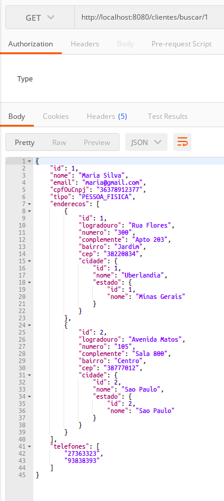

# IMPLEMENTANDO END-POINT PARA CLIENT

vamos implementar as demais classes necessarias para criar um end-point de acesso que retorne os dados ao informar o id do cliente, o primeiro passo e implementar a classe da camada `service` que ir possuir as regras de negocio e a classe da camada `resource` que ira possuir os contoladores de acesso ao end-point.

implementacao `ClienteService`

```java
package br.com.estudos.springboot.projetospringboot.service;

import br.com.estudos.springboot.projetospringboot.domain.Cliente;
import br.com.estudos.springboot.projetospringboot.ropository.ClienteRepository;
import br.com.estudos.springboot.projetospringboot.service.exceptions.ObjectNotFoundException;
import org.springframework.beans.factory.annotation.Autowired;
import org.springframework.stereotype.Service;

import java.util.Optional;

@Service
public class ClienteService {

    @Autowired
    private ClienteRepository repository;

    public Cliente buscar(Integer id){
        Optional<Cliente> cliente = repository.findById(id);

        return cliente.orElseThrow(() -> new ObjectNotFoundException(
                "objeto com id " + id + " nao encontrado na classe de dominio " + Cliente.class.getName()
            )
        );
    }

}
```

implementacao da classe `ClienteResource`

```java
package br.com.estudos.springboot.projetospringboot.resource;

import br.com.estudos.springboot.projetospringboot.domain.Cliente;
import br.com.estudos.springboot.projetospringboot.service.ClienteService;
import org.springframework.beans.factory.annotation.Autowired;
import org.springframework.http.ResponseEntity;
import org.springframework.web.bind.annotation.PathVariable;
import org.springframework.web.bind.annotation.RequestMapping;
import org.springframework.web.bind.annotation.RequestMethod;
import org.springframework.web.bind.annotation.RestController;

@RestController
@RequestMapping(value = "/clientes")
public class ClienteResource {

    @Autowired
    private ClienteService service;

    @RequestMapping(method = RequestMethod.GET, value = "/buscar/{id}")
    public ResponseEntity<?> buscar(@PathVariable Integer id){

        Cliente cliente = service.buscar(id);

        return ResponseEntity.ok().body(cliente);
    }

}
```

analisando o [diagrama UML de classes](../../ConteudoDoCurso/Secao2-ImplementacaoDoModeloConceitual/Diagrama/diagrama-de-classes.png) note que o relacinamento entre `Cliente` e `Endereco` e conhecido por ambas as classes, o mesmo ocorre com classe `Cidade` e `Estado`, o que acarretara no erro de referencia ciclica ao tentar retornar o valor do bando de dados, para contornar este problema vamos declarar o atributo que podera ser serializado _annotation_ `@JsonManagedReference` e o atributo na classe relacionada que nao podera ser serializado com a _annotation_ `@JsonBackReference`, refatorando as classes temos.

alteracao classe `Cliente`

```java
package br.com.estudos.springboot.projetospringboot.domain;

import br.com.estudos.springboot.projetospringboot.domain.enums.TipoCliente;
import com.fasterxml.jackson.annotation.JsonManagedReference;

import javax.persistence.*;
import java.util.*;

@Entity
public class Cliente {

    @Id
    @GeneratedValue(strategy = GenerationType.IDENTITY)
    private Integer id;

    private String nome;

    private String email;

    private String cpfOuCnpj;

    private Integer tipo;

    // annotation que permite a serializacao
    @JsonManagedReference
    @OneToMany(mappedBy = "cliente")
    private List<Endereco> enderecos = new ArrayList<>();

    @ElementCollection
    @CollectionTable(name = "telefone")
    private Set<String> telefones = new HashSet<>();

    public Cliente(){

    }

    public Cliente(Integer id, String nome, String email, String cpfOuCnpj, TipoCliente tipo) {
        this.id = id;
        this.nome = nome;
        this.email = email;
        this.cpfOuCnpj = cpfOuCnpj;
        this.tipo = tipo.getId();
    }

    public Integer getId() {
        return id;
    }

    public void setId(Integer id) {
        this.id = id;
    }

    public String getNome() {
        return nome;
    }

    public void setNome(String nome) {
        this.nome = nome;
    }

    public String getEmail() {
        return email;
    }

    public void setEmail(String email) {
        this.email = email;
    }

    public String getCpfOuCnpj() {
        return cpfOuCnpj;
    }

    public void setCpfOuCnpj(String cpfOuCnpj) {
        this.cpfOuCnpj = cpfOuCnpj;
    }

    public TipoCliente getTipo() {
        return TipoCliente.toEnum(tipo);
    }

    public void setTipo(TipoCliente tipo) {
        this.tipo = tipo.getId();
    }

    public List<Endereco> getEnderecos() {
        return enderecos;
    }

    public void setEnderecos(List<Endereco> enderecos) {
        this.enderecos = enderecos;
    }

    public Set<String> getTelefones() {
        return telefones;
    }

    public void setTelefones(Set<String> telefones) {
        this.telefones = telefones;
    }

    @Override
    public boolean equals(Object o) {
        if (this == o) return true;
        if (o == null || getClass() != o.getClass()) return false;
        Cliente cliente = (Cliente) o;
        return Objects.equals(id, cliente.id);
    }

    @Override
    public int hashCode() {
        return Objects.hash(id);
    }

    @Override
    public String toString() {
        return "Cliente{" +
                "id=" + id +
                ", nome='" + nome + '\'' +
                ", email='" + email + '\'' +
                ", cpfOuCnpj='" + cpfOuCnpj + '\'' +
                ", tipo=" + tipo +
                ", enderecos=" + enderecos +
                ", telefones=" + telefones +
                '}';
    }
}
```

alteracao classe `Endereco`

```java
package br.com.estudos.springboot.projetospringboot.domain;

import com.fasterxml.jackson.annotation.JsonBackReference;

import javax.persistence.*;
import java.util.Objects;

@Entity
public class Endereco {

    @Id
    @GeneratedValue(strategy = GenerationType.IDENTITY)
    private Integer id;

    private String logradouro;

    private String numero;

    private String complemente;

    private String bairro;

    private String cep;

    // annotation que bloqueia a serializacao
    @JsonBackReference
    @ManyToOne
    @JoinColumn(name = "cliente_id")
    private Cliente cliente;

    @ManyToOne
    @JoinColumn(name = "cidade_id")
    private Cidade cidade;

    public Cidade getCidade() {
        return cidade;
    }

    public Endereco (){

    }

    public Endereco(Integer id, String logradouro, String numero, String complemente, String bairro, String cep, Cliente cliente, Cidade cidade) {
        this.id = id;
        this.logradouro = logradouro;
        this.numero = numero;
        this.complemente = complemente;
        this.bairro = bairro;
        this.cep = cep;
        this.cliente = cliente;
        this.cidade = cidade;
    }

    public Integer getId() {
        return id;
    }

    public void setId(Integer id) {
        this.id = id;
    }

    public String getLogradouro() {
        return logradouro;
    }

    public void setLogradouro(String logradouro) {
        this.logradouro = logradouro;
    }

    public String getNumero() {
        return numero;
    }

    public void setNumero(String numero) {
        this.numero = numero;
    }

    public String getComplemente() {
        return complemente;
    }

    public void setComplemente(String complemente) {
        this.complemente = complemente;
    }

    public String getBairro() {
        return bairro;
    }

    public void setBairro(String bairro) {
        this.bairro = bairro;
    }

    public String getCep() {
        return cep;
    }

    public void setCep(String cep) {
        this.cep = cep;
    }

    public Cliente getCliente() {
        return cliente;
    }

    public void setCliente(Cliente cliente) {
        this.cliente = cliente;
    }

    @Override
    public boolean equals(Object o) {
        if (this == o) return true;
        if (o == null || getClass() != o.getClass()) return false;
        Endereco endereco = (Endereco) o;
        return Objects.equals(id, endereco.id);
    }

    @Override
    public int hashCode() {
        return Objects.hash(id);
    }

    @Override
    public String toString() {
        return "Endereco{" +
                "id=" + id +
                ", logradouro='" + logradouro + '\'' +
                ", numero='" + numero + '\'' +
                ", complemente='" + complemente + '\'' +
                ", bairro='" + bairro + '\'' +
                ", cep='" + cep + '\'' +
                ", cliente=" + cliente +
                ", cidade=" + cidade +
                '}';
    }
}
```

alteracao da classe `Cidade`

```java

package br.com.estudos.springboot.projetospringboot.domain;

import com.fasterxml.jackson.annotation.JsonManagedReference;

import javax.persistence.*;
import java.util.Objects;

@Entity
public class Cidade {

    @Id
    @GeneratedValue(strategy = GenerationType.IDENTITY)
    private Integer id;

    private String nome;

    // annotation que permite a serializacao
    @JsonManagedReference
    @ManyToOne
    @JoinColumn(name = "estado_id")
    private Estado estado;

    public Cidade(){

    }

    public Cidade(Integer id, String nome, Estado estado) {
        this.id = id;
        this.nome = nome;
        this.estado = estado;
    }

    public Integer getId() {
        return id;
    }

    public void setId(Integer id) {
        this.id = id;
    }

    public String getNome() {
        return nome;
    }

    public void setNome(String nome) {
        this.nome = nome;
    }

    public Estado getEstado() {
        return estado;
    }

    public void setEstado(Estado estado) {
        this.estado = estado;
    }

    @Override
    public boolean equals(Object o) {
        if (this == o) return true;
        if (o == null || getClass() != o.getClass()) return false;
        Cidade cidade = (Cidade) o;
        return Objects.equals(id, cidade.id);
    }

    @Override
    public int hashCode() {
        return Objects.hash(id);
    }

    @Override
    public String toString() {
        return "Cidade{" +
                "id=" + id +
                ", nome='" + nome + '\'' +
                ", estado=" + estado +
                '}';
    }

}
```

alteracao da classe `Estado`

```java
package br.com.estudos.springboot.projetospringboot.domain;

import com.fasterxml.jackson.annotation.JsonBackReference;

import javax.persistence.*;
import java.util.ArrayList;
import java.util.List;
import java.util.Objects;

@Entity
public class Estado {

    @Id
    @GeneratedValue(strategy = GenerationType.IDENTITY)
    private Integer id;

    private String nome;

    // annotation que nao permite a seraliacao
    @JsonBackReference
    @OneToMany(mappedBy = "estado")
    private List<Cidade> cidades = new ArrayList<>();

    public Estado() {

    }

    public Estado(Integer id, String nome) {
        this.id = id;
        this.nome = nome;
    }

    public Integer getId() {
        return id;
    }

    public void setId(Integer id) {
        this.id = id;
    }

    public String getNome() {
        return nome;
    }

    public List<Cidade> getCidades() {
        return cidades;
    }

    public void setCidades(List<Cidade> cidades) {
        this.cidades = cidades;
    }

    public void setNome(String nome) {
        this.nome = nome;
    }

    @Override
    public boolean equals(Object o) {
        if (this == o) return true;
        if (o == null || getClass() != o.getClass()) return false;
        Estado estado = (Estado) o;
        return Objects.equals(id, estado.id);
    }

    @Override
    public int hashCode() {
        return Objects.hash(id);
    }

    @Override
    public String toString() {
        return "Estado{" +
                "id=" + id +
                ", nome='" + nome + '\'' +
                '}';
    }
}
```
Utilizando o software Postman vamos acessar o end-point criado.

<p align="center">
    <br>
    figura 1 - JSON serializado no end-point de Cliente.
</p>


