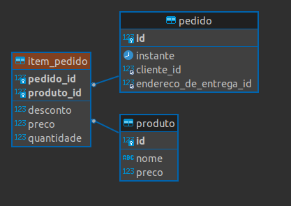

# __IMPLEMENTACAO CLASSE DE ASSOCIACAO ITEM PEDIDO__

segundo o [diagrama UML de classes](../../ConteudoDoCurso/Secao2-ImplementacaoDoModeloConceitual/Diagrama/diagrama-de-classes.png) a classe `ItemPedido` e uma relacao de associacao entre as classes `Pedido` e `Produto`, existem diversas formas de realizar a implementacao deste conceito, vamos abordar a forma mais integra e rigorosa utilizando o Hibernate (implementacao da JPA) e criar uma chave primaria composta para a classe `ItemPedido`, chamada `ItemPedidoPK`.

classe `ItemPedidoPK`

```java
package br.com.estudos.springboot.projetospringboot.domain;

import javax.persistence.Embeddable;
import javax.persistence.JoinColumn;
import javax.persistence.ManyToOne;
import java.io.Serializable;
import java.util.Objects;

@Embedable
public class ItemPedidoPK implements Serializable {

    private static final long serialVersionUID = 1L;

    @ManyToOne
    @JoinColumn(name = "pedido_id")
    private Pedido pedido;

    @ManyToOne
    @JoinColumn(name = "produto_id")
    private Produto produto;

    public Pedido getPedido() {
        return pedido;
    }

    public void setPedido(Pedido pedido) {
        this.pedido = pedido;
    }

    public Produto getProduto() {
        return produto;
    }

    public void setProduto(Produto produto) {
        this.produto = produto;
    }

    @Override
    public boolean equals(Object o) {
        if (this == o) return true;
        if (o == null || getClass() != o.getClass()) return false;
        ItemPedidoPK that = (ItemPedidoPK) o;
        return Objects.equals(pedido, that.pedido) && Objects.equals(produto, that.produto);
    }

    @Override
    public int hashCode() {
        return Objects.hash(pedido, produto);
    }
}
```

algumas observacoes importantes sao, e necessario implementar a interface `Serializable` e declarar um numero de versao (atributo serialVersionUID), e os atributos que faram parte da associacao entre as tabelas (neste caso `Pedido` e `Produto`), os metodos getters, setters, equals e hashCode tambem devem ser declardos, a classe recebe a _annotation_ `@Embedable` para indicar que sera usada como subtipo de outra classe.
O proximo passo e implementar a classe `ItemPeido`.

classe `ItemPedido`

```java
package br.com.estudos.springboot.projetospringboot.domain;

import javax.persistence.*;

@Entity
public class ItemPedido {

    @EmbeddedId
    private ItemPedidoPK id = new ItemPedidoPK();

    private Double desconto;

    private Integer quantidade;

    private Float preco;

    public ItemPedido() {
    }

    public ItemPedido(Pedido pedido, Produto produto, Double desconto, Integer quantidade, Float preco) {
        this.id.setPedido(pedido);
        this.id.setProduto(produto);
        this.desconto = desconto;
        this.quantidade = quantidade;
        this.preco = preco;
    }

    public Pedido getPedido(){
        return id.getPedido();
    }

    public Produto getItem(){
        return id.getProduto();
    }

    public Double getDesconto() {
        return desconto;
    }

    public void setDesconto(Double desconto) {
        this.desconto = desconto;
    }

    public Integer getQuantidade() {
        return quantidade;
    }

    public void setQuantidade(Integer quantidade) {
        this.quantidade = quantidade;
    }

    public Float getPreco() {
        return preco;
    }

    public void setPreco(Float preco) {
        this.preco = preco;
    }
}
```

a classe item pedido possui o atributo `id` que e do tipo `ItemPedidoPK` e possui a _annotation_ `@EmbeddedId` que utiliza a classe como chave composta. note que construtor recebe um objeto do tipo `Pedido` e outro do tipo `Produto` e realizar a chamada dos metodos setters respectivos a cada atributo.

alem da criacao das novas classes, as classes ja existentes necessitam receber os repectivcos relacionamentos.

refatoracao da classe `Produto`

```java
package br.com.estudos.springboot.projetospringboot.domain;

import com.fasterxml.jackson.annotation.JsonBackReference;

import javax.persistence.*;
import java.util.*;

@Entity
public class Produto {

    @Id
    @GeneratedValue(strategy = GenerationType.IDENTITY)
    private Integer id;

    private String nome;

    private Double preco;

    @JsonBackReference
    @ManyToMany
    @JoinTable(
            name = "produto_categoria",
            joinColumns = @JoinColumn(name = "produto_id"),
            inverseJoinColumns = @JoinColumn(name = "categoria_id")
    )
    private List<Categoria> categorias = new ArrayList<>();

    @OneToMany(mappedBy = "id.produto")
    private Set<ItemPedido> pedidos =new HashSet<>();

    public Produto(){

    }

    public Produto(Integer id, String nome, Double preco) {
        this.id = id;
        this.nome = nome;
        this.preco = preco;
    }

    public List<Pedido> getPedidos(){
        List<Pedido> lista = new ArrayList<>();
        for(ItemPedido itemPedido : pedidos){
            lista.add(itemPedido.getPedido());
        }
        return lista;
    }

    public Integer getId() {
        return id;
    }

    public void setId(Integer id) {
        this.id = id;
    }

    public String getNome() {
        return nome;
    }

    public void setNome(String nome) {
        this.nome = nome;
    }

    public Double getPreco() {
        return preco;
    }

    public void setPreco(Double preco) {
        this.preco = preco;
    }

    public List<Categoria> getCategorias() {
        return categorias;
    }

    public void setCategorias(List<Categoria> categorias) {
        this.categorias = categorias;
    }

    @Override
    public boolean equals(Object o) {
        if (this == o) return true;
        if (o == null || getClass() != o.getClass()) return false;
        Produto produto = (Produto) o;
        return Objects.equals(id, produto.id);
    }

    @Override
    public int hashCode() {
        return Objects.hash(id);
    }

    @Override
    public String toString() {
        return "Produto{" +
                "id=" + id +
                ", nome='" + nome + '\'' +
                ", preco=" + preco +
                ", categorias=" + categorias +
                '}';
    }
}
```
node que o argumento `mapedBy` recebido pela _annotation_ `@OneToMany`, nao aponda para o atributo id (atributo do tipo `ItemPedidoPK`), mas para qual atributo dentro da chave composta possui o respectivo mapeamento (outra extremidade do relacionamento).

refatoracao classe `Pedido`

```java
package br.com.estudos.springboot.projetospringboot.domain;

import com.fasterxml.jackson.annotation.JsonBackReference;
import com.fasterxml.jackson.annotation.JsonManagedReference;

import javax.persistence.*;
import java.util.*;

@Entity
public class Pedido {

    @Id
    @GeneratedValue(strategy = GenerationType.IDENTITY)
    private Integer id;

    private Date instante;

    @JsonManagedReference
    @OneToOne(cascade = CascadeType.ALL, mappedBy = "pedido")
    private Pagamento pagamento;

    @ManyToOne
    @JoinColumn(name = "endereco_de_entrega_id")
    private Endereco enderecoDeEntrega;

    @JsonBackReference
    @ManyToOne
    @JoinColumn(name = "cliente_id")
    private Cliente cliente;

    @OneToMany(mappedBy = "id.pedido")
    private Set<ItemPedido> itens = new HashSet<>();

    public Pedido() {
    }

    public Pedido(Integer id, Date instante, Endereco enderecoDeEntrega, Cliente cliente) {
        this.id = id;
        this.instante = instante;
        this.enderecoDeEntrega = enderecoDeEntrega;
        this.cliente = cliente;
    }

    public Integer getId() {
        return id;
    }

    public void setId(Integer id) {
        this.id = id;
    }

    public List<Produto> getProdutos(){
        List<Produto> lista = new ArrayList<>();
        for(ItemPedido itemPedido : itens){
            lista.add(itemPedido.getItem());
        }
        return lista;
    }

    public Date getInstante() {
        return instante;
    }

    public void setInstante(Date instante) {
        this.instante = instante;
    }

    public Pagamento getPagamento() {
        return pagamento;
    }

    public void setPagamento(Pagamento pagamento) {
        this.pagamento = pagamento;
    }

    public Endereco getEnderecoDeEntrega() {
        return enderecoDeEntrega;
    }

    public void setEnderecoDeEntrega(Endereco enderecoDeEntrega) {
        this.enderecoDeEntrega = enderecoDeEntrega;
    }

    public Cliente getCliente() {
        return cliente;
    }

    public void setCliente(Cliente cliente) {
        this.cliente = cliente;
    }

    @Override
    public boolean equals(Object o) {
        if (this == o) return true;
        if (o == null || getClass() != o.getClass()) return false;
        Pedido pedido = (Pedido) o;
        return Objects.equals(id, pedido.id);
    }

    @Override
    public int hashCode() {
        return Objects.hash(id);
    }

    @Override
    public String toString() {
        return "Pedido{" +
                "id=" + id +
                ", instante=" + instante +
                ", pagamento=" + pagamento +
                ", enderecoDeEntrega=" + enderecoDeEntrega +
                ", cliente=" + cliente +
                '}';
    }
}
```

tanto na classe `Produto` quanto em `Pedido` as `Collections` sao do tipo `Set` (comportam-se como um conjunto, nao permitem repeticao de elementos), pois na classe `ItemPedido` temos a atributo quantidade.

#
## REFATORACOES ADJACENTES

para pesrsistir os objetos no banco de dados, vamos refatorar o metodo `run()` na classe principal do Spring, instanciando os objetos de acordo com o [diagrama UML de objetos](../../ConteudoDoCurso/Secao2-ImplementacaoDoModeloConceitual/Diagrama/diagrama-de-objetos.png).

```java
package br.com.estudos.springboot.projetospringboot;

import br.com.estudos.springboot.projetospringboot.domain.*;
import br.com.estudos.springboot.projetospringboot.domain.enums.EstadoPagameno;
import br.com.estudos.springboot.projetospringboot.domain.enums.TipoCliente;
import br.com.estudos.springboot.projetospringboot.ropository.*;
import org.springframework.beans.factory.annotation.Autowired;
import org.springframework.boot.CommandLineRunner;
import org.springframework.boot.SpringApplication;
import org.springframework.boot.autoconfigure.SpringBootApplication;

import java.text.SimpleDateFormat;
import java.util.Arrays;

@SpringBootApplication
public class ProjetoSpringBootApplication implements CommandLineRunner {

	@Autowired
	CategoriaRepository categoriaRepository;

	@Autowired
	ProdutoRepository produtoRepository;

	@Autowired
	EstadoRepository estadoRepository;

	@Autowired
	CidadeRepository cidadeRepository;

	@Autowired
	EnderecoRepository enderecoRepository;

	@Autowired
	ClienteRepository clienteRepository;

	@Autowired
	PedidoRepository pedidoRepository;

	@Autowired
	PagamentoRepository pagamentoRepository;

	@Autowired
	ItemPedidoRepository itemPedidoRepository;

	public static void main(String[] args) {
		SpringApplication.run(ProjetoSpringBootApplication.class, args);
	}

	@Override
	public void run(String... args) throws Exception {

		var cat1 = new Categoria(null, "Informatica");
		var cat2 = new Categoria(null, "Escritorio");

		var prod1 = new Produto(null, "Computador", 2000.00);
		var prod2 = new Produto(null, "Impressora", 800.00);
		var prod3 = new Produto(null, "Mouse", 80.00);

		cat1.getProdutos().addAll(Arrays.asList(prod1, prod2, prod3));
		cat2.getProdutos().addAll(Arrays.asList(prod3));

		prod1.getCategorias().addAll(Arrays.asList(cat1));
		prod2.getCategorias().addAll(Arrays.asList(cat1, cat2));
		prod3.getCategorias().addAll(Arrays.asList(cat1));

		categoriaRepository.saveAll(Arrays.asList(cat1,cat2));
		produtoRepository.saveAll(Arrays.asList(prod1, prod2, prod3));

		var est1 = new Estado(null, "Minas Gerais");
		var est2 = new Estado(null, "Sao Paulo");

		var c1 = new Cidade(null, "Uberlandia", est1);
		var c2 = new Cidade(null, "Sao Paulo", est2);
		var c3 = new Cidade(null, "Campinas", est2);

		est1.getCidades().addAll(Arrays.asList(c1));
		est2.getCidades().addAll(Arrays.asList(c2, c3));

		estadoRepository.saveAll(Arrays.asList(est1, est2));
		cidadeRepository.saveAll(Arrays.asList(c1, c2, c3));

		Cliente cli1 = new Cliente(null, "Maria Silva", "maria@gmail.com", "36378912377", TipoCliente.PESSOA_FISICA);

		Endereco e1 = new Endereco(null, "Rua Flores", "300", "Apto 203", "Jardim", "38220834", cli1, c1);
		Endereco e2 = new Endereco(null, "Avenida Matos", "105", "Sala 800", "Centro", "38777012", cli1, c2);

		cli1.getEnderecos().addAll(Arrays.asList(e1, e2));

		String t1 = "27363323";
		String t2 = "93838393";
		cli1.getTelefones().addAll(Arrays.asList(t1, t2));

		clienteRepository.saveAll(Arrays.asList(cli1));
		enderecoRepository.saveAll(Arrays.asList(e1, e2));

		SimpleDateFormat sdf = new SimpleDateFormat("dd/MM/yyyy HH:mm");

		Pedido ped1 = new Pedido(null, sdf.parse("30/09/2017 10:32"), e1, cli1);
		Pedido ped2 = new Pedido(null, sdf.parse("10/10/2017 19:35"), e2, cli1);

		Pagamento pgto1 = new PagamentoComCartao(null, EstadoPagameno.QUITADO, ped1, 6);
		ped1.setPagamento(pgto1);
		Pagamento pgto2 = new PagamentoComBoleto(null, EstadoPagameno.PEDENTE, ped2, sdf.parse("20/10/2017 00:00"), null);
		ped2.setPagamento(pgto2);

		cli1.getPedidos().addAll(Arrays.asList(ped1, ped2));

		pedidoRepository.saveAll(Arrays.asList(ped1, ped2));
		pagamentoRepository.saveAll(Arrays.asList(pgto1, pgto2));

		ItemPedido ip1 = new ItemPedido(ped1, prod1, 200d, 1, 2000f);
		ItemPedido ip2 = new ItemPedido(ped1, prod3, 0d, 2, 80f);
		ItemPedido ip3 = new ItemPedido(ped2, prod2, 100d, 1, 800f);

		ped1.getItens().addAll(Arrays.asList(ip1, ip2));
		ped2.getItens().addAll(Arrays.asList(ip3));

		prod1.getItens().addAll(Arrays.asList(ip1));
		prod2.getItens().addAll(Arrays.asList(ip3));
		prod3.getItens().addAll(Arrays.asList(ip2));

		itemPedidoRepository.saveAll(Arrays.asList(ip1, ip2, ip3));
	}
}
```

diagrama entidade relacional.

<p align="center">
    <br>
    figura 1 - diagrama entidade relacional.
</p>


