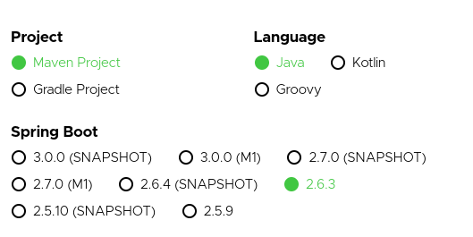
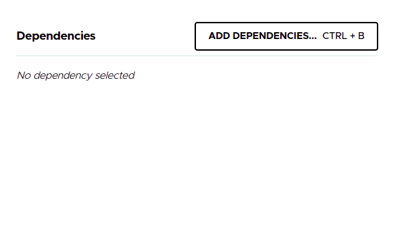
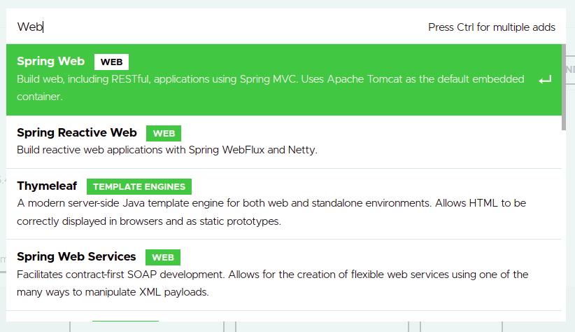
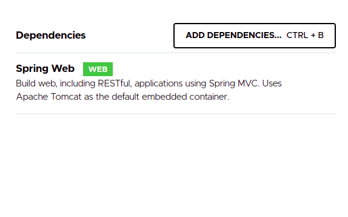
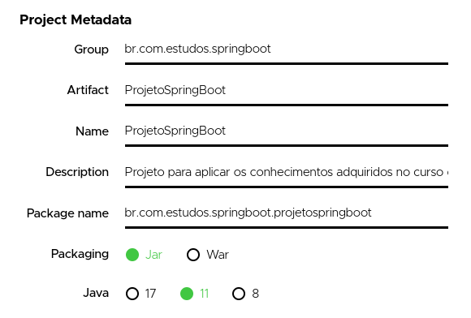
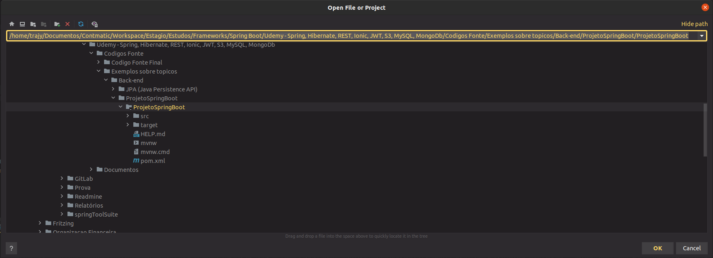
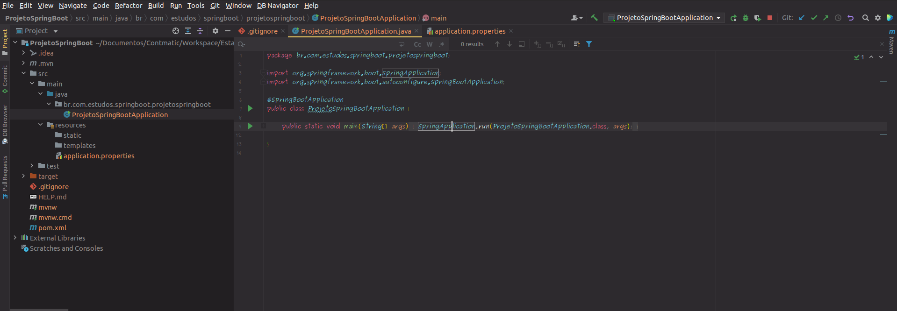
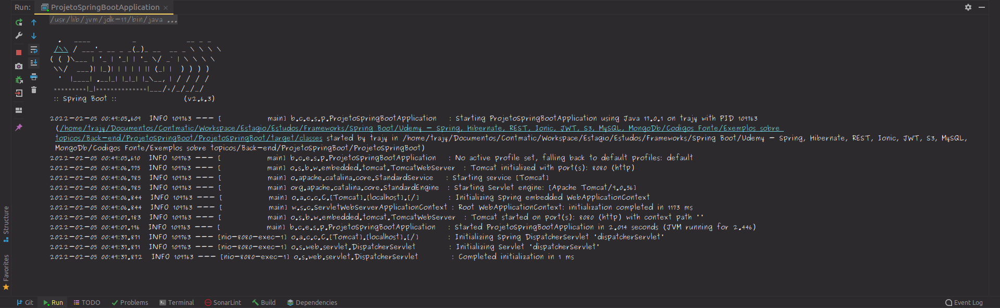

# __CRIACAO DO PROJETO SPRING BOOT NO INTELIj__

Para gerar a versao inicial do projeto vamos utilizar o [spring initializr](https://start.spring.io/), vamos as configuracoes iniciais, maven como ferramenta de _build_ e gerenciamento de _packages_, liguagem de programacao Java, spring boot na versao 2.6.3 (estavel, imutavel). 

<p align="center">
    <br>
    figura 1 - Configuracoes de build, linguagem de programacao e versao do spring boot.
</p>

Em _dependencies_ vamos adicionar o Spring Web como pacote incial


<p align="center">
    <br>
    figura 2 - Spring Initializr dependencies.
</p>

<p align="center">
    <br>
    figura 3 - Spring Initializr adicionando Spring Web.
</p>
<p align="center">
    <br>
    figura 4 - Spring Initializr adicionando Spring Web.
</p>

Apos adicionar as dependencias iniciais do projeto basta preencher os metadados do projeto coforme o exemplo.

<p align="center">
    <br>
    figura 5 - Spring Initializr metadados do projeto.
</p>

E baixar o projeto inicial em generate.

<p align="center">
    <br>
    figura 6 - Spring Initializr metadados do projeto.
</p>

Apos o download ser concluido basta importar no inteliJ em file -> open e aguardar o Maven baixar as dependencias do projeto.

<p align="center">
    <br>
    figura 7 - InteliJ importando projeto.
</p>

Note que calsse de inicializacao da aplicacao e gerada automaticamente note que a classe possui a anotacao `@SpringBootApplication` para indicar que e uma classe de inicializacao.

<p align="center">
    <br>
    figura 8 - Classe de inicializacao da aplicacao Spring Boot.
</p>

E possivel inicializar o servidor, pois o tomcat (container para o servidor) vem embutido no projeto.

<p align="center">
    <br>
    figura 9 - Log de inicializacao Spring Boot.
</p>

por padrao a aplicacao e iniciada em `http://localhost:8080/` e possivel alterar a porta que o sring ira utilizar inserindo a seguinte linha em `src/main/resources/application.properties`, como exemplo vamos setar a porta 8081

```
server.port=${port:8081}
```


