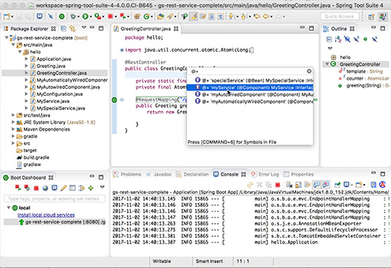
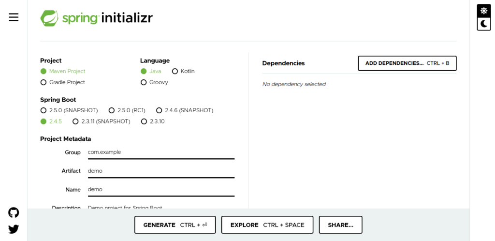

# __Spring Boot: como começar__

É um fato que a etapa de criação e configuração de uma aplicação é um processo chato e moroso que muitas vezes exige a manipulação de vários arquivos (xml, properties etc) e dependências. Por isso, conheça nesse artigo um framework que pode ajudar muito nas suas rotinas: o Spring Boot!

## __Mas, o que é Spring Boot?__<br>
O Spring Boot é um framework Java open source que tem como objetivo facilitar esse processo em aplicações Java. Consequentemente, ele traz mais agilidade para o processo de desenvolvimento, uma vez que devs conseguem reduzir o tempo gasto com as configurações iniciais.  

Com o Spring Boot conseguimos abstrair e facilitar a configuração de, por exemplo:

Servidores; 
Gerenciamento de dependências;
Configurações de bibliotecas;
Métricas & health checks;
Entre outros!
Atualmente o projeto encontra-se na versão 2.5.0 Aproveite e confira o Github do projeto Spring Boot.

## __Como o Spring Boot funciona?__<br>
Para realizar todo esse processo o Spring Boot utiliza um conceito chamado convenção sobre configuração.

Mas o que isso significa? Significa que é uma ferramenta que decide para você a melhor forma de se fazer algo. É o que chamamos de ferramenta opinativa, ela toma as decisões no nosso lugar baseado em convenções, aplicando configurações padrões e facilitando o trabalho.

No entanto ela não é inflexível e ainda permite uma configuração diferente da default caso o usuário assim deseje. 

Por exemplo, você pode alterar para que ele utilize o Jetty como servidor ao invés do Tomcat que é a configuração padrão.

Uma das maiores vantagens que o Spring Boot trouxe ao desenvolvimento é que toda essa configuração não necessita mais ser realizada pelos temidos XMLs, embora ele ainda suporte esse tipo de configuração.  A maior parte da configuração pode ser feita de forma programática via anotações.

O Spring Boot é composto por vários módulos que ajudam nesse processo. Alguns deles são:

## __Spring Boot__<br>
É o módulo principal que ajuda na configuração e integração dos outros módulos. 

## __Spring Boot Starters__
Os starters são dependências que agrupam outras dependências com um propósito em comum. Dessa forma, somente uma configuração é realizada no seu gerenciador de dependências.

Por exemplo, o spring-boot-starter-amqp, é um starter que permite a construção de soluções de mensageria baseadas em AMQP e RabbitMQ.  

Ao realizar a configuração no meu gerenciador de dependência se define somente o starter:

```xml
<dependencies>
   <dependency>
       <groupId>org.springframework.boot</groupId>
       <artifactId>spring-boot-starter-amqp</artifactId>
   </dependency>
</dependencies>
```

E internamente ele encapsula as dependências necessárias para utilização das features. No caso do spring-boot-starter-amqp,  ele encapsula três dependências:

```
plugins {
 id "org.springframework.boot.starter"
}


description = "Starter for using Spring AMQP and Rabbit MQ"


dependencies {
 api(project(":spring-boot-project:spring-boot-starters:spring-boot-starter"))
 api("org.springframework:spring-messaging")
 api("org.springframework.amqp:spring-rabbit")
}
```

Alguns exemplos de starters disponíveis:

__Spring Boot Starter Web__: Auxilia na construção de aplicações web trazendo já disponíveis para uso Spring MVC, Rest e o Tomcat como servidor.<br>
__Spring Boot Starter Test__: Contém a maioria das dependências necessárias para realizar testes da sua aplicação: Junit, AssertJ, Hamcrest, Mockito, entre outros.<br>
__Spring Boot Starter Data JPA__: Facilita a construção da nossa camada de persistência, ajudando na abstração do nosso banco de dados provendo uma série de facilidades para criação de repositories, escrita de queries, entre outros.<br>
Como podem ver, reduzem o número de dependências adicionadas, deixando meu arquivo muito mais limpo.

## __Spring Boot Autoconfigure__
Como dito anteriormente o Spring Boot trabalha de forma opinativa, tomando decisões para você. 

Mas baseado em que? Essas decisões padrões são baseadas através do conteúdo do seu classpath. 

O Autoconfigure é responsável por ler este conteúdo e realizar as configurações necessárias para que a aplicação funcione. É ele quem gerencia todo o processo de configuração da aplicação.

## __Spring Boot Actuator__
O Spring Boot Actuator é uma ferramenta que permite monitorar e gerenciar as aplicações implantadas. Dentre os recursos disponibilizados temos: 

Métricas: Obtém e disponibiliza diversos dados da nossa aplicação, como por exemplo, espaço em disco, memória, tempo de resposta etc.
Logging: Facilita o acesso ao arquivo de log da aplicação por meio de um endpoint específico. 
HeathlChecks: Disponibiliza endpoints de health checks.
Informações da Aplicação: Permite a disponibilização de informações da aplicação. Por exemplo, versão, informações do git etc.

## __Spring Boot Test__
O Spring Boot Test contém funcionalidades úteis e anotações que facilitam e ajudam a testar sua aplicação.

## __Spring Boot Devtools__
Spring Boot Devtools é um conjunto de funcionalidades que ajuda o trabalho de qualquer dev. Como, por exemplo, restart automático da aplicação quando ocorre alguma mudança no código.

## __Spring Tool Suite__
O Spring nos fornece uma IDE totalmente customizada para o desenvolvimento de aplicações do ecossistema spring: o Spring Tool Suite (STS). 

O STS é uma IDE baseada em Eclipse que já vem com algumas funcionalidades facilitadoras para projetos Spring. 

<p align="center">
    <br>
    figura 1 - IDE Spring Tools Suite (STS)
</p>

O STS está disponível para Linux, Mac e Windows. Para utilizar basta realizar o [download no site oficial](https://spring.io/tools).

Além da IDE baseada em Eclipse, o STS já está disponível como plugin para VSCode.

## __Spring Initializr__
Mas eu preciso obrigatoriamente utilizar o STS para desenvolver uma aplicação em Spring Boot? É claro que não! 

E para facilitar a criação de aplicações utilizando outras IDEs a Spring disponibilizou o [Spring Initializr](https://start.spring.io/). Ele é uma UI que permite a criação de projetos Sprint Boot de forma facilitada.

<p align="center">
    <br>
    figura 2 - Spring Initializr (STS)
</p>

Através dele definimos nome do projeto, pacotes, dependências (starters do spring e outros projetos), linguagem (Java, Groovy ou Kotlin). 

Uma vez definido é só clicar no botão Generate e o projeto será criado, gerando um zip pronto para ser importado na IDE de sua preferência.

## __Conclusão__
O objetivo deste artigo é dar uma ideia inicial de como Spring Boot funciona e pode ajudar descomplicando a construção de aplicações Java.

Como podem ver, essa ferramenta traz uma série de funcionalidades que nos ajuda a agilizar o processo de construção de aplicações nos permitindo focar um maior tempo fazendo o que mais gostamos de fazer: codar!

Caso deseje se aprofundar mais na ferramenta o site do Spring Boot possui uma [aréa completa com tutoriais e exemplos](https://spring.io/projects/spring-boot#learn). 

## __Referências__
[Versao Original do texto](https://www.zup.com.br/blog/spring-boot#:~:text=O%20Spring%20Boot%20%C3%A9%20um,gasto%20com%20as%20configura%C3%A7%C3%B5es%20iniciais.)<br>
[Spring Boot: Github do Projeto](https://github.com/spring-projects/spring-boot)<br>
[Spring Boot: Site do Projeto](https://spring.io/projects/spring-boot)<br> 
[Baeldung: Into to Spring Boot Starters](https://www.baeldung.com/spring-boot-starters)<br>
[Stackoverflow: O que é convenção sobre configuração?](https://pt.stackoverflow.com/questions/420122/o-que-%C3%A9-conven%C3%A7%C3%A3o-sobre-configura%C3%A7%C3%A3o)<br>
[GeekHunter: Spring Boot: Tudo que você precisa saber!](https://blog.geekhunter.com.br/tudo-o-que-voce-precisa-saber-sobre-o-spring-boot/#:~:text=O%20Spring%20Boot%20%C3%A9%20uma,que%20utilizem%20o%20ecossistema%20Spring.&text=Com%20configura%C3%A7%C3%B5es%20r%C3%A1pidas%2C%20voc%C3%AA%20consegue,o%20Thymeleaf%20como%20template%20engine.)<br>
[Algaworks: O que é Spring Boot.](https://blog.algaworks.com/spring-boot/)