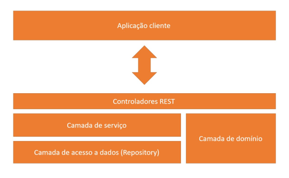

# Udemy-Spring-boot-Hibernate-REST-Ionic-JWT-S3-MySQL-MongoDb

este repositorio contem [codigos fonte](https://github.com/Trajy/Udemy-Spring-boot-Hibernate-REST-Ionic-JWT-S3-MySQL-MongoDb/tree/main/Codigos%20Fonte) e [documentacao das etapas de desenvolvimento](https://github.com/Trajy/Udemy-Spring-boot-Hibernate-REST-Ionic-JWT-S3-MySQL-MongoDb/tree/main/Documentos) embasados no curso [Spring Boot, Hibernate, REST, Ionic, JWT, S3, MySQL, MongoDB](https://www.udemy.com/course/spring-boot-ionic/)

#
## Stack

### IDE

 InteliJ

### Frameworks
 Spring

### Gerenciador de dependencias
 Maven

### Linguagem de Programacao
 Java

#
## Arquitetura de Software

Arquitetura de software consiste em um padrao generalizado que pode ser aplicado para diversos cenarios em um projeto de desenvolvimento. O modelo DTO (Data Transfer Object),genericamente tem como sua principal funcao obter e armazenar dados, e um padrao de projeto que organiza a transferencia de dados em camadas, onde cada uma possui sua responsabilidade especifica (vide [Atualizando Arquitetura de Software](Documentos/Markdown/projeto-spring-boot/07-atualizando-arquitetura-de-software.md)).

     
    figura 1 - arquitetura DTO (Data Transfer Object).

